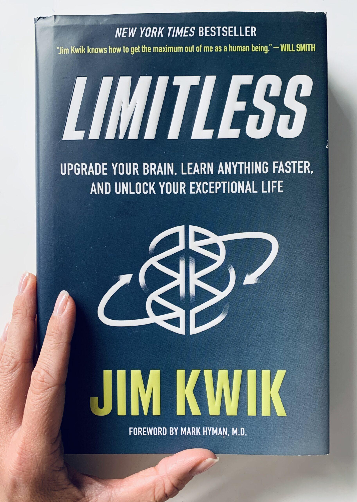
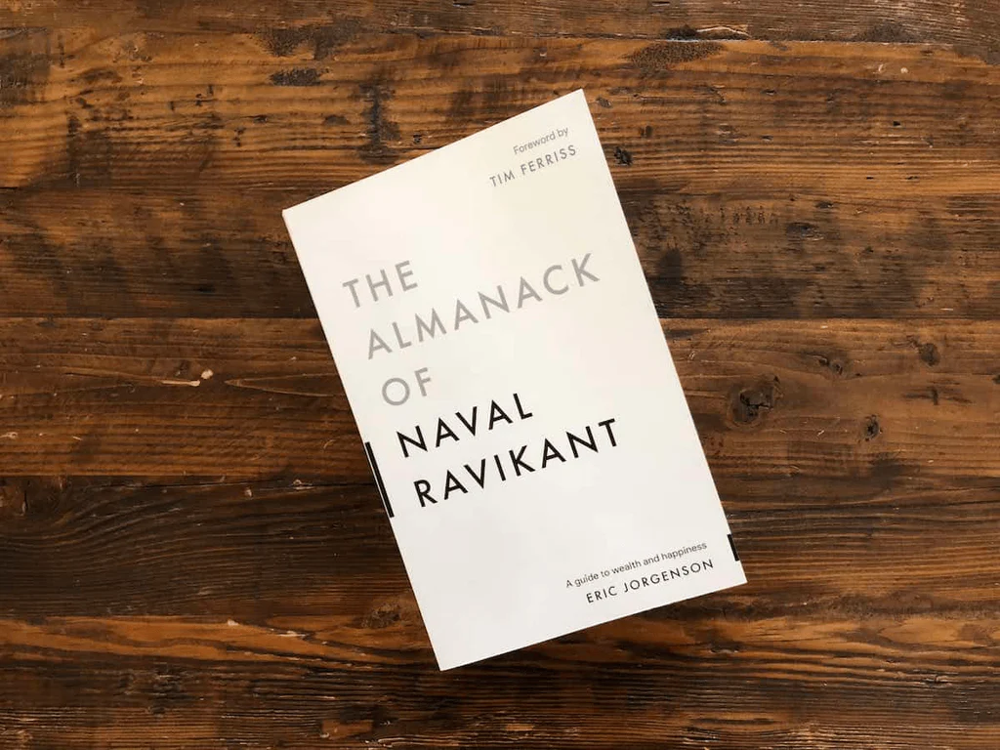
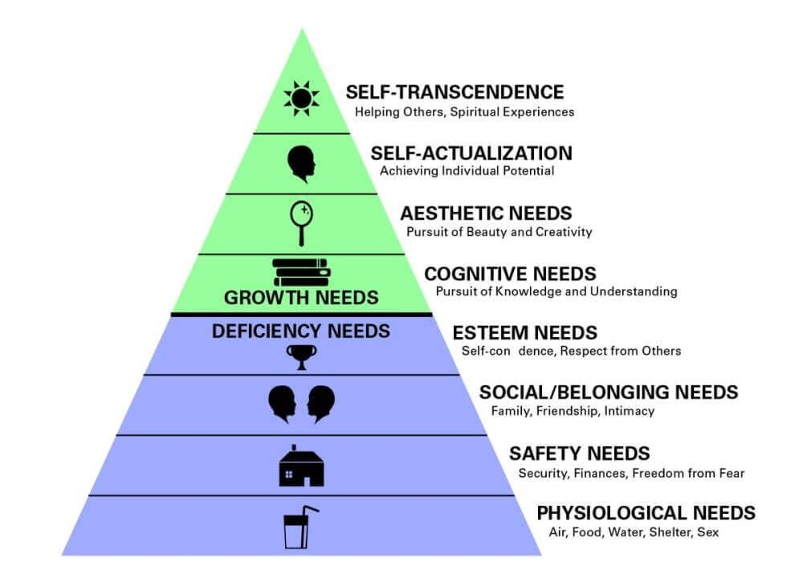
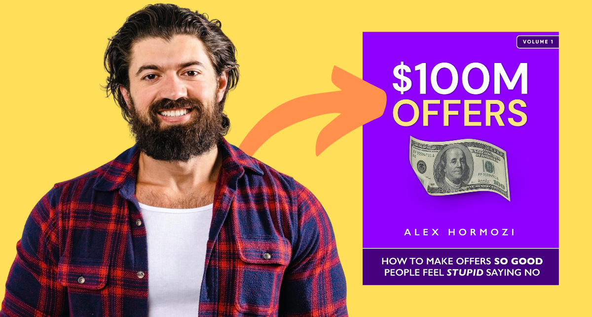

# assets\favicon.ico

This is a binary file of the type: Binary

# assets\img\8foldpath.jpg

This is a binary file of the type: Image

# assets\img\Alex-Simon.jpg

This is a binary file of the type: Image

# assets\img\Alex$100.jpg

This is a binary file of the type: Image

# assets\img\Books.jpg

This is a binary file of the type: Image

# assets\img\Bushido.jpg

This is a binary file of the type: Image

# assets\img\Digital_reunesans_2.jpg

This is a binary file of the type: Image

# assets\img\entrepreneurship.jpg

This is a binary file of the type: Image

# assets\img\Finance.jpg

This is a binary file of the type: Image

# assets\img\Fire.jpg

This is a binary file of the type: Image

# assets\img\Ground.png

This is a binary file of the type: Image

# assets\img\hourglass.webp

This is a binary file of the type: Image

# assets\img\HubermanLab.jpg

This is a binary file of the type: Image

# assets\img\JimKwik.jpg

This is a binary file of the type: Image

# assets\img\Maslow.jpg

This is a binary file of the type: Image

# assets\img\ProfileJuly.jpg

This is a binary file of the type: Image

# assets\img\Python.jpg

This is a binary file of the type: Image

# assets\img\Ravikant.jpg

This is a binary file of the type: Image

# assets\img\Water.webp

This is a binary file of the type: Image

# assets\img\Wind.jpeg

This is a binary file of the type: Image

# BlogPosts\$100_Offer.html

```html
<!DOCTYPE html>
<html lang="en">
<head>
    <meta charset="UTF-8">
    <meta name="viewport" content="width=device-width, initial-scale=1.0">
    <title>Offers So Good People Feel Stupid Saying No: Your Business's Secret Weapon</title>
    <meta name="description" content="Learn how to create Grand Slam Offers that customers can't refuse using Alex Hormozi's proven framework for business success.">
    <link rel="preconnect" href="https://fonts.googleapis.com">
    <link rel="preconnect" href="https://fonts.gstatic.com" crossorigin>
    <link href="https://fonts.googleapis.com/css2?family=Inter:wght@300;400;500;600;700&display=swap" rel="stylesheet">
    <style>
        :root {
            --primary-color: #2563eb;
            --secondary-color: #1e40af;
            --accent-color: #f59e0b;
            --text-primary: #1f2937;
            --text-secondary: #6b7280;
            --background: #ffffff;
            --surface: #f9fafb;
            --border: #e5e7eb;
            --success: #10b981;
            --warning: #f59e0b;
            --error: #ef4444;
            --shadow: 0 4px 6px -1px rgba(0, 0, 0, 0.1), 0 2px 4px -1px rgba(0, 0, 0, 0.06);
            --shadow-lg: 0 10px 15px -3px rgba(0, 0, 0, 0.1), 0 4px 6px -2px rgba(0, 0, 0, 0.05);
        }

        * {
            margin: 0;
            padding: 0;
            box-sizing: border-box;
        }

        body {
            font-family: 'Inter', -apple-system, BlinkMacSystemFont, 'Segoe UI', Roboto, sans-serif;
            line-height: 1.7;
            color: var(--text-primary);
            background: var(--background);
            font-size: 16px;
            scroll-behavior: smooth;
        }

        .container {
            max-width: 900px;
            margin: 0 auto;
            padding: 2rem 1rem;
        }

        header {
            text-align: center;
            margin-bottom: 3rem;
            padding: 2rem 0;
            background: linear-gradient(135deg, var(--primary-color) 0%, var(--secondary-color) 100%);
            color: white;
            border-radius: 12px;
            box-shadow: var(--shadow-lg);
        }

        h1 {
            font-size: clamp(2rem, 4vw, 3rem);
            font-weight: 700;
            margin-bottom: 1rem;
            line-height: 1.2;
        }

        .subtitle {
            font-size: 1.2rem;
            opacity: 0.9;
            font-weight: 300;
        }

        main {
            background: var(--background);
            border-radius: 12px;
            padding: 2rem;
            box-shadow: var(--shadow);
        }

        h2 {
            font-size: 1.75rem;
            font-weight: 600;
            color: var(--primary-color);
            margin: 2.5rem 0 1rem 0;
            padding-bottom: 0.5rem;
            border-bottom: 2px solid var(--border);
            position: relative;
        }

        h2::before {
            content: '';
            position: absolute;
            bottom: -2px;
            left: 0;
            width: 60px;
            height: 2px;
            background: var(--accent-color);
        }

        h3 {
            font-size: 1.4rem;
            font-weight: 600;
            color: var(--text-primary);
            margin: 2rem 0 1rem 0;
        }

        p {
            margin-bottom: 1.5rem;
            color: var(--text-primary);
        }

        .intro-text {
            font-size: 1.1rem;
            color: var(--text-secondary);
            background: var(--surface);
            padding: 1.5rem;
            border-radius: 8px;
            border-left: 4px solid var(--primary-color);
            margin-bottom: 2rem;
        }

        .highlight {
            background: linear-gradient(120deg, var(--accent-color) 0%, var(--accent-color) 100%);
            background-size: 100% 0.3em;
            background-repeat: no-repeat;
            background-position: 0 88%;
            font-weight: 600;
            color: var(--text-primary);
            padding: 0.1em 0.2em;
        }

        .key-point {
            background: var(--surface);
            padding: 1.5rem;
            border-radius: 8px;
            margin: 1.5rem 0;
            border-left: 4px solid var(--success);
        }

        .warning-box {
            background: #fef3c7;
            border: 1px solid #fbbf24;
            border-radius: 8px;
            padding: 1.5rem;
            margin: 1.5rem 0;
        }

        .warning-box h3 {
            color: #92400e;
            margin-top: 0;
        }

        ul, ol {
            margin: 1.5rem 0;
            padding-left: 1.5rem;
        }

        li {
            margin-bottom: 0.75rem;
            color: var(--text-primary);
        }

        .value-equation {
            background: var(--surface);
            padding: 2rem;
            border-radius: 12px;
            margin: 2rem 0;
            border: 2px solid var(--border);
        }

        .value-equation h3 {
            text-align: center;
            color: var(--primary-color);
            margin-bottom: 1.5rem;
        }

        .offer-steps {
            counter-reset: step-counter;
        }

        .offer-steps li {
            counter-increment: step-counter;
            position: relative;
            background: var(--surface);
            padding: 1.5rem;
            margin-bottom: 1rem;
            border-radius: 8px;
            border-left: 4px solid var(--primary-color);
        }

        .offer-steps li::before {
            content: counter(step-counter);
            position: absolute;
            left: -20px;
            top: 1.5rem;
            background: var(--primary-color);
            color: white;
            width: 30px;
            height: 30px;
            border-radius: 50%;
            display: flex;
            align-items: center;
            justify-content: center;
            font-weight: 600;
            font-size: 0.875rem;
        }

        .magic-formula {
            display: grid;
            grid-template-columns: repeat(auto-fit, minmax(250px, 1fr));
            gap: 1rem;
            margin: 2rem 0;
        }

        .magic-item {
            background: var(--surface);
            padding: 1.5rem;
            border-radius: 8px;
            border-top: 4px solid var(--accent-color);
        }

        .magic-item h4 {
            color: var(--primary-color);
            margin-bottom: 0.5rem;
            font-weight: 600;
        }

        .quote {
            font-style: italic;
            font-size: 1.1rem;
            color: var(--text-secondary);
            border-left: 4px solid var(--accent-color);
            padding-left: 1.5rem;
            margin: 2rem 0;
        }

        .cta-section {
            background: linear-gradient(135deg, var(--primary-color) 0%, var(--secondary-color) 100%);
            color: white;
            padding: 2rem;
            border-radius: 12px;
            text-align: center;
            margin-top: 3rem;
        }

        .cta-section h3 {
            color: white;
            margin-bottom: 1rem;
        }

        .button {
            display: inline-block;
            background: var(--accent-color);
            color: white;
            padding: 0.75rem 1.5rem;
            border-radius: 6px;
            text-decoration: none;
            font-weight: 600;
            transition: all 0.3s ease;
            margin-top: 1rem;
        }

        .button:hover {
            background: #d97706;
            transform: translateY(-2px);
        }

        .table-of-contents {
            background: var(--surface);
            padding: 2rem;
            border-radius: 12px;
            margin-bottom: 2rem;
        }

        .table-of-contents h3 {
            margin-top: 0;
            color: var(--primary-color);
        }

        .table-of-contents ul {
            list-style: none;
            padding-left: 0;
        }

        .table-of-contents li {
            margin-bottom: 0.5rem;
        }

        .table-of-contents a {
            color: var(--text-primary);
            text-decoration: none;
            transition: color 0.3s ease;
        }

        .table-of-contents a:hover {
            color: var(--primary-color);
        }

        @media (max-width: 768px) {
            .container {
                padding: 1rem;
            }
            
            main {
                padding: 1.5rem;
            }
            
            h1 {
                font-size: 2rem;
            }
            
            h2 {
                font-size: 1.5rem;
            }
            
            .magic-formula {
                grid-template-columns: 1fr;
            }
        }

        /* Accessibility improvements */
        @media (prefers-reduced-motion: reduce) {
            * {
                animation-duration: 0.01ms !important;
                animation-iteration-count: 1 !important;
                transition-duration: 0.01ms !important;
            }
        }

        /* Focus styles for keyboard navigation */
        a:focus,
        button:focus {
            outline: 2px solid var(--primary-color);
            outline-offset: 2px;
        }
    </style>
</head>
<body>
    <div class="container">
        <header>
            <h1>Offers So Good People Feel Stupid Saying No</h1>
            <p class="subtitle">Your Business's Secret Weapon for Unstoppable Growth</p>
        </header>

        <nav class="table-of-contents">
            <h3>Table of Contents</h3>
            <ul>
                <li><a href="#introduction">Introduction</a></li>
                <li><a href="#what-is-offer">What is an Offer?</a></li>
                <li><a href="#commodity-problem">The Commodity Problem</a></li>
                <li><a href="#finding-market">Finding The Right Market</a></li>
                <li><a href="#value-equation">The Value Equation</a></li>
                <li><a href="#crafting-offer">Crafting Your Offer</a></li>
                <li><a href="#enhancing-offer">Enhancing Your Offer</a></li>
                <li><a href="#naming-offer">Naming Your Offer</a></li>
                <li><a href="#conclusion">Conclusion</a></li>
            </ul>
        </nav>

        <main>
            <section id="introduction">
                <div class="intro-text">
                    If you're an entrepreneur or a business owner, you're probably grappling with two fundamental issues: <span class="highlight">not enough clients</span> and <span class="highlight">not enough cash (excess profit at the end of the month)</span>. These problems often stem from offering "ordinary" deals. But what if I told you it's possible to create offers that potential customers would consider "stupid to say no to"? That's the core claim of the book "100M Offers".
                </div>

                <p>The author, Alex Hormozi, states that he crafted thousands of offers over a decade, many of which failed, some did okay, and some were "home runs". Over time, he realized this wasn't luck but a repeatable framework. This book teaches you how to build these "Grand Slam Offers".</p>
            </section>

            <section id="what-is-offer">
                <h2>What is an Offer and Why is it So Important?</h2>

                <p>The only way to build a business is by exchanging value for money. <span class="highlight">The offer is literally what you provide to a prospective customer in exchange for their money</span>. It's the first thing new customers interact with in your business, and it's your business's lifeblood.</p>

                <div class="key-point">
                    <ul>
                        <li>No offer? No business. No life.</li>
                        <li>Bad offer? Negative profit. No business. Miserable life.</li>
                        <li>Decent offer? No profit. Stagnating business. Stagnating life.</li>
                        <li>Good offer? Some profit. Okay business. Okay life.</li>
                        <li><strong>Grand Slam Offer? Fantastic profit. Insane business. Freedom.</strong></li>
                    </ul>
                </div>

                <p>A Grand Slam Offer is a deal presented to the marketplace that cannot be compared to any other product or service, combining the right mix of pricing, value, guarantees, and naming strategies. This <span class="highlight">allows your business to differentiate itself</span>.</p>
            </section>

            <section id="commodity-problem">
                <h2>The Commodity Problem: Price-Driven Purchases</h2>

                <div class="warning-box">
                    <h3>The Commodity Trap</h3>
                    <p>A product available in many places (a commodity) is typically bought based on price. If all products seem "equal," the cheapest one is the most valuable. If prospects compare your product to another and say "these are pretty much the same, I'll take the cheaper one," they've commoditized you.</p>
                </div>

                <p>This leads to <span class="highlight">price competition and reduced margins, potentially making the business owner a slave to their work</span>.</p>

                <p><span class="highlight">A Grand Slam Offer solves this problem</span>. It makes your product look so different that the prospect struggles to compare prices, allowing you to reset the value perception. The result: <span class="highlight">value-driven, not price-driven purchases</span>.</p>
            </section>

            <section id="finding-market">
                <h2>Finding The Right Market: A Starving Crowd</h2>

                <p>A crucial point in the book is that the market comes even before the offer. One fundamental question about marketing is: "If you were going to open a hot dog stand and had only one advantage over your competitors, what would it be?" The answer is often things like "location" or "quality." But the author's answer is different: <span class="highlight">"A starving crowd of people who want hot dogs"</span>.</p>

                <div class="key-point">
                    <p>Your market matters. <span class="highlight">We are not trying to create demand; we are trying to channel it</span>. You must find a market that has a painful problem, purchasing power, and is easily targetable. A market with widespread, unmet needs in health, wealth, or relationships is ideal.</p>
                </div>

                <p>An important lesson: <span class="highlight">Commit to your niche</span>. Switching niches means starting over from the beginning each time, prolonging your failure. Focusing on a specific niche makes your message more effective and <span class="highlight">increases your pricing power</span>.</p>

                <div class="quote">
                    "A general time management course might sell for $19, while a course titled 'Time Management For B2B Outbound Power Tools & Gardening Sales Reps,' despite similar content, could sell for $1000-$2000 because it feels like it was made 'exactly for them'."
                </div>
            </section>

            <section id="value-equation">
                <h2>The Value Equation: The Foundation of the Offer</h2>

                <div class="value-equation">
                    <h3>Four Key Factors to Increase Value</h3>
                    <ol>
                        <li><strong>(Increase) Dream Outcome:</strong> How big is the result the customer wants to achieve?</li>
                        <li><strong>(Increase) Perceived Likelihood of Achievement:</strong> How likely does the customer believe they are to achieve this outcome with your offer?</li>
                        <li><strong>(Decrease) Perceived Time Delay:</strong> How long will it take the customer to achieve the outcome?</li>
                        <li><strong>(Decrease) Perceived Effort & Sacrifice:</strong> How much effort or sacrifice does the customer perceive is required to achieve this outcome?</li>
                    </ol>
                </div>

                <p><span class="highlight">Perception is reality</span>. What increases value is the prospect's <span class="highlight">perception</span> of an increase in the likelihood of success, a decrease in time delay, and a decrease in effort/sacrifice.</p>

                <div class="quote">
                    "While 'Meditation' and 'Xanax' have the same dream outcome ('Relaxation, Reduced Anxiety, Feelings of well-being'), Xanax created a multi-billion dollar market because it is perceived to offer less effort, less time delay, and a higher likelihood of achievement."
                </div>
            </section>

            <section id="crafting-offer">
                <h2>Crafting Your Offer: Problems to Solutions, Trim and Stack</h2>

                <p>To build a valuable offer, follow these steps:</p>

                <ol class="offer-steps">
                    <li><strong>Identify your prospect's Dream Outcome</strong></li>
                    <li><strong>List all the potential obstacles/problems</strong> they will face in reaching that outcome. Think in insane detail about what happens immediately before and after they use your product/service.</li>
                    <li><strong>Rewrite these problems into solution-oriented statements</strong>. This creates a checklist of what you will provide. You must solve <em>every</em> perceived problem.</li>
                    <li><strong>Brainstorm all the different ways you can deliver these solutions</strong>. Think creatively about different delivery vehicles (1-on-1, small group, DIY, DWY, DFY, different mediums).</li>
                    <li><strong>Trim the list:</strong> Eliminate options that are high cost for you to deliver but low value for the customer. Then remove those that are low cost <em>and</em> low value. <span class="highlight">Focus on those with the highest value to the customer and lowest cost to you</span>.</li>
                    <li><strong>Stack the remaining components</strong>: Bundle these into the final high-value deliverable you will present to your customer. The goal is to make customers think, "I get <em>all</em> this for only that?"</li>
                </ol>
            </section>

            <section id="enhancing-offer">
                <h2>Enhancing Your Offer: Scarcity, Urgency, Bonuses, Guarantees</h2>

                <p>Use psychological levers to make your offer even more appealing:</p>

                <h3>Scarcity</h3>
                <p>Limiting supply (number of clients, spots, time) increases demand and desire for your offer. People want what they cannot have. This also implies social proof.</p>

                <h3>Urgency</h3>
                <p>Setting a time limit encourages immediate action. Ethical ways include rolling cohorts, rolling seasonal urgency, promotional urgency, and exploding opportunity.</p>

                <h3>Bonuses</h3>
                <p>Offering additional items beyond the core offer greatly increases the price-to-value discrepancy. Bonuses should address specific concerns or obstacles in the prospect's mind.</p>

                <h3>Guarantees</h3>
                <p><span class="highlight">Risk reversal is the number one way to increase conversion</span>. Identify your prospects' biggest fears and perceived obstacles and turn them into guarantees.</p>
            </section>

            <section id="naming-offer">
                <h2>Naming Your Offer: MAGIC Formula</h2>

                <p>No matter how good your Grand Slam Offer is, it won't make money if nobody knows about it. Naming your offer correctly is vital for attracting ideal customers and deterring unsuitable ones.</p>

                <div class="magic-formula">
                    <div class="magic-item">
                        <h4>M - Magnetic "Reason Why"</h4>
                        <p>A word or phrase explaining why the offer is being made (e.g., Free, 88% Off, Spring, New Year)</p>
                    </div>
                    <div class="magic-item">
                        <h4>A - Announce Your Avatar</h4>
                        <p>Specific terms identifying who the offer targets (e.g., Bee Cave Dentists, Rolling Hills Moms)</p>
                    </div>
                    <div class="magic-item">
                        <h4>G - Goal</h4>
                        <p>Words clarifying the outcome the customer will achieve (e.g., Pain Free, Celebrity Smile, Double Your Profit)</p>
                    </div>
                    <div class="magic-item">
                        <h4>I - Interval</h4>
                        <p>A time frame indicating how quickly the result is expected (e.g., 4 Hour, 21 Day, 6 Week)</p>
                    </div>
                    <div class="magic-item">
                        <h4>C - Container Word</h4>
                        <p>A word signifying the offer is a system or bundle (e.g., Challenge, Blueprint, Bootcamp, Program, System)</p>
                    </div>
                </div>
            </section>

            <section id="conclusion">
                <h2>Conclusion</h2>

                <p>Building a Grand Slam Offer is the first building block of any great business. It's a product or service that people desperately want and truly solves their problems. This can enable you to make more sales at higher prices with more profit.</p>

                <p>Remember, you often get the best returns by going against conventional wisdom. Being bold is important. Finding the right market, understanding the value equation, turning problems into solutions, bundling high-value items, enhancing your offer with Scarcity, Urgency, Bonuses, and Guarantees, and naming it correctly—these are the core steps to building offers so good people feel stupid saying no.</p>
            </section>

            <div class="cta-section">
                <h3>Ready to Create Your Grand Slam Offer?</h3>
                <p>Take action today and transform your business with these proven strategies. The difference between a good offer and a Grand Slam Offer could be the difference between struggling and thriving.</p>
            </div>
        </main>
    </div>
</body>
</html>
```

# BlogPosts\8foldpath.html

```html
<!DOCTYPE html>
<html lang="en">
<head>
    <meta charset="UTF-8">
    <meta name="viewport" content="width=device-width, initial-scale=1.0">
    <title>The Noble Eightfold Path: A Way to the End of Suffering</title>
    <meta name="description" content="An exploration of The Noble Eightfold Path, a practical guide to the cessation of suffering as detailed in Bhikkhu Bodhi's book, available for free from the Pariyatti organization.">
    <link rel="preconnect" href="https://fonts.googleapis.com">
    <link rel="preconnect" href="https://fonts.gstatic.com" crossorigin>
    <link href="https://fonts.googleapis.com/css2?family=Inter:wght@300;400;500;600;700&display=swap" rel="stylesheet">
    <style>
        :root {
            --primary-color: #3cc0a3;
            --secondary-color: #5273e0;
            --accent-color: #f59e0b;
            --text-primary: #1f2937;
            --text-secondary: #6b7280;
            --background: #ffffff;
            --surface: #f9fafb;
            --border: #e5e7eb;
            --success: #10b981;
            --warning: #f59e0b;
            --error: #ef4444;
            --shadow: 0 4px 6px -1px rgba(0, 0, 0, 0.1), 0 2px 4px -1px rgba(0, 0, 0, 0.06);
            --shadow-lg: 0 10px 15px -3px rgba(0, 0, 0, 0.1), 0 4px 6px -2px rgba(0, 0, 0, 0.05);
        }

        * {
            margin: 0;
            padding: 0;
            box-sizing: border-box;
        }

        body {
            font-family: 'Inter', -apple-system, BlinkMacSystemFont, 'Segoe UI', Roboto, sans-serif;
            line-height: 1.7;
            color: var(--text-primary);
            background: var(--background);
            font-size: 16px;
            scroll-behavior: smooth;
        }

        .container {
            max-width: 900px;
            margin: 0 auto;
            padding: 2rem 1rem;
        }

        header {
            text-align: center;
            margin-bottom: 3rem;
            padding: 2rem 0;
            background: linear-gradient(135deg, var(--primary-color) 0%, var(--secondary-color) 100%);
            color: white;
            border-radius: 12px;
            box-shadow: var(--shadow-lg);
        }

        h1 {
            font-size: clamp(2rem, 4vw, 3rem);
            font-weight: 700;
            margin-bottom: 1rem;
            line-height: 1.2;
        }

        .subtitle {
            font-size: 1.2rem;
            opacity: 0.9;
            font-weight: 300;
        }

        main {
            background: var(--background);
            border-radius: 12px;
            padding: 2rem;
            box-shadow: var(--shadow);
        }

        h2 {
            font-size: 1.75rem;
            font-weight: 600;
            color: var(--primary-color);
            margin: 2.5rem 0 1rem 0;
            padding-bottom: 0.5rem;
            border-bottom: 2px solid var(--border);
            position: relative;
        }

        h2::before {
            content: '';
            position: absolute;
            bottom: -2px;
            left: 0;
            width: 60px;
            height: 2px;
            background: var(--accent-color);
        }

        h3 {
            font-size: 1.4rem;
            font-weight: 600;
            color: var(--text-primary);
            margin: 2rem 0 1rem 0;
        }

        h4 {
            font-size: 1.1rem;
            font-weight: 600;
            color: var(--primary-color);
            margin-bottom: 0.5rem;
        }

        p {
            margin-bottom: 1.5rem;
            color: var(--text-primary);
        }

        .intro-text {
            font-size: 1.1rem;
            color: var(--text-secondary);
            background: var(--surface);
            padding: 1.5rem;
            border-radius: 8px;
            border-left: 4px solid var(--primary-color);
            margin-bottom: 2rem;
        }

        .key-point {
            background: var(--surface);
            padding: 1.5rem;
            border-radius: 8px;
            margin: 1.5rem 0;
            border-left: 4px solid var(--success);
        }

        ul, ol {
            margin: 1.5rem 0;
            padding-left: 1.5rem;
        }

        li {
            margin-bottom: 0.75rem;
            color: var(--text-primary);
        }

        .cta-section {
            background: linear-gradient(135deg, var(--primary-color) 0%, var(--secondary-color) 100%);
            color: white;
            padding: 2rem;
            border-radius: 12px;
            text-align: center;
            margin-top: 3rem;
        }

        .cta-section h3 {
            color: white;
            margin-bottom: 1rem;
        }

        .button {
            display: inline-block;
            background: var(--accent-color);
            color: white;
            padding: 0.75rem 1.5rem;
            border-radius: 6px;
            text-decoration: none;
            font-weight: 600;
            transition: all 0.3s ease;
            margin-top: 1rem;
        }

        .button:hover {
            background: #d97706;
            transform: translateY(-2px);
        }

        .table-of-contents {
            background: var(--surface);
            padding: 2rem;
            border-radius: 12px;
            margin-bottom: 2rem;
        }

        .table-of-contents h3 {
            margin-top: 0;
            color: var(--primary-color);
        }

        .table-of-contents ul {
            list-style: none;
            padding-left: 0;
        }

        .table-of-contents li {
            margin-bottom: 0.5rem;
        }

        .table-of-contents a {
            color: var(--text-primary);
            text-decoration: none;
            transition: color 0.3s ease;
        }

        .table-of-contents a:hover {
            color: var(--primary-color);
        }
        
        @media (max-width: 768px) {
            .container {
                padding: 1rem;
            }
            main {
                padding: 1.5rem;
            }
            h1 {
                font-size: 2rem;
            }
            h2 {
                font-size: 1.5rem;
            }
        }

        /* Accessibility improvements */
        @media (prefers-reduced-motion: reduce) {
            * {
                animation-duration: 0.01ms !important;
                animation-iteration-count: 1 !important;
                transition-duration: 0.01ms !important;
            }
        }

        /* Focus styles for keyboard navigation */
        a:focus,
        button:focus {
            outline: 2px solid var(--primary-color);
            outline-offset: 2px;
        }
    </style>
</head>
<body>
    <div class="container">
        <header>
            <h1>The Noble Eightfold Path: A Way to the End of Suffering</h1>
            <p class="subtitle"><strong>A Guide from Bhikkhu Bodhi's Book</strong></p>
        </header>
        
        <nav class="table-of-contents">
            <h3>Table of Contents</h3>
            <ul>
                <li><a href="#introduction">Introduction</a></li>
                <li><a href="#dukkha">The Problem and Scope of Suffering (Dukkha)</a></li>
                <li><a href="#eightfold-path">The Noble Eightfold Path: The Middle Way</a></li>
                <li><a href="#three-trainings">The Threefold Training of the Path</a></li>
                <li><a href="#conclusion">The Path to Liberation from Suffering</a></li>
                <li><a href="#cta">Resources and Call to Action</a></li>
            </ul>
        </nav>

        <main>
            <section id="introduction">
                <div class="intro-text">
                    Today, we're going to discuss a profound teaching that offers a solution to one of the most fundamental problems of the human experience: <strong>suffering</strong>. This is the <strong>Noble Eightfold Path</strong>. This ancient wisdom, detailed in Bhikkhu Bodhi's e-book, <em>"The Noble Eightfold Path: The Way to the End of Suffering,"</em> provides a practical roadmap for finding liberation from suffering. The e-book is offered for free by a non-profit organization called Pariyatti, which aims to spread the words of the Buddha, support the seeker's journey, and illuminate the meditator's path.
                </div>
                
                <p>The essence of the Buddha's teaching can be distilled into two core principles: the <strong>Four Noble Truths</strong> and the <strong>Noble Eightfold Path</strong>. The first covers the doctrine, and the second encompasses the discipline in the broadest sense. These two principles form an indivisible unit called <strong>dhamma-vinaya</strong> because the last of the Four Noble Truths (the truth of the path) is the Noble Eightfold Path, and the first factor of the Eightfold Path (right view) is the understanding of the Four Noble Truths. The book emphasizes the importance of a deep understanding to practice the path correctly, as right understanding is an aspect of right view, the first factor of the Path.</p>
            </section>
            
            <section id="dukkha">
                <h2>The Problem and Scope of Suffering (Dukkha)</h2>
                
                <p>The Buddha makes the problem of suffering the cornerstone of his teaching. The term <strong>"Dukkha,"</strong> though often translated as "suffering," carries a deeper meaning than just physical pain and misery. Essentially, it refers to a fundamental state of dissatisfaction or discontent that exists in the lives of all unenlightened beings. <strong>Dukkha</strong> manifests in the pains of life's physical processes like birth, aging, sickness, and death. It also arises in our internal reactions, such as grief, anger, and disappointment, created by separations, unpleasant encounters, or the inability to obtain our desires. Even our pleasures are not exempt from <strong>dukkha</strong>, as they are impermanent and lead to a sense of lack when they end.</p>
                
                <p>According to the Buddha, even death does not end <strong>dukkha</strong>, because the life process does not stop with death. The <strong>"mental continuum"</strong> continues through the cycle of rebirth (<strong>saṃsāra</strong>). This cycle has been ongoing since time immemorial and is a round of existence marked by impermanence, which is the deepest meaning of dissatisfaction.</p>
                
                <p>So, what is the origin of this suffering? The Buddha finds the source of suffering within ourselves, in a fundamental unease that pervades our being. This unease manifests in unwholesome mental states called <strong>"kilesa"</strong> in Pāli, often translated as <strong>"defilements."</strong> The most basic defilements are the triad of <strong>greed (lobha)</strong>, <strong>hatred (dosa)</strong>, and <strong>delusion (moha)</strong>. From these roots, all other defilements, such as pride, jealousy, and ambition, and thus the various forms of suffering, are born.</p>
                
                <p>There is a single defilement that underlies all others: <strong>Ignorance (avijjā).</strong> Ignorance is the state of not knowing things as they truly are, a fundamental mental darkness that obscures right understanding.</p>
            </section>
            
            <section id="eightfold-path">
                <h2>The Noble Eightfold Path: The Middle Way</h2>
                
                <p>To completely end suffering, we must eliminate ignorance. The way to eliminate ignorance is with <strong>wisdom (paññā)</strong>. Wisdom is the ability to comprehend things as they are, directly and without an intermediary. This wisdom is cultivated with what the Buddha called the <strong>Middle Way (majjhimā paṭipadā)</strong>, which is the Noble Eightfold Path that avoids two extremes for liberation from suffering.</p>
                
                <p>The two extremes are:</p>
                <ol>
                    <li><strong>Indulgence in sensual pleasures:</strong> The attempt to extinguish dissatisfaction by gratifying desire.</li>
                    <li><strong>Self-mortification:</strong> The search for liberation by inflicting pain on the body.</li>
                </ol>
                <p>The Noble Eightfold Path transcends both extremes by emphasizing the emptiness of desire and the importance of renunciation. This path <strong>"leads to vision, leads to knowledge, and leads to peace, to direct knowledge, to enlightenment, to Nibbana."</strong></p>
                
                <p>The eight factors of the Noble Eightfold Path are not steps to be followed in sequence but are like the components of a braided cable, intertwined with one another. They are divided into three main training groups:</p>
                <ol>
                    <li>The <strong>Moral Discipline Group (Sīlakkhandha):</strong> <strong>Right Speech</strong>, <strong>Right Action</strong>, <strong>Right Livelihood</strong>.</li>
                    <li>The <strong>Concentration Group (Samādhikkhandha):</strong> <strong>Right Effort</strong>, <strong>Right Mindfulness</strong>, <strong>Right Concentration</strong>.</li>
                    <li>The <strong>Wisdom Group (Paññākkhandha):</strong> <strong>Right View</strong>, <strong>Right Intention</strong>.</li>
                </ol>
                <p>These three groups represent the trainings in higher moral discipline, higher consciousness, and higher wisdom. Moral discipline is the foundation for concentration, concentration is the foundation for wisdom, and wisdom is the direct vehicle to liberation.</p>
            </section>
            
            <section id="three-trainings">
                <h2>The Threefold Training of the Path</h2>
                
                <h3>1. Moral Discipline (Sīla)</h3>
                <p>Moral discipline aims to avoid unwholesome actions and promote good conduct. Its ultimate goal is spiritual rather than merely ethical; it helps in the purification of the mind. The word <strong>"Sīla"</strong> encompasses various meanings related to right conduct and is explained through observance (<strong>samādāna</strong>).</p>
                
                <h4>Right Speech (Sammā Vācā)</h4>
                <p>It has four components: <strong>abstaining from lying</strong>, <strong>slander</strong>, <strong>harsh speech</strong>, and <strong>idle chatter</strong>. Speech can break lives, create enmity, or grant wisdom, heal divisions, and create peace.</p>
                <ul>
                    <li><strong>Abstaining from lying:</strong> Speaking the truth and being trustworthy. Lying has a degrading consequence because falsehoods tend to proliferate.</li>
                    <li><strong>Abstaining from slander:</strong> Staying away from speech aimed at creating enmity and division. Engaging in speech that promotes harmony and friendship.</li>
                    <li><strong>Abstaining from harsh speech:</strong> Staying away from words uttered with anger and meant to cause pain to the listener. Speaking compassionate, gentle, and pleasing words. The ideal antidote is patience.</li>
                    <li><strong>Abstaining from idle chatter:</strong> Staying away from aimless or shallow conversations. Limiting speech to important topics. In the modern world, this can also mean avoiding exposure to a stream of unnecessary information and distracting entertainment.</li>
                </ul>
                
                <h4>Right Action (Sammā Kammanta)</h4>
                <p>This means abstaining from unwholesome actions carried out through the body. It has three components:</p>
                <ul>
                    <li><strong>Abstaining from killing (Pāṇātipātā veramaṇī):</strong> Abstaining from intentionally ending the life of any sentient being (humans, animals, insects). The positive counterpart is to cultivate kindness and compassion towards other beings.</li>
                    <li><strong>Abstaining from taking what is not given (Adinnādānā veramaṇī):</strong> Abstaining from taking another's lawful possessions with the intention of theft. Honesty and generosity are the positive aspects of this principle.</li>
                    <li><strong>Abstaining from sexual misconduct (Kāmesu micchācārā veramaṇī):</strong> Abstaining from extramarital, harmful, or hurtful sexual relationships. For monks and nuns, this principle is celibacy, while for laypeople, it is marital fidelity.</li>
                </ul>
                
                <h4>Right Livelihood (Sammā Ājīva)</h4>
                <p>This means earning one's living in a righteous way. The Buddha specified five unwholesome livelihoods that harm others: <strong>trading in weapons</strong>, <strong>trading in living beings</strong> (including butchery, slave trading, and prostitution), <strong>trading in meat</strong>, <strong>trading in poisons</strong>, and <strong>trading in intoxicants</strong>. Dishonest means, such as <strong>cheating, trickery, divination</strong>, and <strong>usury</strong>, are also wrong livelihoods.</p>
            
                <h3>2. Concentration (Samādhi)</h3>
                <p>The concentration section refers to mental training and aims for the power of sustained concentration necessary for penetrating wisdom. It consists of three factors: <strong>Right Effort</strong>, <strong>Right Mindfulness</strong>, and <strong>Right Concentration</strong>.</p>
                
                <h4>Right Effort (Sammā Vāyāma)</h4>
                <p>It involves four main efforts:</p>
                <ol>
                    <li>Preventing unwholesome states from arising.</li>
                    <li>Abandoning unwholesome states that have already arisen.</li>
                    <li>Arousing wholesome states that have not yet arisen.</li>
                    <li>Sustaining and perfecting wholesome states that have already arisen.</li>
                </ol>
                <p>These efforts are necessary to deal with the <strong>"five hindrances"</strong> that can arise during meditation: <strong>sensual desire, ill-will, sloth-and-torpor, restlessness</strong>, and <strong>doubt</strong>.</p>
                
                <h4>Right Mindfulness (Sammā Sati)</h4>
                <p>This is the practice of observing what is happening in the present moment, both around and within us, with an impartial attitude. It allows the mind to focus on what is, without commentary, judgment, or assumptions. It is cultivated through the four foundations of mindfulness:</p>
                <ol>
                    <li><strong>Contemplation of the body (Kāyānupassanā):</strong> Beginning with <strong>mindfulness of the breath (ānāpānasati)</strong> and continuing with the contemplation of bodily postures and parts.</li>
                    <li><strong>Contemplation of feelings (Vedanānupassanā):</strong> Observing pleasant, painful, and neutral feelings, to observe without identifying with them or clinging to them.</li>
                    <li><strong>Contemplation of the mind (Cittānupassanā):</strong> Noticing whether the mind is associated with defilements like greed, hatred, and delusion, or if it is free from them.</li>
                    <li><strong>Contemplation of phenomena (Dhammānupassanā):</strong> Examining the ultimate components of existence, such as the <strong>five hindrances, the five aggregates, the six sense bases, the seven factors of enlightenment</strong>, and the <strong>Four Noble Truths</strong>.</li>
                </ol>
                
                <h4>Right Concentration (Sammā Samādhi)</h4>
                <p>This is the <strong>one-pointedness of mind (citt’ekaggatā)</strong>. It brings the mind's scattered state to a unified, collected state. Concentration can be developed through meditation objects (<strong>kasiṇas</strong>, <strong>unattractive objects</strong>, <strong>recollections</strong> etc.). As the practice progresses, concentration leads to various levels of <strong>Jhāna</strong> (meditative absorption), which are characterized by deeper states of calm, purity, and subtlety. However, concentration alone is not sufficient for liberation; wisdom is necessary.</p>
            
                <h3>3. Wisdom (Paññā)</h3>
                <p>Comprising <strong>right view</strong> and <strong>right intention</strong>, the wisdom section represents the culmination of the Path and aims to uproot ignorance at its core.</p>
                
                <h4>Right View (Sammā Diṭṭhi)</h4>
                <p>It involves the correct understanding of the entire teaching of the Buddha, especially the Four Noble Truths.</p>
                <ul>
                    <li><strong>Mundane Right View:</strong> Includes understanding the law of <strong>kamma</strong> (the moral effect of actions). This view accepts the impact of our actions on our destiny and leads to virtuous conduct.</li>
                    <li><strong>Supramundane Right View:</strong> The superior right view that leads to liberation from suffering. This is the comprehension of the <strong>Four Noble Truths</strong>: the understanding of <strong>suffering</strong>, <strong>its origin</strong>, <strong>its cessation</strong>, and the <strong>path leading to its cessation</strong>. Right view first develops conceptually through learning and reflection and then transforms into an experiential insight through meditation practice.</li>
                </ul>
                
                <h4>Right Intention (Sammā Saṅkappa)</h4>
                <p>This refers to the purposive direction of mental activity. The Buddha explains right intention as three-fold:</p>
                <ul>
                    <li><strong>Intention of Renunciation:</strong> The intention to relinquish desires. Acının kaynağı olarak arzunun doğasını anlayarak, zihni feragata yöneltir.</li>
                    <li><strong>Intention of Good Will:</strong> To counteract ill-will and anger. It involves cultivating a <strong>loving-kindness (mettā)</strong> and <strong>good will (abyāpāda)</strong> toward all beings.</li>
                    <li><strong>Intention of Non-harming:</strong> To counteract cruel, aggressive, and violent thoughts with thoughts guided by compassion (<strong>karuṇā</strong>). Wishing for other beings to be free from suffering.</li>
                </ul>
                <p>These three right intentions work through thought substitution to eliminate unwholesome roots like greed and hatred.</p>
            </section>
            
            <section id="conclusion">
                <h2>The Path to Liberation from Suffering</h2>
                <p>The purpose of this Path is to counteract the three layers of mental defilements: <strong>latent tendencies</strong>, <strong>manifestation</strong>, and <strong>violation</strong>. Moral discipline controls violations, concentration controls manifestations, while wisdom cuts the latent tendencies at the root. Wisdom, by eliminating ignorance, provides permanent liberation from suffering.</p>
                <p>The practice involves examining the conditioned formations (<strong>saṅkhārā</strong>), the factors of existence within the five aggregates, in terms of the three universal signs: <strong>impermanence (aniccatā)</strong>, <strong>unsatisfactoriness (dukkhatā)</strong>, and <strong>non-self (anattatā)</strong>. This direct insight leads the mind to detach from the conditioned and realize the unconditioned, <strong>Nibbāna</strong>.</p>
                <p>The Noble Eightfold Path is a matter of gradual practice and progress. Bhikkhu Bodhi states that there are only two requirements to reach the goal: <strong>to begin</strong> and <strong>to persevere</strong>. With consistent and diligent practice, liberation is the inevitable fruit of the Path.</p>
            </section>
            
            <div class="cta-section" id="cta">
                <h3>Find Your Way to Freedom</h3>
                <p>We hope this blog post has helped you better understand this profound and practical path at the heart of the Buddha's teaching. For more information and resources, we invite you to visit the Pariyatti website.</p>
                <a href="https://www.pariyatti.org" class="button" target="_blank">Explore Pariyatti.org</a>
            </div>
        </main>
    </div>
</body>
</html>
```

# BlogPosts\AlexSimon.html

```html
<!DOCTYPE html>
<html lang="en">
<head>
    <meta charset="UTF-8">
    <meta name="viewport" content="width=device-width, initial-scale=1.0">
    <title>Alex Hormozi's Blueprint for a Million-Dollar Business</title>
    <style>
        * {
            margin: 0;
            padding: 0;
            box-sizing: border-box;
        }

        :root {
            --primary-color: #2563eb;
            --primary-dark: #1d4ed8;
            --secondary-color: #f59e0b;
            --text-primary: #465f81;
            --text-secondary: #6b7280;
            --bg-primary: #ffffff;
            --bg-secondary: #f8fafc;
            --bg-accent: #eff6ff;
            --border-color: #e5e7eb;
            --shadow-sm: 0 1px 2px 0 rgb(0 0 0 / 0.05);
            --shadow-md: 0 4px 6px -1px rgb(0 0 0 / 0.1), 0 2px 4px -2px rgb(0 0 0 / 0.1);
            --shadow-lg: 0 10px 15px -3px rgb(0 0 0 / 0.1), 0 4px 6px -4px rgb(0 0 0 / 0.1);
        }

        body {
            font-family: -apple-system, BlinkMacSystemFont, 'Segoe UI', Roboto, Oxygen, Ubuntu, Cantarell, sans-serif;
            line-height: 1.7;
            color: var(--text-primary);
            background: linear-gradient(135deg, #f8fafc 0%, #e2e8f0 100%);
            min-height: 100vh;
        }

        .container {
            max-width: 900px;
            margin: 0 auto;
            padding: 2rem;
        }

        .header {
            text-align: center;
            margin-bottom: 3rem;
            padding: 3rem 2rem;
            background: linear-gradient(135deg, var(--primary-color) 0%, var(--primary-dark) 100%);
            border-radius: 20px;
            color: white;
            box-shadow: var(--shadow-lg);
            position: relative;
            overflow: hidden;
        }

        .header::before {
            content: '';
            position: absolute;
            top: 0;
            left: 0;
            right: 0;
            bottom: 0;
            background: url('data:image/svg+xml,<svg xmlns="http://www.w3.org/2000/svg" viewBox="0 0 100 100"><defs><pattern id="grain" width="100" height="100" patternUnits="userSpaceOnUse"><circle cx="25" cy="25" r="1" fill="white" opacity="0.1"/><circle cx="75" cy="75" r="1" fill="white" opacity="0.1"/><circle cx="50" cy="10" r="0.5" fill="white" opacity="0.1"/><circle cx="10" cy="60" r="0.5" fill="white" opacity="0.1"/><circle cx="90" cy="40" r="0.5" fill="white" opacity="0.1"/></pattern></defs><rect width="100" height="100" fill="url(%23grain)"/></svg>') repeat;
            pointer-events: none;
        }

        .header h1 {
            font-size: clamp(2rem, 5vw, 3.5rem);
            font-weight: 800;
            margin-bottom: 1rem;
            letter-spacing: -0.02em;
            position: relative;
            z-index: 1;
        }

        .header .subtitle {
            font-size: 1.25rem;
            opacity: 0.9;
            font-weight: 300;
            position: relative;
            z-index: 1;
        }

        .content {
            background: var(--bg-primary);
            border-radius: 16px;
            padding: 3rem;
            box-shadow: var(--shadow-lg);
            margin-bottom: 2rem;
        }

        .step-section {
            margin-bottom: 4rem;
            scroll-margin-top: 2rem;
        }

        .step-section:last-child {
            margin-bottom: 0;
        }

        .step-header {
            display: flex;
            align-items: center;
            margin-bottom: 2rem;
            padding-bottom: 1rem;
            border-bottom: 3px solid var(--bg-accent);
        }

        .step-number {
            background: linear-gradient(135deg, var(--primary-color), var(--primary-dark));
            color: white;
            width: 3rem;
            height: 3rem;
            border-radius: 50%;
            display: flex;
            align-items: center;
            justify-content: center;
            font-weight: 700;
            font-size: 1.25rem;
            margin-right: 1.5rem;
            flex-shrink: 0;
            box-shadow: var(--shadow-md);
        }

        .step-title {
            font-size: 1.75rem;
            font-weight: 700;
            color: var(--text-primary);
            margin: 0;
        }

        .step-content p {
            margin-bottom: 1.5rem;
            font-size: 1.1rem;
            line-height: 1.8;
        }

        .step-content p:last-child {
            margin-bottom: 0;
        }

        .framework-box {
            background: var(--bg-accent);
            border: 2px solid var(--primary-color);
            border-radius: 12px;
            padding: 2rem;
            margin: 2rem 0;
            position: relative;
        }

        .framework-title {
            font-weight: 700;
            color: var(--primary-color);
            font-size: 1.25rem;
            margin-bottom: 1rem;
            display: flex;
            align-items: center;
        }

        .framework-title::before {
            content: '🎯';
            margin-right: 0.5rem;
        }

        .highlight-box {
            background: linear-gradient(135deg, #fef3c7 0%, #fde68a 100%);
            border-left: 4px solid var(--secondary-color);
            padding: 1.5rem;
            margin: 1.5rem 0;
            border-radius: 0 8px 8px 0;
            font-style: italic;
            font-weight: 500;
        }

        ul, ol {
            margin: 1.5rem 0;
            padding-left: 0;
        }

        li {
            margin-bottom: 1rem;
            padding-left: 2rem;
            position: relative;
            list-style: none;
        }

        ul li::before {
            content: '▶';
            color: var(--primary-color);
            font-weight: bold;
            position: absolute;
            left: 0;
        }

        ol li::before {
            content: counter(list-counter);
            counter-increment: list-counter;
            background: var(--primary-color);
            color: white;
            width: 1.5rem;
            height: 1.5rem;
            border-radius: 50%;
            display: flex;
            align-items: center;
            justify-content: center;
            font-size: 0.875rem;
            font-weight: 700;
            position: absolute;
            left: 0;
            top: 0.125rem;
        }

        ol {
            counter-reset: list-counter;
        }

        strong {
            color: var(--primary-color);
            font-weight: 600;
        }

        .value-equation {
            background: linear-gradient(135deg, #1e293b 0%, #334155 100%);
            color: white;
            padding: 2rem;
            border-radius: 12px;
            margin: 2rem 0;
            text-align: center;
            font-size: 1.25rem;
            font-weight: 600;
            box-shadow: var(--shadow-lg);
        }

        .intro-text {
            font-size: 1.2rem;
            color: var(--text-secondary);
            line-height: 1.8;
            margin-bottom: 3rem;
            text-align: center;
            max-width: 800px;
            margin-left: auto;
            margin-right: auto;
        }

        .table-of-contents {
            background: var(--bg-secondary);
            border-radius: 12px;
            padding: 2rem;
            margin-bottom: 3rem;
        }

        .toc-title {
            font-size: 1.5rem;
            font-weight: 700;
            margin-bottom: 1.5rem;
            color: var(--text-primary);
            text-align: center;
        }

        .toc-list {
            display: grid;
            grid-template-columns: repeat(auto-fit, minmax(300px, 1fr));
            gap: 0.75rem;
            margin: 0;
        }

        .toc-item {
            background: white;
            padding: 1rem 1.5rem;
            border-radius: 8px;
            border: 1px solid var(--border-color);
            transition: all 0.2s ease;
            cursor: pointer;
            list-style: none;
            margin: 0;
        }

        .toc-item:hover {
            transform: translateY(-2px);
            box-shadow: var(--shadow-md);
            border-color: var(--primary-color);
        }

        .toc-item a {
            text-decoration: none;
            color: var(--text-primary);
            display: flex;
            align-items: center;
            font-weight: 500;
        }

        .toc-number {
            background: var(--primary-color);
            color: white;
            width: 1.5rem;
            height: 1.5rem;
            border-radius: 50%;
            display: flex;
            align-items: center;
            justify-content: center;
            font-size: 0.875rem;
            font-weight: 700;
            margin-right: 0.75rem;
            flex-shrink: 0;
        }

        .citation {
            font-size: 0.875rem;
            color: var(--text-secondary);
            font-style: italic;
        }

        @media (max-width: 768px) {
            .container {
                padding: 1rem;
            }

            .content {
                padding: 2rem 1.5rem;
            }

            .header {
                padding: 2rem 1.5rem;
                margin-bottom: 2rem;
            }

            .step-header {
                flex-direction: column;
                text-align: center;
                align-items: center;
            }

            .step-number {
                margin-right: 0;
                margin-bottom: 1rem;
            }

            .toc-list {
                grid-template-columns: 1fr;
            }
        }

        /* Smooth scrolling */
        html {
            scroll-behavior: smooth;
        }

        /* Focus styles for accessibility */
        .toc-item:focus-within {
            outline: 2px solid var(--primary-color);
            outline-offset: 2px;
        }
    </style>
</head>
<body>
    <div class="container">
        <header class="header">
            <h1>Alex Hormozi's Blueprint</h1>
            <p class="subtitle">9 Steps to Build a Million-Dollar Business</p>
        </header>

        <main class="content">
            <p class="intro-text">
                Drawing on his diverse experience from gyms to software startups, Alex Hormozi shares a powerful 9-step blueprint designed to build a business worth a million dollars. This framework provides a structured approach to tackle the key challenges entrepreneurs face.
            </p>

            <nav class="table-of-contents">
                <h2 class="toc-title">Blueprint Overview</h2>
                <ul class="toc-list">
                    <li class="toc-item">
                        <a href="#step1">
                            <span class="toc-number">1</span>
                            Figuring Out Who You Are
                        </a>
                    </li>
                    <li class="toc-item">
                        <a href="#step2">
                            <span class="toc-number">2</span>
                            Who to Sell To & What to Sell
                        </a>
                    </li>
                    <li class="toc-item">
                        <a href="#step3">
                            <span class="toc-number">3</span>
                            Get Them To Buy
                        </a>
                    </li>
                    <li class="toc-item">
                        <a href="#step4">
                            <span class="toc-number">4</span>
                            How Many Times
                        </a>
                    </li>
                    <li class="toc-item">
                        <a href="#step5">
                            <span class="toc-number">5</span>
                            Who Helps You
                        </a>
                    </li>
                    <li class="toc-item">
                        <a href="#step6">
                            <span class="toc-number">6</span>
                            Keep Your Advantage
                        </a>
                    </li>
                    <li class="toc-item">
                        <a href="#step7">
                            <span class="toc-number">7</span>
                            Stick With It
                        </a>
                    </li>
                    <li class="toc-item">
                        <a href="#step8">
                            <span class="toc-number">8</span>
                            Getting Better
                        </a>
                    </li>
                    <li class="toc-item">
                        <a href="#step9">
                            <span class="toc-number">9</span>
                            Never Stop
                        </a>
                    </li>
                </ul>
            </nav>

            <section id="step1" class="step-section">
                <div class="step-header">
                    <div class="step-number">1</div>
                    <h2 class="step-title">Figuring Out Who You Are</h2>
                </div>
                <div class="step-content">
                    <p>This first step addresses the often-confusing concept of identity and traits. Instead of wishing for inherent traits like charisma or patience, Alex suggests translating these desired traits into concrete, observable <strong>behaviors</strong>. Traits are essentially "bundled terms" – single words representing a series of underlying actions.</p>

                    <div class="highlight-box">
                        <strong>Core Principle: Do to Be</strong> – Don't wait to <em>be</em> a certain person to <em>do</em> something; the doing creates the being.
                    </div>

                    <p>For example, charisma isn't something you're born with; it's the result of specific behaviors like nodding when someone talks, repeating what they say, smiling, making eye contact, speaking with volume and varied tonality, and shaking hands firmly. By focusing on performing these micro-behaviors, you can be perceived as having the trait, making seemingly unattainable qualities achievable through action.</p>

                    <p>Alex fundamentally believes that <strong>all things are trainable</strong>, differing only in the resources required or the rate of learning (intelligence). Therefore, anyone can train to become anything, including an entrepreneur. Instead of focusing on who you <em>wish</em> you were, identify the version you want to be, list their traits, and then define the behaviors associated with those traits.</p>

                    <p>A crucial insight is to model the <em>rise</em> of people you admire – what they did when they were starting out – rather than just where they are today. Ultimately, the summary of this phase is simple: <strong>do something</strong>. Nothing changes until you take action.</p>
                </div>
            </section>

            <section id="step2" class="step-section">
                <div class="step-header">
                    <div class="step-number">2</div>
                    <h2 class="step-title">Who to Sell To & What to Sell Them</h2>
                </div>
                <div class="step-content">
                    <p>Steps two and three are tightly linked because your choice of who to sell to directly influences what you will sell. When figuring out <strong>what to sell</strong>, Alex often focuses on services, noting that 80% of US businesses are services, making them an easy way to start.</p>

                    <div class="framework-box">
                        <div class="framework-title">The Three P's Framework</div>
                        <ul>
                            <li><strong>Pain:</strong> Something painful you overcame (e.g., figuring out how to advertise, managing food allergies). Saving people time can translate to pain relief.</li>
                            <li><strong>Profession:</strong> A skill you use in your job that you can fractionalize or sell to other companies.</li>
                            <li><strong>Passion:</strong> Something you love or are interested in (e.g., model cars), around which you can build various business models.</li>
                        </ul>
                    </div>

                    <p>The most common and often easiest person to <strong>sell to</strong> is someone like yourself. This is because you have lived with the problem ("living with the problem") and deeply understand their desires and struggles, reducing the need for extensive market research. Mark Zuckerberg building Facebook to solve his own social awkwardness is cited as an example.</p>

                    <div class="framework-box">
                        <div class="framework-title">Four Market Characteristics</div>
                        <ul>
                            <li>They have the <strong>money</strong> for your offering</li>
                            <li>They are <strong>easy to find</strong> (directories, associations, conferences)</li>
                            <li>The market is <strong>growing</strong> (more demand than supply)</li>
                            <li>They are in <strong>pain</strong> – experiencing problems they'd rather not deal with, whether significant or minor annoyances. Searing hot pain is ideal</li>
                        </ul>
                    </div>

                    <p>Selling to the wrong person, even with a great service, can lead to failure. The same product or service can have vastly different values depending on the customer. The car story illustrates this, where the value jumped dramatically when sold to a collector instead of a pawn shop or dealership. Similarly, a CRO expert doing the same work adds significantly more value to a $100 million business than a $1 million business, allowing them to charge more.</p>
                </div>
            </section>

            <section id="step3" class="step-section">
                <div class="step-header">
                    <div class="step-number">3</div>
                    <h2 class="step-title">Get Them To Buy</h2>
                </div>
                <div class="step-content">
                    <p>Once you know who you're selling to and what you're selling, the next step is getting them to pay. Alex uses the <strong>CLOSER</strong> framework for sales conversations:</p>

                    <div class="framework-box">
                        <div class="framework-title">The CLOSER Sales Framework</div>
                        <ul>
                            <li><strong>C</strong>larify: Ask why they are there or what they are struggling with. Every lead shows some initial interest, so you just need to understand their motivation.</li>
                            <li><strong>L</strong>abel: Summarize the problem back to them ("It sounds like you're here because...") to build rapport and confirm understanding. This is active listening.</li>
                            <li><strong>O</strong>verview: Explore their past experiences trying to solve the problem (the Pain Cycle). The goal here is to remind them of the pain they've experienced and how past solutions didn't work.</li>
                            <li><strong>S</strong>ell: <strong>Sell the 'vacation', not the 'plane flight'</strong>. Focus on the desired outcome and how they will feel (the 'sizzle'), not the technical details or process (the 'steak').</li>
                            <li><strong>E</strong>xplain: Address their concerns. Common concerns include timing, preference, money/ROI, stalls ("I need to think about it"), past negative experiences, and needing to consult a decision maker.</li>
                            <li><strong>R</strong>einforce: After the sale, reinforce that they made a great decision and facilitate a smooth transition to onboarding or customer success. This helps prevent buyer's remorse.</li>
                        </ul>
                    </div>

                    <div class="highlight-box">
                        Remember: You're not just selling a product or service – you're selling a transformation and a better future state.
                    </div>
                </div>
            </section>

            <section id="step4" class="step-section">
                <div class="step-header">
                    <div class="step-number">4</div>
                    <h2 class="step-title">How Many Times</h2>
                </div>
                <div class="step-content">
                    <p>The goal isn't just a single sale; it's to create customers who buy repeatedly. As Dan Kennedy says, "you don't get customers to make sales; you make sales to get customers." Here are <strong>eight ways to make more money</strong> from an existing customer:</p>

                    <div class="framework-box">
                        <div class="framework-title">Eight Revenue Multipliers</div>
                        <ul>
                            <li><strong>Increase Price:</strong> Charge more for what you offer</li>
                            <li><strong>Decrease Cost:</strong> Lower your operational costs to increase margin</li>
                            <li><strong>Ask Again (Quantity):</strong> Get them to buy more of the same thing immediately</li>
                            <li><strong>Continuity (Subscription):</strong> Get them to buy the same thing repeatedly over time</li>
                            <li><strong>Increase Quality:</strong> Offer a better, premium version of the product or service</li>
                            <li><strong>Downsell:</strong> Offer a less expensive or smaller version if they say no to the main offer</li>
                            <li><strong>Cross-sell:</strong> Offer complementary products or services</li>
                            <li><strong>Lower Quality (Economical):</strong> Offer a basic or entry-level version</li>
                        </ul>
                    </div>

                    <p>Alex highlights the concept of the <strong>problem/solution cycle</strong>: solving one problem for a customer often creates new problems or needs that you can then solve with additional offers. More importantly, customers often enter <strong>hyper-buying cycles</strong> after making a significant decision or adopting a new identity (e.g., deciding to run a marathon, getting a new pet, getting married).</p>

                    <p>In this state, they are motivated to buy many related items within a short period. If you don't make these relevant offers at the right time, they will buy them elsewhere. Offers are only bad if they are irrelevant or mistimed. Building trust (brand) is crucial as customers are more likely to buy additional items from a source they already trust.</p>
                </div>
            </section>

            <section id="step5" class="step-section">
                <div class="step-header">
                    <div class="step-number">5</div>
                    <h2 class="step-title">Who Helps You</h2>
                </div>
                <div class="step-content">
                    <p>To scale, you need a team. The process for finding employees mirrors the process for finding customers. You can use the same <strong>four ways to let people know about stuff</strong>:</p>

                    <div class="framework-box">
                        <div class="framework-title">Four Recruitment Channels</div>
                        <ul>
                            <li><strong>Warm Outreach:</strong> Reaching out to people you know</li>
                            <li><strong>One-to-Many (Known):</strong> Posting on your social media or network</li>
                            <li><strong>Cold Outreach:</strong> Reaching out to people you don't know</li>
                            <li><strong>One-to-Many (Unknown):</strong> Running paid advertisements (e.g., on job boards)</li>
                        </ul>
                    </div>

                    <p>The pipeline for building a team also resembles the customer pipeline:</p>

                    <ol>
                        <li><strong>Application Generation:</strong> Attracting candidates using the four methods above</li>
                        <li><strong>Nurture:</strong> Keeping candidates engaged, recognizing that top candidates find jobs quickly</li>
                        <li><strong>Sales (Interview):</strong> The interview process is a two-way street; you need to sell top talent on why they should work for you just as much as they sell themselves</li>
                        <li><strong>Onboarding:</strong> A thorough onboarding process upfront reduces the need for future work and helps new hires become proficient faster</li>
                        <li><strong>Retention/Ascension:</strong> Keep good talent by providing growth opportunities and a clear career path</li>
                    </ol>

                    <p>Offering growth is a key factor in retaining employees. Permanent recruiting is often a main job for CEOs.</p>
                </div>
            </section>

            <section id="step6" class="step-section">
                <div class="step-header">
                    <div class="step-number">6</div>
                    <h2 class="step-title">Keep Your Advantage</h2>
                </div>
                <div class="step-content">
                    <p>Maintaining your edge in the market is crucial. Alex defines <strong>strategy</strong> simply as the <strong>prioritization of resources</strong>. Keeping your advantage is closely tied to your <strong>brand</strong>, which acts as a virtuous cycle.</p>

                    <p>Brand is built on what you say about yourself, what others (friends) say about you, and the actual experience people have with your product or service. The experience is paramount; good advertising means little if the product is bad. Your brand makes a promise, and while the promise may remain consistent, the <em>way</em> you fulfill that promise must evolve through continuous improvement and innovation.</p>

                    <div class="framework-box">
                        <div class="framework-title">R&D Prioritization Framework</div>
                        <ul>
                            <li><strong>Impact:</strong> How much people are suffering from the problem</li>
                            <li><strong>Reach:</strong> How many people are suffering from the problem</li>
                            <li><strong>Confidence:</strong> How likely a potential solution is to solve the problem</li>
                            <li><strong>Expense:</strong> How much it costs <em>you</em> to implement the solution</li>
                        </ul>
                    </div>

                    <div class="value-equation">
                        <strong>Value = (Dream Outcome × Perceived Likelihood of Achievement) ÷ (Time Delay × Effort & Sacrifice)</strong>
                    </div>

                    <p>To increase the value of your offering, you must increase the desired <strong>Dream Outcome</strong> and the customer's <strong>Perceived Likelihood of Achievement</strong>, while decreasing the <strong>Time Delay</strong> (how long it takes to get results) and the <strong>Effort & Sacrifice</strong> required from the customer. Top companies often focus heavily on reducing time delay and effort/sacrifice (operational excellence).</p>

                    <p>Blockbuster failed to keep its advantage because Netflix offered less time delay and less sacrifice (no trip to the store, no late fees). Making promises (Dream Outcome/Perceived Likelihood) that are too big without delivering can damage your brand.</p>
                </div>
            </section>

            <section id="step7" class="step-section">
                <div class="step-header">
                    <div class="step-number">7</div>
                    <h2 class="step-title">Stick With It</h2>
                </div>
                <div class="step-content">
                    <p>This step is about perseverance, as many of the best gains come from sticking with something for the long haul, appearing only at the very end of the compounding curve. An expert is defined as someone who has made more mistakes than anyone else in a very narrow field.</p>

                    <div class="highlight-box">
                        <strong>Alex's Core Mantra:</strong> "As long as I don't quit, I win"
                    </div>

                    <p>Your <strong>reference group</strong> – the people you compare yourself to, not just those you spend time with – significantly impacts your long-term financial well-being. Alex advises taking advice from people closest to your goals, even if they aren't the people closest to you personally. Heroes and mentors (even aspirational ones) can provide guidance.</p>

                    <p>The principle of "doing to be" applies here; consistently performing actions associated with perseverance can make you a persistent person, regardless of how you feel. For Alex, his motivation often stemmed from a deep fear of failure or a perceived deprivation of respect.</p>

                    <div class="framework-box">
                        <div class="framework-title">The North Star Question</div>
                        <p><strong>"Does having X in my life increase the chance I hit my goal?"</strong></p>
                        <p>If not, cutting out X (people, activities) might be necessary. There are trade-offs – achieving significant goals requires sacrificing other things (time, hobbies, certain relationships). You must be willing to name and pay the price.</p>
                    </div>

                    <p>Viewing business as an <strong>infinite game</strong> where success is measured by simply staying in the game is powerful. Failure only occurs if you choose to stop. Don't let negative comments or external doubts push you to quit. Use what you've got as fuel – while passion is great, sometimes initial motivation comes from less positive emotions like shame or anger. This fuel can change over time, but don't let the wish for a different fuel stop you from starting.</p>
                </div>
            </section>

            <section id="step8" class="step-section">
                <div class="step-header">
                    <div class="step-number">8</div>
                    <h2 class="step-title">Getting Better</h2>
                </div>
                <div class="step-content">
                    <p>Improvement is based on action and analysis. Alex defines <strong>Work = Volume × Leverage</strong>, resulting in <strong>Output</strong>. Leverage represents your skill or effectiveness. Doing volume (taking many actions) is necessary to build skill (leverage).</p>

                    <div class="framework-box">
                        <div class="framework-title">The Improvement Cycle</div>
                        <ol>
                            <li><strong>Do volume:</strong> Take a large number of actions (e.g., make 100 sales calls, create 100 social media posts)</li>
                            <li><strong>Analyze:</strong> Look back at the results and identify what worked best (the top 10%). Use a common factors analysis to determine what characteristics or behaviors were consistent
```

# BlogPosts\Entrepreneurship.html

```html
<!DOCTYPE html>
<html lang="en">
<head>
    <meta charset="UTF-8">
    <meta name="viewport" content="width=device-width, initial-scale=1.0">
    <meta name="description" content="Discover timeless insights from visionaries like Elon Musk, Warren Buffett, and Jack Ma on achieving success in business and life.">
    <meta name="keywords" content="success, entrepreneurship, business advice, Warren Buffett, Elon Musk, Jack Ma">
    <meta name="author" content="Your Blog Name">
    <title>The Entrepreneur's Playbook: Timeless Insights from Visionaries and Experts</title>
    <style>
        :root {
            --primary-color: #2c3e50;
            --accent-color: #e74c3c;
            --text-color: #333;
            --light-text: #7f8c8d;
            --background: #ffffff;
            --card-background: #f8f9fa;
            --border-color: #e9ecef;
            --shadow: 0 2px 10px rgba(0,0,0,0.1);
            --gradient: linear-gradient(135deg, #667eea 0%, #764ba2 100%);
        }

        * {
            margin: 0;
            padding: 0;
            box-sizing: border-box;
        }

        body {
            font-family: 'Georgia', 'Times New Roman', serif;
            line-height: 1.7;
            color: var(--text-color);
            background: var(--background);
            overflow-x: hidden;
        }

        .container {
            max-width: 900px;
            margin: 0 auto;
            padding: 0 20px;
        }

        /* Header with gradient background */
        .hero-header {
            background: var(--gradient);
            color: white;
            padding: 80px 0;
            text-align: center;
            position: relative;
            overflow: hidden;
        }

        .hero-header::before {
            content: '';
            position: absolute;
            top: 0;
            left: 0;
            right: 0;
            bottom: 0;
            background: url('data:image/svg+xml,<svg xmlns="http://www.w3.org/2000/svg" viewBox="0 0 100 100"><circle cx="20" cy="20" r="2" fill="white" opacity="0.1"/><circle cx="80" cy="40" r="1.5" fill="white" opacity="0.15"/><circle cx="40" cy="80" r="1" fill="white" opacity="0.1"/></svg>');
            animation: float 20s ease-in-out infinite;
        }

        @keyframes float {
            0%, 100% { transform: translateY(0px); }
            50% { transform: translateY(-20px); }
        }

        .hero-header h1 {
            font-size: 3.2rem;
            font-weight: 700;
            margin-bottom: 20px;
            position: relative;
            z-index: 1;
            text-shadow: 0 2px 4px rgba(0,0,0,0.3);
        }

        .hero-subtitle {
            font-size: 1.3rem;
            opacity: 0.9;
            max-width: 700px;
            margin: 0 auto;
            position: relative;
            z-index: 1;
        }

        /* Table of Contents */
        .toc {
            background: var(--card-background);
            border-radius: 15px;
            padding: 30px;
            margin: 40px 0;
            box-shadow: var(--shadow);
            border-left: 5px solid var(--accent-color);
        }

        .toc h2 {
            color: var(--primary-color);
            margin-bottom: 20px;
            font-size: 1.5rem;
        }

        .toc ul {
            list-style: none;
        }

        .toc li {
            margin-bottom: 10px;
        }

        .toc a {
            color: var(--primary-color);
            text-decoration: none;
            padding: 8px 15px;
            border-radius: 8px;
            display: block;
            transition: all 0.3s ease;
        }

        .toc a:hover {
            background: var(--accent-color);
            color: white;
            transform: translateX(10px);
        }

        /* Main content */
        .content {
            padding: 40px 0;
        }

        .intro {
            font-size: 1.2rem;
            color: var(--light-text);
            margin-bottom: 50px;
            text-align: center;
            font-style: italic;
            border-left: 4px solid var(--accent-color);
            padding-left: 20px;
            background: var(--card-background);
            padding: 30px;
            border-radius: 10px;
        }

        .section {
            margin-bottom: 60px;
            scroll-margin-top: 100px;
        }

        h2 {
            color: var(--primary-color);
            font-size: 2.2rem;
            margin-bottom: 25px;
            border-bottom: 3px solid var(--accent-color);
            padding-bottom: 10px;
            position: relative;
        }

        h2::after {
            content: '';
            position: absolute;
            bottom: -3px;
            left: 0;
            width: 50px;
            height: 3px;
            background: var(--gradient);
        }

        h3 {
            color: var(--primary-color);
            font-size: 1.6rem;
            margin: 30px 0 20px 0;
            position: relative;
            padding-left: 20px;
        }

        h3::before {
            content: '▶';
            position: absolute;
            left: 0;
            color: var(--accent-color);
            font-size: 0.8em;
        }

        p {
            margin-bottom: 20px;
            text-align: justify;
            font-size: 1.1rem;
        }

        strong {
            color: var(--accent-color);
            font-weight: 700;
        }

        /* Enhanced lists */
        ul {
            margin: 20px 0;
            padding-left: 0;
        }

        li {
            list-style: none;
            margin-bottom: 15px;
            padding: 15px;
            background: var(--card-background);
            border-radius: 8px;
            border-left: 4px solid var(--accent-color);
            transition: all 0.3s ease;
            position: relative;
        }

        li:hover {
            transform: translateX(5px);
            box-shadow: var(--shadow);
        }

        li::before {
            content: '✓';
            color: var(--accent-color);
            font-weight: bold;
            margin-right: 10px;
        }

        /* Quote styling */
        .quote {
            background: var(--gradient);
            color: white;
            padding: 30px;
            border-radius: 15px;
            margin: 30px 0;
            font-style: italic;
            font-size: 1.2rem;
            text-align: center;
            position: relative;
            overflow: hidden;
        }

        .quote::before {
            content: '"';
            font-size: 4rem;
            position: absolute;
            top: -10px;
            left: 20px;
            opacity: 0.3;
        }

        /* Progress indicator */
        .progress-bar {
            position: fixed;
            top: 0;
            left: 0;
            width: 0%;
            height: 4px;
            background: var(--gradient);
            z-index: 1000;
            transition: width 0.3s ease;
        }

        /* Scroll to top button */
        .scroll-top {
            position: fixed;
            bottom: 30px;
            right: 30px;
            width: 50px;
            height: 50px;
            background: var(--gradient);
            color: white;
            border: none;
            border-radius: 50%;
            cursor: pointer;
            opacity: 0;
            transition: all 0.3s ease;
            z-index: 1000;
            font-size: 1.2rem;
        }

        .scroll-top.visible {
            opacity: 1;
            transform: translateY(0);
        }

        .scroll-top:hover {
            transform: scale(1.1);
            box-shadow: 0 5px 15px rgba(0,0,0,0.3);
        }

        /* Footer */
        .footer {
            background: var(--primary-color);
            color: white;
            text-align: center;
            padding: 40px 0;
            margin-top: 60px;
        }

        /* Responsive design */
        @media (max-width: 768px) {
            .hero-header h1 {
                font-size: 2.5rem;
            }
            
            .hero-subtitle {
                font-size: 1.1rem;
            }
            
            .container {
                padding: 0 15px;
            }
            
            h2 {
                font-size: 1.8rem;
            }
            
            .toc {
                padding: 20px;
            }
        }

        /* Smooth animations */
        .fade-in {
            opacity: 0;
            transform: translateY(30px);
            transition: all 0.6s ease;
        }

        .fade-in.visible {
            opacity: 1;
            transform: translateY(0);
        }
    </style>
</head>
<body>
    <div class="progress-bar" id="progressBar"></div>
    
    <header class="hero-header">
        <div class="container">
            <h1>The Entrepreneur's Playbook</h1>
            <p class="hero-subtitle">Timeless Insights from Visionaries and Experts</p>
        </div>
    </header>

    <div class="container">
        <nav class="toc">
            <h2>📋 Table of Contents</h2>
            <ul>
                <li><a href="#intro">Introduction</a></li>
                <li><a href="#entrepreneurial">The Entrepreneurial Journey</a></li>
                <li><a href="#people">People and Expertise</a></li>
                <li><a href="#financial">Financial Wisdom</a></li>
                <li><a href="#personal">Personal Principles</a></li>
                <li><a href="#remarkable">Being Remarkable</a></li>
                <li><a href="#conclusion">Conclusion</a></li>
            </ul>
        </nav>

        <main class="content">
            <section id="intro" class="section">
                <div class="intro fade-in">
                    In the pursuit of achievement, whether in business, finance, or personal growth, insights from those who have navigated the path successfully are invaluable. Drawing from the wisdom of renowned entrepreneurs, investors, and thought leaders like Elon Musk, Jack Ma, Warren Buffett, Charlie Munger, Brian Tracy, and Seth Godin, we uncover fundamental principles that can guide anyone towards their goals.
                </div>
            </section>

            <section id="entrepreneurial" class="section fade-in">
                <h2>🚀 The Entrepreneurial Journey: Embrace the Grind and Stay Focused</h2>

                <p>Starting a company is described as <strong>"very difficult and quite painful"</strong>. It demands immense personal investment and a unique mindset. If you need "inspiring words, don't do it". Instead, cultivate:</p>
                
                <ul>
                    <li><strong>Rigorous Self-Analysis:</strong> You must be able to tell the difference between truly believing in your ideals and pursuing an unrealistic dream.</li>
                    <li><strong>Extreme Tenacity:</strong> This is non-negotiable for success.</li>
                    <li><strong>Unwavering Work Ethic:</strong> Expect to put in <strong>"80 to 100 hour weeks every week"</strong>. If others work 40 hours and you work 100, you will achieve in 4 months what takes them a year.</li>
                    <li><strong>Purpose Beyond Problems:</strong> Life can't just be about solving problems; there need to be inspiring reasons to get up in the morning that make life worth living.</li>
                </ul>

                <h3>The Power of Singular Focus</h3>
                <p>One of the biggest entrepreneurial mistakes is <strong>splitting your attention</strong>. When you have multiple projects, none may work because you're waiting to see which one succeeds. The competitor who beats you is likely doing only one thing. <strong>Commitment is defined as the "elimination of alternatives"</strong>.</p>

                <div class="quote">
                    "Commitment is the elimination of alternatives"
                </div>

                <h3>Navigating the Stages of Entrepreneurship</h3>
                <p>The entrepreneurial path often follows six stages:</p>
                <ul>
                    <li><strong>Uninformed Optimism:</strong> Seeing an opportunity that looks amazing but not understanding what it entails.</li>
                    <li><strong>Informed Pessimism:</strong> Realizing the endeavor is "significantly more complicated" and harder than expected.</li>
                    <li><strong>Crisis of Meaning/Valley of Despair:</strong> Continuing to work without seeing results, leading to a critical split.</li>
                    <li><strong>Informed Optimism (The Breakthrough):</strong> By sticking with it, you start to understand both the challenges and how to maximize the good.</li>
                </ul>

                <p>The vast majority of multi-billion dollar companies reach their "big numbers" between years 6 and 10. It can take about <strong>5 years for most entrepreneurs "to just like find something that works"</strong> and another 5 years to build something for generational wealth.</p>
            </section>

            <section id="people" class="section fade-in">
                <h2>👥 People and Expertise: The True Engines of a Company</h2>

                <p>A company is fundamentally <strong>"a group of people that have gathered together to create a product or service"</strong>. Its success hinges on how talented, hardworking, and cohesively focused that group is.</p>

                <h3>Finding and Developing Talent</h3>
                <p>The ability to <strong>train and "level up" talent</strong> is one of the largest advantages an organization can have. For low-skilled labor, it makes sense to <strong>"hire for attitude and then train aptitude"</strong>.</p>

                <h3>Embracing Nuance and Learning from Failure</h3>
                <p>Beginners tend to have "binary thinking" – something either worked or didn't. Experts, however, employ "nuance thinking," breaking down what didn't work into component parts to find the specific constraint. <strong>Expertise is developed by "trying and failing"</strong>.</p>
            </section>

            <section id="financial" class="section fade-in">
                <h2>💰 Financial Wisdom: Beyond Traditional Thinking</h2>

                <p>Traditional schooling is criticized as "watered down" and "not appropriate for the real world" when it comes to money. Key principles include:</p>

                <ul>
                    <li><strong>Debt and Taxes:</strong> "Debt and taxes make the rich richer. Debt and taxes make the poor and middle class poor".</li>
                    <li><strong>Hard Assets over Fiat Currency:</strong> Preference for gold and silver coins, with silver called the "biggest bargain".</li>
                    <li><strong>Invest in Yourself:</strong> <strong>"Your best defense is your own earning power."</strong></li>
                    <li><strong>Spend Less Than You Earn:</strong> This simple rule, along with avoiding toxic people and activities, makes success almost certain.</li>
                </ul>
            </section>

            <section id="personal" class="section fade-in">
                <h2>🎯 Personal Principles for Enduring Success</h2>

                <ul>
                    <li><strong>Commitment to Excellence:</strong> Being in the "top 10% in your field" is "where the money is".</li>
                    <li><strong>Dream Big:</strong> Practice "back from the future thinking" by imagining your perfect life in 5 years.</li>
                    <li><strong>Persuasion Skills:</strong> Learning how to sell and persuade customers that they need what you offer is crucial.</li>
                    <li><strong>Solving Real Problems:</strong> Successful people became legendary by solving problems people were facing.</li>
                    <li><strong>Authenticity:</strong> When you choose to be your authentic self, the world conforms to you.</li>
                    <li><strong>Antifragility:</strong> Be prepared for hardships, as "whatever doesn't kill you will make you stronger".</li>
                    <li><strong>Fear as a Signal:</strong> View fear as "a symptom that you might be about to do something that involves responsibility and making an impact".</li>
                    <li><strong>First Principles Thinking:</strong> Boil problems down to "the most fundamental truths you can imagine and reason up from there."</li>
                </ul>
            </section>

            <section id="remarkable" class="section fade-in">
                <h2>⭐ Being "Remarkable" and Strategic Thinking</h2>

                <p>Seth Godin explains that "remarkable" doesn't mean standing out with a gimmick; it means <strong>"worth making a remark about"</strong>. To be remarkable is to <strong>"be of service, to bring enough empathy to the table, to not fit in, to not buy the indoctrination, but to stand out on behalf of the people you're trying to make a difference for"</strong>.</p>

                <p><strong>Strategy</strong> is not just planning; it acknowledges that other systems and people exist, and your efforts might not work. It's a "philosophy of becoming". A key aspect of strategy is understanding <strong>"The Dip"</strong> – knowing when to persevere versus when to quit.</p>
            </section>

            <section id="conclusion" class="section fade-in">
                <h2>🎬 Conclusion: Action and Patience</h2>

                <p>Ultimately, success isn't just about knowing what to do; <strong>"It's about taking action"</strong>. It requires patience—thinking about success not in months or years, but in <strong>10-year increments</strong>. Focus on your customers and your team, and empower more people.</p>

                <div class="quote">
                    "Success is doing the obvious thing for an extraordinary period of time without believing that you're smarter than you are." - Shane Parish
                </div>

                <p>The journey may be long and fraught with challenges, but by applying these principles and maintaining a long-term, focused, and adaptable mindset, you can navigate the path to enduring success.</p>
            </section>
        </main>
    </div>

    <footer class="footer">
        <div class="container">
            <p>&copy; 2025 Your Blog Name. Wisdom for the journey to success.</p>
        </div>
    </footer>

    <button class="scroll-top" id="scrollTop">↑</button>

    <script>
        // Progress bar
        window.addEventListener('scroll', () => {
            const winScroll = document.body.scrollTop || document.documentElement.scrollTop;
            const height = document.documentElement.scrollHeight - document.documentElement.clientHeight;
            const scrolled = (winScroll / height) * 100;
            document.getElementById('progressBar').style.width = scrolled + '%';
        });

        // Scroll to top button
        const scrollTop = document.getElementById('scrollTop');
        window.addEventListener('scroll', () => {
            if (window.pageYOffset > 300) {
                scrollTop.classList.add('visible');
            } else {
                scrollTop.classList.remove('visible');
            }
        });

        scrollTop.addEventListener('click', () => {
            window.scrollTo({ top: 0, behavior: 'smooth' });
        });

        // Smooth scrolling for navigation links
        document.querySelectorAll('a[href^="#"]').forEach(anchor => {
            anchor.addEventListener('click', function (e) {
                e.preventDefault();
                const target = document.querySelector(this.getAttribute('href'));
                if (target) {
                    target.scrollIntoView({ behavior: 'smooth', block: 'start' });
                }
            });
        });

        // Fade in animation on scroll
        const observerOptions = {
            threshold: 0.1,
            rootMargin: '0px 0px -50px 0px'
        };

        const observer = new IntersectionObserver((entries) => {
            entries.forEach(entry => {
                if (entry.isIntersecting) {
                    entry.target.classList.add('visible');
                }
            });
        }, observerOptions);

        document.querySelectorAll('.fade-in').forEach(el => {
            observer.observe(el);
        });
    </script>
</body>
</html>
```

# BlogPosts\Fire.html

```html
<!DOCTYPE html>
<html lang="en">
<head>
    <meta charset="UTF-8">
    <meta name="viewport" content="width=device-width, initial-scale=1.0">
    <title>Musashi's Strategic Wisdom: Ancient Principles for Modern Success</title>
    <style>
        * {
            margin: 0;
            padding: 0;
            box-sizing: border-box;
        }

        body {
            font-family: 'Georgia', 'Times New Roman', serif;
            line-height: 1.7;
            color: #333;
            background: #f8f9fa;
            min-height: 100vh;
        }

        .container {
            max-width: 900px;
            margin: 0 auto;
            padding: 20px;
        }

        .hero {
            background: #2c3e50;
            color: white;
            padding: 60px 40px;
            margin-bottom: 30px;
            border-radius: 8px;
            box-shadow: 0 4px 6px rgba(0,0,0,0.1);
            text-align: center;
            position: relative;
            overflow: hidden;
        }

        .hero::before {
            content: '';
            position: absolute;
            top: -50%;
            left: -50%;
            width: 200%;
            height: 200%;
            background: url('data:image/svg+xml,<svg xmlns="http://www.w3.org/2000/svg" viewBox="0 0 100 100"><circle cx="50" cy="50" r="1" fill="rgba(255,255,255,0.1)"/></svg>') repeat;
            animation: float 20s infinite linear;
        }

        @keyframes float {
            0% { transform: translate(-50%, -50%) rotate(0deg); }
            100% { transform: translate(-50%, -50%) rotate(360deg); }
        }

        .hero h1 {
            font-size: 2.8rem;
            margin-bottom: 20px;
            text-shadow: 2px 2px 4px rgba(0,0,0,0.3);
            position: relative;
            z-index: 1;
        }

        .hero p {
            font-size: 1.2rem;
            opacity: 0.9;
            position: relative;
            z-index: 1;
        }

        .content {
            background: white;
            padding: 40px;
            border-radius: 8px;
            box-shadow: 0 2px 4px rgba(0,0,0,0.1);
            margin-bottom: 30px;
        }

        .intro {
            font-size: 1.1rem;
            line-height: 1.8;
            color: #555;
            margin-bottom: 40px;
            padding: 30px;
            background: #f8f9fa;
            border-radius: 8px;
            border-left: 4px solid #2c3e50;
        }

        h2 {
            color: #2c3e50;
            font-size: 2.2rem;
            margin: 50px 0 30px 0;
            text-align: center;
            position: relative;
        }

        h2::after {
            content: '';
            display: block;
            width: 80px;
            height: 3px;
            background: #2c3e50;
            margin: 15px auto;
            border-radius: 2px;
        }

        .principle {
            margin-bottom: 40px;
            padding: 30px;
            background: #fff;
            border-radius: 8px;
            box-shadow: 0 2px 4px rgba(0,0,0,0.1);
            border-left: 4px solid #2c3e50;
            transition: all 0.3s ease;
            position: relative;
            overflow: hidden;
        }

        .principle:hover {
            transform: translateY(-2px);
            box-shadow: 0 4px 8px rgba(0,0,0,0.15);
        }

        .principle::before {
            content: '';
            position: absolute;
            top: 0;
            left: -100%;
            width: 100%;
            height: 100%;
            background: linear-gradient(90deg, transparent, rgba(255,255,255,0.4), transparent);
            transition: 0.8s;
        }

        .principle:hover::before {
            left: 100%;
        }

        .principle h3 {
            color: #2c3e50;
            font-size: 1.5rem;
            margin-bottom: 20px;
            display: flex;
            align-items: center;
        }

        .principle-number {
            background: #2c3e50;
            color: white;
            width: 35px;
            height: 35px;
            border-radius: 50%;
            display: flex;
            align-items: center;
            justify-content: center;
            font-weight: bold;
            margin-right: 15px;
            font-size: 0.9rem;
        }

        .principle p {
            margin-bottom: 20px;
            color: #555;
            font-size: 1.05rem;
        }

        .applications {
            display: grid;
            gap: 20px;
            margin-top: 25px;
        }

        .application {
            background: #e8f4f8;
            color: #2c3e50;
            padding: 20px;
            border-radius: 6px;
            transition: all 0.3s ease;
            border-left: 3px solid #5a9fd4;
        }

        .application:nth-child(2) {
            background: #f0f8ff;
            border-left-color: #4a90e2;
        }

        .application:nth-child(3) {
            background: #f0f9f0;
            border-left-color: #52c41a;
        }

        .application:hover {
            transform: scale(1.02);
            box-shadow: 0 10px 25px rgba(0,0,0,0.2);
        }

        .application strong {
            font-size: 1.1rem;
            display: block;
            margin-bottom: 10px;
            text-shadow: 1px 1px 2px rgba(0,0,0,0.2);
        }

        .nine-principles {
            background: linear-gradient(135deg, #667eea 0%, #764ba2 100%);
            color: white;
            padding: 40px;
            border-radius: 20px;
            margin: 50px 0;
        }

        .nine-principles h3 {
            color: white;
            text-align: center;
            margin-bottom: 30px;
            font-size: 1.8rem;
        }

        .principles-grid {
            display: grid;
            grid-template-columns: repeat(auto-fit, minmax(300px, 1fr));
            gap: 20px;
        }

        .principle-item {
            background: rgba(255,255,255,0.1);
            padding: 20px;
            border-radius: 12px;
            backdrop-filter: blur(10px);
            border: 1px solid rgba(255,255,255,0.2);
            transition: all 0.3s ease;
        }

        .principle-item:hover {
            background: rgba(255,255,255,0.2);
            transform: translateY(-3px);
        }

        .principle-item strong {
            display: block;
            margin-bottom: 8px;
            font-size: 1.1rem;
        }

        .conclusion {
            background: linear-gradient(135deg, #ffecd2 0%, #fcb69f 100%);
            padding: 40px;
            border-radius: 20px;
            text-align: center;
            font-size: 1.1rem;
            line-height: 1.8;
            color: #2c3e50;
            box-shadow: 0 15px 35px rgba(0,0,0,0.1);
        }

        .scroll-indicator {
            position: fixed;
            top: 0;
            left: 0;
            width: 100%;
            height: 4px;
            background: linear-gradient(90deg, #667eea, #764ba2);
            transform-origin: left;
            transform: scaleX(0);
            z-index: 1000;
            transition: transform 0.1s ease;
        }

        @media (max-width: 768px) {
            .hero h1 {
                font-size: 2.2rem;
            }
            
            .hero p {
                font-size: 1rem;
            }
            
            .content {
                padding: 25px;
            }
            
            .principle {
                padding: 20px;
            }
            
            .applications {
                grid-template-columns: 1fr;
            }
        }

        /* Smooth scrolling */
        html {
            scroll-behavior: smooth;
        }

        /* Custom scrollbar */
        ::-webkit-scrollbar {
            width: 12px;
        }

        ::-webkit-scrollbar-track {
            background: #f1f1f1;
            border-radius: 10px;
        }

        ::-webkit-scrollbar-thumb {
            background: linear-gradient(135deg, #667eea, #764ba2);
            border-radius: 10px;
        }

        ::-webkit-scrollbar-thumb:hover {
            background: linear-gradient(135deg, #764ba2, #667eea);
        }
    </style>
</head>
<body>
    <div class="scroll-indicator" id="scrollIndicator"></div>
    
    <div class="container">
        <div class="hero">
            <h1>Musashi's Strategic Wisdom</h1>
            <p>Ancient Principles for Modern Success in Business, Social Life, and Personal Growth</p>
        </div>

        <div class="content">
            <div class="intro">
                <p>Miyamoto Musashi (c.1584–1645), a legendary Japanese samurai and master swordsman, is widely known for founding the Hyōhō Niten Ichi-ryū or Niten-ryū style of swordsmanship. He is also the revered author of "The Book of Five Rings," a profound text on strategy, tactics, and philosophy that continues to be studied extensively today.</p>
                
                <p>Musashi began his journey inclined towards the Way of Strategy from his youth, engaging in numerous duels from the age of thirteen and winning sixty encounters by the time he was twenty-eight or twenty-nine. However, he realized his early victories were not due to mastered strategy, but perhaps natural ability or the inferiority of other schools. It was only when he was fifty that he truly came to realize the Way of Strategy after continuous study.</p>
                
                <p>His principles extend far beyond the battlefield, offering deep insights applicable to the realms of business, social interactions, and personal challenges. His philosophy posits that the path of strategy is a "sure method to win when fighting for your life one man against five or ten" and that "one man can beat ten, so a thousand men can beat ten thousand". This implies the scalability and universality of his strategic insights.</p>
            </div>

            <h2>Key Principles from Musashi's Strategy</h2>

            <div class="principle">
                <h3><span class="principle-number">1</span>Understanding Timing in Strategy</h3>
                <p>Musashi emphasizes that there is <strong>timing in everything</strong> – from dancing and music to military arts, and even in the "rise and fall of capital" in the Way of the merchant. Mastering timing in strategy requires extensive practice. For Musashi, victory in battles is achieved by "knowing the enemies' timing, and thus using a timing which the enemy does not expect".</p>
                <div class="applications">
                    <div class="application">
                        <strong>In Business:</strong> This translates to understanding market trends, competitor moves, and product launch cycles. Releasing a product or service at the opportune moment, or launching a marketing campaign when the market is most receptive, can be decisive.
                    </div>
                    <div class="application">
                        <strong>In Social Life:</strong> It means knowing when to speak, when to listen, when to offer help, or when to address a conflict. Acting at the right moment can strengthen relationships or resolve disputes.
                    </div>
                    <div class="application">
                        <strong>In Struggles:</strong> Recognizing the exact moment to push forward, pivot, or retreat when facing a personal challenge is crucial. Striking when an obstacle is weakest or when you are strongest can lead to overcoming it.
                    </div>
                </div>
            </div>

            <div class="principle">
                <h3><span class="principle-number">2</span>Continuous Training and Development</h3>
                <p>Musashi stresses the necessity of "morning and evening researching and training" to become a master of strategy, enabling one to "polish his skill, become free from self, and realize extraordinary ability". This commitment to lifelong learning leads to "miraculous power". The Way of Strategy is found "in training".</p>
                <div class="applications">
                    <div class="application">
                        <strong>In Business:</strong> Fosters a culture of continuous learning, professional development, and skill enhancement. Companies and individuals that constantly adapt and upgrade their capabilities remain competitive.
                    </div>
                    <div class="application">
                        <strong>In Social Life:</strong> Encourages self-improvement in communication, empathy, and emotional intelligence. Constantly learning from social interactions leads to better relationships.
                    </div>
                    <div class="application">
                        <strong>In Struggles:</strong> Emphasizes resilience and adaptability. Every challenge is an opportunity to learn and grow, enhancing one's ability to face future difficulties.
                    </div>
                </div>
            </div>

            <div class="principle">
                <h3><span class="principle-number">3</span>Evaluating the Environment and Positioning</h3>
                <p>Musashi advises positioning oneself strategically, such as taking an attitude with the sun behind you or keeping an entrance to your rear in a building. The goal is to "look down on the enemy, and take up your attitude on slightly higher places" and "chase the enemy into awkward places".</p>
                <div class="applications">
                    <div class="application">
                        <strong>In Business:</strong> Means thoroughly understanding the market landscape, competitive environment, and internal capabilities. This includes identifying niche markets, leveraging geographical advantages, or optimizing physical and digital presences.
                    </div>
                    <div class="application">
                        <strong>In Social Life:</strong> Being aware of the social dynamics, context, and environment. Choosing the right setting for a conversation or knowing when and where to address a sensitive topic can influence the outcome.
                    </div>
                    <div class="application">
                        <strong>In Struggles:</strong> Assessing the surrounding circumstances of a problem. Positioning yourself where you have the most resources or leverage, and putting the problem in a less favorable "spot."
                    </div>
                </div>
            </div>

            <div class="principle">
                <h3><span class="principle-number">4</span>Taking Initiative - The Three Methods</h3>
                <p>Musashi highlights three critical methods for taking the lead, stating that "you can win quickly by taking the lead":</p>
                <div class="applications">
                    <div class="application">
                        <strong>Ken No Sen (To Set Him Up):</strong> Attacking quickly and calmly, or advancing with a strong spirit to overwhelm the enemy from the outset. Application: Being a first-mover in business, proactively addressing issues, or taking the lead in a group project.
                    </div>
                    <div class="application">
                        <strong>Tai No Sen (To Wait for Initiative):</strong> Feigning weakness or remaining undisturbed when the enemy attacks, then striking strongly as soon as they relax or become disordered. Application: Observing competitors' moves and responding with a stronger, more informed counter-strategy.
                    </div>
                    <div class="application">
                        <strong>Tai Tai No Sen (To Accompany and Forestall):</strong> Attacking strongly and calmly when both sides attack together, aiming for the enemy's weak point. Application: Matching the opponent's intensity while simultaneously identifying and exploiting their weaknesses.
                    </div>
                </div>
            </div>

            <div class="principle">
                <h3><span class="principle-number">5</span>Leading by Hindering - "To Hold Down a Pillow"</h3>
                <p>This principle means "not allowing the enemy's head to rise". It's about suppressing the enemy's useful actions and foiling their plans before they can fully manifest.</p>
                <div class="applications">
                    <div class="application">
                        <strong>In Business:</strong> Proactively identifying and mitigating risks, anticipating competitor strategies, and neutralizing potential threats before they gain momentum. It also relates to controlling the narrative or market direction.
                    </div>
                    <div class="application">
                        <strong>In Social Life:</strong> Preventing misunderstandings from escalating, addressing negative gossip before it spreads, or defusing tension in a group.
                    </div>
                    <div class="application">
                        <strong>In Struggles:</strong> Stopping negative habits or thoughts from taking root, or preventing minor problems from growing into major crises.
                    </div>
                </div>
            </div>

            <div class="principle">
                <h3><span class="principle-number">6</span>Strategic Positioning - "Crossing at a Ford"</h3>
                <p>Like a good captain discerning the best route across a sea, this means understanding the enemy's capabilities and your own strengths to attack at an advantageous point. It is about attacking the enemy's weak point and putting yourself in a dominant position.</p>
                <div class="applications">
                    <div class="application">
                        <strong>In Business:</strong> Identifying competitive advantages, exploiting gaps in the market, or choosing the most effective distribution channels.
                    </div>
                    <div class="application">
                        <strong>In Social Life:</strong> Approaching sensitive topics from a position of mutual trust or choosing the right time and place to address a conflict to maximize positive outcomes.
                    </div>
                    <div class="application">
                        <strong>In Struggles:</strong> Focusing efforts on the most vulnerable aspects of a problem or leveraging your core strengths to overcome a challenge.
                    </div>
                </div>
            </div>

            <div class="principle">
                <h3><span class="principle-number">7</span>Knowing "Collapse"</h3>
                <p>Musashi states that "everything can collapse" when its rhythm is deranged, and when the enemy begins to collapse, you must pursue relentlessly without allowing them to recover.</p>
                <div class="applications">
                    <div class="application">
                        <strong>In Business:</strong> Recognizing when a competitor is vulnerable (e.g., during a PR crisis, product failure, or leadership change) and capitalizing on the opportunity to gain market share.
                    </div>
                    <div class="application">
                        <strong>In Social Life:</strong> Understanding when a bad situation or argument has reached a point of no return, and knowing when to either withdraw definitively or push for a complete resolution.
                    </div>
                    <div class="application">
                        <strong>In Struggles:</strong> Identifying the breaking point of a challenge or negative pattern and striking with full force to ensure it doesn't resurface.
                    </div>
                </div>
            </div>

            <div class="principle">
                <h3><span class="principle-number">8</span>To Become the Enemy</h3>
                <p>This principle encourages you to "think yourself in the enemy's position". It means understanding their perspective, motivations, and perceived strengths and weaknesses.</p>
                <div class="applications">
                    <div class="application">
                        <strong>In Business:</strong> Crucial for customer empathy and competitive analysis. By understanding your customers' needs and your competitors' strategies, you can better tailor your own approach.
                    </div>
                    <div class="application">
                        <strong>In Social Life:</strong> Fosters empathy and conflict resolution. By understanding another person's viewpoint, even if you disagree, you can communicate more effectively and build stronger relationships.
                    </div>
                    <div class="application">
                        <strong>In Struggles:</strong> Helps in problem-solving by viewing the problem from multiple angles. Understanding why a struggle persists or what perpetuates it can reveal pathways to overcome it.
                    </div>
                </div>
            </div>

            <div class="principle">
                <h3><span class="principle-number">9</span>To Release Four Hands</h3>
                <p>When in a stalemate where the issue cannot be decided, Musashi advises abandoning the current spirit and winning through an "alternative resource" or an "unexpected technique".</p>
                <div class="applications">
                    <div class="application">
                        <strong>In Business:</strong> Encourages innovation and adaptability. When traditional methods fail, a creative pivot, a new business model, or an unexpected product feature can break a deadlock.
                    </div>
                    <div class="application">
                        <strong>In Social Life:</strong> Finding alternative ways to resolve a conflict or approach a difficult conversation when direct methods are unproductive.
                    </div>
                    <div class="application">
                        <strong>In Struggles:</strong> Not being rigid in your approach to challenges. If one method isn't working, be open to entirely different, out-of-the-box solutions.
                    </div>
                </div>
            </div>

            <div class="principle">
                <h3><span class="principle-number">10</span>To Move the Shade</h3>
                <p>When the enemy's intentions are hidden, make a feint attack or a strong indication of attack to force them to reveal their resources or intentions.</p>
                <div class="applications">
                    <div class="application">
                        <strong>In Business:</strong> Testing the market with pilot programs or surveys, or making strategic announcements to gauge competitor reactions and gather intelligence.
                    </div>
                    <div class="application">
                        <strong>In Social Life:</strong> Gently probing to understand someone's hidden feelings or intentions without direct confrontation.
                    </div>
                    <div class="application">
                        <strong>In Struggles:</strong> Taking small, calculated risks to understand the scope or resistance of a problem before committing full resources.
                    </div>
                </div>
            </div>

            <div class="principle">
                <h3><span class="principle-number">11</span>The "Mountain-Sea Change"</h3>
                <p>Musashi advises against repeating a failed approach multiple times. If an attack fails, change your method: "If the enemy thinks of the mountains, attack like the sea; and if he thinks of the sea, attack like the mountains".</p>
                <div class="applications">
                    <div class="application">
                        <strong>In Business:</strong> Emphasizes strategic flexibility. If a product isn't selling, don't just push harder; reconsider the marketing, pricing, or even the product itself.
                    </div>
                    <div class="application">
                        <strong>In Social Life:</strong> If one communication style isn't working in a relationship, try a completely different approach.
                    </div>
                    <div class="application">
                        <strong>In Struggles:</strong> If a certain problem-solving technique isn't effective, be prepared to completely change your strategy, perhaps approaching it from an entirely different angle or with different resources.
                    </div>
                </div>
            </div>

            <div class="principle">
                <h3><span class="principle-number">12</span>To Penetrate the Depths</h3>
                <p>Beyond superficial victory, it means destroying the enemy's spirit deeply, demoralizing them by quickly changing your own spirit.</p>
                <div class="applications">
                    <div class="application">
                        <strong>In Business:</strong> Going beyond superficial successes to address core organizational weaknesses or market fundamental shifts. It's about achieving a decisive and lasting competitive advantage.
                    </div>
                    <div class="application">
                        <strong>In Social Life:</strong> Addressing the root causes of conflict or misunderstanding, rather than just the symptoms. Building deep, meaningful connections.
                    </div>
                    <div class="application">
                        <strong>In Struggles:</strong> Not just alleviating symptoms but fundamentally changing the underlying conditions that perpetuate a struggle, leading to genuine and lasting resolution.
                    </div>
                </div>
            </div>

            <div class="principle">
                <h3><span class="principle-number">13</span>To Renew</h3>
                <p>When deadlocked, Musashi suggests abandoning current efforts, thinking of the situation with a "fresh spirit," and winning in a new rhythm or with a different technique.</p>
                <div class="applications">
                    <div class="application">
                        <strong>In Business:</strong> Pivoting, rebranding, or launching a completely new initiative when an existing one faces insurmountable obstacles. It's about not being tied to sunk costs or past strategies.
                    </div>
                    <div class="application">
                        <strong>In Social Life:</strong> Approaching a strained relationship or an unresolved issue with a fresh perspective, letting go of past grievances to find a new path forward.
                    </div>
                    <div class="application">
                        <strong>In Struggles:</strong> When feeling stuck, taking a break, gaining new insights, or trying a completely different mindset to break free from a cycle of struggle.
                    </div>
                </div>
            </div>

            <div class="principle">
                <h3><span class="principle-number">14</span>"Rat's Head, Ox's Neck"</h3>
                <p>This principle advises against getting preoccupied with small details when entangled. Instead, one must suddenly shift to a "large spirit," interchanging large with small, to view the broader Way of Strategy.</p>
                <div class="applications">
                    <div class="application">
                        <strong>In Business:</strong> Balancing strategic vision with tactical execution. Not getting bogged down in minor operational details while losing sight of the overall business goals.
                    </div>
                    <div class="application">
                        <strong>In Social Life:</strong> Not letting minor annoyances or disagreements overshadow the larger relationship or common goals.
                    </div>
                    <div class="application">
                        <strong>In Struggles:</strong> Focusing on the most impactful solutions rather than getting lost in minor, less significant aspects of a problem.
                    </div>
                </div>
            </div>

            <div class="principle">
                <h3><span class="principle-number">15</span>The Commander Knows the Troops</h3>
                <p>Musashi suggests thinking of the enemy as your own troops, which allows you to "move him at will and be able to chase him around".</p>
                <div class="applications">
                    <div class="application">
                        <strong>In Business:</strong> Effective leadership and stakeholder management. Understanding your team, partners, and even competitors deeply to anticipate their actions and influence outcomes.
                    </div>
                    <div class="application">
                        <strong>In Social Life:</strong> Understanding the motivations and needs of others in order to guide interactions or collaborations effectively.
                    </div>
                    <div class="application">
                        <strong>In Struggles:</strong> Knowing the nature of the challenge so intimately that you can anticipate its moves and counter them effectively.
                    </div>
                </div>
            </div>

            <div class="principle">
                <h3><span class="principle-number">16</span>To Let Go the Hilt</h3>
                <p>This principle speaks to winning "without a sword" or even while holding it but not winning through direct force, implying a spiritual or mental victory where physical conflict is unnecessary.</p>
                <div class="applications">
                    <div class="application">
                        <strong>In Business:</strong> Achieving dominance through reputation, thought leadership, or market influence rather than direct, cutthroat competition. Winning without needing to 'fight'.
                    </div>
                    <div class="application">
                        <strong>In Social Life:</strong> Resolving conflicts through persuasion, wisdom, or de-escalation, avoiding direct confrontation.
                    </div>
                    <div class="application">
                        <strong>In Struggles:</strong> Achieving peace or resolution through inner strength and wisdom, rather than constantly battling external circumstances.
                    </div>
                </div>
            </div>

            <div class="principle">
                <h3><span class="principle-number">17</span>The Body of a Rock</h3>
                <p>When the Way of Strategy is mastered, one's body and spirit can become "like a rock," unmovable by "ten thousand things".</p>
                <div class="applications">
                    <div class="application">
                        <strong>In Business:</strong> Cultivating unwavering resolve and resilience in the face of market volatility or business challenges.
                    </div>
                    <div class="application">
                        <strong>In Social Life:</strong> Maintaining your integrity and core values despite external pressures or criticism.
                    </div>
                    <div class="application">
                        <strong>In Struggles:</strong> Developing inner strength and mental fortitude to remain calm and focused amidst adversity.
                    </div>
                </div>
            </div>

            <div class="nine-principles">
                <h3>The Nine Principles</h3>
                <p style="text-align: center; margin-bottom: 30px; opacity: 0.9;">Musashi's guiding principles for the warrior's life:</p>
                <div class="principles-grid">
                    <div class="principle-item">
                        <strong>1. Do not think dishonestly.</strong>
                        Maintain integrity in all thoughts and actions.
                    </div>
                    <div class="principle-item">
                        <strong>2. The Way is in training.</strong>
                        Continuous practice and learning are essential.
                    </div>
                    <div class="principle-item">
                        <strong>3. Become acquainted with every art.</strong>
                        Broaden your knowledge and skills across disciplines.
                    </div>
                    <div class="principle-item">
                        <strong>4. Know the Ways of all professions.</strong>
                        Understand different fields and their methods.
                    </div>
                    <div class="principle-item">
                        <strong>5. Distinguish between gain and loss.</strong>
                        Develop clear judgment about worldly matters.
                    </div>
                    <div class="principle-item">
                        <strong>6. Develop intuitive judgement.</strong>
                        Cultivate understanding for everything around you.
                    </div>
                    <div class="principle-item">
                        <strong>7. Perceive the unseen.</strong>
                        Look beyond the obvious to hidden truths.
                    </div>
                    <div class="principle-item">
                        <strong>8. Pay attention to trifles.</strong>
                        Small details often matter greatly.
                    </div>
                    <div class="principle-item">
                        <strong>9. Do nothing which is of no use.</strong>
                        Focus only on what serves a purpose.
                    </div>
                </div>
                <p style="text-align: center; margin-top: 30px; opacity: 0.9;">These principles serve as a universal guide for ethical conduct, personal growth, effective problem-solving, and efficiency in all aspects of life.</p>
            </div>

            <div class="conclusion">
                <h2 style="color: #2c3e50; margin-bottom: 30px;">Timeless Wisdom for Modern Success</h2>
                <p>Musashi's "The Book of Five Rings" offers a timeless framework for navigating complexities in our modern world. Its core tenets — deep understanding of the situation, adaptability, psychological superiority, and relentless self-improvement — remain profoundly relevant for achieving success and finding balance in business, social interactions, and personal development.</p>
                
                <p style="margin-top: 25px; font-style: italic;">The way of strategy is not merely about winning battles, but about mastering oneself and one's environment through wisdom, preparation, and unwavering dedication to continuous growth.</p>
            </div>
        </div>
    </div>

    <script>
        // Scroll indicator
        window.addEventListener('scroll', () => {
            const scrollTop = document.documentElement.scrollTop || document.body.scrollTop;
            const scrollHeight = document.documentElement.scrollHeight - document.documentElement.clientHeight;
            const scrollPercentage = (scrollTop / scrollHeight) * 100;
            document.getElementById('scrollIndicator').style.transform = `scaleX(${scrollPercentage / 100})`;
        });

        // Smooth reveal animation for principles
        const observer = new IntersectionObserver((entries) => {
            entries.forEach(entry => {
                if (entry.isIntersecting) {
                    entry.target.style.opacity = '1';
                    entry.target.style.transform = 'translateY(0)';
                }
            });
        }, { threshold: 0.1 });

        // Apply animation to principles
        document.querySelectorAll('.principle').forEach(principle => {
            principle.style.opacity = '0';
            principle.style.transform = 'translateY(20px)';
            principle.style.transition = 'opacity 0.6s ease, transform 0.6s ease';
            observer.observe(principle);
        });

        // Add parallax effect to hero
        window.addEventListener('scroll', () => {
            const scrolled = window.pageYOffset;
            const hero = document.querySelector('.hero');
            if (hero) {
                hero.style.transform = `translateY(${scrolled * 0.3}px)`;
            }
        });
    </script>
</body>
</html>
```

# BlogPosts\Focus.html

```html
<!DOCTYPE html>
<html lang="en">
<head>
    <meta charset="UTF-8">
    <meta name="viewport" content="width=device-width, initial-scale=1.0">
    <meta name="description" content="Learn science-backed strategies to improve focus and concentration through behavioral techniques, nutrition, and mind-body practices.">
    <meta name="keywords" content="focus, concentration, attention, ADHD, neuroplasticity, productivity">
    <meta name="author" content="Your Name">
    
    <!-- Open Graph / Social Media -->
    <meta property="og:type" content="article">
    <meta property="og:title" content="Mastering Your Focus: A Deep Dive into Attention and Concentration">
    <meta property="og:description" content="Learn science-backed strategies to improve focus and concentration through behavioral techniques, nutrition, and mind-body practices.">
    <meta property="og:url" content="https://yourwebsite.com/mastering-focus">
    
    <title>Mastering Your Focus: A Deep Dive into Attention and Concentration</title>
    
    <style>
        :root {
            --primary-color: #2c3e50;
            --secondary-color: #2980b9;
            --text-color: #333;
            --text-light: #7f8c8d;
            --background: #ffffff;
            --background-light: #f8f9fa;
            --border-color: #e9ecef;
            --max-width: 800px;
            --spacing-xs: 0.5rem;
            --spacing-sm: 1rem;
            --spacing-md: 1.5rem;
            --spacing-lg: 2rem;
            --spacing-xl: 3rem;
        }

        * {
            box-sizing: border-box;
        }

        body {
            font-family: -apple-system, BlinkMacSystemFont, 'Segoe UI', Roboto, Oxygen, Ubuntu, Cantarell, sans-serif;
            line-height: 1.7;
            color: var(--text-color);
            max-width: var(--max-width);
            margin: 0 auto;
            padding: var(--spacing-lg) var(--spacing-md);
            background: var(--background);
        }

        /* Typography */
        h1, h2, h3, h4, h5, h6 {
            color: var(--primary-color);
            margin-top: var(--spacing-xl);
            margin-bottom: var(--spacing-md);
            line-height: 1.3;
        }

        h1 {
            font-size: clamp(1.8rem, 4vw, 2.5rem);
            margin-top: 0;
            text-align: center;
            font-weight: 700;
            border-bottom: 3px solid var(--secondary-color);
            padding-bottom: var(--spacing-md);
        }

        h2 {
            font-size: clamp(1.4rem, 3vw, 1.8rem);
            margin-top: var(--spacing-xl);
            position: relative;
        }

        h2::before {
            content: '';
            position: absolute;
            left: -var(--spacing-md);
            top: 50%;
            transform: translateY(-50%);
            width: 4px;
            height: 100%;
            background: var(--secondary-color);
            border-radius: 2px;
        }

        h3 {
            font-size: clamp(1.2rem, 2.5vw, 1.4rem);
            color: var(--secondary-color);
        }

        p {
            margin-bottom: var(--spacing-md);
            text-align: justify;
        }

        /* Lead paragraph styling */
        .lead {
            font-size: 1.1em;
            font-weight: 400;
            color: var(--text-light);
            background: var(--background-light);
            padding: var(--spacing-md);
            border-left: 4px solid var(--secondary-color);
            border-radius: 0 8px 8px 0;
            margin: var(--spacing-lg) 0;
        }

        /* Lists */
        ul, ol {
            margin: var(--spacing-md) 0;
            padding-left: var(--spacing-lg);
        }

        li {
            margin-bottom: var(--spacing-sm);
            line-height: 1.6;
        }

        /* Emphasis and strong text */
        strong, b {
            color: var(--secondary-color);
            font-weight: 600;
        }

        em {
            font-style: italic;
            color: var(--primary-color);
        }

        /* Article structure */
        article {
            background: var(--background);
        }

        .article-meta {
            text-align: center;
            color: var(--text-light);
            font-size: 0.9em;
            margin-bottom: var(--spacing-xl);
            padding-bottom: var(--spacing-md);
            border-bottom: 1px solid var(--border-color);
        }

        .article-meta time {
            font-weight: 500;
        }

        /* Section containers */
        section {
            margin: var(--spacing-xl) 0;
        }

        /* Special content boxes */
        .highlight-box {
            background: linear-gradient(135deg, #f8f9fa 0%, #e9ecef 100%);
            border: 1px solid var(--border-color);
            border-radius: 8px;
            padding: var(--spacing-md);
            margin: var(--spacing-lg) 0;
            position: relative;
        }

        .highlight-box::before {
            content: '💡';
            position: absolute;
            top: var(--spacing-sm);
            right: var(--spacing-sm);
            font-size: 1.2em;
        }

        /* Navigation/Table of Contents */
        .toc {
            background: var(--background-light);
            border: 1px solid var(--border-color);
            border-radius: 8px;
            padding: var(--spacing-md);
            margin: var(--spacing-lg) 0;
        }

        .toc h3 {
            margin-top: 0;
            margin-bottom: var(--spacing-sm);
            color: var(--primary-color);
        }

        .toc ul {
            margin: 0;
            padding-left: var(--spacing-md);
        }

        .toc a {
            color: var(--secondary-color);
            text-decoration: none;
            font-weight: 500;
            transition: color 0.2s ease;
        }

        .toc a:hover {
            color: var(--primary-color);
            text-decoration: underline;
        }

        /* Footer */
        footer {
            margin-top: var(--spacing-xl);
            padding-top: var(--spacing-lg);
            border-top: 2px solid var(--border-color);
            text-align: center;
            color: var(--text-light);
        }

        /* Responsive design */
        @media (max-width: 768px) {
            body {
                padding: var(--spacing-md) var(--spacing-sm);
            }

            h2::before {
                display: none;
            }

            .highlight-box::before {
                display: none;
            }
        }

        /* Print styles */
        @media print {
            body {
                max-width: none;
                margin: 0;
                padding: 1cm;
                font-size: 12pt;
                line-height: 1.5;
            }

            h1, h2, h3 {
                page-break-after: avoid;
            }

            .toc {
                display: none;
            }
        }

        /* Focus and accessibility */
        a:focus,
        button:focus {
            outline: 2px solid var(--secondary-color);
            outline-offset: 2px;
        }

        /* Sources section */
        .sources {
            background: var(--background-light);
            border: 1px solid var(--border-color);
            border-radius: 8px;
            padding: var(--spacing-lg);
            margin: var(--spacing-xl) 0;
        }

        .sources h2 {
            margin-top: 0;
            color: var(--primary-color);
        }

        .source-item {
            margin-bottom: var(--spacing-md);
            padding: var(--spacing-sm);
            background: var(--background);
            border-radius: 6px;
            border-left: 3px solid var(--secondary-color);
        }

        .source-item:last-child {
            margin-bottom: 0;
        }

        .source-link {
            color: var(--secondary-color);
            text-decoration: none;
            font-weight: 500;
            transition: color 0.2s ease;
        }

        .source-link:hover {
            color: var(--primary-color);
            text-decoration: underline;
        }

        .source-title {
            font-weight: 600;
            color: var(--primary-color);
            margin-bottom: var(--spacing-xs);
            line-height: 1.4;
        }

        /* Smooth scrolling for anchor links */
        html {
            scroll-behavior: smooth;
        }

        /* Loading animation for images */
        img {
            max-width: 100%;
            height: auto;
            border-radius: 8px;
            box-shadow: 0 4px 12px rgba(0,0,0,0.1);
        }
    </style>
</head>
<body>
    <article>
        <header>
            <h1>Mastering Your Focus: A Deep Dive into Attention and Concentration</h1>
            <div class="article-meta">
                <time datetime="2025-01-15">Published January 15, 2025</time> • 
                <span>12 min read</span>
            </div>
        </header>

        <div class="lead">
            In our increasingly distracting world, the ability to focus and concentrate is a superpower. Whether you're a student, a professional, or simply someone looking to enhance your cognitive performance, understanding and improving your focus can unlock significant potential in every area of your life. This post will explore the science of attention and provide actionable tools—from behavioral strategies to nutritional support—to help you cultivate a sharper, more sustained focus.
        </div>

        <nav class="toc" role="navigation" aria-label="Table of Contents">
            <h3>Table of Contents</h3>
            <ul>
                <li><a href="#what-is-focus">What is Focus?</a></li>
                <li><a href="#neurochemistry">The Neurochemistry of Focus</a></li>
                <li><a href="#behavioral-strategies">Foundational Behavioral Strategies</a></li>
                <li><a href="#specific-tools">Specific Tools for Honing Focus</a></li>
                <li><a href="#nutritional-support">Nutritional Support</a></li>
                <li><a href="#prescription-medications">Prescription Medications</a></li>
                <li><a href="#conclusion">Conclusion</a></li>
                <li><a href="#sources">Sources</a></li>
            </ul>
        </nav>

        <main>
            <section id="what-is-focus">
                <h2>What is Focus? Defining Attention and Concentration</h2>
                <p>While terms like attention, focus, and concentration are often used interchangeably, from a scientific perspective, they primarily refer to the same thing: <strong>perception</strong>. Our nervous system is constantly bombarded with sensory information, but we only "perceive" what we pay attention to. Therefore, improving focus is about learning to direct and sustain our perception toward specific information or tasks, while simultaneously ruling out distractions.</p>

                <div class="highlight-box">
                    <p>It's crucial to distinguish between challenges with normal focus and Attention-Deficit/Hyperactivity Disorder (ADHD). While many people experience symptoms like distractibility or difficulty concentrating due to modern stressors or smartphone use, a clinical diagnosis of ADHD requires specific criteria and should only be made by a qualified professional. Interestingly, people with ADHD often possess the capacity for "hyper-focus" on things they genuinely love or are interested in, suggesting that the issue isn't a lack of attention, but rather a lack of volitional control over that attention.</p>
                </div>
            </section>

            <section id="neurochemistry">
                <h2>The Neurochemistry of Focus: Your Brain's Internal Orchestra</h2>
                <p>Understanding the brain's chemistry is key to harnessing focus. Imagine focus as an <strong>arrow</strong>:</p>
                
                <ul>
                    <li>The <strong>shaft of the arrow</strong> represents <strong>epinephrine (adrenaline)</strong>, a neurochemical that increases overall energy and alertness. It's necessary for focus, but not sufficient on its own. This "alertness" can be triggered by various motivators, including love, joy, fear, or even pharmacological means like caffeine.</li>
                    <li>The <strong>arrowhead</strong> is <strong>acetylcholine</strong>, a neurochemical that acts like a spotlight, precisely highlighting the neural circuits involved in whatever you're concentrating on. It sharpens your focus, directing it to specific details.</li>
                    <li>The <strong>engine or propeller</strong> that keeps the arrow moving forward is <strong>dopamine</strong>, often associated with motivation and drive. Dopamine ensures sustained focus, allowing you to maintain concentration over time.</li>
                </ul>
                
                <p>These three neurochemicals—epinephrine, acetylcholine, and dopamine—work in concert to allow you to get focused, focus precisely, and maintain that focus for extended periods.</p>
            </section>

            <section id="behavioral-strategies">
                <h2>Foundational Behavioral Strategies for Sharpening Focus</h2>
                <p>Before diving into specific techniques or supplements, it's essential to establish a strong behavioral foundation. These are modulating factors that broadly support brain function, making focused states more accessible.</p>

                <ul>
                    <li>
                        <strong>Optimize Your Sleep</strong>: <strong>Quality sleep is non-negotiable</strong> for mental and physical performance. Aim for adequate, high-quality sleep on most nights (ideally 80% of the time). Sleep modulates nearly every bodily process, including attention and focus. Without sufficient sleep, no other tool can reliably overcome chronic deprivation. Consistent sleep and wake times are particularly important, as circadian rhythms play a crucial role in attention.
                    </li>
                    <li>
                        <strong>Master Ultradian Cycles and Deliberate Defocus</strong>: Your brain operates in approximately 90-minute ultradian cycles. Plan your deep work or focused concentration bouts to last 90 minutes or less.
                        <p>After a focused session, <strong>deliberately defocus</strong> for at least 10 to 30 minutes. This means engaging in menial tasks, letting your mind idle, and avoiding stimulating activities like checking your phone. This period of decompression is as vital as the focus itself for restoring your cognitive capacity. The more intensely you focus, the more rest you'll need afterward.</p>
                    </li>
                    <li>
                        <strong>Cultivate Optimal Eating Habits</strong>: What and how you eat significantly impacts focus. <strong>Reducing simple sugars and highly processed foods</strong> can improve attention.
                        <p>Neurons thrive on glucose, and sufficient blood glucose can enhance cognitive function and perception. However, eating too much, especially a large volume of food, can divert blood flow to your gut and make you sleepy, diminishing focus. Some individuals experience mental clarity when fasted due to reduced parasympathetic activation (less sleepiness). Consider optimizing your meal timing, perhaps working fasted for an initial period and then consuming smaller, balanced meals to maintain focus throughout the day.</p>
                    </li>
                    <li>
                        <strong>Limit Digital Distractions</strong>: Smartphones and constant context switching are creating a kind of "induced ADHD" in adults. The brain struggles with rapid turnover of contexts, diminishing its capacity for meaningful work.
                        <p>To mitigate this, consider limiting smartphone use: adolescents to less than 60 minutes per day, and adults to less than two hours per day. Using apps that block access to distracting websites or even physical lockboxes for your devices can be highly effective.</p>
                    </li>
                    <li>
                        <strong>Prioritize a Sense of Purpose</strong>: Connecting your tasks to higher-order goals and values can significantly boost your motivation and ability to focus. The ADHD brain, for example, is often "interest-driven" rather than "importance-driven". Cultivating curiosity and framing tasks as interesting can engage the dopamine system, enhancing your capacity to store information.
                    </li>
                </ul>
            </section>

            <section id="specific-tools">
                <h2>Specific Tools for Honing Your Focus</h2>
                <p>Beyond the foundational behaviors, several direct tools can mediate (directly contribute to) or further modulate your focus.</p>

                <h3>Sound-Based Tools</h3>
                <ul>
                    <li>
                        <strong>40 Hz Binaural Beats</strong>: These can increase focus and concentration by influencing dopamine and acetylcholine levels. You can find zero-cost apps (e.g., BrainWave) to generate these beats. Use them for 5 minutes prior to focused work, or continuously if you're feeling particularly distractible.
                    </li>
                    <li>
                        <strong>White, Pink, or Brown Noise</strong>: These types of noise can help people transition into concentrated states by amplifying activity in the prefrontal cortex. They are also readily available via free apps or YouTube.
                    </li>
                </ul>

                <h3>Mind-Body Practices</h3>
                <ul>
                    <li>
                        <strong>Focus/Refocus Meditation</strong>: A 13-minute daily meditation, focusing on your breath and a point an inch behind your forehead, can significantly improve concentration. The key is to acknowledge when your mind drifts and <strong>continually refocus</strong>. This trains the neural circuits for focus. Avoid doing this within four hours of bedtime, as it can be disruptive to sleep.
                    </li>
                    <li>
                        <strong>Non-Sleep Deep Rest (NSDR) / Yoga Nidra</strong>: This practice involves lying down and listening to a guided relaxation script for 10-60 minutes. It's restorative, helping to replenish dopamine levels and compensate for lost sleep, thereby improving focus, especially when sleep-deprived. NSDR is about deliberate defocusing, contrasting with the active refocusing of meditation.
                    </li>
                    <li>
                        <strong>Hypnosis</strong>: As a unique brain state combining deep focus and deep relaxation, hypnosis can accelerate neuroplasticity for concentration. Apps like Reveri (r-e-v-e-r-i) offer scripts as short as 8-13 minutes, specifically for improving focus.
                    </li>
                    <li>
                        <strong>Visual Focus Training</strong>: Your cognitive focus is largely driven by your visual system. Practicing visual focus by staring at a single point for 30 seconds to 3 minutes can train your brain's focusing circuits. This can be done overtly (directly looking) or covertly (looking straight but focusing elsewhere). It acts as an excellent "warm-up" for any focused task.
                    </li>
                    <li>
                        <strong>Acute Stress & Cold Exposure</strong>: Counterintuitively, acute, mild stress can improve concentration by increasing epinephrine and cortisol. Deliberate cold exposure (cold showers or ice baths for 1-5 minutes) is a safe and effective way to achieve this, massively increasing epinephrine and dopamine levels. This can be used as a pre-work ritual to boost alertness and focus.
                    </li>
                </ul>
            </section>

            <section id="nutritional-support">
                <h2>Nutritional Support for Focus</h2>
                <p>Certain compounds, often consumed as supplements, can support brain function and directly contribute to concentration.</p>

                <ul>
                    <li>
                        <strong>Omega-3 Fatty Acids (EPA & DHA)</strong>: Ingesting 1-3 grams of EPA essential fatty acid per day can broadly modulate mood and cognitive function, indirectly supporting focus. DHA, specifically 300mg or more per day, is also crucial for attentional effects.
                    </li>
                    <li>
                        <strong>Creatine Monohydrate</strong>: 5 grams per day can generally support brain function, particularly prefrontal cortical networks involved in concentration.
                    </li>
                    <li>
                        <strong>Alpha-GPC (Choline)</strong>: As a precursor to acetylcholine, Alpha-GPC (300-600mg) taken 10-20 minutes before a focused work session can significantly enhance concentration.
                    </li>
                    <li>
                        <strong>L-Tyrosine</strong>: This amino acid is a precursor to dopamine. Dosing can be tricky (100-1200mg), but it can increase dopamine and improve focus.
                    </li>
                    <li>
                        <strong>Phenylethylamine (PEA)</strong>: A short-lived compound in the dopamine synthesis pathway, 500-1000mg of PEA can enhance focus.
                    </li>
                    <li>
                        <strong>Caffeine</strong>: A widely used stimulant, caffeine (100-200mg) boosts alertness by increasing epinephrine and dopamine receptor density, leading to improved focus. Delaying intake 90-120 minutes after waking is often recommended, unless used as a pre-workout jolt.
                    </li>
                </ul>
            </section>

            <section id="prescription-medications">
                <h2>A Note on Prescription Medications</h2>
                <div class="highlight-box">
                    <p>Prescription medications for ADHD, such as Ritalin, Adderall, Vyvanse, Modafinil, and Armodafinil, primarily increase dopamine and epinephrine transmission in the brain. While highly beneficial for individuals with a clinical diagnosis of ADHD, they are powerful drugs that should only be used under the careful evaluation and prescription of a psychiatrist or physician due to potential side effects, including dependency and other risks.</p>
                </div>
            </section>

            <section id="conclusion">
                <h2>Conclusion: A Holistic Approach to Focus</h2>
                <p>Improving focus is a skill that can be developed through neuroplasticity—your brain's ability to change in response to experience. The key is consistent, deliberate practice. Remember, behavioral tools should always come first, followed by nutritional support and supplementation, with prescription drugs as a last resort under professional guidance. By integrating these science-based strategies into your daily life, you can train your neural circuits to focus, refocus, and maintain concentration, empowering you to achieve your mental and physical goals. Don't forget the importance of deliberate decompression; sometimes, stepping back allows your brain to focus even better when you return to the task.</p>
            </section>

            <section id="sources" class="sources">
                <h2>Sources & Further Learning</h2>
                <p>This article is based on scientific research and expert insights from leading neuroscientists and researchers. For deeper understanding, watch these comprehensive video resources:</p>
                
                <div class="source-item">
                    <div class="source-title">Focus Toolkit: Tools to Improve Your Focus & Concentration</div>
                    <div class="source-platform">Huberman Lab Podcast #88</div>
                    <a href="https://www.youtube.com/watch?v=yb5zpo5WDG4&t=339s" class="source-link" target="_blank" rel="noopener noreferrer">Watch on YouTube →</a>
                </div>

                <div class="source-item">
                    <div class="source-title">ADHD & How Anyone Can Improve Their Focus</div>
                    <div class="source-platform">Huberman Lab</div>
                    <a href="https://www.youtube.com/watch?v=hFL6qRIJZ_Y&t=780s" class="source-link" target="_blank" rel="noopener noreferrer">Watch on YouTube →</a>
                </div>

                <div class="source-item">
                    <div class="source-title">How to Focus to Change Your Brain</div>
                    <div class="source-platform">Huberman Lab</div>
                    <a href="https://www.youtube.com/watch?v=LG53Vxum0as&t=2980s" class="source-link" target="_blank" rel="noopener noreferrer">Watch on YouTube →</a>
                </div>

                <div class="source-item">
                    <div class="source-title">Improve Focus with Behavioral Tools & Medication for ADHD</div>
                    <div class="source-platform">Dr. John Kruse</div>
                    <a href="https://www.youtube.com/watch?v=NtQ-kdLlQiU&t=3395s" class="source-link" target="_blank" rel="noopener noreferrer">Watch on YouTube →</a>
                </div>

                <div class="source-item">
                    <div class="source-title">How to Improve Memory & Focus Using Science Protocols</div>
                    <div class="source-platform">Dr. Charan Ranganath</div>
                    <a href="https://www.youtube.com/watch?v=jC8Pu9HBd48&t=6346s" class="source-link" target="_blank" rel="noopener noreferrer">Watch on YouTube →</a>
                </div>
            </section>
        </main>

        <footer>
            <p>&copy; 2025 Your Blog Name. All rights reserved.</p>
            <p>Found this helpful? <a href="#" style="color: var(--secondary-color);">Share it with others</a> who might benefit.</p>
        </footer>
    </article>
</body>
</html>
```

# BlogPosts\GroundBook.html

```html
<!DOCTYPE html>
<html lang="en">
<head>
    <meta charset="UTF-8">
    <meta name="viewport" content="width=device-width, initial-scale=1.0">
    <meta name="description" content="An in-depth analysis of Miyamoto Musashi's Ground Book, the foundational chapter of The Book of Five Rings, exploring strategy, warrior philosophy, and martial arts principles.">
    <meta name="keywords" content="Miyamoto Musashi, Ground Book, Five Rings, strategy, samurai, martial arts, philosophy">
    <title>The Ground Book: Miyamoto Musashi's Foundation of Strategy</title>
    <style>
        :root {
            --primary-color: #2c3e50;
            --secondary-color: #34495e;
            --accent-color: #d35400;
            --text-color: #2c3e50;
            --light-gray: #ecf0f1;
            --white: #ffffff;
            --shadow: rgba(0, 0, 0, 0.1);
            --border-radius: 8px;
            --transition: all 0.3s ease;
        }

        * {
            margin: 0;
            padding: 0;
            box-sizing: border-box;
        }

        body {
            font-family: 'Georgia', 'Times New Roman', serif;
            line-height: 1.7;
            color: var(--text-color);
            background: linear-gradient(135deg, #f5f7fa 0%, #c3cfe2 100%);
            min-height: 100vh;
            padding: 20px;
        }

        .container {
            max-width: 900px;
            margin: 0 auto;
            background: var(--white);
            border-radius: var(--border-radius);
            box-shadow: 0 10px 30px var(--shadow);
            overflow: hidden;
        }

        header {
            background: linear-gradient(135deg, var(--primary-color), var(--secondary-color));
            color: var(--white);
            padding: 40px 30px;
            text-align: center;
            position: relative;
        }

        header::before {
            content: '';
            position: absolute;
            top: 0;
            left: 0;
            right: 0;
            bottom: 0;
            background: url('data:image/svg+xml,<svg xmlns="http://www.w3.org/2000/svg" viewBox="0 0 100 100"><defs><pattern id="grain" width="100" height="100" patternUnits="userSpaceOnUse"><circle cx="20" cy="20" r="1" fill="rgba(255,255,255,0.1)"/><circle cx="80" cy="80" r="1" fill="rgba(255,255,255,0.1)"/><circle cx="40" cy="60" r="1" fill="rgba(255,255,255,0.1)"/></pattern></defs><rect width="100" height="100" fill="url(%23grain)"/></svg>');
            opacity: 0.3;
        }

        h1 {
            font-size: 2.5rem;
            margin-bottom: 10px;
            font-weight: 300;
            letter-spacing: 1px;
            position: relative;
            z-index: 1;
        }

        .subtitle {
            font-size: 1.1rem;
            opacity: 0.9;
            font-style: italic;
            position: relative;
            z-index: 1;
        }

        main {
            padding: 40px 30px;
        }

        .intro {
            font-size: 1.1rem;
            margin-bottom: 40px;
            padding: 25px;
            background: var(--light-gray);
            border-radius: var(--border-radius);
            border-left: 4px solid var(--accent-color);
        }

        h2 {
            color: var(--primary-color);
            font-size: 1.8rem;
            margin: 40px 0 20px 0;
            padding-bottom: 10px;
            border-bottom: 2px solid var(--accent-color);
            position: relative;
        }

        h2::before {
            content: '';
            position: absolute;
            bottom: -2px;
            left: 0;
            width: 50px;
            height: 2px;
            background: var(--primary-color);
        }

        p {
            margin-bottom: 20px;
            text-align: justify;
            hyphens: auto;
        }

        .highlight {
            background: linear-gradient(120deg, rgba(211, 84, 0, 0.1) 0%, rgba(211, 84, 0, 0.1) 100%);
            padding: 2px 4px;
            border-radius: 3px;
            font-weight: 600;
        }

        .principles-grid {
            display: grid;
            grid-template-columns: repeat(auto-fit, minmax(280px, 1fr));
            gap: 20px;
            margin: 30px 0;
        }

        .principle-card {
            background: var(--white);
            border: 1px solid #e0e0e0;
            border-radius: var(--border-radius);
            padding: 20px;
            box-shadow: 0 2px 10px rgba(0, 0, 0, 0.05);
            transition: var(--transition);
        }

        .principle-card:hover {
            transform: translateY(-2px);
            box-shadow: 0 4px 20px rgba(0, 0, 0, 0.1);
        }

        .principle-number {
            display: inline-block;
            width: 30px;
            height: 30px;
            background: var(--accent-color);
            color: var(--white);
            border-radius: 50%;
            text-align: center;
            line-height: 30px;
            font-weight: bold;
            margin-right: 10px;
        }

        .books-overview {
            display: grid;
            grid-template-columns: repeat(auto-fit, minmax(250px, 1fr));
            gap: 20px;
            margin: 30px 0;
        }

        .book-card {
            background: linear-gradient(135deg, var(--light-gray), #d5dbdb);
            border-radius: var(--border-radius);
            padding: 20px;
            border-left: 4px solid var(--accent-color);
            transition: var(--transition);
        }

        .book-card:hover {
            transform: scale(1.02);
            box-shadow: 0 5px 15px rgba(0, 0, 0, 0.1);
        }

        .book-title {
            font-weight: bold;
            color: var(--primary-color);
            margin-bottom: 10px;
            font-size: 1.1rem;
        }

        ul, ol {
            margin: 20px 0;
            padding-left: 30px;
        }

        li {
            margin-bottom: 10px;
            line-height: 1.6;
        }

        .citation {
            font-size: 0.85rem;
            color: #7f8c8d;
            vertical-align: super;
            margin-left: 2px;
        }

        .quote {
            font-style: italic;
            background: #f8f9fa;
            padding: 15px;
            border-left: 3px solid var(--accent-color);
            margin: 20px 0;
            border-radius: 0 var(--border-radius) var(--border-radius) 0;
        }

        .section-divider {
            height: 2px;
            background: linear-gradient(to right, transparent, var(--accent-color), transparent);
            margin: 40px 0;
        }

        footer {
            background: var(--primary-color);
            color: var(--white);
            padding: 30px;
            text-align: center;
            font-size: 0.9rem;
            opacity: 0.9;
        }

        .back-to-top {
            position: fixed;
            bottom: 30px;
            right: 30px;
            background: var(--accent-color);
            color: var(--white);
            border: none;
            border-radius: 50%;
            width: 50px;
            height: 50px;
            font-size: 1.2rem;
            cursor: pointer;
            box-shadow: 0 2px 10px rgba(0, 0, 0, 0.2);
            transition: var(--transition);
            opacity: 0;
            visibility: hidden;
        }

        .back-to-top.visible {
            opacity: 1;
            visibility: visible;
        }

        .back-to-top:hover {
            background: #e67e22;
            transform: translateY(-2px);
        }

        @media (max-width: 768px) {
            body {
                padding: 10px;
            }
            
            header {
                padding: 30px 20px;
            }
            
            h1 {
                font-size: 2rem;
            }
            
            main {
                padding: 30px 20px;
            }
            
            .principles-grid,
            .books-overview {
                grid-template-columns: 1fr;
            }
        }

        @media (prefers-reduced-motion: reduce) {
            * {
                animation-duration: 0.01ms !important;
                animation-iteration-count: 1 !important;
                transition-duration: 0.01ms !important;
            }
        }
    </style>
</head>
<body>
    <div class="container">
        <header>
            <h1>The Ground Book</h1>
            <p class="subtitle">Miyamoto Musashi's Foundation of Strategy</p>
        </header>

        <main>
            <section class="intro">
                <p>Miyamoto Musashi (c.1584–1645), also known as Shinmen Takezō, was a famous Japanese samurai considered one of the most skilled swordsmen in history <span class="citation">[1]</span>. He founded the Hyōhō Niten Ichi-ryū or Niten-ryū style of swordsmanship and authored "The Book of Five Rings," a work on strategy, tactics, and philosophy still studied today <span class="citation">[1]</span>. Written in his later years <span class="citation">[2, 3]</span>, the book is divided into five sections, each named after an element. The first of these, serving as the foundation, is <span class="highlight">The Ground Book</span> <span class="citation">[4, 5]</span>.</p>
            </section>

            <section>
                <h2>What is The Ground Book?</h2>
                <p>The Ground Book is the <span class="highlight">first chapter of "The Book of Five Rings"</span> <span class="citation">[4, 5]</span>. Musashi states that it explains the essence of his Ni Ten Ichi-ryu (Two Swords, One School) Way of Strategy from the perspective of his school <span class="citation">[5]</span>. He likens understanding the Way of Strategy to a <span class="highlight">straight road mapped out on the ground</span>, which is why this first book is called the Ground Book <span class="citation">[5]</span>.</p>
            </section>

            <section>
                <h2>Defining Strategy</h2>
                <p>Musashi defines <span class="highlight">strategy as the craft of the warrior</span> <span class="citation">[6]</span>. He asserts that commanders must practice this craft, and troopers (soldiers) should understand its Way <span class="citation">[6]</span>. According to him, not many warriors in the world at his time truly understood the Way of Strategy <span class="citation">[6]</span>.</p>
                
                <p>He notes that there are various "Ways" in life, such as the Way of Buddha, Confucius, healing, poetry (Waka), tea, archery, and many other arts and skills <span class="citation">[6]</span>. The warrior's Way, he states, is a <span class="highlight">twofold path of pen and sword</span>, and a warrior should have an interest in both <span class="citation">[6]</span>. Even without natural talent, a man can become a warrior through diligent adherence to both aspects of the Way <span class="citation">[7]</span>.</p>
                
                <div class="quote">
                    The core of the warrior's Way is the <span class="highlight">resolute acceptance of death</span>, although Musashi distinguishes this from the duty or shame-driven deaths of others <span class="citation">[7]</span>.
                </div>
                
                <p>The warrior's path specifically involves studying the Way of Strategy, which is <span class="highlight">based on overcoming men</span> <span class="citation">[7]</span>. Through victory in duels or large battles, one can gain power and fame for oneself or their lord <span class="citation">[7]</span>. This, he states, is the virtue of strategy <span class="citation">[7]</span>.</p>
            </section>

            <div class="section-divider"></div>

            <section>
                <h2>Critique of Other Schools</h2>
                <p>Musashi observes that those known as "masters of strategy" often focus only on sword-fencing <span class="citation">[8]</span>. He argues that <span class="highlight">the true value of strategy cannot be seen within the narrow confines of sword-fencing technique</span> <span class="citation">[8]</span>. He criticizes many contemporary schools for treating their arts like commodities, selling their techniques by embellishing and showing off for profit <span class="citation">[9]</span>.</p>
                
                <div class="quote">
                    "Immature strategy is the cause of grief" <span class="citation">[9]</span>
                </div>
                
                <p>He aims to show the "true spirit of this Ichi school" as it is mirrored in the Way of heaven <span class="citation">[3]</span>.</p>
            </section>

            <section>
                <h2>The Four Ways and the Carpenter Analogy</h2>
                <p>Musashi mentions four ways in which people live: as gentlemen (warriors), farmers, artisans, and merchants <span class="citation">[10]</span>. The warrior, carrying the weaponry of his Way, must <span class="highlight">master the virtue of his weapons</span> <span class="citation">[11]</span>.</p>
                
                <p>He uses the <span class="highlight">analogy of carpentry to explain the Way of Strategy</span> <span class="citation">[11]</span>. Just as a carpenter uses a master plan for building a house, the Way of Strategy involves having a plan of campaign <span class="citation">[12]</span>.</p>
                
                <p>The parallels between carpentry and strategy include:</p>
                <ul>
                    <li>The foreman carpenter must understand natural rules, country rules, and house rules, similar to how a commander must understand rules of nature, society, and their own house (domain/forces) <span class="citation">[12, 13]</span></li>
                    <li>The foreman selects wood based on its qualities for different parts of the house, just as a commander deploys men according to their abilities and limitations <span class="citation">[13, 14]</span></li>
                    <li>A good foreman knows his men, their morale, and encourages them, mirroring the principle of strategy <span class="citation">[14]</span></li>
                    <li>The carpenter, like a soldier, sharpens his own tools and works under direction <span class="citation">[15]</span></li>
                </ul>
                
                <p>Mastery in carpentry leads to skill in making various items and ensuring the work is true, unwarped, and well-joined <span class="citation">[4, 15]</span>. This is the craft, and understanding measures allows a carpenter to become a foreman <span class="citation">[15]</span>. Musashi urges the reader to think deeply about this comparison <span class="citation">[4, 15]</span>.</p>
            </section>

            <div class="section-divider"></div>

            <section>
                <h2>Outline of the Five Books</h2>
                <p>The Way of Strategy is presented in five books, each covering different aspects <span class="citation">[4]</span>:</p>
                
                <div class="books-overview">
                    <div class="book-card">
                        <div class="book-title">Ground</div>
                        <p>Explains the essence of the Ni Ten Ichi school's strategy <span class="citation">[5]</span>. It's the foundation, like a straight road <span class="citation">[5]</span>.</p>
                    </div>
                    
                    <div class="book-card">
                        <div class="book-title">Water</div>
                        <p>Based on water, the spirit becomes like water, adopting different shapes and colors <span class="citation">[5]</span>. It explains principles of sword-fencing and the concept of knowing one thing to know ten thousand things <span class="citation">[5]</span>.</p>
                    </div>
                    
                    <div class="book-card">
                        <div class="book-title">Fire</div>
                        <p>About fighting and battles, large or small, likening spirit to the intensity of fire <span class="citation">[16]</span>. It emphasizes quick decision-making through training <span class="citation">[16]</span>.</p>
                    </div>
                    
                    <div class="book-card">
                        <div class="book-title">Wind</div>
                        <p>Describes other schools of strategy, their traditions, and why they deviate from the true Way <span class="citation">[17]</span>. It stresses the importance of knowing others to know oneself <span class="citation">[17]</span>.</p>
                    </div>
                    
                    <div class="book-card">
                        <div class="book-title">Void</div>
                        <p>Represents that which has no beginning or end, the Way of nature <span class="citation">[18]</span>. Attaining it means striking naturally by appreciating the power and rhythm of nature <span class="citation">[18]</span>.</p>
                    </div>
                </div>
            </section>

            <section>
                <h2>Principles for Learning the Way</h2>
                <p>At the end of the Ground Book, Musashi lists <span class="highlight">nine broad principles</span> for those who want to learn his strategy <span class="citation">[19]</span>:</p>
                
                <div class="principles-grid">
                    <div class="principle-card">
                        <span class="principle-number">1</span>
                        <strong>Do not think dishonestly</strong> <span class="citation">[19]</span>
                    </div>
                    <div class="principle-card">
                        <span class="principle-number">2</span>
                        <strong>The Way is in training</strong> <span class="citation">[19]</span>
                    </div>
                    <div class="principle-card">
                        <span class="principle-number">3</span>
                        <strong>Become acquainted with every art</strong> <span class="citation">[19]</span>
                    </div>
                    <div class="principle-card">
                        <span class="principle-number">4</span>
                        <strong>Know the Ways of all professions</strong> <span class="citation">[19]</span>
                    </div>
                    <div class="principle-card">
                        <span class="principle-number">5</span>
                        <strong>Distinguish between gain and loss in worldly matters</strong> <span class="citation">[19]</span>
                    </div>
                    <div class="principle-card">
                        <span class="principle-number">6</span>
                        <strong>Develop intuitive judgement and understanding for everything</strong> <span class="citation">[19]</span>
                    </div>
                    <div class="principle-card">
                        <span class="principle-number">7</span>
                        <strong>Perceive those things which cannot be seen</strong> <span class="citation">[19]</span>
                    </div>
                    <div class="principle-card">
                        <span class="principle-number">8</span>
                        <strong>Pay attention even to trifles</strong> <span class="citation">[19]</span>
                    </div>
                    <div class="principle-card">
                        <span class="principle-number">9</span>
                        <strong>Do nothing which is of no use</strong> <span class="citation">[19]</span>
                    </div>
                </div>
                
                <p>He emphasizes that placing these principles in your heart and training diligently is crucial <span class="citation">[19]</span>. Looking at things on a large scale is necessary to master strategy <span class="citation">[19]</span>. Musashi promises that if you learn and attain this strategy, you will never lose, even to many enemies <span class="citation">[19]</span>.</p>
                
                <div class="quote">
                    The most important thing is dedicating your heart to strategy and adhering earnestly to the Way <span class="citation">[19]</span>.
                </div>
                
                <p>Through training, one can control the body freely, conquer men physically, and beat ten men with spirit, ultimately implying invincibility <span class="citation">[19]</span>.</p>
                
                <p>He also briefly touches upon the <span class="highlight">benefit of weapons</span> <span class="citation">[20]</span> and the importance of <span class="highlight">timing</span> in strategy <span class="citation">[21]</span>, noting that timing must be mastered through practice <span class="citation">[21, 22]</span>.</p>
            </section>

            <div class="section-divider"></div>

            <section>
                <h2>Conclusion of the Ground Book</h2>
                <p>Musashi concludes the Ground Book by stating that if there is a Way that involves the spirit of not being defeated, helps oneself, and gains honor, it is the Way of strategy <span class="citation">[23]</span>. The outline of his Ichi school strategy is recorded in these five books <span class="citation">[22]</span>.</p>
                
                <p>The Ground Book lays the fundamental philosophical groundwork for Musashi's strategy, defining the warrior's path, critiquing common misconceptions, and providing core principles for training and outlook. It sets the stage for the more detailed techniques and concepts discussed in the subsequent books.</p>
            </section>
        </main>

        <footer>
            <p>Understanding the foundations of strategy through the wisdom of Miyamoto Musashi</p>
        </footer>
    </div>

    <button class="back-to-top" id="backToTop" aria-label="Back to top">↑</button>

    <script>
        // Back to top functionality
        const backToTop = document.getElementById('backToTop');
        
        window.addEventListener('scroll', () => {
            if (window.pageYOffset > 300) {
                backToTop.classList.add('visible');
            } else {
                backToTop.classList.remove('visible');
            }
        });
        
        backToTop.addEventListener('click', () => {
            window.scrollTo({
                top: 0,
                behavior: 'smooth'
            });
        });

        // Smooth scrolling for anchor links
        document.querySelectorAll('a[href^="#"]').forEach(anchor => {
            anchor.addEventListener('click', function (e) {
                e.preventDefault();
                const target = document.querySelector(this.getAttribute('href'));
                if (target) {
                    target.scrollIntoView({
                        behavior: 'smooth',
                        block: 'start'
                    });
                }
            });
        });
    </script>
</body>
</html>
```

# BlogPosts\HubermanFocus.html

```html
<!DOCTYPE html>
<html lang="en">
<head>
    <meta charset="UTF-8">
    <meta name="viewport" content="width=device-width, initial-scale=1.0">
    <meta name="description" content="Learn science-backed strategies to improve focus and concentration through behavioral techniques, nutrition, and mind-body practices.">
    <meta name="keywords" content="focus, concentration, attention, ADHD, neuroplasticity, productivity">
    <meta name="author" content="Your Name">
    
    <!-- Open Graph / Social Media -->
    <meta property="og:type" content="article">
    <meta property="og:title" content="Mastering Your Focus: A Deep Dive into Attention and Concentration">
    <meta property="og:description" content="Learn science-backed strategies to improve focus and concentration through behavioral techniques, nutrition, and mind-body practices.">
    <meta property="og:url" content="https://yourwebsite.com/mastering-focus">
    
    <title>Mastering Your Focus: A Deep Dive into Attention and Concentration</title>
    
    <style>
        :root {
            --primary-color: #2c3e50;
            --secondary-color: #2980b9;
            --text-color: #333;
            --text-light: #7f8c8d;
            --background: #ffffff;
            --background-light: #f8f9fa;
            --border-color: #e9ecef;
            --max-width: 800px;
            --spacing-xs: 0.5rem;
            --spacing-sm: 1rem;
            --spacing-md: 1.5rem;
            --spacing-lg: 2rem;
            --spacing-xl: 3rem;
        }

        * {
            box-sizing: border-box;
        }

        body {
            font-family: -apple-system, BlinkMacSystemFont, 'Segoe UI', Roboto, Oxygen, Ubuntu, Cantarell, sans-serif;
            line-height: 1.7;
            color: var(--text-color);
            max-width: var(--max-width);
            margin: 0 auto;
            padding: var(--spacing-lg) var(--spacing-md);
            background: var(--background);
        }

        /* Typography */
        h1, h2, h3, h4, h5, h6 {
            color: var(--primary-color);
            margin-top: var(--spacing-xl);
            margin-bottom: var(--spacing-md);
            line-height: 1.3;
        }

        h1 {
            font-size: clamp(1.8rem, 4vw, 2.5rem);
            margin-top: 0;
            text-align: center;
            font-weight: 700;
            border-bottom: 3px solid var(--secondary-color);
            padding-bottom: var(--spacing-md);
        }

        h2 {
            font-size: clamp(1.4rem, 3vw, 1.8rem);
            margin-top: var(--spacing-xl);
            position: relative;
        }

        h2::before {
            content: '';
            position: absolute;
            left: -var(--spacing-md);
            top: 50%;
            transform: translateY(-50%);
            width: 4px;
            height: 100%;
            background: var(--secondary-color);
            border-radius: 2px;
        }

        h3 {
            font-size: clamp(1.2rem, 2.5vw, 1.4rem);
            color: var(--secondary-color);
        }

        p {
            margin-bottom: var(--spacing-md);
            text-align: justify;
        }

        /* Lead paragraph styling */
        .lead {
            font-size: 1.1em;
            font-weight: 400;
            color: var(--text-light);
            background: var(--background-light);
            padding: var(--spacing-md);
            border-left: 4px solid var(--secondary-color);
            border-radius: 0 8px 8px 0;
            margin: var(--spacing-lg) 0;
        }

        /* Lists */
        ul, ol {
            margin: var(--spacing-md) 0;
            padding-left: var(--spacing-lg);
        }

        li {
            margin-bottom: var(--spacing-sm);
            line-height: 1.6;
        }

        /* Emphasis and strong text */
        strong, b {
            color: var(--secondary-color);
            font-weight: 600;
        }

        em {
            font-style: italic;
            color: var(--primary-color);
        }

        /* Article structure */
        article {
            background: var(--background);
        }

        .article-meta {
            text-align: center;
            color: var(--text-light);
            font-size: 0.9em;
            margin-bottom: var(--spacing-xl);
            padding-bottom: var(--spacing-md);
            border-bottom: 1px solid var(--border-color);
        }

        .article-meta time {
            font-weight: 500;
        }

        /* Section containers */
        section {
            margin: var(--spacing-xl) 0;
        }

        /* Special content boxes */
        .highlight-box {
            background: linear-gradient(135deg, #f8f9fa 0%, #e9ecef 100%);
            border: 1px solid var(--border-color);
            border-radius: 8px;
            padding: var(--spacing-md);
            margin: var(--spacing-lg) 0;
            position: relative;
        }

        .highlight-box::before {
            content: '💡';
            position: absolute;
            top: var(--spacing-sm);
            right: var(--spacing-sm);
            font-size: 1.2em;
        }

        /* Navigation/Table of Contents */
        .toc {
            background: var(--background-light);
            border: 1px solid var(--border-color);
            border-radius: 8px;
            padding: var(--spacing-md);
            margin: var(--spacing-lg) 0;
        }

        .toc h3 {
            margin-top: 0;
            margin-bottom: var(--spacing-sm);
            color: var(--primary-color);
        }

        .toc ul {
            margin: 0;
            padding-left: var(--spacing-md);
        }

        .toc a {
            color: var(--secondary-color);
            text-decoration: none;
            font-weight: 500;
            transition: color 0.2s ease;
        }

        .toc a:hover {
            color: var(--primary-color);
            text-decoration: underline;
        }

        /* Footer */
        footer {
            margin-top: var(--spacing-xl);
            padding-top: var(--spacing-lg);
            border-top: 2px solid var(--border-color);
            text-align: center;
            color: var(--text-light);
        }

        /* Responsive design */
        @media (max-width: 768px) {
            body {
                padding: var(--spacing-md) var(--spacing-sm);
            }

            h2::before {
                display: none;
            }

            .highlight-box::before {
                display: none;
            }
        }

        /* Print styles */
        @media print {
            body {
                max-width: none;
                margin: 0;
                padding: 1cm;
                font-size: 12pt;
                line-height: 1.5;
            }

            h1, h2, h3 {
                page-break-after: avoid;
            }

            .toc {
                display: none;
            }
        }

        /* Focus and accessibility */
        a:focus,
        button:focus {
            outline: 2px solid var(--secondary-color);
            outline-offset: 2px;
        }

        /* Sources section */
        .sources {
            background: var(--background-light);
            border: 1px solid var(--border-color);
            border-radius: 8px;
            padding: var(--spacing-lg);
            margin: var(--spacing-xl) 0;
        }

        .sources h2 {
            margin-top: 0;
            color: var(--primary-color);
        }

        .source-item {
            margin-bottom: var(--spacing-md);
            padding: var(--spacing-sm);
            background: var(--background);
            border-radius: 6px;
            border-left: 3px solid var(--secondary-color);
        }

        .source-item:last-child {
            margin-bottom: 0;
        }

        .source-link {
            color: var(--secondary-color);
            text-decoration: none;
            font-weight: 500;
            transition: color 0.2s ease;
        }

        .source-link:hover {
            color: var(--primary-color);
            text-decoration: underline;
        }

        .source-title {
            font-weight: 600;
            color: var(--primary-color);
            margin-bottom: var(--spacing-xs);
            line-height: 1.4;
        }

        /* Smooth scrolling for anchor links */
        html {
            scroll-behavior: smooth;
        }

        /* Loading animation for images */
        img {
            max-width: 100%;
            height: auto;
            border-radius: 8px;
            box-shadow: 0 4px 12px rgba(0,0,0,0.1);
        }
    </style>
</head>
<body>
    <article>
        <header>
            <h1>Mastering Your Focus: A Deep Dive into Attention and Concentration</h1>
            <div class="article-meta">
                <time datetime="2025-01-15">Published January 15, 2025</time> • 
                <span>12 min read</span>
            </div>
        </header>

        <div class="lead">
            In our increasingly distracting world, the ability to focus and concentrate is a superpower. Whether you're a student, a professional, or simply someone looking to enhance your cognitive performance, understanding and improving your focus can unlock significant potential in every area of your life. This post will explore the science of attention and provide actionable tools—from behavioral strategies to nutritional support—to help you cultivate a sharper, more sustained focus.
        </div>

        <nav class="toc" role="navigation" aria-label="Table of Contents">
            <h3>Table of Contents</h3>
            <ul>
                <li><a href="#what-is-focus">What is Focus?</a></li>
                <li><a href="#neurochemistry">The Neurochemistry of Focus</a></li>
                <li><a href="#behavioral-strategies">Foundational Behavioral Strategies</a></li>
                <li><a href="#specific-tools">Specific Tools for Honing Focus</a></li>
                <li><a href="#nutritional-support">Nutritional Support</a></li>
                <li><a href="#prescription-medications">Prescription Medications</a></li>
                <li><a href="#conclusion">Conclusion</a></li>
                <li><a href="#sources">Sources</a></li>
            </ul>
        </nav>

        <main>
            <section id="what-is-focus">
                <h2>What is Focus? Defining Attention and Concentration</h2>
                <p>While terms like attention, focus, and concentration are often used interchangeably, from a scientific perspective, they primarily refer to the same thing: <strong>perception</strong>. Our nervous system is constantly bombarded with sensory information, but we only "perceive" what we pay attention to. Therefore, improving focus is about learning to direct and sustain our perception toward specific information or tasks, while simultaneously ruling out distractions.</p>

                <div class="highlight-box">
                    <p>It's crucial to distinguish between challenges with normal focus and Attention-Deficit/Hyperactivity Disorder (ADHD). While many people experience symptoms like distractibility or difficulty concentrating due to modern stressors or smartphone use, a clinical diagnosis of ADHD requires specific criteria and should only be made by a qualified professional. Interestingly, people with ADHD often possess the capacity for "hyper-focus" on things they genuinely love or are interested in, suggesting that the issue isn't a lack of attention, but rather a lack of volitional control over that attention.</p>
                </div>
            </section>

            <section id="neurochemistry">
                <h2>The Neurochemistry of Focus: Your Brain's Internal Orchestra</h2>
                <p>Understanding the brain's chemistry is key to harnessing focus. Imagine focus as an <strong>arrow</strong>:</p>
                
                <ul>
                    <li>The <strong>shaft of the arrow</strong> represents <strong>epinephrine (adrenaline)</strong>, a neurochemical that increases overall energy and alertness. It's necessary for focus, but not sufficient on its own. This "alertness" can be triggered by various motivators, including love, joy, fear, or even pharmacological means like caffeine.</li>
                    <li>The <strong>arrowhead</strong> is <strong>acetylcholine</strong>, a neurochemical that acts like a spotlight, precisely highlighting the neural circuits involved in whatever you're concentrating on. It sharpens your focus, directing it to specific details.</li>
                    <li>The <strong>engine or propeller</strong> that keeps the arrow moving forward is <strong>dopamine</strong>, often associated with motivation and drive. Dopamine ensures sustained focus, allowing you to maintain concentration over time.</li>
                </ul>
                
                <p>These three neurochemicals—epinephrine, acetylcholine, and dopamine—work in concert to allow you to get focused, focus precisely, and maintain that focus for extended periods.</p>
            </section>

            <section id="behavioral-strategies">
                <h2>Foundational Behavioral Strategies for Sharpening Focus</h2>
                <p>Before diving into specific techniques or supplements, it's essential to establish a strong behavioral foundation. These are modulating factors that broadly support brain function, making focused states more accessible.</p>

                <ul>
                    <li>
                        <strong>Optimize Your Sleep</strong>: <strong>Quality sleep is non-negotiable</strong> for mental and physical performance. Aim for adequate, high-quality sleep on most nights (ideally 80% of the time). Sleep modulates nearly every bodily process, including attention and focus. Without sufficient sleep, no other tool can reliably overcome chronic deprivation. Consistent sleep and wake times are particularly important, as circadian rhythms play a crucial role in attention.
                    </li>
                    <li>
                        <strong>Master Ultradian Cycles and Deliberate Defocus</strong>: Your brain operates in approximately 90-minute ultradian cycles. Plan your deep work or focused concentration bouts to last 90 minutes or less.
                        <p>After a focused session, <strong>deliberately defocus</strong> for at least 10 to 30 minutes. This means engaging in menial tasks, letting your mind idle, and avoiding stimulating activities like checking your phone. This period of decompression is as vital as the focus itself for restoring your cognitive capacity. The more intensely you focus, the more rest you'll need afterward.</p>
                    </li>
                    <li>
                        <strong>Cultivate Optimal Eating Habits</strong>: What and how you eat significantly impacts focus. <strong>Reducing simple sugars and highly processed foods</strong> can improve attention.
                        <p>Neurons thrive on glucose, and sufficient blood glucose can enhance cognitive function and perception. However, eating too much, especially a large volume of food, can divert blood flow to your gut and make you sleepy, diminishing focus. Some individuals experience mental clarity when fasted due to reduced parasympathetic activation (less sleepiness). Consider optimizing your meal timing, perhaps working fasted for an initial period and then consuming smaller, balanced meals to maintain focus throughout the day.</p>
                    </li>
                    <li>
                        <strong>Limit Digital Distractions</strong>: Smartphones and constant context switching are creating a kind of "induced ADHD" in adults. The brain struggles with rapid turnover of contexts, diminishing its capacity for meaningful work.
                        <p>To mitigate this, consider limiting smartphone use: adolescents to less than 60 minutes per day, and adults to less than two hours per day. Using apps that block access to distracting websites or even physical lockboxes for your devices can be highly effective.</p>
                    </li>
                    <li>
                        <strong>Prioritize a Sense of Purpose</strong>: Connecting your tasks to higher-order goals and values can significantly boost your motivation and ability to focus. The ADHD brain, for example, is often "interest-driven" rather than "importance-driven". Cultivating curiosity and framing tasks as interesting can engage the dopamine system, enhancing your capacity to store information.
                    </li>
                </ul>
            </section>

            <section id="specific-tools">
                <h2>Specific Tools for Honing Your Focus</h2>
                <p>Beyond the foundational behaviors, several direct tools can mediate (directly contribute to) or further modulate your focus.</p>

                <h3>Sound-Based Tools</h3>
                <ul>
                    <li>
                        <strong>40 Hz Binaural Beats</strong>: These can increase focus and concentration by influencing dopamine and acetylcholine levels. You can find zero-cost apps (e.g., BrainWave) to generate these beats. Use them for 5 minutes prior to focused work, or continuously if you're feeling particularly distractible.
                    </li>
                    <li>
                        <strong>White, Pink, or Brown Noise</strong>: These types of noise can help people transition into concentrated states by amplifying activity in the prefrontal cortex. They are also readily available via free apps or YouTube.
                    </li>
                </ul>

                <h3>Mind-Body Practices</h3>
                <ul>
                    <li>
                        <strong>Focus/Refocus Meditation</strong>: A 13-minute daily meditation, focusing on your breath and a point an inch behind your forehead, can significantly improve concentration. The key is to acknowledge when your mind drifts and <strong>continually refocus</strong>. This trains the neural circuits for focus. Avoid doing this within four hours of bedtime, as it can be disruptive to sleep.
                    </li>
                    <li>
                        <strong>Non-Sleep Deep Rest (NSDR) / Yoga Nidra</strong>: This practice involves lying down and listening to a guided relaxation script for 10-60 minutes. It's restorative, helping to replenish dopamine levels and compensate for lost sleep, thereby improving focus, especially when sleep-deprived. NSDR is about deliberate defocusing, contrasting with the active refocusing of meditation.
                    </li>
                    <li>
                        <strong>Hypnosis</strong>: As a unique brain state combining deep focus and deep relaxation, hypnosis can accelerate neuroplasticity for concentration. Apps like Reveri (r-e-v-e-r-i) offer scripts as short as 8-13 minutes, specifically for improving focus.
                    </li>
                    <li>
                        <strong>Visual Focus Training</strong>: Your cognitive focus is largely driven by your visual system. Practicing visual focus by staring at a single point for 30 seconds to 3 minutes can train your brain's focusing circuits. This can be done overtly (directly looking) or covertly (looking straight but focusing elsewhere). It acts as an excellent "warm-up" for any focused task.
                    </li>
                    <li>
                        <strong>Acute Stress & Cold Exposure</strong>: Counterintuitively, acute, mild stress can improve concentration by increasing epinephrine and cortisol. Deliberate cold exposure (cold showers or ice baths for 1-5 minutes) is a safe and effective way to achieve this, massively increasing epinephrine and dopamine levels. This can be used as a pre-work ritual to boost alertness and focus.
                    </li>
                </ul>
            </section>

            <section id="nutritional-support">
                <h2>Nutritional Support for Focus</h2>
                <p>Certain compounds, often consumed as supplements, can support brain function and directly contribute to concentration.</p>

                <ul>
                    <li>
                        <strong>Omega-3 Fatty Acids (EPA & DHA)</strong>: Ingesting 1-3 grams of EPA essential fatty acid per day can broadly modulate mood and cognitive function, indirectly supporting focus. DHA, specifically 300mg or more per day, is also crucial for attentional effects.
                    </li>
                    <li>
                        <strong>Creatine Monohydrate</strong>: 5 grams per day can generally support brain function, particularly prefrontal cortical networks involved in concentration.
                    </li>
                    <li>
                        <strong>Alpha-GPC (Choline)</strong>: As a precursor to acetylcholine, Alpha-GPC (300-600mg) taken 10-20 minutes before a focused work session can significantly enhance concentration.
                    </li>
                    <li>
                        <strong>L-Tyrosine</strong>: This amino acid is a precursor to dopamine. Dosing can be tricky (100-1200mg), but it can increase dopamine and improve focus.
                    </li>
                    <li>
                        <strong>Phenylethylamine (PEA)</strong>: A short-lived compound in the dopamine synthesis pathway, 500-1000mg of PEA can enhance focus.
                    </li>
                    <li>
                        <strong>Caffeine</strong>: A widely used stimulant, caffeine (100-200mg) boosts alertness by increasing epinephrine and dopamine receptor density, leading to improved focus. Delaying intake 90-120 minutes after waking is often recommended, unless used as a pre-workout jolt.
                    </li>
                </ul>
            </section>

            <section id="prescription-medications">
                <h2>A Note on Prescription Medications</h2>
                <div class="highlight-box">
                    <p>Prescription medications for ADHD, such as Ritalin, Adderall, Vyvanse, Modafinil, and Armodafinil, primarily increase dopamine and epinephrine transmission in the brain. While highly beneficial for individuals with a clinical diagnosis of ADHD, they are powerful drugs that should only be used under the careful evaluation and prescription of a psychiatrist or physician due to potential side effects, including dependency and other risks.</p>
                </div>
            </section>

            <section id="conclusion">
                <h2>Conclusion: A Holistic Approach to Focus</h2>
                <p>Improving focus is a skill that can be developed through neuroplasticity—your brain's ability to change in response to experience. The key is consistent, deliberate practice. Remember, behavioral tools should always come first, followed by nutritional support and supplementation, with prescription drugs as a last resort under professional guidance. By integrating these science-based strategies into your daily life, you can train your neural circuits to focus, refocus, and maintain concentration, empowering you to achieve your mental and physical goals. Don't forget the importance of deliberate decompression; sometimes, stepping back allows your brain to focus even better when you return to the task.</p>
            </section>

            <section id="sources" class="sources">
                <h2>Sources & Further Learning</h2>
                <p>This article is based on scientific research and expert insights from leading neuroscientists and researchers. For deeper understanding, watch these comprehensive video resources:</p>
                
                <div class="source-item">
                    <div class="source-title">Focus Toolkit: Tools to Improve Your Focus & Concentration</div>
                    <div class="source-platform">Huberman Lab Podcast #88</div>
                    <a href="https://www.youtube.com/watch?v=yb5zpo5WDG4&t=339s" class="source-link" target="_blank" rel="noopener noreferrer">Watch on YouTube →</a>
                </div>

                <div class="source-item">
                    <div class="source-title">ADHD & How Anyone Can Improve Their Focus</div>
                    <div class="source-platform">Huberman Lab</div>
                    <a href="https://www.youtube.com/watch?v=hFL6qRIJZ_Y&t=780s" class="source-link" target="_blank" rel="noopener noreferrer">Watch on YouTube →</a>
                </div>

                <div class="source-item">
                    <div class="source-title">How to Focus to Change Your Brain</div>
                    <div class="source-platform">Huberman Lab</div>
                    <a href="https://www.youtube.com/watch?v=LG53Vxum0as&t=2980s" class="source-link" target="_blank" rel="noopener noreferrer">Watch on YouTube →</a>
                </div>

                <div class="source-item">
                    <div class="source-title">Improve Focus with Behavioral Tools & Medication for ADHD</div>
                    <div class="source-platform">Dr. John Kruse</div>
                    <a href="https://www.youtube.com/watch?v=NtQ-kdLlQiU&t=3395s" class="source-link" target="_blank" rel="noopener noreferrer">Watch on YouTube →</a>
                </div>

                <div class="source-item">
                    <div class="source-title">How to Improve Memory & Focus Using Science Protocols</div>
                    <div class="source-platform">Dr. Charan Ranganath</div>
                    <a href="https://www.youtube.com/watch?v=jC8Pu9HBd48&t=6346s" class="source-link" target="_blank" rel="noopener noreferrer">Watch on YouTube →</a>
                </div>
            </section>
        </main>

        <footer>
            <p>Found this helpful? <a href="#" style="color: var(--secondary-color);">Share it with others</a> who might benefit.</p>
        </footer>
    </article>
</body>
</html>
```

# BlogPosts\JimKwik.html

```html
<!DOCTYPE html>
<html lang="en">
<head>
    <meta charset="UTF-8">
    <meta name="viewport" content="width=device-width, initial-scale=1.0">
    <title>Pushing Limits in Coding & Engineering: Elevate Your Mind with Jim Kwik's 'Limitless' Book</title>
    <meta name="description" content="Explore how to unlock your mental potential in the fields of coding and engineering using the mindset, motivation, and methods from Jim Kwik's 'Limitless'.">
    <link rel="preconnect" href="https://fonts.googleapis.com">
    <link rel="preconnect" href="https://fonts.gstatic.com" crossorigin>
    <link href="https://fonts.googleapis.com/css2?family=Inter:wght@300;400;500;600;700&display=swap" rel="stylesheet">
    <style>
        :root {
            --primary-color: #3cc0a3;
            --secondary-color: #5273e0;
            --accent-color: #f59e0b;
            --text-primary: #1f2937;
            --text-secondary: #6b7280;
            --background: #ffffff;
            --surface: #f9fafb;
            --border: #e5e7eb;
            --success: #10b981;
            --warning: #f59e0b;
            --error: #ef4444;
            --shadow: 0 4px 6px -1px rgba(0, 0, 0, 0.1), 0 2px 4px -1px rgba(0, 0, 0, 0.06);
            --shadow-lg: 0 10px 15px -3px rgba(0, 0, 0, 0.1), 0 4px 6px -2px rgba(0, 0, 0, 0.05);
        }

        * {
            margin: 0;
            padding: 0;
            box-sizing: border-box;
        }

        body {
            font-family: 'Inter', -apple-system, BlinkMacSystemFont, 'Segoe UI', Roboto, sans-serif;
            line-height: 1.7;
            color: var(--text-primary);
            background: var(--background);
            font-size: 16px;
            scroll-behavior: smooth;
        }

        .container {
            max-width: 900px;
            margin: 0 auto;
            padding: 2rem 1rem;
        }

        header {
            text-align: center;
            margin-bottom: 3rem;
            padding: 2rem 0;
            background: linear-gradient(135deg, var(--primary-color) 0%, var(--secondary-color) 100%);
            color: white;
            border-radius: 12px;
            box-shadow: var(--shadow-lg);
        }

        h1 {
            font-size: clamp(2rem, 4vw, 3rem);
            font-weight: 700;
            margin-bottom: 1rem;
            line-height: 1.2;
        }

        .subtitle {
            font-size: 1.2rem;
            opacity: 0.9;
            font-weight: 300;
        }

        main {
            background: var(--background);
            border-radius: 12px;
            padding: 2rem;
            box-shadow: var(--shadow);
        }

        h2 {
            font-size: 1.75rem;
            font-weight: 600;
            color: var(--primary-color);
            margin: 2.5rem 0 1rem 0;
            padding-bottom: 0.5rem;
            border-bottom: 2px solid var(--border);
            position: relative;
        }

        h2::before {
            content: '';
            position: absolute;
            bottom: -2px;
            left: 0;
            width: 60px;
            height: 2px;
            background: var(--accent-color);
        }

        h3 {
            font-size: 1.4rem;
            font-weight: 600;
            color: var(--text-primary);
            margin: 2rem 0 1rem 0;
        }

        p {
            margin-bottom: 1.5rem;
            color: var(--text-primary);
        }

        .intro-text {
            font-size: 1.1rem;
            color: var(--text-secondary);
            background: var(--surface);
            padding: 1.5rem;
            border-radius: 8px;
            border-left: 4px solid var(--primary-color);
            margin-bottom: 2rem;
        }

        .highlight {
            background: linear-gradient(120deg, var(--accent-color) 0%, var(--accent-color) 100%);
            background-size: 100% 0.3em;
            background-repeat: no-repeat;
            background-position: 0 88%;
            font-weight: 600;
            color: var(--text-primary);
            padding: 0.1em 0.2em;
        }

        .key-point {
            background: var(--surface);
            padding: 1.5rem;
            border-radius: 8px;
            margin: 1.5rem 0;
            border-left: 4px solid var(--success);
        }

        .warning-box {
            background: #fef3c7;
            border: 1px solid #fbbf24;
            border-radius: 8px;
            padding: 1.5rem;
            margin: 1.5rem 0;
        }

        .warning-box h3 {
            color: #92400e;
            margin-top: 0;
        }

        ul, ol {
            margin: 1.5rem 0;
            padding-left: 1.5rem;
        }

        li {
            margin-bottom: 0.75rem;
            color: var(--text-primary);
        }

        .value-equation {
            background: var(--surface);
            padding: 2rem;
            border-radius: 12px;
            margin: 2rem 0;
            border: 2px solid var(--border);
        }

        .value-equation h3 {
            text-align: center;
            color: var(--primary-color);
            margin-bottom: 1.5rem;
        }

        .offer-steps {
            counter-reset: step-counter;
        }

        .offer-steps li {
            counter-increment: step-counter;
            position: relative;
            background: var(--surface);
            padding: 1.5rem;
            margin-bottom: 1rem;
            border-radius: 8px;
            border-left: 4px solid var(--primary-color);
        }

        .offer-steps li::before {
            content: counter(step-counter);
            position: absolute;
            left: -20px;
            top: 1.5rem;
            background: var(--primary-color);
            color: white;
            width: 30px;
            height: 30px;
            border-radius: 50%;
            display: flex;
            align-items: center;
            justify-content: center;
            font-weight: 600;
            font-size: 0.875rem;
        }

        .magic-formula {
            display: grid;
            grid-template-columns: repeat(auto-fit, minmax(250px, 1fr));
            gap: 1rem;
            margin: 2rem 0;
        }

        .magic-item {
            background: var(--surface);
            padding: 1.5rem;
            border-radius: 8px;
            border-top: 4px solid var(--accent-color);
        }

        .magic-item h4 {
            color: var(--primary-color);
            margin-bottom: 0.5rem;
            font-weight: 600;
        }

        .quote {
            font-style: italic;
            font-size: 1.1rem;
            color: var(--text-secondary);
            border-left: 4px solid var(--accent-color);
            padding-left: 1.5rem;
            margin: 2rem 0;
        }

        .cta-section {
            background: linear-gradient(135deg, var(--primary-color) 0%, var(--secondary-color) 100%);
            color: white;
            padding: 2rem;
            border-radius: 12px;
            text-align: center;
            margin-top: 3rem;
        }

        .cta-section h3 {
            color: white;
            margin-bottom: 1rem;
        }

        .button {
            display: inline-block;
            background: var(--accent-color);
            color: white;
            padding: 0.75rem 1.5rem;
            border-radius: 6px;
            text-decoration: none;
            font-weight: 600;
            transition: all 0.3s ease;
            margin-top: 1rem;
        }

        .button:hover {
            background: #d97706;
            transform: translateY(-2px);
        }

        .table-of-contents {
            background: var(--surface);
            padding: 2rem;
            border-radius: 12px;
            margin-bottom: 2rem;
        }

        .table-of-contents h3 {
            margin-top: 0;
            color: var(--primary-color);
        }

        .table-of-contents ul {
            list-style: none;
            padding-left: 0;
        }

        .table-of-contents li {
            margin-bottom: 0.5rem;
        }

        .table-of-contents a {
            color: var(--text-primary);
            text-decoration: none;
            transition: color 0.3s ease;
        }

        .table-of-contents a:hover {
            color: var(--primary-color);
        }

        @media (max-width: 768px) {
            .container {
                padding: 1rem;
            }
            
            main {
                padding: 1.5rem;
            }
            
            h1 {
                font-size: 2rem;
            }
            
            h2 {
                font-size: 1.5rem;
            }
            
            .magic-formula {
                grid-template-columns: 1fr;
            }
        }

        /* Accessibility improvements */
        @media (prefers-reduced-motion: reduce) {
            * {
                animation-duration: 0.01ms !important;
                animation-iteration-count: 1 !important;
                transition-duration: 0.01ms !important;
            }
        }

        /* Focus styles for keyboard navigation */
        a:focus,
        button:focus {
            outline: 2px solid var(--primary-color);
            outline-offset: 2px;
        }
    </style>
</head>
<body>
    <div class="container">
        <header>
            <h1>Pushing Limits in Coding and Engineering</h1>
            <p class="subtitle">Elevate Your Mind with Jim Kwik's <strong>"Limitless"</strong></p>
        </header>
        
        <nav class="table-of-contents">
            <h3>Table of Contents</h3>
            <ul>
                <li><a href="#introduction">Introduction</a></li>
                <li><a href="#mindset">Your Mindset: Debunking the "I'm Not Smart Enough" Lie</a></li>
                <li><a href="#motivation">Your Motivation: Purpose, Energy, and Small Simple Steps</a></li>
                <li><a href="#methods">The Methods: Practical Ways to Learn How to Learn</a></li>
                <li><a href="#conclusion">Being Limitless in Other Areas</a></li>
                <li><a href="#call-to-action">Now Is the Time to Act!</a></li>
            </ul>
        </nav>

        <main>
            <section id="introduction">
                <div class="intro-text">
                    In today's fast-paced world, our learning and problem-solving skills have become more critical than ever. In fields like coding and engineering, which require continuous development, maximizing our mental capacity is a necessity. But what if I told you that you have limitless potential? This is where Jim Kwik's book, <strong>"Limitless,"</strong> provides us with a roadmap on how to unleash this potential.
                </div>
                
                <p>Kwik, who was labeled "the boy with the broken brain" after a childhood brain injury, dramatically improved his own learning abilities by overcoming these challenges. The main message of the book is simple: **learning how to learn** is our ultimate superpower that makes all other skills possible. In this blog post, we will explore how we can use this **"superpower"** in coding and engineering and integrate it into other areas of our lives.</p>
            </section>
            
            <section id="mindset">
                <h2>1. Your Mindset: Debunking the "I'm Not Smart Enough" Lie</h2>
                
                <p>When approaching coding or complex engineering problems, a common inner voice might say, "This is too difficult" or "I can't do this." Kwik calls these <strong>"Limited Ideas Entertained"</strong> (LIEs). The book addresses common misconceptions, such as intelligence being a **fixed trait** and mistakes being **failures**. However, our intelligence is fluid, and with a **growth mindset**, we can improve anything.</p>
                
                <p>For engineers and coders, this means learning to say, "I'm not good at this yet" instead of "I can't fix this bug." Notice and question your **Automatic Negative Thoughts** (ANTs), because if you fight for your limitations, you get to keep them.</p>
            </section>
            
            <section id="motivation">
                <h2>2. Your Motivation: Purpose, Energy, and Small Simple Steps</h2>
                
                <p>Motivation is our purpose for taking an action and the energy needed to do it. According to Kwik, the formula for motivation is: <strong>Motivation = Purpose × Energy × Small Simple Steps (S3).</strong></p>
                
                <ul>
                    <li><strong>Purpose:</strong> It's important to know why you're writing code or designing a system. Maybe you want to develop an app that benefits society, or perhaps you want to create a groundbreaking technology in your industry. When your purpose is clear, it provides a powerful driving force.</li>
                    <li><strong>Energy:</strong> Our brain uses 20% of our energy, even though it makes up a very small part of our total body weight. To best fuel your brain, include foods like **avocados, blueberries, broccoli, dark chocolate, eggs, leafy greens, salmon, and walnuts** in your diet. Adequate, quality **sleep** and regular **exercise** also increase your mental vitality.</li>
                    <li><strong>Small Simple Steps (S3):</strong> A large software project or a complex engineering design can be intimidating. Jim Kwik suggests breaking the task down into **small, manageable chunks**. Completing each small step gives you confidence and motivation for the next one. For example, working on a new programming language for just 15 minutes each day.</li>
                </ul>
            </section>
            
            <section id="methods">
                <h2>3. The Methods: Practical Ways to Learn How to Learn</h2>
                
                <p>Here are some of Kwik's methods that will directly affect your mental performance in coding, engineering, and other fields:</p>
                
                <p>• <strong>Focus:</strong></p>
                <ul>
                    <li><strong>Defeat the Digital Supervillains:</strong> The **digital deluge**, **digital distraction**, **digital dementia**, and **digital deduction** are today's biggest enemies. When coding, silence your phone and turn off unnecessary notifications.</li>
                    <li><strong>Improve Your Concentration Muscle:</strong> Your ability to focus on a single thing is like a muscle that grows stronger with practice. Try **breathing exercises** or short **meditations** to calm your mind.</li>
                </ul>
                
                <p>• <strong>Study:</strong></p>
                <ul>
                    <li><strong>Active Recall:</strong> Instead of passively reading material, close the book and write or speak aloud everything you remember. This deepens your understanding when learning a new library or architectural pattern.</li>
                    <li><strong>Spaced Repetition:</strong> Consolidate information into long-term memory by repeating it at regular intervals. This is very effective for learning complex algorithms or system structures.</li>
                    <li><strong>Effective Note-Taking:</strong> Use the **"capture and create"** method during lectures or technical meetings. Take notes on the left side of the page, while using the right side for your own thoughts, questions, and ideas on how to apply the information.</li>
                </ul>
                
                <p>• <strong>Memory:</strong></p>
                <ul>
                    <li><strong>Visualization and Association:</strong> Our brain thinks in images more than words. Associate complex code blocks, network structures, or engineering diagrams with vivid, exaggerated images in your mind. Using the ancient Greek method of **loci**, you can give presentations without notes by linking important information to a mental journey.</li>
                    <li><strong>MOM (Motivation, Observation, Methods) Acronym:</strong> To remember something, have a strong **motivation**, observe carefully (**observation**), and use the right **methods**.</li>
                </ul>
                
                <p>• <strong>Speed Reading:</strong></p>
                <ul>
                    <li><strong>Reduce Subvocalization:</strong> Reading with an inner voice limits your reading speed to your speaking speed. By silencing this inner voice, you can significantly increase your reading speed.</li>
                    <li><strong>Use a Visual Pacer:</strong> Use your finger or a pen to guide your eyes and increase your reading speed. This skill is invaluable for consuming engineering documentation, technical articles, or industry news faster.</li>
                </ul>
                
                <p>• <strong>Thinking:</strong></p>
                <ul>
                    <li><strong>Six Thinking Hats:</strong> Edward de Bono's this tool allows you to approach a problem from different angles: gathering information (**white hat**), optimism (**yellow hat**), risk analysis (**black hat**), emotional response (**red hat**), creative solutions (**green hat**), and process management (**blue hat**). This is very useful when designing software architecture, debugging a bug, or determining your approach to a project.</li>
                    <li><strong>Exponential Thinking:</strong> Instead of improving the existing by 10%, focus on a 1000% difference to make major breakthroughs. This is the key to innovation and groundbreaking solutions in engineering.</li>
                </ul>
            </section>
            
            <section id="conclusion">
                <h2>Being Limitless in Other Areas</h2>
                
                <p>These techniques are not limited to coding and engineering; they can become superpowers in every area of life. You can apply the same principles to learn a new language, start a complex hobby, build healthy habits, or achieve your personal development goals. Remember, **learning how to learn**, makes everything possible in your life.</p>
            </section>
            
            <div class="cta-section" id="call-to-action">
                <h3>Now Is the Time to Act!</h3>
                <p>Being <strong>"Limitless"</strong> is a choice, and this choice is entirely yours. By unleashing your own potential, you can transform not only your life but also the lives of those around you. With Jim Kwik's philosophy: <strong>Learn. Earn. Return.</strong> To begin your own limitless journey, you can try the **10-Day Kwik Start Plan** in this book or explore the additional resources on his website.</p>
                <p>Leave your limiting beliefs behind and unleash the superhero within you!</p>
            </div>
        </main>
    </div>
</body>
</html>
```

# BlogPosts\Maslow.html

```html
<!DOCTYPE html>
<html lang="en">
  <head>
    <meta charset="UTF-8" />
    <meta name="viewport" content="width=device-width, initial-scale=1.0" />
    <meta name="description" content="Explore Maslow's complete hierarchy of needs including the often-overlooked sixth level of self-transcendence and its relevance to modern life." />
    <meta name="keywords" content="Maslow, hierarchy of needs, self-transcendence, psychology, motivation, self-actualization" />
    <meta name="author" content="Psychology Insights" />
    <title>Beyond the Pyramid: Understanding Maslow's Hierarchy of Needs</title>
    <style>
      :root {
        --primary-color: #2c3e50;
        --secondary-color: #4caf50;
        --background-light: #f0f8ff;
        --text-color: #333;
        --text-secondary: #444;
        --border-radius: 6px;
        --shadow: 0 2px 10px rgba(0, 0, 0, 0.1);
      }

      * {
        box-sizing: border-box;
      }

      body {
        font-family: 'Segoe UI', Tahoma, Geneva, Verdana, sans-serif;
        line-height: 1.7;
        margin: 0;
        padding: 2rem 1rem;
        color: var(--text-color);
        background-color: #fafafa;
      }

      .container {
        max-width: 800px;
        margin: 0 auto;
        background: white;
        padding: 3rem;
        border-radius: var(--border-radius);
        box-shadow: var(--shadow);
      }

      header {
        margin-bottom: 3rem;
        text-align: center;
      }

      h1 {
        color: var(--primary-color);
        font-size: clamp(1.8rem, 4vw, 2.5rem);
        margin-bottom: 1rem;
        line-height: 1.2;
      }

      h2 {
        color: var(--primary-color);
        font-size: clamp(1.3rem, 3vw, 1.6rem);
        margin: 2.5rem 0 1rem 0;
        border-bottom: 2px solid var(--secondary-color);
        padding-bottom: 0.5rem;
      }

      h3 {
        color: var(--primary-color);
        font-size: 1.2rem;
        margin: 2rem 0 1rem 0;
      }

      section {
        margin-bottom: 2rem;
      }

      p {
        margin-bottom: 1.2rem;
      }

      ul {
        padding-left: 1.5rem;
        margin-bottom: 1.5rem;
      }

      li {
        margin-bottom: 0.5rem;
      }

      .hierarchy-level {
        background: #f8f9fa;
        padding: 1.5rem;
        margin: 1.5rem 0;
        border-left: 4px solid var(--secondary-color);
        border-radius: 0 var(--border-radius) var(--border-radius) 0;
      }

      .hierarchy-level h3 {
        margin-top: 0;
        display: flex;
        align-items: center;
        gap: 0.5rem;
      }

      .level-number {
        background: var(--secondary-color);
        color: white;
        width: 24px;
        height: 24px;
        border-radius: 50%;
        display: flex;
        align-items: center;
        justify-content: center;
        font-size: 0.9rem;
        font-weight: bold;
        flex-shrink: 0;
      }

      .takeaway {
        background: linear-gradient(135deg, var(--background-light), #e8f5e8);
        padding: 2rem;
        border-radius: var(--border-radius);
        border: 1px solid #e0e0e0;
        margin: 2rem 0;
        position: relative;
        overflow: hidden;
      }

      .takeaway::before {
        content: '';
        position: absolute;
        top: 0;
        left: 0;
        height: 100%;
        width: 4px;
        background: var(--secondary-color);
      }

      .takeaway h2 {
        border-bottom: none;
        margin-top: 0;
        color: var(--primary-color);
      }

      em {
        color: var(--text-secondary);
        font-style: italic;
      }

      strong {
        color: var(--primary-color);
        font-weight: 600;
      }

      .intro {
        font-size: 1.1rem;
        color: var(--text-secondary);
        text-align: center;
        max-width: 600px;
        margin: 0 auto;
      }

      .transcendence {
        background: linear-gradient(135deg, #fff8e1, #f3e5f5);
        border-left-color: #9c27b0;
      }

      .nav-list {
        background: #f8f9fa;
        padding: 1rem;
        border-radius: var(--border-radius);
        margin: 2rem 0;
      }

      .nav-list h3 {
        margin-top: 0;
        margin-bottom: 0.5rem;
        font-size: 1rem;
        color: var(--text-secondary);
      }

      .nav-list ol {
        margin: 0;
        padding-left: 1.2rem;
      }

      .nav-list li {
        margin-bottom: 0.3rem;
      }

      .nav-list a {
        color: var(--primary-color);
        text-decoration: none;
        transition: color 0.3s ease;
      }

      .nav-list a:hover {
        color: var(--secondary-color);
        text-decoration: underline;
      }

      @media (max-width: 768px) {
        .container {
          padding: 2rem 1.5rem;
        }
        
        .hierarchy-level {
          padding: 1rem;
        }
        
        .takeaway {
          padding: 1.5rem;
        }
      }

      /* Focus styles for accessibility */
      a:focus,
      button:focus {
        outline: 2px solid var(--secondary-color);
        outline-offset: 2px;
      }

      /* Smooth scrolling for anchor links */
      html {
        scroll-behavior: smooth;
      }
    </style>
  </head>
  <body>
    <div class="container">
      <article>
        <header>
          <h1>Beyond the Pyramid: Understanding Maslow's Hierarchy of Needs and Self-Transcendence</h1>
          <p class="intro">
            When we talk about human motivation, few models are as enduring and insightful as Abraham Maslow's Hierarchy of Needs. Originally proposed in 1943, this psychological framework has helped generations understand what drives our actions—from survival to self-realization.
          </p>
        </header>

        <nav class="nav-list" aria-label="Article contents">
          <h3>Contents</h3>
          <ol>
            <li><a href="#classic-pyramid">The Classic Pyramid: Maslow's Five Levels</a></li>
            <li><a href="#beyond-self">Beyond Self: Maslow's Final Insight</a></li>
            <li><a href="#final-thoughts">Why This Matters Today</a></li>
          </ol>
        </nav>

        <section>
          <p>
            But did you know that Maslow later expanded his famous pyramid with a final, often-overlooked stage? It's called <strong>self-transcendence</strong>—and it's all about going beyond the self.
          </p>
          <p>
            Let's explore the full hierarchy, step by step, and then take a closer look at this profound final level.
          </p>
        </section>

        <section id="classic-pyramid">
          <h2>The Classic Pyramid: Maslow's Five Levels</h2>
          <p>
            Maslow originally described five levels of human needs, structured like a pyramid. Each level builds on the previous one—meaning we typically seek to satisfy lower needs before higher ones become relevant.
          </p>

          <div class="hierarchy-level">
            <h3><span class="level-number">1</span>Physiological Needs (Basic Survival)</h3>
            <ul>
              <li>Food, water, air</li>
              <li>Sleep, shelter, clothing</li>
              <li>Reproduction</li>
            </ul>
            <p>
              Without these, nothing else matters. We're wired to satisfy these before anything else.
            </p>
          </div>

          <div class="hierarchy-level">
            <h3><span class="level-number">2</span>Safety Needs</h3>
            <ul>
              <li>Personal safety</li>
              <li>Financial security</li>
              <li>Health and protection from danger</li>
            </ul>
            <p>
              This is where we seek jobs, safe housing, insurance, and healthy environments.
            </p>
          </div>

          <div class="hierarchy-level">
            <h3><span class="level-number">3</span>Love and Belonging</h3>
            <ul>
              <li>Friendships and family</li>
              <li>Romantic relationships</li>
              <li>Community and group belonging</li>
            </ul>
            <p>
              We're social creatures, and a sense of belonging has a powerful effect on well-being.
            </p>
          </div>

          <div class="hierarchy-level">
            <h3><span class="level-number">4</span>Esteem</h3>
            <ul>
              <li>Achievement and mastery</li>
              <li>Recognition, confidence, and independence</li>
              <li>Self-worth and appreciation</li>
            </ul>
            <p>It's about knowing we matter and are capable.</p>
          </div>

          <div class="hierarchy-level">
            <h3><span class="level-number">5</span>Self-Actualization</h3>
            <ul>
              <li>Personal growth and fulfillment</li>
              <li>Creativity, morality, and authenticity</li>
              <li>Realizing one's potential</li>
            </ul>
            <p>
              Think of artists, scientists, or activists operating at their peak—not for fame, but for the joy of meaningful work.
            </p>
          </div>
        </section>

        <section id="beyond-self">
          <h2>Beyond Self: Maslow's Final Insight</h2>
          <p>
            Toward the end of his life, Maslow recognized a level beyond self-actualization—one that transcends personal ambition.
          </p>

          <div class="hierarchy-level transcendence">
            <h3><span class="level-number">6</span>Self-Transcendence: Serving Something Greater</h3>
            <p>
              Self-transcendence is about moving beyond the ego to serve a greater purpose. It includes:
            </p>
            <ul>
              <li>Altruism and compassion</li>
              <li>Spiritual or mystical experiences</li>
              <li>Dedication to a cause, community, or universal truth</li>
            </ul>
            <p>
              While self-actualization is about personal potential, self-transcendence asks:
              <em>"How can I contribute beyond myself?"</em>
            </p>

            <p>You might experience it through:</p>
            <ul>
              <li>Volunteering or activism</li>
              <li>Raising children with love and wisdom</li>
              <li>Creating art that uplifts others</li>
              <li>Experiencing awe in nature or meditation</li>
            </ul>

            <p>
              Maslow saw this as the most meaningful and mature stage of human life—a point where fulfillment comes not from what we get, but from what we give.
            </p>
          </div>
        </section>

        <aside class="takeaway" id="final-thoughts">
          <h2>Final Thoughts: Why This Matters Today</h2>
          <p>
            In a world where hustle culture glorifies personal success, Maslow reminds us that real fulfillment doesn't end with self-actualization. It continues into self-transcendence—where we find purpose through connection, contribution, and compassion.
          </p>
          <p>
            So the next time you reflect on your goals, ask not just
            <strong>"What do I want to become?"</strong> but also:
            <strong>"What do I want to give?"</strong>
          </p>
          <p>That might just be the most human question of all.</p>
        </aside>
      </article>
    </div>
  </body>
</html>
```

# BlogPosts\May_Stock-Market_Analysis.html

```html
<!DOCTYPE html>
<html lang="en">
<head>
    <meta charset="UTF-8">
    <title>May Stock Market Analysis</title>
    <style>
        body { font-family: Arial, sans-serif; line-height: 1.6; margin: 40px; color: #333; }
        h1, h2, h3 { color: #2c3e50; }
        table { width: 100%; border-collapse: collapse; margin: 20px 0; }
        table, th, td { border: 1px solid #ccc; }
        th, td { padding: 10px; text-align: left; }
        th { background-color: #f8f8f8; }
        .note { font-style: italic; color: #555; }
    </style>
</head>
<body>
    <h1>📈 May Stock Market Analysis: Trends, Indicators & Insights</h1>

    <p>As May wraps up, we’ve taken a deep dive into the performance of the stock market using a comprehensive set of technical indicators. Our analysis covers 459 stocks and reveals notable trends in both price movements and momentum indicators. Let’s break it down.</p>

    <h2>🔁 Monthly Price Change Overview</h2>
    <ul>
        <li><strong>Average Monthly Change</strong>: +0.73%</li>
        <li><strong>Median Change</strong>: -0.96% <span class="note">➤ Most stocks declined.</span></li>
        <li><strong>Standard Deviation</strong>: 16.47% <span class="note">➤ High variability across the market.</span></li>
    </ul>

    <h3>🚀 Top 5 Gainers</h3>
    <table>
        <tr><th>Symbol</th><th>Monthly Gain</th></tr>
        <tr><td>KLRHO.IS</td><td>+118.8%</td></tr>
        <tr><td>ADESE.IS</td><td>+104.5%</td></tr>
        <tr><td>TEKTU.IS</td><td>+71.9%</td></tr>
        <tr><td>DITAS.IS</td><td>+69.1%</td></tr>
        <tr><td>EMKEL.IS</td><td>+49.4%</td></tr>
    </table>

    <h3>📉 Top 5 Losers</h3>
    <table>
        <tr><th>Symbol</th><th>Monthly Loss</th></tr>
        <tr><td>TUREX.IS</td><td>-65.1%</td></tr>
        <tr><td>DARDL.IS</td><td>-63.6%</td></tr>
        <tr><td>DERHL.IS</td><td>-60.1%</td></tr>
        <tr><td>BEGYO.IS</td><td>-58.8%</td></tr>
        <tr><td>SANFM.IS</td><td>-54.5%</td></tr>
    </table>

    <h2>📊 Market Trend Breakdown</h2>
    <ul>
        <li><strong>Uptrend</strong>: 194 stocks</li>
        <li><strong>Downtrend</strong>: 263 stocks</li>
    </ul>
    <p class="note">✅ The market is leaning bearish, with a majority of stocks in a downtrend during May.</p>

    <h2>📈 Technical Indicator Insights</h2>
    <table>
        <tr>
            <th>Indicator</th><th>Mean</th><th>Change from April</th><th>Interpretation</th>
        </tr>
        <tr><td>RSI</td><td>43.5</td><td>↓ -2.70</td><td>Weakening momentum</td></tr>
        <tr><td>MACDAS</td><td>-0.31</td><td>↑ +9.41</td><td>Positive crossover signs</td></tr>
        <tr><td>MACD Dif</td><td>+2.72</td><td>↑ +10.74</td><td>Strengthening divergence</td></tr>
        <tr><td>MACD Signal</td><td>-3.03</td><td>↓ -1.33</td><td>Slower momentum in some stocks</td></tr>
        <tr><td>CCI</td><td>-74.2</td><td>↓ -33.67</td><td>Negative pressure increasing</td></tr>
        <tr><td>ADX</td><td>23.6</td><td>↑ +0.62</td><td>Mild strengthening of trends</td></tr>
        <tr><td>OBV</td><td>209M</td><td>↓ -39.5M</td><td>Possible weakening accumulation</td></tr>
        <tr><td>ATR</td><td>26.2</td><td>↓ -5.96</td><td>Slight drop in volatility</td></tr>
        <tr><td>BB Width</td><td>20.8</td><td>↑ +0.99</td><td>Bands widening slightly</td></tr>
    </table>

    <h2>🔍 Final Thoughts</h2>
    <p>May presented a <strong>bifurcated market</strong>: while a few stocks delivered triple-digit gains, the majority struggled, with nearly 60% in a downtrend. Indicators reflect cautious momentum and volatility moderation, hinting at potential consolidation or correction phases.</p>

    <h3>What’s Next?</h3>
    <ul>
        <li>Track trend reversals (<code>st_way</code> vs <code>old_st_way</code>)</li>
        <li>Highlight bullish/bearish divergences in RSI & MACD</li>
        <li>Segment analysis by sectors (if available)</li>
    </ul>

    <p>Stay tuned and follow for more data-backed insights!</p>
</body>
</html>
```

# BlogPosts\Ravikant.html

```html
<!DOCTYPE html>
<html lang="en">
<head>
    <meta charset="UTF-8">
    <meta name="viewport" content="width=device-width, initial-scale=1.0">
    <meta name="description" content="Naval Ravikant's principles for building wealth without getting lucky - a comprehensive guide to specific knowledge, leverage, and long-term thinking.">
    <title>Building Wealth: Naval Ravikant's Principles</title>
    <style>
        :root {
            --primary-color: #2c3e50;
            --secondary-color: #3498db;
            --accent-color: #e74c3c;
            --text-color: #333;
            --text-light: #666;
            --background: #fff;
            --card-background: #f8f9fa;
            --border-color: #e9ecef;
            --shadow: 0 2px 10px rgba(0,0,0,0.1);
            --font-family: -apple-system, BlinkMacSystemFont, 'Segoe UI', Roboto, Oxygen, Ubuntu, Cantarell, sans-serif;
        }

        * {
            box-sizing: border-box;
        }

        body {
            font-family: var(--font-family);
            line-height: 1.7;
            margin: 0;
            padding: 20px;
            color: var(--text-color);
            background: linear-gradient(135deg, #667eea 0%, #764ba2 100%);
            min-height: 100vh;
        }

        .container {
            max-width: 900px;
            margin: 0 auto;
            background: var(--background);
            border-radius: 12px;
            box-shadow: var(--shadow);
            overflow: hidden;
        }

        header {
            background: linear-gradient(135deg, var(--primary-color) 0%, var(--secondary-color) 100%);
            color: white;
            padding: 3rem 2rem;
            text-align: center;
        }

        h1 {
            margin: 0;
            font-size: 2.5rem;
            font-weight: 700;
            line-height: 1.2;
            text-shadow: 0 2px 4px rgba(0,0,0,0.3);
        }

        .subtitle {
            margin-top: 1rem;
            font-size: 1.2rem;
            opacity: 0.9;
            font-weight: 300;
        }

        main {
            padding: 2rem;
        }

        .intro {
            background: var(--card-background);
            padding: 2rem;
            border-radius: 8px;
            border-left: 4px solid var(--secondary-color);
            margin-bottom: 2rem;
            font-size: 1.1rem;
        }

        h2 {
            color: var(--primary-color);
            font-size: 1.8rem;
            margin: 2rem 0 1rem 0;
            font-weight: 600;
            border-bottom: 2px solid var(--secondary-color);
            padding-bottom: 0.5rem;
        }

        .principles-grid {
            display: grid;
            gap: 1.5rem;
            margin: 2rem 0;
        }

        .principle-card {
            background: var(--card-background);
            border-radius: 8px;
            padding: 1.5rem;
            border-left: 4px solid var(--accent-color);
            transition: transform 0.2s ease, box-shadow 0.2s ease;
        }

        .principle-card:hover {
            transform: translateY(-2px);
            box-shadow: 0 4px 20px rgba(0,0,0,0.1);
        }

        .principle-title {
            color: var(--primary-color);
            font-size: 1.3rem;
            font-weight: 600;
            margin-bottom: 1rem;
            display: flex;
            align-items: center;
            gap: 0.5rem;
        }

        .principle-number {
            background: var(--accent-color);
            color: white;
            width: 2rem;
            height: 2rem;
            border-radius: 50%;
            display: flex;
            align-items: center;
            justify-content: center;
            font-size: 0.9rem;
            font-weight: bold;
        }

        .leverage-types {
            display: grid;
            grid-template-columns: repeat(auto-fit, minmax(250px, 1fr));
            gap: 1rem;
            margin: 1rem 0;
        }

        .leverage-card {
            background: white;
            padding: 1rem;
            border-radius: 6px;
            border: 1px solid var(--border-color);
        }

        .leverage-card h4 {
            color: var(--secondary-color);
            margin: 0 0 0.5rem 0;
            font-size: 1.1rem;
        }

        .citation {
            display: inline-block;
            background: var(--secondary-color);
            color: white;
            padding: 0.1rem 0.4rem;
            border-radius: 3px;
            font-size: 0.75rem;
            font-weight: 500;
            margin: 0 0.2rem;
            text-decoration: none;
            transition: background 0.2s ease;
        }

        .citation:hover {
            background: var(--primary-color);
        }

        .highlight {
            background: linear-gradient(120deg, rgba(52, 152, 219, 0.1) 0%, rgba(52, 152, 219, 0.2) 100%);
            padding: 0.1rem 0.3rem;
            border-radius: 3px;
            font-weight: 600;
        }

        .conclusion {
            background: linear-gradient(135deg, var(--card-background) 0%, rgba(52, 152, 219, 0.05) 100%);
            padding: 2rem;
            border-radius: 8px;
            margin-top: 2rem;
            border: 1px solid var(--border-color);
        }

        .key-takeaway {
            background: var(--accent-color);
            color: white;
            padding: 1.5rem;
            border-radius: 8px;
            margin: 2rem 0;
            text-align: center;
            font-size: 1.1rem;
            font-weight: 500;
        }

        @media (max-width: 768px) {
            body {
                padding: 10px;
            }

            header {
                padding: 2rem 1rem;
            }

            h1 {
                font-size: 2rem;
            }

            main {
                padding: 1rem;
            }

            .intro {
                padding: 1.5rem;
            }

            .principle-card {
                padding: 1rem;
            }

            .leverage-types {
                grid-template-columns: 1fr;
            }
        }

        /* Accessibility improvements */
        @media (prefers-reduced-motion: reduce) {
            * {
                animation-duration: 0.01ms !important;
                animation-iteration-count: 1 !important;
                transition-duration: 0.01ms !important;
            }
        }

        /* Focus styles for better accessibility */
        .citation:focus,
        .principle-card:focus-within {
            outline: 2px solid var(--secondary-color);
            outline-offset: 2px;
        }
    </style>
</head>
<body>
    <div class="container">
        <header>
            <h1>Building Wealth</h1>
            <div class="subtitle">Naval Ravikant's Principles for Getting Rich (Without Getting Lucky)</div>
        </header>

        <main>
            <section class="intro">
                <p>Getting rich isn't about random luck or just grinding away at hard work. According to Naval Ravikant, it's a skill you can learn and develop <span class="citation">[1]</span>. If he were to lose everything and be dropped on a random street, he believes he could be wealthy again within five or ten years because he has developed this skillset <span class="citation">[1]</span>. This approach isn't about seeking status or just accumulating money, but building <span class="highlight">wealth</span> – owning assets that earn income for you even while you sleep <span class="citation">[2, 3]</span>.</p>
            </section>

            <section>
                <h2>Core Principles for Building Wealth</h2>
                
                <div class="principles-grid">
                    <article class="principle-card">
                        <div class="principle-title">
                            <span class="principle-number">1</span>
                            Understand How Wealth Is Created
                        </div>
                        <p>Wealth comes from owning assets like businesses, robots, computer programs, or even property you can rent out – things that produce value over time <span class="citation">[3]</span>. Money is merely the way we transfer this value or an IOU for past work <span class="citation">[2, 4]</span>. You won't get rich simply by renting out your time <span class="citation">[5]</span>.</p>
                    </article>

                    <article class="principle-card">
                        <div class="principle-title">
                            <span class="principle-number">2</span>
                            Find and Build Specific Knowledge
                        </div>
                        <p>This is crucial. Specific knowledge is not something society can easily train others to do <span class="citation">[6]</span> or that can be outsourced or automated <span class="citation">[6]</span>. It's often technical or creative <span class="citation">[6]</span>. You discover it by pursuing your <span class="highlight">genuine curiosity and passion</span> rather than chasing what's currently popular <span class="citation">[6-8]</span>.</p>
                        <p>Building specific knowledge should <span class="highlight">feel like play to you but will look like work to others</span> <span class="citation">[6, 10, 11]</span>. When you are 100 percent into something, you will vastly outperform those who aren't <span class="citation">[7]</span>.</p>
                    </article>

                    <article class="principle-card">
                        <div class="principle-title">
                            <span class="principle-number">3</span>
                            Embrace Accountability
                        </div>
                        <p>Be willing to take business risks under your own name <span class="citation">[12, 13]</span>. Society rewards this with responsibility, equity, and leverage <span class="citation">[12, 13]</span>. In modern society, the risk of ruin is relatively low <span class="citation">[14]</span>; often, people forgive failures as long as there was honesty and integrity <span class="citation">[14]</span>.</p>
                    </article>

                    <article class="principle-card">
                        <div class="principle-title">
                            <span class="principle-number">4</span>
                            Get Paid for Your Judgment
                        </div>
                        <p>In an age of leverage, judgment is incredibly underrated compared to hard work <span class="citation">[16]</span>. Leverage can multiply the impact of small differences in judgment <span class="citation">[17]</span>. You should aspire to be paid for your unique knowledge and judgment, using leverage (robots, computers, capital) to do the work <span class="citation">[16, 17]</span>.</p>
                    </article>

                    <article class="principle-card">
                        <div class="principle-title">
                            <span class="principle-number">5</span>
                            Find a Position of Leverage
                        </div>
                        <p>Leverage is essential for building fortunes <span class="citation">[12]</span>. The three main types are:</p>
                        <div class="leverage-types">
                            <div class="leverage-card">
                                <h4>Labor</h4>
                                <p>Other people working for you <span class="citation">[12]</span>. This is the oldest form, but potentially the least effective and most complex in the modern world.</p>
                            </div>
                            <div class="leverage-card">
                                <h4>Capital</h4>
                                <p>Using money to multiply decisions <span class="citation">[12]</span>. Historically, the dominant form of leverage for creating wealth <span class="citation">[20]</span>.</p>
                            </div>
                            <div class="leverage-card">
                                <h4>Code and Media</h4>
                                <p>Products with no marginal cost of replication <span class="citation">[12, 20]</span>. This is the <span class="highlight">newest and most democratic/permissionless form</span> of leverage <span class="citation">[20-22]</span>.</p>
                            </div>
                        </div>
                    </article>

                    <article class="principle-card">
                        <div class="principle-title">
                            <span class="principle-number">6</span>
                            Build or Buy Equity in a Business
                        </div>
                        <p>Financial freedom comes from <span class="highlight">owning a piece of a business or product</span> (equity) <span class="citation">[14]</span>. If you are just paid hourly or a salary, your income stops when you stop working, and you cannot earn nonlinearly <span class="citation">[5, 24]</span>. Owners take risks but own the upside <span class="citation">[24]</span>.</p>
                    </article>

                    <article class="principle-card">
                        <div class="principle-title">
                            <span class="principle-number">7</span>
                            Play Long-Term Games with Long-Term People
                        </div>
                        <p>All great returns in life, including wealth, relationships, and knowledge, come from <span class="highlight">compound interest</span> <span class="citation">[25, 26]</span>. Stick with the right people and the right endeavors for decades <span class="citation">[25]</span>. Reputation also compounds over time <span class="citation">[27]</span>.</p>
                    </article>

                    <article class="principle-card">
                        <div class="principle-title">
                            <span class="principle-number">8</span>
                            Prioritize and Focus
                        </div>
                        <p>There are countless opportunities, especially with the internet <span class="citation">[28]</span>. Learn to value your time and ruthlessly protect it, outsourcing or ignoring tasks worth less than your aspirational hourly rate <span class="citation">[18, 28, 29]</span>. Become the best in the world at what you do by continuously refining your focus <span class="citation">[30, 31]</span>.</p>
                    </article>
                </div>
            </section>

            <div class="key-takeaway">
                <strong>"Find Work That Feels Like Play"</strong> is fundamental because it leads you to your specific knowledge. When your work feels like play, you can work harder and longer than others who find it tedious, giving you a competitive edge <span class="citation">[11]</span>.
            </div>

            <section class="conclusion">
                <h2>The Journey to Wealth</h2>
                <p>Building wealth is not a get-rich-quick scheme; it takes time and persistent effort <span class="citation">[31]</span>. It's about consistently combining specific knowledge, accountability, and leverage over a long period <span class="citation">[31]</span>. The journey is hard, but the tools and principles are available <span class="citation">[35]</span>.</p>
                
                <p>Ultimately, while money solves money problems and buys freedom in the material world <span class="citation">[35, 36]</span>, it doesn't guarantee happiness <span class="citation">[35]</span>. The path to peace and happiness requires internal work, separate from but potentially enabled by the freedom wealth provides <span class="citation">[36, 37]</span>.</p>
            </section>
        </main>
    </div>
</body>
</html>
```

# BlogPosts\SamuraiCulture.html

```html
<!DOCTYPE html>
<html lang="en">
<head>
    <meta charset="UTF-8">
    <meta name="viewport" content="width=device-width, initial-scale=1.0">
    <title>The Samurai's Code: Building an Unbreakable Business Culture</title>
    <meta name="description" content="Learn how the seven virtues of Bushido can provide a timeless framework for building a resilient, honorable, and successful modern business culture.">
    <link rel="preconnect" href="https://fonts.googleapis.com">
    <link rel="preconnect" href="https://fonts.gstatic.com" crossorigin>
    <link href="https://fonts.googleapis.com/css2?family=Inter:wght@300;400;500;600;700&display=swap" rel="stylesheet">
    <style>
        /* General Styling */
        :root {
            --primary-color: #b71c1c; /* Deep Red */
            --secondary-color: #2c3e50; /* Dark Slate Blue */
            --accent-color: #f39c12; /* Gold/Orange */
            --text-primary: #212121; /* Near Black */
            --text-secondary: #757575; /* Gray */
            --background: #ffffff;
            --surface: #f5f5f5; /* Light Gray */
            --border: #e0e0e0;
            --shadow: 0 4px 15px rgba(0, 0, 0, 0.1);
            --shadow-lg: 0 10px 30px rgba(0, 0, 0, 0.15);
        }

        * { margin: 0; padding: 0; box-sizing: border-box; }

        body {
            font-family: 'Inter', sans-serif;
            line-height: 1.8;
            color: var(--text-primary);
            background: var(--surface);
            font-size: 16px;
        }

        .container {
            max-width: 900px;
            margin: 0 auto;
            padding: 2rem 1rem;
        }

        /* Header */
        header {
            text-align: center;
            margin-bottom: 3rem;
            padding: 3rem 1rem;
            background: linear-gradient(rgba(0,0,0,0.6), rgba(0,0,0,0.6)), url(assets/img/Digital_reunesans_2.jpg);
            background-size: cover;
            background-position: center;
            color: white;
            border-radius: 12px;
            box-shadow: var(--shadow-lg);
        }

        h1 {
            font-size: clamp(2.5rem, 5vw, 3.5rem);
            font-weight: 700;
            line-height: 1.2;
            margin-bottom: 1rem;
            text-shadow: 2px 2px 8px rgba(0,0,0,0.5);
        }

        .subtitle {
            font-size: 1.25rem;
            font-weight: 300;
            opacity: 0.9;
        }

        /* Main Content */
        main {
            background: var(--background);
            border-radius: 12px;
            padding: 2rem;
            box-shadow: var(--shadow);
        }

        h2 {
            font-size: 1.8rem;
            font-weight: 600;
            color: var(--secondary-color);
            margin: 3rem 0 1.5rem 0;
            padding-bottom: 0.5rem;
            border-bottom: 2px solid var(--border);
            position: relative;
        }

        h2::after {
            content: '';
            position: absolute;
            bottom: -2px;
            left: 0;
            width: 70px;
            height: 2px;
            background: var(--primary-color);
        }
        
        h3 {
            font-size: 1.4rem;
            font-weight: 600;
            color: var(--primary-color);
            margin: 2rem 0 1rem 0;
        }

        p { margin-bottom: 1.5rem; }

        /* Custom Block Elements */
        .intro-text {
            font-size: 1.1rem;
            color: var(--text-secondary);
            background: var(--surface);
            padding: 1.5rem;
            border-radius: 8px;
            border-left: 4px solid var(--primary-color);
            margin-bottom: 2rem;
        }

        .virtue-card {
            background: var(--surface);
            padding: 1.5rem;
            border-radius: 8px;
            margin: 1.5rem 0;
            border-left: 4px solid var(--accent-color);
        }
        
        .virtue-card h3 { margin-top: 0; }
        .virtue-card h3 span { font-style: italic; color: var(--text-secondary); font-weight: 400; margin-left: 0.5rem; }

        .actionable-section {
            background: linear-gradient(135deg, #f5f7fa, #e8ebf0);
            padding: 2rem;
            border-radius: 12px;
            margin: 3rem 0;
            border: 1px solid var(--border);
        }
        
        .actionable-section h3 {
            color: var(--secondary-color);
            margin-top: 0;
            margin-bottom: 1.5rem;
            border-bottom: 1px solid var(--border);
            padding-bottom: 0.5rem;
        }

        .quote {
            font-style: italic;
            font-size: 1.1rem;
            color: var(--secondary-color);
            border-left: 4px solid var(--primary-color);
            padding-left: 1.5rem;
            margin: 2rem auto;
            max-width: 80%;
            text-align: center;
        }

        /* Lists */
        ul {
            list-style: none;
            padding-left: 0;
        }
        li {
            padding-left: 1.5rem;
            position: relative;
            margin-bottom: 0.75rem;
        }
        li::before {
            content: '»';
            position: absolute;
            left: 0;
            color: var(--primary-color);
            font-weight: bold;
        }
    </style>
</head>
<body>
    <div class="container">
        <header>
            <h1>The Samurai's Code</h1>
            <p class="subtitle">Building an Unbreakable Business Culture with Bushido</p>
        </header>

        <main>
            <section id="introduction">
                <div class="intro-text">
                    In a world obsessed with short-term gains and disruptive innovation, the concept of an ancient warrior code might seem out of place. Yet, the principles of Bushido—the Way of the Samurai—offer a timeless and powerful framework for building a business culture that is resilient, honorable, and profoundly effective.
                </div>
                <p>Culture isn't just a mission statement on a wall; it's the invisible shield that protects a company in a crisis and the sharp edge that gives it a competitive advantage. Let's explore the seven virtues of Bushido and see how they can be translated into an actionable blueprint for modern leadership.</p>
            </section>

            <section id="virtues">
                <h2>The Seven Virtues of Bushido in Business</h2>

                <div class="virtue-card">
                    <h3>義 (Gi) <span>Justice & Integrity</span></h3>
                    <p><strong>In Business:</strong> This is the unwavering commitment to doing the right thing, even when it's hard. It means transparent dealings with customers, ethical treatment of employees, and owning up to mistakes. A company with 'Gi' doesn't look for loopholes; it sets the standard.</p>
                </div>

                <div class="virtue-card">
                    <h3>勇 (Yū) <span>Courage</span></h3>
                    <p><strong>In Business:</strong> Courage isn't the absence of fear; it's the willingness to take calculated risks for a greater vision. It's the courage to innovate, to have difficult conversations, to pivot when necessary, and to stand by your principles under pressure.</p>
                </div>

                <div class="virtue-card">
                    <h3>仁 (Jin) <span>Compassion</span></h3>
                    <p><strong>In Business:</strong> Compassion is the foundation of exceptional customer service and strong team morale. It's about understanding the needs of your clients and colleagues, leading with empathy, and creating an environment where people feel valued and supported.</p>
                </div>

                <div class="virtue-card">
                    <h3>礼 (Rei) <span>Respect</span></h3>
                    <p><strong>In Business:</strong> True respect goes beyond simple politeness. It's about valuing diverse opinions, honoring commitments, and treating everyone—from the intern to the CEO to the customer—with dignity. A respectful culture fosters collaboration and psychological safety.</p>
                </div>

                <div class="virtue-card">
                    <h3>誠 (Makoto) <span>Honesty & Sincerity</span></h3>
                    <p><strong>In Business:</strong> Makoto means your words and actions are aligned. In business, this translates to authentic marketing, sincere leadership, and a product that delivers on its promises. Trust is built on a foundation of honesty.</p>
                </div>

                <div class="virtue-card">
                    <h3>名誉 (Meiyo) <span>Honor</span></h3>
                    <p><strong>In Business:</strong> Honor is tied to personal and professional reputation. It's the intrinsic drive to uphold high standards, take pride in your work, and be accountable for the quality of your output. An honorable company is one whose name is synonymous with excellence.</p>
                </div>

                <div class="virtue-card">
                    <h3>忠義 (Chūgi) <span>Loyalty</span></h3>
                    <p><strong>In Business:</strong> Loyalty is a two-way street. A company must be loyal to its mission, its customers, and its people. In return, it earns the fierce loyalty of a team that is dedicated to the company's success, not out of obligation, but out of a shared sense of purpose.</p>
                </div>
            </section>
            
            <div class="actionable-section">
                <h2>From Virtue to Practice: Operationalizing Your Culture</h2>
                <p>Values are meaningless unless they are embedded in your daily operations. Here’s how to turn these abstract virtues into concrete processes.</p>
                
                <h3>Hiring for Culture</h3>
                <p>Instead of just asking about skills, design interview questions that reveal character. To test for <strong>Makoto (Honesty)</strong>, ask:</p>
                <p class="quote">"Tell me about a time you had to deliver bad news to a team or a client. What did you say, and what was the result?"</p>
                <p>The answer will reveal their commitment to truth over comfort.</p>

                <h3>Performance Reviews</h3>
                <p>Measure what matters. Your review system should evaluate people on both performance and their embodiment of the virtues. A peer review could include:</p>
                <ul>
                    <li>"On a scale of 1-5, how did this person demonstrate <strong>Rei (Respect)</strong> in meetings this quarter?"</li>
                    <li>"Provide an example of when this person showed <strong>Yū (Courage)</strong> by tackling a difficult problem."</li>
                </ul>

                <h3>The Culture Charter</h3>
                <p>Empower your team to define what each virtue looks like in their roles. A developer’s definition of <strong>Meiyo (Honor)</strong> might be "writing clean, well-documented code and taking full ownership of bugs." This collaborative document turns abstract ideals into a shared, practical guide.</p>
            </div>

            <div class="actionable-section">
                <h2>The Role of Rituals and Symbols</h2>
                <p>Culture thrives on consistent reinforcement. Rituals and symbols make your values visible and tangible.</p>

                <h3>Honoring the Virtues</h3>
                <p>Create simple, public rituals to recognize team members who embody a virtue. A weekly "Courageous Action" award for someone who took a brave stand reinforces that these principles are not just words on a wall, but living actions.</p>
                
                <h3>Storytelling</h3>
                <p>Stories are the lifeblood of culture. Actively collect and share narratives of team members demonstrating the virtues. A story about a time someone with <strong>Jin (Compassion)</strong> went above and beyond for a customer makes the value unforgettable and inspires others to follow suit.</p>
            </div>

            <div class="actionable-section">
                <h2>The Ultimate Test: Navigating Crisis</h2>
                <p>A company's true character is revealed not in good times, but in moments of crisis. Your culture is tested when:</p>
                <ul>
                    <li>A major product launch fails.</li>
                    <li>You have to conduct layoffs.</li>
                    <li>You are faced with a difficult ethical dilemma.</li>
                </ul>
                <p>In these moments, a culture built on <strong>Gi (Integrity)</strong> and <strong>Makoto (Honesty)</strong> will not resort to blame, lies, or shortcuts. The virtues become an unbreakable shield, protecting both the company's reputation and its people's morale. This is where a Bushido-inspired culture proves its ultimate worth.</p>
            </div>

            <section id="conclusion">
                <h2>Conclusion</h2>
                <p>Building a company on the principles of Bushido is not about being rigid or old-fashioned. It's about creating a timeless foundation of trust, respect, and integrity that empowers people to do their best work. It is a commitment to building a business that is not only successful, but also honorable and worthy of loyalty.</p>
            </section>
        </main>
    </div>
</body>
</html>
```

# BlogPosts\waterbook.html

```html
<!DOCTYPE html>
<html lang="en">
<head>
    <meta charset="UTF-8">
    <meta name="viewport" content="width=device-width, initial-scale=1.0">
    <title>Musashi's Water Book: Fluidity and Strategy</title>
    <style>
        * {
            margin: 0;
            padding: 0;
            box-sizing: border-box;
        }

        body {
            font-family: 'Georgia', serif;
            line-height: 1.7;
            color: #1a365d;
            background: linear-gradient(135deg, #667eea 0%, #764ba2 100%);
            min-height: 100vh;
            position: relative;
        }

        body::before {
            content: '';
            position: fixed;
            top: 0;
            left: 0;
            right: 0;
            bottom: 0;
            background: url('data:image/svg+xml,<svg xmlns="http://www.w3.org/2000/svg" viewBox="0 0 100 100"><defs><pattern id="water" patternUnits="userSpaceOnUse" width="20" height="20"><path d="M0,10 Q5,5 10,10 T20,10" stroke="rgba(255,255,255,0.1)" stroke-width="0.5" fill="none"/></pattern></defs><rect width="100" height="100" fill="url(%23water)"/></svg>');
            pointer-events: none;
            z-index: -1;
        }

        .container {
            max-width: 1000px;
            margin: 0 auto;
            padding: 20px;
        }

        header {
            text-align: center;
            margin-bottom: 40px;
            background: rgba(255, 255, 255, 0.95);
            padding: 50px;
            border-radius: 20px;
            box-shadow: 0 20px 40px rgba(0, 0, 0, 0.1);
            backdrop-filter: blur(10px);
            border: 1px solid rgba(255, 255, 255, 0.2);
        }

        h1 {
            font-size: 3em;
            color: #2d3748;
            margin-bottom: 15px;
            font-weight: 700;
            text-shadow: 2px 2px 4px rgba(0, 0, 0, 0.1);
            background: linear-gradient(135deg, #667eea 0%, #764ba2 100%);
            -webkit-background-clip: text;
            -webkit-text-fill-color: transparent;
            background-clip: text;
        }

        .subtitle {
            font-size: 1.3em;
            color: #4a5568;
            font-style: italic;
            margin-bottom: 20px;
        }

        .intro-section {
            background: rgba(255, 255, 255, 0.9);
            padding: 40px;
            border-radius: 15px;
            margin-bottom: 30px;
            border-left: 5px solid #667eea;
            box-shadow: 0 10px 30px rgba(0, 0, 0, 0.1);
        }

        main {
            background: rgba(255, 255, 255, 0.95);
            padding: 50px;
            border-radius: 20px;
            box-shadow: 0 20px 40px rgba(0, 0, 0, 0.1);
            backdrop-filter: blur(10px);
            border: 1px solid rgba(255, 255, 255, 0.2);
        }

        h2 {
            color: #2d3748;
            font-size: 2.2em;
            margin-bottom: 30px;
            padding-bottom: 15px;
            border-bottom: 3px solid #667eea;
            text-align: center;
            position: relative;
        }

        h2::after {
            content: '';
            position: absolute;
            bottom: -3px;
            left: 50%;
            transform: translateX(-50%);
            width: 100px;
            height: 3px;
            background: linear-gradient(90deg, #667eea, #764ba2);
            border-radius: 2px;
        }

        h3 {
            color: #4a5568;
            font-size: 1.5em;
            margin: 30px 0 20px 0;
            padding: 15px;
            background: linear-gradient(135deg, #f7fafc 0%, #edf2f7 100%);
            border-radius: 10px;
            border-left: 4px solid #667eea;
        }

        p {
            margin-bottom: 20px;
            text-align: justify;
            color: #2d3748;
            font-size: 1.1em;
        }

        strong {
            color: #1a202c;
            font-weight: 600;
            background: linear-gradient(120deg, #bee3f8 0%, #90cdf4 100%);
            padding: 2px 4px;
            border-radius: 3px;
        }

        ul {
            margin: 20px 0;
            padding-left: 0;
        }

        li {
            margin-bottom: 25px;
            padding: 20px;
            background: linear-gradient(135deg, #ffffff 0%, #f8fafc 100%);
            border-radius: 12px;
            border-left: 4px solid #4299e1;
            box-shadow: 0 4px 15px rgba(0, 0, 0, 0.05);
            list-style: none;
            position: relative;
            transition: transform 0.3s ease, box-shadow 0.3s ease;
        }

        li:hover {
            transform: translateX(5px);
            box-shadow: 0 8px 25px rgba(0, 0, 0, 0.1);
        }

        li::before {
            content: '⚔️';
            position: absolute;
            left: -15px;
            top: 20px;
            font-size: 1.2em;
            background: white;
            padding: 5px;
            border-radius: 50%;
            box-shadow: 0 2px 10px rgba(0, 0, 0, 0.1);
        }

        .technique-title {
            font-weight: 700;
            color: #2b6cb0;
            font-size: 1.2em;
            margin-bottom: 10px;
            display: block;
        }

        .citation {
            font-size: 0.85em;
            color: #718096;
            background: rgba(113, 128, 150, 0.1);
            padding: 2px 6px;
            border-radius: 3px;
            margin-left: 5px;
        }

        .essence-section {
            background: linear-gradient(135deg, #e6fffa 0%, #b2f5ea 100%);
            padding: 30px;
            border-radius: 15px;
            margin: 30px 0;
            border: 2px solid #4fd1c7;
            position: relative;
        }

        .essence-section::before {
            content: '💧';
            position: absolute;
            top: -15px;
            left: 30px;
            font-size: 2em;
            background: white;
            padding: 10px;
            border-radius: 50%;
            box-shadow: 0 4px 15px rgba(0, 0, 0, 0.1);
        }

        .core-principles {
            background: linear-gradient(135deg, #fef5e7 0%, #fed7aa 100%);
            padding: 30px;
            border-radius: 15px;
            margin: 30px 0;
            border: 2px solid #f6ad55;
        }

        .mastery-section {
            background: linear-gradient(135deg, #f0fff4 0%, #c6f6d5 100%);
            padding: 30px;
            border-radius: 15px;
            margin: 30px 0;
            border: 2px solid #68d391;
        }

        .quote {
            font-style: italic;
            font-size: 1.2em;
            color: #2d3748;
            text-align: center;
            padding: 25px;
            background: linear-gradient(135deg, #4299e1 0%, #667eea 100%);
            color: white;
            border-radius: 12px;
            margin: 30px 0;
            box-shadow: 0 8px 25px rgba(0, 0, 0, 0.15);
            position: relative;
        }

        .quote::before {
            content: '"';
            font-size: 4em;
            position: absolute;
            top: -20px;
            left: 20px;
            color: rgba(255, 255, 255, 0.3);
            font-family: serif;
        }

        .water-flow {
            background: linear-gradient(90deg, #667eea, #764ba2, #667eea);
            background-size: 200% 100%;
            animation: waterFlow 4s ease-in-out infinite;
            height: 4px;
            border-radius: 2px;
            margin: 20px 0;
        }

        @keyframes waterFlow {
            0%, 100% { background-position: 0% 50%; }
            50% { background-position: 100% 50%; }
        }

        .floating-element {
            animation: float 3s ease-in-out infinite;
        }

        @keyframes float {
            0%, 100% { transform: translateY(0px); }
            50% { transform: translateY(-10px); }
        }

        .section-divider {
            text-align: center;
            margin: 50px 0;
            position: relative;
        }

        .section-divider::before {
            content: '';
            position: absolute;
            top: 50%;
            left: 0;
            right: 0;
            height: 1px;
            background: linear-gradient(90deg, transparent, #667eea, transparent);
        }

        .section-divider span {
            background: white;
            padding: 0 20px;
            color: #667eea;
            font-size: 1.5em;
        }

        @media (max-width: 768px) {
            .container {
                padding: 10px;
            }
            
            header, main {
                padding: 30px 20px;
            }
            
            h1 {
                font-size: 2.2em;
            }
            
            h2 {
                font-size: 1.8em;
            }
            
            li {
                padding: 15px;
            }
        }

        .scroll-indicator {
            position: fixed;
            top: 0;
            left: 0;
            width: 100%;
            height: 4px;
            background: linear-gradient(90deg, #667eea, #764ba2);
            transform-origin: left;
            transform: scaleX(0);
            transition: transform 0.3s ease;
            z-index: 1000;
        }
    </style>
</head>
<body>
    <div class="scroll-indicator"></div>
    
    <div class="container">
        <header class="floating-element">
            <h1>Musashi's Water Book</h1>
            <p class="subtitle">Fluidity and Strategy in the Art of War</p>
        </header>

        <div class="intro-section">
            <p>Miyamoto Musashi, a legendary Japanese samurai and one of history's most skilled swordsmen <span class="citation">[1]</span>, authored "The Book of Five Rings" (Go Rin No Sho) as a treatise on strategy, tactics, and philosophy <span class="citation">[1]</span>. Written in 1645 <span class="citation">[2]</span>, just before his death, the book is divided into five sections: Ground, Water, Fire, Wind, and Void <span class="citation">[3]</span>. Each book represents a different aspect or element of strategy, offering profound insights that extend far beyond martial combat <span class="citation">[3, 4]</span>. The second of these, the Water Book, is particularly significant as it explains the core methods and spirit of Musashi's own Hyōhō Niten Ichi-ryū (or Niten-ryū) style of swordsmanship <span class="citation">[1, 2, 5]</span>.</p>
        </div>

        <main>
            <div class="essence-section">
                <h2>The Essence of Water</h2>
                <div class="water-flow"></div>
                
                <p>The spirit of the <strong>Ni Ten Ichi school of strategy is based on water</strong> <span class="citation">[5]</span>. Musashi explains that with water as the basis, <strong>the spirit becomes like water</strong> <span class="citation">[6]</span>. This means adopting the shape of its receptacle, sometimes being a mere trickle and other times a wild sea <span class="citation">[6]</span>. Just as water has a clear blue colour, the clarity of Ichi school's principles is shown in this book <span class="citation">[6]</span>.</p>

                <p>The Water Book describes methods of victory, focusing on the long-sword form of the Ichi school <span class="citation">[5]</span>. While the principles are often written in terms of single combat, Musashi emphasizes that you must <strong>think broadly</strong> so that you attain an understanding for battles involving ten thousand on a side <span class="citation">[7]</span>. The principle is that the spirit of defeating one man is the same for ten million men <span class="citation">[6]</span>. A strategist makes small things into big things, like building a great Buddha from a one-foot model <span class="citation">[6]</span>. The overarching principle is, having one thing, <strong>to know ten thousand things</strong> <span class="citation">[6]</span>.</p>

                <div class="quote">
                    Understanding the Way of Strategy through the Water Book requires more than just reading; it must be grasped intuitively.
                </div>

                <p>Understanding the Way of Strategy through the Water Book requires more than just reading; it must be <strong>grasped intuitively</strong> <span class="citation">[5]</span>. If you merely read the book, you will not reach the Way <span class="citation">[7]</span>. Instead, you must <strong>absorb the things written in this book</strong>, not just reading, memorizing, or imitating, but studying hard to realize the principle from within your own heart and absorb these things into your body <span class="citation">[7]</span>. Mistaking the Way, even a little, can lead to bewilderment and falling into bad ways <span class="citation">[7]</span>.</p>
            </div>

            <div class="section-divider">
                <span>⚔️</span>
            </div>

            <div class="core-principles">
                <h2>Core Principles and Techniques from the Water Book</h2>
                
                <p>The Water Book delves into various practical and spiritual aspects crucial for mastering strategy:</p>

                <ul>
                    <li>
                        <span class="technique-title">Spiritual Bearing</span>
                        In strategy and everyday life, your spiritual bearing should be <strong>determined though calm</strong> <span class="citation">[8]</span>. You should meet situations without tenseness yet not recklessly, with a spirit that is settled yet unbiased <span class="citation">[8]</span>. Do not let your spirit be influenced by your body, or your body by your spirit <span class="citation">[8]</span>. Avoid being insufficiently or overly spirited; an elevated or low spirit is weak <span class="citation">[8]</span>. Crucially, <strong>do not let the enemy see your spirit</strong> <span class="citation">[8]</span>. You must cultivate your wisdom and spirit, learning public justice, distinguishing good from evil, and studying different arts <span class="citation">[9]</span>. When you cannot be deceived by men, you will have realized the wisdom of strategy <span class="citation">[9]</span>. This wisdom is different on the battlefield, where you must ceaselessly research principles to develop a steady spirit, even when hard-pressed <span class="citation">[10]</span>.
                    </li>

                    <li>
                        <span class="technique-title">Stance</span>
                        Adopt a stance with your head erect, looking neither up nor down, nor twisted <span class="citation">[10]</span>. Keep features composed, the nose line straight, and nostrils slightly flared <span class="citation">[10]</span>. The back of the neck should be straight, instilling vigour throughout the body from shoulders down <span class="citation">[10]</span>. Shoulders should be low, the abdomen braced, and strength put into the legs <span class="citation">[10]</span>. This combat stance should be maintained in everyday life, and your everyday stance should be your combat stance <span class="citation">[11]</span>.
                    </li>

                    <li>
                        <span class="technique-title">Gaze</span>
                        The gaze should be <strong>large and broad</strong>, described as the "twofold gaze: Perception and Sight" <span class="citation">[11]</span>. Perception is strong, while sight is weak <span class="citation">[11]</span>. In strategy, it is important to <strong>see distant things as if they were close and take a distanced view of close things</strong> <span class="citation">[11]</span>. You must focus on knowing the enemy's sword and not be distracted by insignificant movements <span class="citation">[11]</span>. This gaze is the same for single combat and large-scale strategy and should be used in everyday life, not varying whatever happens <span class="citation">[11, 12]</span>.
                    </li>

                    <li>
                        <span class="technique-title">Holding the Long Sword</span>
                        Grip the long sword with a floating feeling in the thumb and forefinger, tight with the last two fingers, and the middle finger neither tight nor slack <span class="citation">[12]</span>. There should be no play in your hands <span class="citation">[12]</span>. When taking up the sword, <strong>you must feel intent on cutting the enemy</strong> <span class="citation">[12]</span>. Do not change your grip when cutting, and your hands must not "cower" <span class="citation">[12]</span>. Fixedness is a dead hand; pliability is a living hand <span class="citation">[13]</span>.
                    </li>

                    <li>
                        <span class="technique-title">Footwork</span>
                        Tread firmly with your heels, with toe tips somewhat floating <span class="citation">[13]</span>. Feet must always move as in normal walking, whether moving fast or slow <span class="citation">[13]</span>. Musashi dislikes methods like "jumping-foot," "floating-foot," and "fixed-steps" <span class="citation">[13]</span>. "Yin-Yang foot" is important, meaning not moving only one foot, but moving left-right and right-left when cutting, withdrawing, or warding off <span class="citation">[14]</span>.
                    </li>

                    <li>
                        <span class="technique-title">The Five Attitudes</span>
                        These are Upper, Middle, Lower, Right Side, and Left Side <span class="citation">[14]</span>. The sole purpose is to <strong>cut the enemy</strong> <span class="citation">[14]</span>. Do not be conscious of making an attitude; think only of cutting <span class="citation">[14]</span>. Attitudes should be large or small according to the situation <span class="citation">[14]</span>. The Middle attitude is the heart of the attitudes <span class="citation">[15]</span>.
                    </li>

                    <li>
                        <span class="technique-title">The Way of the Long Sword</span>
                        Knowing this means you can wield the sword with two fingers <span class="citation">[15]</span>. If you know the path of the sword well, you can wield it easily <span class="citation">[15]</span>. You must wield the long sword <strong>calmly</strong>, not quickly <span class="citation">[15]</span>. Trying to wield it quickly leads to "short sword chopping," which cannot cut down a man with a long sword <span class="citation">[16]</span>.
                    </li>

                    <li>
                        <span class="technique-title">The Five Approaches</span>
                        These are specific methods tied to the five attitudes for engaging the enemy <span class="citation">[17-20]</span>. They involve actions like dashing, deflecting, cutting from different angles (upwards, downwards, sideways), parrying, and transitioning between attitudes <span class="citation">[17-20]</span>. Mastering these approaches, along with timing and understanding the enemy's sword, will allow you to <strong>always win</strong> <span class="citation">[18, 20]</span>.
                    </li>

                    <li>
                        <span class="technique-title">Attitude No-Attitude</span>
                        This teaching means there is <strong>no need for fixed long sword attitudes</strong>, though the five ways of holding the sword still exist <span class="citation">[21]</span>. How you hold the sword should simply make it easy to cut the enemy, adapting to the situation, place, and your relation to the enemy <span class="citation">[21]</span>. The principle is "Existing Attitude - Nonexisting Attitude" <span class="citation">[22]</span>. The primary intention is always to <strong>cut the enemy</strong> <span class="citation">[22]</span>. Every movement, whether parrying, hitting, springing, striking, or touching, must include the intention of cutting <span class="citation">[22]</span>.
                    </li>

                    <li>
                        <span class="technique-title">Advanced Cutting Techniques</span>
                        Various specific cuts are described, such as "In One Timing" (hitting instantly before the enemy decides to move) <span class="citation">[23]</span>, "Abdomen Timing of Two" (feinting and then cutting as the enemy relaxes) <span class="citation">[24]</span>, "No Design, No Conception" (hitting with body, spirit, and hands from the Void) <span class="citation">[25]</span>, "Flowing Water Cut" (cutting slowly, following the body like stagnant water) <span class="citation">[25]</span>, "Continuous Cut" (cutting multiple places with one sweep) <span class="citation">[26]</span>, "Fire and Stones Cut" (cutting strongly on impact without raising the sword) <span class="citation">[26, 27]</span>, and "Red Leaves Cut" (knocking down the enemy's sword) <span class="citation">[27]</span>.
                    </li>

                    <li>
                        <span class="technique-title">Body Movement Principles</span>
                        Concepts like "The Body in Place of the Long Sword" or "the long sword in place of the body" suggest prioritizing body movement or sword movement depending on the enemy <span class="citation">[28]</span>. "Chinese Monkey's Body" is about not stretching out your arms, getting in quickly with your whole body <span class="citation">[29]</span>. "Glue and Lacquer Emulsion Body" means sticking firmly to the enemy when you approach <span class="citation">[30]</span>. "To Strive for Height" is about striving for a superior position when closing with the enemy <span class="citation">[30]</span>. "To Apply Stickiness" involves hitting the enemy's sword so that they do not separate easily <span class="citation">[31]</span>. The "Body Strike" is striking the enemy's breast with your shoulder through a gap in their guard <span class="citation">[31]</span>.
                    </li>

                    <li>
                        <span class="technique-title">Specialized Combat Techniques</span>
                        Three methods to parry a cut are described, often involving thrusting at the enemy's eyes or face <span class="citation">[32, 33]</span>. "To Stab at the Face" means being intent on stabbing at the enemy's face with the sword point, making their body "rideable" <span class="citation">[33]</span>. "To Stab at the Heart" is used when cutting is difficult, thrusting at the enemy's breast without wavering the point <span class="citation">[34]</span>. "Scold Tut-TUT!" is a counter-cut with quick timing, thrusting up and cutting simultaneously with raising the sword <span class="citation">[35, 36]</span>. The "Smacking Parry" involves meeting the enemy's cut with a specific rhythm, primarily intending to cut them quickly rather than just parry <span class="citation">[36, 37]</span>.
                    </li>

                    <li>
                        <span class="technique-title">Fighting Multiple Enemies</span>
                        Against multiple opponents, use both swords, adopt a wide-stretched attitude, chase enemies around, observe their attacking order, and cut left and right alternately <span class="citation">[37]</span>. Drive them together and cut them down strongly without letting them recover <span class="citation">[37]</span>.
                    </li>
                </ul>

                <div class="quote">
                    The Way cannot be clearly explained in writing alone; you must practice diligently to understand how to win.
                </div>

                <p>Musashi emphasizes that the Way cannot be clearly explained in writing alone; you must <strong>practice diligently</strong> to understand how to win <span class="citation">[38]</span>. The spirit of "<strong>one cut</strong>" means winning with certainty <span class="citation">[38]</span>. The <strong>true Way of Strategy is revealed in the long sword</strong> <span class="citation">[38]</span>.</p>
            </div>

            <div class="section-divider">
                <span>🌊</span>
            </div>

            <div class="mastery-section">
                <h2>Attaining the Way</h2>
                
                <p>The Water Book outlines the path to mastery in the Ni To Ichi school. To learn how to win with the long sword, you must first learn the five approaches and five attitudes, and <strong>absorb the Way of the long sword naturally in your body</strong> <span class="citation">[39]</span>. You need to understand spirit and timing, handle the long sword naturally, and move body and legs in harmony with your spirit <span class="citation">[39]</span>. By studying the book's contents and fighting with enemies, you will gradually come to know the principle of the Way <span class="citation">[40]</span>.</p>

                <p>Diligent practice over the years leads to achieving the spirit of the warrior <span class="citation">[40]</span>. <strong>Today is victory over yourself of yesterday; tomorrow is your victory over lesser men</strong> <span class="citation">[40]</span>. To beat more skillful men, train according to this book, not being swayed by side-tracks <span class="citation">[40]</span>. Killing an enemy is not the true Way if it is not based on what you have learned <span class="citation">[40]</span>. If you attain this Way, you will be able to beat many men, and your sword-fighting ability will increase through battles and duels <span class="citation">[41]</span>.</p>

                <div class="quote">
                    Today is victory over yourself of yesterday; tomorrow is your victory over lesser men.
                </div>

                <p>Ultimately, the Water Book is not just a manual of techniques but a guide to cultivating a fluid, adaptable, and intuitive spirit essential for victory in both combat and life <span class="citation">[5, 6, 8]</span>.</p>
            </div>
        </main>
    </div>

    <script>
        // Scroll indicator
        window.addEventListener('scroll', () => {
            const scrolled = (window.scrollY / (document.documentElement.scrollHeight - window.innerHeight)) * 100;
            document.querySelector('.scroll-indicator').style.transform = `scaleX(${scrolled / 100})`;
        });

        // Smooth scrolling for better reading experience
        document.addEventListener('DOMContentLoaded', () => {
            const links = document.querySelectorAll('a[href^="#"]');
            links.forEach(link => {
                link.addEventListener('click', (e) => {
                    e.preventDefault();
                    const target = document.querySelector(link.getAttribute('href'));
                    if (target) {
                        target.scrollIntoView({ behavior: 'smooth' });
                    }
                });
            });
        });
    </script>
</body>
</html>
```

# BlogPosts\Wind.html

```html
<!DOCTYPE html>
<html lang="en">
<head>
  <meta charset="UTF-8" />
  <meta name="viewport" content="width=device-width, initial-scale=1.0" />
  <title>Understanding Musashi's "The Wind Book": A Deep Dive into the Critique of Other Strategies</title>
  <style>
    * {
      margin: 0;
      padding: 0;
      box-sizing: border-box;
    }

    body {
      font-family: 'Georgia', serif;
      line-height: 1.7;
      color: #2c3e50;
      background: linear-gradient(135deg, #f5f7fa 0%, #c3cfe2 100%);
      min-height: 100vh;
    }

    .container {
      max-width: 900px;
      margin: 0 auto;
      padding: 20px;
    }

    header {
      text-align: center;
      margin-bottom: 40px;
      background: rgba(255, 255, 255, 0.9);
      padding: 40px;
      border-radius: 15px;
      box-shadow: 0 10px 30px rgba(0, 0, 0, 0.1);
      backdrop-filter: blur(10px);
    }

    h1 {
      font-size: 2.5em;
      color: #1a252f;
      margin-bottom: 10px;
      font-weight: 700;
      text-shadow: 2px 2px 4px rgba(0, 0, 0, 0.1);
    }

    .subtitle {
      font-size: 1.2em;
      color: #7f8c8d;
      font-style: italic;
      margin-bottom: 20px;
    }

    .intro {
      font-size: 1.1em;
      color: #34495e;
      text-align: justify;
      background: rgba(255, 255, 255, 0.7);
      padding: 30px;
      border-radius: 10px;
      margin-bottom: 30px;
      border-left: 5px solid #3498db;
    }

    main {
      background: rgba(255, 255, 255, 0.95);
      padding: 40px;
      border-radius: 15px;
      box-shadow: 0 15px 35px rgba(0, 0, 0, 0.1);
      backdrop-filter: blur(10px);
    }

    h2 {
      color: #2c3e50;
      font-size: 1.8em;
      margin-bottom: 30px;
      padding-bottom: 10px;
      border-bottom: 3px solid #3498db;
      text-align: center;
    }

    .criticism-item {
      margin-bottom: 40px;
      padding: 25px;
      background: linear-gradient(135deg, #ffffff 0%, #f8f9fa 100%);
      border-radius: 12px;
      border-left: 5px solid #e74c3c;
      box-shadow: 0 5px 15px rgba(0, 0, 0, 0.08);
      transition: transform 0.3s ease, box-shadow 0.3s ease;
    }

    .criticism-item:hover {
      transform: translateY(-5px);
      box-shadow: 0 10px 25px rgba(0, 0, 0, 0.15);
    }

    .criticism-title {
      font-size: 1.3em;
      color: #c0392b;
      margin-bottom: 15px;
      font-weight: 600;
    }

    .criticism-content {
      margin-left: 20px;
    }

    .application-section {
      margin-bottom: 15px;
      padding: 15px;
      background: rgba(52, 152, 219, 0.05);
      border-radius: 8px;
      border-left: 3px solid #3498db;
    }

    .application-title {
      font-weight: 600;
      color: #2980b9;
      margin-bottom: 8px;
    }

    .application-text {
      color: #34495e;
      text-align: justify;
    }

    blockquote {
      background: linear-gradient(135deg, #34495e 0%, #2c3e50 100%);
      color: white;
      padding: 30px;
      border-radius: 12px;
      font-style: italic;
      font-size: 1.1em;
      text-align: center;
      margin: 40px 0;
      box-shadow: 0 8px 25px rgba(0, 0, 0, 0.2);
      position: relative;
    }

    blockquote::before {
      content: '"';
      font-size: 4em;
      position: absolute;
      top: -10px;
      left: 20px;
      color: rgba(255, 255, 255, 0.3);
    }

    footer {
      background: linear-gradient(135deg, #2c3e50 0%, #34495e 100%);
      color: white;
      padding: 30px;
      border-radius: 12px;
      margin-top: 40px;
      text-align: center;
      box-shadow: 0 8px 25px rgba(0, 0, 0, 0.2);
    }

    .conclusion {
      font-size: 1.1em;
      margin-bottom: 20px;
      text-align: justify;
    }

    .highlight {
      background: linear-gradient(120deg, #3fc795 0%, #95ca40 100%);
      padding: 2px 6px;
      border-radius: 4px;
      font-weight: 600;
    }

    @media (max-width: 768px) {
      .container {
        padding: 10px;
      }
      
      header, main {
        padding: 20px;
      }
      
      h1 {
        font-size: 2em;
      }
      
      .criticism-item {
        padding: 20px;
      }
    }
  </style>
</head>
<body>
  <div class="container">
    <header>
      <h1>Understanding Musashi's "The Wind Book"</h1>
      <p class="subtitle">A Deep Dive into the Critique of Other Strategies</p>
    </header>

    <div class="intro">
      <p>Miyamoto Musashi's <strong>"Wind Book"</strong> (Tradition) section in <em>The Book of Five Rings</em> is dedicated to critiquing the approaches of other strategy schools. Musashi states that it is necessary to know other schools in order to fully understand the essence of his own Ichi school. These criticisms offer universal lessons that can be deeply applied in modern contexts such as business, social life, and personal struggles.</p>
    </div>

    <main>
      <section>
        <h2>Musashi's Primary Criticisms and Their Modern Reflections</h2>
        
        <div class="criticism-item">
          <div class="criticism-title">Over-reliance on Extra-Long Swords (Over-dependence on Tools or Resources)</div>
          <div class="criticism-content">
            <div class="application-section">
              <div class="application-title">Criticism:</div>
              <div class="application-text">Musashi criticized schools that relied solely on extremely long swords, believing that true skill comes from adaptability rather than dependence on specific tools. He argued that focusing on the sword's length rather than the swordsman's skill creates a false sense of security.</div>
            </div>
            <div class="application-section">
              <div class="application-title">Application in Business:</div>
              <div class="application-text">Companies that over-rely on expensive technology or resources without developing core competencies often fail when market conditions change. True competitive advantage comes from adaptable skills and strategic thinking, not just superior tools.</div>
            </div>
            <div class="application-section">
              <div class="application-title">Application in Social Life:</div>
              <div class="application-text">People who depend on external status symbols (wealth, connections, appearance) without developing genuine character and interpersonal skills often struggle in meaningful relationships. Authentic connection comes from within.</div>
            </div>
            <div class="application-section">
              <div class="application-title">Application in Struggles:</div>
              <div class="application-text">Relying solely on external support or resources during personal challenges can create dependency. True resilience comes from developing inner strength and adaptability to face difficulties with whatever resources are available.</div>
            </div>
          </div>
        </div>

        <div class="criticism-item">
          <div class="criticism-title">Strong Long Sword Spirit (Focus on Brute Force or Aggression)</div>
          <div class="criticism-content">
            <div class="application-section">
              <div class="application-title">Criticism:</div>
              <div class="application-text">Musashi opposed the mentality of relying purely on strength and aggressive attacks. He believed that true strategy involves timing, positioning, and mental clarity rather than overwhelming force alone.</div>
            </div>
            <div class="application-section">
              <div class="application-title">Application in Business:</div>
              <div class="application-text">Aggressive business tactics like price wars or hostile takeovers may provide short-term gains but often damage long-term relationships and sustainable growth. Strategic patience and positioning are more effective.</div>
            </div>
            <div class="application-section">
              <div class="application-title">Application in Social Life:</div>
              <div class="application-text">Dominating conversations or relationships through force of personality rather than genuine listening and empathy creates superficial connections that lack depth and mutual respect.</div>
            </div>
            <div class="application-section">
              <div class="application-title">Application in Struggles:</div>
              <div class="application-text">Trying to overcome personal problems through sheer willpower alone often leads to burnout. Sustainable change requires understanding, strategy, and working with natural rhythms rather than against them.</div>
            </div>
          </div>
        </div>

        <div class="criticism-item">
          <div class="criticism-title">Use of the Shorter Long Sword (Defensive or Self-Confined)</div>
          <div class="criticism-content">
            <div class="application-section">
              <div class="application-title">Criticism:</div>
              <div class="application-text">Musashi criticized overly defensive stances that limit one's range and options. He believed that being too cautious or confined creates missed opportunities and eventual defeat.</div>
            </div>
            <div class="application-section">
              <div class="application-title">Application in Business:</div>
              <div class="application-text">Companies that focus only on protecting existing market share without innovating or expanding often get overtaken by more dynamic competitors. Growth requires calculated risks and expansion.</div>
            </div>
            <div class="application-section">
              <div class="application-title">Application in Social Life:</div>
              <div class="application-text">People who remain in their comfort zones and avoid social risks miss opportunities for meaningful connections and personal growth. Authentic relationships require vulnerability and openness.</div>
            </div>
            <div class="application-section">
              <div class="application-title">Application in Struggles:</div>
              <div class="application-text">Purely defensive approaches to personal challenges often perpetuate problems. Sometimes we must take proactive steps and calculated risks to create positive change in our lives.</div>
            </div>
          </div>
        </div>

        <div class="criticism-item">
          <div class="criticism-title">Over-reliance on Fixed Stances (Lack of Flexibility and Adaptability)</div>
          <div class="criticism-content">
            <div class="application-section">
              <div class="application-title">Criticism:</div>
              <div class="application-text">Musashi opposed rigid stances and forms that couldn't adapt to changing circumstances. He emphasized the importance of fluid movement and responsiveness to the immediate situation.</div>
            </div>
            <div class="application-section">
              <div class="application-title">Application in Business:</div>
              <div class="application-text">Organizations with rigid hierarchies and inflexible processes struggle to adapt to market changes. Successful companies maintain core principles while adapting their methods to new circumstances.</div>
            </div>
            <div class="application-section">
              <div class="application-title">Application in Social Life:</div>
              <div class="application-text">People who rigidly stick to social scripts or personas miss opportunities for authentic connection. True charisma comes from being genuinely responsive to others and situations.</div>
            </div>
            <div class="application-section">
              <div class="application-title">Application in Struggles:</div>
              <div class="application-text">Inflexible approaches to personal problems often fail because life is constantly changing. Adaptability and willingness to adjust strategies based on new information are essential for overcoming challenges.</div>
            </div>
          </div>
        </div>

        <div class="criticism-item">
          <div class="criticism-title">Fixing the Eyes on Details (Ignoring the Big Picture)</div>
          <div class="criticism-content">
            <div class="application-section">
              <div class="application-title">Criticism:</div>
              <div class="application-text">Musashi warned against focusing too intently on specific techniques or details while losing sight of the overall strategic situation. He emphasized the importance of peripheral awareness and holistic understanding.</div>
            </div>
            <div class="application-section">
              <div class="application-title">Application in Business:</div>
              <div class="application-text">Managers who get caught up in minor operational details often miss major market shifts or strategic opportunities. Effective leadership requires balancing attention to detail with strategic vision.</div>
            </div>
            <div class="application-section">
              <div class="application-title">Application in Social Life:</div>
              <div class="application-text">Focusing too intensely on specific words or behaviors in conversations can cause us to miss emotional undercurrents and the overall relationship dynamic. Social intelligence requires holistic awareness.</div>
            </div>
            <div class="application-section">
              <div class="application-title">Application in Struggles:</div>
              <div class="application-text">Getting obsessed with specific symptoms or problems can prevent us from seeing the broader patterns and root causes in our lives. Effective problem-solving requires both focus and perspective.</div>
            </div>
          </div>
        </div>

        <div class="criticism-item">
          <div class="criticism-title">Unsatisfactory Footwork and the Illusion of Speed (Losing Balance and Rhythm)</div>
          <div class="criticism-content">
            <div class="application-section">
              <div class="application-title">Criticism:</div>
              <div class="application-text">Musashi criticized schools that emphasized rapid movement without proper foundation and balance. He believed that true speed comes from efficiency and proper timing, not frantic motion.</div>
            </div>
            <div class="application-section">
              <div class="application-title">Application in Business:</div>
              <div class="application-text">Companies that rush to market without proper planning often create unsustainable growth or quality issues. Sustainable success requires building strong foundations and moving with deliberate purpose.</div>
            </div>
            <div class="application-section">
              <div class="application-title">Application in Social Life:</div>
              <div class="application-text">People who talk rapidly or move quickly through social interactions often appear nervous or inauthentic. True confidence comes from being comfortable with natural rhythms and pauses.</div>
            </div>
            <div class="application-section">
              <div class="application-title">Application in Struggles:</div>
              <div class="application-text">Rushing through personal development or trying to solve problems too quickly often leads to setbacks. Sustainable change requires patience, proper pacing, and building solid foundations.</div>
            </div>
          </div>
        </div>

        <div class="criticism-item">
          <div class="criticism-title">"Interior" and "Surface" Concepts (Unnecessary Complexity and Avoidance of Directness)</div>
          <div class="criticism-content">
            <div class="application-section">
              <div class="application-title">Criticism:</div>
              <div class="application-text">Musashi opposed schools that created unnecessarily complex philosophies and techniques that obscured rather than clarified effective action. He valued directness and practical effectiveness over elaborate theories.</div>
            </div>
            <div class="application-section">
              <div class="application-title">Application in Business:</div>
              <div class="application-text">Organizations that create overly complex processes, jargon, or hierarchies often lose sight of their core mission and become inefficient. Simple, direct approaches are usually more effective.</div>
            </div>
            <div class="application-section">
              <div class="application-title">Application in Social Life:</div>
              <div class="application-text">People who communicate in overly complex or indirect ways often create confusion and distance. Clear, honest communication builds stronger relationships than elaborate social strategies.</div>
            </div>
            <div class="application-section">
              <div class="application-title">Application in Struggles:</div>
              <div class="application-text">Overcomplicating personal problems with excessive analysis or elaborate solutions often prevents taking the simple, direct actions that would actually help. Sometimes the best approach is the most straightforward one.</div>
            </div>
          </div>
        </div>
      </section>
    </main>

    <footer>
      <p class="conclusion">These criticisms from the Wind Book reinforce Musashi's philosophy that <span class="highlight">strategy should be founded on wisdom, adaptability, determination, and purity of spirit</span>. These lessons can help in developing <span class="highlight">true mastery and an invincible spirit</span> in business, social relationships, and personal struggles, by moving away from superficial techniques, physical dependence, and a defensive mindset.</p>
      
      <blockquote>
        You must study these matters deeply to appreciate the benefit of my Ni To Ichi school.
      </blockquote>
    </footer>
  </div>
</body>
</html>
```

# Blogs.html

```html
<!DOCTYPE html>
<html lang="en">
<head>
    <meta charset="UTF-8">
    <meta name="viewport" content="width=device-width, initial-scale=1.0">
    <title>Blog Posts - Portfolio</title>
    <link href="https://cdnjs.cloudflare.com/ajax/libs/bootstrap/5.3.0/css/bootstrap.min.css" rel="stylesheet">
    <link href="https://cdnjs.cloudflare.com/ajax/libs/font-awesome/6.4.0/css/all.min.css" rel="stylesheet">
    <link href="https://fonts.googleapis.com/css2?family=Inter:wght@300;400;500;600;700&display=swap" rel="stylesheet">
    <style>
        :root {
            --primary-color: #667eea;
            --primary-dark: #5a6fd8;
            --secondary-color: #764ba2;
            --dark-bg: #1a1a1a;
            --darker-bg: #0f0f0f;
            --text-primary: #ffffff;
            --text-secondary: rgba(255, 255, 255, 0.7);
            --text-muted: rgba(255, 255, 255, 0.5);
            --gradient: linear-gradient(135deg, var(--primary-color) 0%, var(--secondary-color) 100%);
            --card-shadow: 0 20px 40px rgba(0, 0, 0, 0.3);
            --hover-shadow: 0 30px 60px rgba(0, 0, 0, 0.4);
        }

        * {
            margin: 0;
            padding: 0;
            box-sizing: border-box;
        }

        body {
            font-family: 'Inter', sans-serif;
            background: var(--darker-bg);
            color: var(--text-primary);
            line-height: 1.6;
            overflow-x: hidden;
        }

        /* Custom Scrollbar */
        ::-webkit-scrollbar {
            width: 8px;
        }

        ::-webkit-scrollbar-track {
            background: var(--dark-bg);
        }

        ::-webkit-scrollbar-thumb {
            background: var(--primary-color);
            border-radius: 4px;
        }

        /* Navigation */
        .navbar {
            background: rgba(26, 26, 26, 0.95) !important;
            backdrop-filter: blur(20px);
            border-bottom: 1px solid rgba(255, 255, 255, 0.1);
            transition: all 0.3s ease;
            padding: 1rem 0;
        }

        .navbar-brand {
            font-weight: 600;
            font-size: 1.5rem;
            background: var(--gradient);
            -webkit-background-clip: text;
            -webkit-text-fill-color: transparent;
            background-clip: text;
        }

        .navbar-toggler {
            border: none;
            color: var(--text-primary);
        }

        /* Header Section */
        .hero-section {
            min-height: 100vh;
            background: linear-gradient(135deg, var(--darker-bg) 0%, var(--dark-bg) 50%, var(--darker-bg) 100%);
            position: relative;
            display: flex;
            align-items: center;
            justify-content: center;
            overflow: hidden;
        }

        .hero-section::before {
            content: '';
            position: absolute;
            top: 0;
            left: 0;
            right: 0;
            bottom: 0;
            background: url('data:image/svg+xml,<svg xmlns="http://www.w3.org/2000/svg" viewBox="0 0 100 100"><defs><pattern id="grain" width="100" height="100" patternUnits="userSpaceOnUse"><circle cx="25" cy="25" r="0.5" fill="%23ffffff" opacity="0.05"/><circle cx="75" cy="75" r="0.3" fill="%23667eea" opacity="0.03"/><circle cx="50" cy="10" r="0.4" fill="%23764ba2" opacity="0.04"/></pattern></defs><rect width="100" height="100" fill="url(%23grain)"/></svg>');
            animation: float 20s ease-in-out infinite;
        }

        @keyframes float {
            0%, 100% { transform: translateY(0px) rotate(0deg); }
            50% { transform: translateY(-20px) rotate(1deg); }
        }

        .hero-content {
            text-align: center;
            z-index: 2;
            position: relative;
            max-width: 800px;
            padding: 2rem;
        }

        .hero-title {
            font-size: clamp(3rem, 8vw, 6rem);
            font-weight: 700;
            background: var(--gradient);
            -webkit-background-clip: text;
            -webkit-text-fill-color: transparent;
            background-clip: text;
            margin-bottom: 2rem;
            animation: slideUp 1s ease-out;
        }

        .hero-subtitle {
            font-size: 1.25rem;
            color: var(--text-secondary);
            margin-bottom: 3rem;
            max-width: 600px;
            margin-left: auto;
            margin-right: auto;
            animation: slideUp 1s ease-out 0.2s both;
        }

        @keyframes slideUp {
            from {
                opacity: 0;
                transform: translateY(30px);
            }
            to {
                opacity: 1;
                transform: translateY(0);
            }
        }

        .cta-button {
            background: var(--gradient);
            border: none;
            padding: 1rem 2.5rem;
            border-radius: 50px;
            color: white;
            font-weight: 600;
            text-decoration: none;
            display: inline-block;
            transition: all 0.3s ease;
            box-shadow: var(--card-shadow);
            animation: slideUp 1s ease-out 0.4s both;
        }

        .cta-button:hover {
            transform: translateY(-3px);
            box-shadow: var(--hover-shadow);
            color: white;
        }

        /* Blog Posts Section */
        .blog-section {
            padding: 5rem 0;
            background: var(--dark-bg);
        }

        .blog-card {
            background: rgba(255, 255, 255, 0.05);
            border-radius: 20px;
            overflow: hidden;
            box-shadow: var(--card-shadow);
            transition: all 0.4s ease;
            border: 1px solid rgba(255, 255, 255, 0.1);
            margin-bottom: 3rem;
        }

        .blog-card:hover {
            transform: translateY(-10px);
            box-shadow: var(--hover-shadow);
            border-color: rgba(102, 126, 234, 0.3);
        }

        .blog-card-image {
            position: relative;
            overflow: hidden;
            height: 300px;
        }

        .blog-card-image img {
            width: 100%;
            height: 100%;
            object-fit: cover;
            transition: transform 0.6s ease;
        }

        .blog-card:hover .blog-card-image img {
            transform: scale(1.1);
        }

        .blog-card-content {
            padding: 2.5rem;
            background: linear-gradient(145deg, rgba(255, 255, 255, 0.08) 0%, rgba(255, 255, 255, 0.03) 100%);
        }

        .blog-card-title {
            font-size: 1.5rem;
            font-weight: 600;
            margin-bottom: 1rem;
            color: var(--text-primary);
        }

        .blog-card-description {
            color: var(--text-secondary);
            margin-bottom: 1.5rem;
            line-height: 1.7;
        }

        .blog-card-meta {
            display: flex;
            align-items: center;
            gap: 1rem;
            margin-bottom: 1.5rem;
            color: var(--text-muted);
            font-size: 0.9rem;
        }

        .blog-card-button {
            background: var(--gradient);
            border: none;
            padding: 0.75rem 1.5rem;
            border-radius: 25px;
            color: white;
            text-decoration: none;
            font-weight: 500;
            display: inline-flex;
            align-items: center;
            gap: 0.5rem;
            transition: all 0.3s ease;
        }

        .blog-card-button:hover {
            transform: translateX(5px);
            color: white;
        }

        /* Search and Filter */
        .blog-controls {
            max-width: 600px;
            margin: 0 auto 4rem;
            display: flex;
            gap: 1rem;
            flex-wrap: wrap;
        }

        .search-box {
            flex: 1;
            min-width: 250px;
            padding: 1rem 1.5rem;
            background: rgba(255, 255, 255, 0.05);
            border: 1px solid rgba(255, 255, 255, 0.1);
            border-radius: 50px;
            color: var(--text-primary);
            font-size: 1rem;
        }

        .search-box:focus {
            outline: none;
            border-color: var(--primary-color);
            box-shadow: 0 0 0 3px rgba(102, 126, 234, 0.1);
        }

        .filter-button {
            padding: 0.75rem 1.5rem;
            background: rgba(255, 255, 255, 0.05);
            border: 1px solid rgba(255, 255, 255, 0.1);
            border-radius: 25px;
            color: var(--text-secondary);
            cursor: pointer;
            transition: all 0.3s ease;
        }

        .filter-button.active,
        .filter-button:hover {
            background: var(--gradient);
            border-color: transparent;
            color: white;
        }

        /* Responsive Design */
        @media (max-width: 768px) {
            .hero-title {
                font-size: 3rem;
            }
            
            .hero-subtitle {
                font-size: 1.1rem;
            }
            
            .blog-card-content {
                padding: 2rem;
            }
            
            .blog-controls {
                flex-direction: column;
                align-items: stretch;
            }
            
            .search-box {
                min-width: auto;
            }
        }

        /* Loading Animation */
        .loading {
            opacity: 0;
            animation: fadeIn 0.6s ease-out forwards;
        }

        @keyframes fadeIn {
            to { opacity: 1; }
        }

        /* Category badges */
        .category-badge {
            background: rgba(102, 126, 234, 0.2);
            color: var(--primary-color);
            padding: 0.25rem 0.75rem;
            border-radius: 15px;
            font-size: 0.8rem;
            font-weight: 500;
        }
    </style>
</head>
<body>
    <!-- Navigation -->
    <nav class="navbar navbar-expand-lg navbar-dark fixed-top">
        <div class="container px-4 px-lg-5">
            <a class="navbar-brand" href="index.html">
                <i class="fas fa-home me-2"></i>Main Page
            </a>
            <button class="navbar-toggler" type="button" data-bs-toggle="collapse" data-bs-target="#navbarResponsive">
                <span class="navbar-toggler-icon"></span>
            </button>
            <div class="collapse navbar-collapse" id="navbarResponsive">
                <!-- Navigation items can be added here -->
            </div>
        </div>
    </nav>

    <!-- Hero Section -->
    <section class="hero-section">
        <div class="hero-content">
            <h1 class="hero-title">Blog Posts</h1>
            <p class="hero-subtitle">
                A dedicated blog section featuring weekly stock market analyses and results from ongoing personal research. Posts include technical breakdowns, indicator-based insights, and commentary on market trends to guide readers through current financial developments.
            </p>
            <a href="#blog-posts" class="cta-button">
                <i class="fas fa-arrow-down me-2"></i>Explore Posts
            </a>
        </div>
    </section>

    <!-- Blog Posts Section -->
    <section class="blog-section" id="blog-posts">
        <div class="container px-4 px-lg-5">
            <!-- Search and Filter Controls -->
            <div class="blog-controls">
                <input type="text" class="search-box" placeholder="Search blog posts..." id="searchInput">
                <button class="filter-button active" data-filter="all">All</button>
                <button class="filter-button" data-filter="business">Business</button>
                <button class="filter-button" data-filter="philosophy">Philosophy</button>
                <button class="filter-button" data-filter="psychology">Psychology</button>
            </div>

            <!-- Blog Posts Grid -->
            <div class="row" id="blogGrid">
                <!-- On Company Culture -->
                <div class="col-lg-6 col-xl-4 loading blog-item" data-category="psychology" style="animation-delay: 0.1s">
                    <div class="blog-card">
                        <div class="blog-card-image">
                            
                        </div>
                        <div class="blog-card-content">
                            <div class="blog-card-meta">
                                <span class="category-badge">Psychology</span>
                                <span><i class="fas fa-clock me-1"></i>15 min read</span>
                            </div>
                            <h3 class="blog-card-title">Building a Company Culture</h3>
                            <p class="blog-card-description">
                                People leave, but systems remain. Learn how the timeless principles of Bushido can help you forge an unbreakable company culture built on honor, courage, and integrity.
                            </p>
                            <a href="BlogPosts/8foldpath.html" class="blog-card-button">
                                Read More <i class="fas fa-arrow-right"></i>
                            </a>
                        </div>
                    </div>
                </div>
                <!--Eight Fold Path -->
                <div class="col-lg-6 col-xl-4 loading blog-item" data-category="psychology" style="animation-delay: 0.1s">
                    <div class="blog-card">
                        <div class="blog-card-image">
                            
                        </div>
                        <div class="blog-card-content">
                            <div class="blog-card-meta">
                                <span class="category-badge">Psychology</span>
                                <span><i class="fas fa-clock me-1"></i>10 min read</span>
                            </div>
                            <h3 class="blog-card-title">Understanding Emotions & Managing Them</h3>
                            <p class="blog-card-description">
                                Aristotle said, "We can not learn without pain," so the way of the Buddha helps to reduce the pain. This tenet increases the learning speed.
                            </p>
                            <a href="BlogPosts/8foldpath.html" class="blog-card-button">
                                Read More <i class="fas fa-arrow-right"></i>
                            </a>
                        </div>
                    </div>
                </div>

                <!-- Jim Kwik -->
                <div class="col-lg-6 col-xl-4 loading blog-item" data-category="psychology" style="animation-delay: 0.1s">
                    <div class="blog-card">
                        <div class="blog-card-image">
                            
                        </div>
                        <div class="blog-card-content">
                            <div class="blog-card-meta">
                                <span class="category-badge">Psychology</span>
                                <span><i class="fas fa-clock me-1"></i>10 min read</span>
                            </div>
                            <h3 class="blog-card-title">Pushing the Limits</h3>
                            <p class="blog-card-description">
                                Simple tool for breaking down to limits.
                            </p>
                            <a href="BlogPosts/JimKwik.html" class="blog-card-button">
                                Read More <i class="fas fa-arrow-right"></i>
                            </a>
                        </div>
                    </div>
                </div>

                <!-- Entrepreneurship Post -->
                <div class="col-lg-6 col-xl-4 loading blog-item" data-category="business" style="animation-delay: 0.1s">
                    <div class="blog-card">
                        <div class="blog-card-image">
                            
                        </div>
                        <div class="blog-card-content">
                            <div class="blog-card-meta">
                                <span class="category-badge">Business</span>
                                <span><i class="fas fa-clock me-1"></i>15 min read</span>
                            </div>
                            <h3 class="blog-card-title">Entrepreneurship Insights</h3>
                            <p class="blog-card-description">
                                Reviewed more than 100 entrepreneur speeches and distilled key insights into actionable strategies for building successful businesses.
                            </p>
                            <a href="BlogPosts/Entrepreneurship.html" class="blog-card-button">
                                Read More <i class="fas fa-arrow-right"></i>
                            </a>
                        </div>
                    </div>
                </div>

                <!-- Wind Book Post -->
                <div class="col-lg-6 col-xl-4 loading blog-item" data-category="philosophy" style="animation-delay: 0.2s">
                    <div class="blog-card">
                        <div class="blog-card-image">
                            
                        </div>
                        <div class="blog-card-content">
                            <div class="blog-card-meta">
                                <span class="category-badge">Philosophy</span>
                                <span><i class="fas fa-clock me-1"></i>12 min read</span>
                            </div>
                            <h3 class="blog-card-title">Go Rin No Sho: Wind Book</h3>
                            <p class="blog-card-description">
                                Chapter 4 of Miyamoto Musashi's legendary work, exploring the principles of adaptability and strategic thinking in combat and life.
                            </p>
                            <a href="BlogPosts/Wind.html" class="blog-card-button">
                                Read More <i class="fas fa-arrow-right"></i>
                            </a>
                        </div>
                    </div>
                </div>

                <!-- Fire Book Post -->
                <div class="col-lg-6 col-xl-4 loading blog-item" data-category="philosophy" style="animation-delay: 0.3s">
                    <div class="blog-card">
                        <div class="blog-card-image">
                            
                        </div>
                        <div class="blog-card-content">
                            <div class="blog-card-meta">
                                <span class="category-badge">Philosophy</span>
                                <span><i class="fas fa-clock me-1"></i>10 min read</span>
                            </div>
                            <h3 class="blog-card-title">Fire Book Insights from Go Rin No Sho</h3>
                            <p class="blog-card-description">
                                Chapter 3 analysis focusing on solving real-life situations using the strategic principles outlined in the Fire Book.
                            </p>
                            <a href="BlogPosts/Fire.html" class="blog-card-button">
                                Read More <i class="fas fa-arrow-right"></i>
                            </a>
                        </div>
                    </div>
                </div>

                <!-- Water Book Post -->
                <div class="col-lg-6 col-xl-4 loading blog-item" data-category="philosophy" style="animation-delay: 0.4s">
                    <div class="blog-card">
                        <div class="blog-card-image">
                            
                        </div>
                        <div class="blog-card-content">
                            <div class="blog-card-meta">
                                <span class="category-badge">Philosophy</span>
                                <span><i class="fas fa-clock me-1"></i>14 min read</span>
                            </div>
                            <h3 class="blog-card-title">Go Rin No Sho: Water Book</h3>
                            <p class="blog-card-description">
                                Chapter 2 exploration of fluid tactics and the importance of maintaining flexibility in strategy and execution.
                            </p>
                            <a href="BlogPosts/waterbook.html" class="blog-card-button">
                                Read More <i class="fas fa-arrow-right"></i>
                            </a>
                        </div>
                    </div>
                </div>

                <!-- Ground Book Post -->
                <div class="col-lg-6 col-xl-4 loading blog-item" data-category="philosophy" style="animation-delay: 0.5s">
                    <div class="blog-card">
                        <div class="blog-card-image">
                            
                        </div>
                        <div class="blog-card-content">
                            <div class="blog-card-meta">
                                <span class="category-badge">Philosophy</span>
                                <span><i class="fas fa-clock me-1"></i>11 min read</span>
                            </div>
                            <h3 class="blog-card-title">Go Rin No Sho: Ground Book</h3>
                            <p class="blog-card-description">
                                The greatest swordsman's Ground Book summary analyzed with NotebookLM, revealing foundational principles of strategy.
                            </p>
                            <a href="BlogPosts/GroundBook.html" class="blog-card-button">
                                Read More <i class="fas fa-arrow-right"></i>
                            </a>
                        </div>
                    </div>
                </div>

                <!-- Alex Hormozi Blueprint Post -->
                <div class="col-lg-6 col-xl-4 loading blog-item" data-category="business" style="animation-delay: 0.6s">
                    <div class="blog-card">
                        <div class="blog-card-image">
                            
                        </div>
                        <div class="blog-card-content">
                            <div class="blog-card-meta">
                                <span class="category-badge">Business</span>
                                <span><i class="fas fa-clock me-1"></i>18 min read</span>
                            </div>
                            <h3 class="blog-card-title">Alex Hormozi's Money Making Blueprint</h3>
                            <p class="blog-card-description">
                                In-depth review of Alex's blueprint with Simon Squib, analyzed using NotebookLM for actionable business insights.
                            </p>
                            <a href="BlogPosts/AlexSimon.html" class="blog-card-button">
                                Read More <i class="fas fa-arrow-right"></i>
                            </a>
                        </div>
                    </div>
                </div>

                <!-- Ravikant Wealth Building Post -->
                <div class="col-lg-6 col-xl-4 loading blog-item" data-category="business" style="animation-delay: 0.7s">
                    <div class="blog-card">
                        <div class="blog-card-image">
                            
                        </div>
                        <div class="blog-card-content">
                            <div class="blog-card-meta">
                                <span class="category-badge">Business</span>
                                <span><i class="fas fa-clock me-1"></i>16 min read</span>
                            </div>
                            <h3 class="blog-card-title">Building Wealth From Ravikant</h3>
                            <p class="blog-card-description">
                                Focused analysis on wealth building strategies from Naval Ravikant's perspective, enhanced with NotebookLM insights.
                            </p>
                            <a href="BlogPosts/Ravikant.html" class="blog-card-button">
                                Read More <i class="fas fa-arrow-right"></i>
                            </a>
                        </div>
                    </div>
                </div>

                <!-- Maslow's Hierarchy Post -->
                <div class="col-lg-6 col-xl-4 loading blog-item" data-category="psychology" style="animation-delay: 0.8s">
                    <div class="blog-card">
                        <div class="blog-card-image">
                            
                        </div>
                        <div class="blog-card-content">
                            <div class="blog-card-meta">
                                <span class="category-badge">Psychology</span>
                                <span><i class="fas fa-clock me-1"></i>13 min read</span>
                            </div>
                            <h3 class="blog-card-title">Maslow's Hierarchy of Needs</h3>
                            <p class="blog-card-description">
                                Comprehensive analysis of Abraham Maslow's groundbreaking theory in psychology from his 1943 paper "A Theory of Human Motivation".
                            </p>
                            <a href="BlogPosts/Maslow.html" class="blog-card-button">
                                Read More <i class="fas fa-arrow-right"></i>
                            </a>
                        </div>
                    </div>
                </div>

                <!-- $100 Million Offer Post -->
                <div class="col-lg-6 col-xl-4 loading blog-item" data-category="business" style="animation-delay: 0.9s">
                    <div class="blog-card">
                        <div class="blog-card-image">
                            
                        </div>
                        <div class="blog-card-content">
                            <div class="blog-card-meta">
                                <span class="category-badge">Business</span>
                                <span><i class="fas fa-clock me-1"></i>20 min read</span>
                            </div>
                            <h3 class="blog-card-title">$100 Million Dollar Offer</h3>
                            <p class="blog-card-description">
                                Detailed review of Alex Hormozi's transformative book using NotebookLM analysis to extract key business strategies.
                            </p>
                            <a href="BlogPosts/$100_Offer.html" class="blog-card-button">
                                Read More <i class="fas fa-arrow-right"></i>
                            </a>
                        </div>
                    </div>
                </div>

                <!-- Huberman Lab Post -->
                <div class="col-lg-6 col-xl-4 loading blog-item" data-category="psychology" style="animation-delay: 1.0s">
                    <div class="blog-card">
                        <div class="blog-card-image">
                            
                        </div>
                        <div class="blog-card-content">
                            <div class="blog-card-meta">
                                <span class="category-badge">Psychology</span>
                                <span><i class="fas fa-clock me-1"></i>22 min read</span>
                            </div>
                            <h3 class="blog-card-title">Using Neuroscience to Upgrade Focus & Energy</h3>
                            <p class="blog-card-description">
                                Science-based tools from Huberman Lab with ChatGPT analysis for improving focus, energy, and stress recovery.
                            </p>
                            <a href="BlogPosts/HubermanFocus.html" class="blog-card-button">
                                Read More <i class="fas fa-arrow-right"></i>
                            </a>
                        </div>
                    </div>
                </div>
            </div>
        </div>
    </section>

    <!-- Scripts -->
    <script src="https://cdnjs.cloudflare.com/ajax/libs/bootstrap/5.3.0/js/bootstrap.bundle.min.js"></script>
    <script>
        document.addEventListener('DOMContentLoaded', function() {
            // Search functionality
            const searchInput = document.getElementById('searchInput');
            const blogItems = document.querySelectorAll('.blog-item');
            const filterButtons = document.querySelectorAll('.filter-button');

            // Search filter
            searchInput.addEventListener('input', function() {
                const searchTerm = this.value.toLowerCase();
                filterPosts(searchTerm, getActiveFilter());
            });

            // Category filter
            filterButtons.forEach(button => {
                button.addEventListener('click', function() {
                    // Update active filter button
                    filterButtons.forEach(btn => btn.classList.remove('active'));
                    this.classList.add('active');
                    
                    const searchTerm = searchInput.value.toLowerCase();
                    const category = this.getAttribute('data-filter');
                    filterPosts(searchTerm, category);
                });
            });

            function getActiveFilter() {
                const activeButton = document.querySelector('.filter-button.active');
                return activeButton ? activeButton.getAttribute('data-filter') : 'all';
            }

            function filterPosts(searchTerm, category) {
                blogItems.forEach(item => {
                    const title = item.querySelector('.blog-card-title').textContent.toLowerCase();
                    const description = item.querySelector('.blog-card-description').textContent.toLowerCase();
                    const itemCategory = item.getAttribute('data-category');
                    
                    const matchesSearch = title.includes(searchTerm) || description.includes(searchTerm);
                    const matchesCategory = category === 'all' || itemCategory === category;
                    
                    if (matchesSearch && matchesCategory) {
                        item.style.display = 'block';
                        item.style.animation = 'fadeIn 0.5s ease-out forwards';
                    } else {
                        item.style.display = 'none';
                    }
                });
            }

            // Smooth scrolling for anchor links
            document.querySelectorAll('a[href^="#"]').forEach(anchor => {
                anchor.addEventListener('click', function (e) {
                    e.preventDefault();
                    const target = document.querySelector(this.getAttribute('href'));
                    if (target) {
                        target.scrollIntoView({
                            behavior: 'smooth',
                            block: 'start'
                        });
                    }
                });
            });

            // Navbar scroll effect
            window.addEventListener('scroll', function() {
                const navbar = document.querySelector('.navbar');
                if (window.scrollY > 100) {
                    navbar.style.background = 'rgba(26, 26, 26, 0.98)';
                } else {
                    navbar.style.background = 'rgba(26, 26, 26, 0.95)';
                }
            });
        });
    </script>
</body>
</html>
```

# css\styles.css

```css
@charset "UTF-8";
/*!
* Start Bootstrap - Grayscale v7.0.6 (https://startbootstrap.com/theme/grayscale)
* Copyright 2013-2023 Start Bootstrap
* Licensed under MIT (https://github.com/StartBootstrap/startbootstrap-grayscale/blob/master/LICENSE)
*/
/*!
 * Bootstrap  v5.2.3 (https://getbootstrap.com/)
 * Copyright 2011-2022 The Bootstrap Authors
 * Copyright 2011-2022 Twitter, Inc.
 * Licensed under MIT (https://github.com/twbs/bootstrap/blob/main/LICENSE)
 */
:root {
  --bs-blue: #0d6efd;
  --bs-indigo: #6610f2;
  --bs-purple: #7464a1;
  --bs-pink: #d63384;
  --bs-red: #a16468;
  --bs-orange: #fd7e14;
  --bs-yellow: #e4c662;
  --bs-green: #67c29c;
  --bs-teal: #64a19d;
  --bs-cyan: #1cabc4;
  --bs-black: #000;
  --bs-white: #fff;
  --bs-gray: #6c757d;
  --bs-gray-dark: #343a40;
  --bs-gray-100: #f8f9fa;
  --bs-gray-200: #e9ecef;
  --bs-gray-300: #dee2e6;
  --bs-gray-400: #ced4da;
  --bs-gray-500: #adb5bd;
  --bs-gray-600: #6c757d;
  --bs-gray-700: #495057;
  --bs-gray-800: #343a40;
  --bs-gray-900: #212529;
  --bs-primary: #64a19d;
  --bs-secondary: #7464a1;
  --bs-success: #67c29c;
  --bs-info: #1cabc4;
  --bs-warning: #e4c662;
  --bs-danger: #a16468;
  --bs-light: #f8f9fa;
  --bs-dark: #212529;
  --bs-black: #000;
  --bs-white: #fff;
  --bs-primary-rgb: 100, 161, 157;
  --bs-secondary-rgb: 116, 100, 161;
  --bs-success-rgb: 103, 194, 156;
  --bs-info-rgb: 28, 171, 196;
  --bs-warning-rgb: 228, 198, 98;
  --bs-danger-rgb: 161, 100, 104;
  --bs-light-rgb: 70, 70,70 ;
  --bs-dark-rgb: 33, 37, 41;
  --bs-black-rgb: 0, 0, 0;
  --bs-white-rgb: 255, 255, 255;
  --bs-white-rgb: 255, 255, 255;
  --bs-black-rgb: 0, 0, 0;
  --bs-body-color-rgb: 33, 37, 41;
  --bs-body-bg-rgb: 255, 255, 255;
  --bs-font-sans-serif: system-ui, -apple-system, "Segoe UI", Roboto, "Helvetica Neue", "Noto Sans", "Liberation Sans", Arial, sans-serif, "Apple Color Emoji", "Segoe UI Emoji", "Segoe UI Symbol", "Noto Color Emoji";
  --bs-font-monospace: SFMono-Regular, Menlo, Monaco, Consolas, "Liberation Mono", "Courier New", monospace;
  --bs-gradient: linear-gradient(180deg, rgba(255, 255, 255, 0.15), rgba(255, 255, 255, 0));
  --bs-body-font-family: Nunito, -apple-system, BlinkMacSystemFont, Segoe UI, Roboto, Helvetica Neue, Arial, sans-serif, Apple Color Emoji, Segoe UI Emoji, Segoe UI Symbol, Noto Color Emoji;
  --bs-body-font-size: 1rem;
  --bs-body-font-weight: 400;
  --bs-body-line-height: 1.5;
  --bs-body-color: #212529;
  --bs-body-bg: #fff;
  --bs-border-width: 1px;
  --bs-border-style: solid;
  --bs-border-color: #dee2e6;
  --bs-border-color-translucent: rgba(0, 0, 0, 0.175);
  --bs-border-radius: 0.375rem;
  --bs-border-radius-sm: 0.25rem;
  --bs-border-radius-lg: 0.5rem;
  --bs-border-radius-xl: 1rem;
  --bs-border-radius-2xl: 2rem;
  --bs-border-radius-pill: 50rem;
  --bs-link-color: #64a19d;
  --bs-link-hover-color: #50817e;
  --bs-code-color: #d63384;
  --bs-highlight-bg: #faf4e0;
}

*,
*::before,
*::after {
  box-sizing: border-box;
}

@media (prefers-reduced-motion: no-preference) {
  :root {
    scroll-behavior: smooth;
  }
}

body {
  margin: 0;
  font-family: var(--bs-body-font-family);
  font-size: var(--bs-body-font-size);
  font-weight: var(--bs-body-font-weight);
  line-height: var(--bs-body-line-height);
  color: var(--bs-body-color);
  text-align: var(--bs-body-text-align);
  background-color: var(--bs-body-bg);
  -webkit-text-size-adjust: 100%;
  -webkit-tap-highlight-color: rgba(0, 0, 0, 0);
}

hr {
  margin: 1rem 0;
  color: inherit;
  border: 0;
  border-top: 1px solid;
  opacity: 0.25;
}

h6, .h6, h5, .h5, h4, .h4, h3, .h3, h2, .h2, h1, .h1 {
  margin-top: 0;
  margin-bottom: 0.5rem;
  font-weight: 500;
  line-height: 1.2;
}

h1, .h1 {
  font-size: calc(1.375rem + 1.5vw);
}
@media (min-width: 1200px) {
  h1, .h1 {
    font-size: 2.5rem;
  }
}

h2, .h2 {
  font-size: calc(1.325rem + 0.9vw);
}
@media (min-width: 1200px) {
  h2, .h2 {
    font-size: 2rem;
  }
}

h3, .h3 {
  font-size: calc(1.3rem + 0.6vw);
}
@media (min-width: 1200px) {
  h3, .h3 {
    font-size: 1.75rem;
  }
}

h4, .h4 {
  font-size: calc(1.275rem + 0.3vw);
}
@media (min-width: 1200px) {
  h4, .h4 {
    font-size: 1.5rem;
  }
}

h5, .h5 {
  font-size: 1.25rem;
}

h6, .h6 {
  font-size: 1rem;
}

p {
  margin-top: 0;
  margin-bottom: 1rem;
}

abbr[title] {
  -webkit-text-decoration: underline dotted;
          text-decoration: underline dotted;
  cursor: help;
  -webkit-text-decoration-skip-ink: none;
          text-decoration-skip-ink: none;
}

address {
  margin-bottom: 1rem;
  font-style: normal;
  line-height: inherit;
}

ol,
ul {
  padding-left: 2rem;
}

ol,
ul,
dl {
  margin-top: 0;
  margin-bottom: 1rem;
}

ol ol,
ul ul,
ol ul,
ul ol {
  margin-bottom: 0;
}

dt {
  font-weight: 700;
}

dd {
  margin-bottom: 0.5rem;
  margin-left: 0;
}

blockquote {
  margin: 0 0 1rem;
}

b,
strong {
  font-weight: bolder;
}

small, .small {
  font-size: 0.875em;
}

mark, .mark {
  padding: 0.1875em;
  background-color: var(--bs-highlight-bg);
}

sub,
sup {
  position: relative;
  font-size: 0.75em;
  line-height: 0;
  vertical-align: baseline;
}

sub {
  bottom: -0.25em;
}

sup {
  top: -0.5em;
}

a {
  color: var(--bs-link-color);
  text-decoration: underline;
}
a:hover {
  color: var(--bs-link-hover-color);
}

a:not([href]):not([class]), a:not([href]):not([class]):hover {
  color: inherit;
  text-decoration: none;
}

pre,
code,
kbd,
samp {
  font-family: var(--bs-font-monospace);
  font-size: 1em;
}

pre {
  display: block;
  margin-top: 0;
  margin-bottom: 1rem;
  overflow: auto;
  font-size: 0.875em;
}
pre code {
  font-size: inherit;
  color: inherit;
  word-break: normal;
}

code {
  font-size: 0.875em;
  color: var(--bs-code-color);
  word-wrap: break-word;
}
a > code {
  color: inherit;
}

kbd {
  padding: 0.1875rem 0.375rem;
  font-size: 0.875em;
  color: var(--bs-body-bg);
  background-color: var(--bs-body-color);
  border-radius: 0.25rem;
}
kbd kbd {
  padding: 0;
  font-size: 1em;
}

figure {
  margin: 0 0 1rem;
}

img,
svg {
  vertical-align: middle;
}

table {
  caption-side: bottom;
  border-collapse: collapse;
}

caption {
  padding-top: 0.5rem;
  padding-bottom: 0.5rem;
  color: #6c757d;
  text-align: left;
}

th {
  text-align: inherit;
  text-align: -webkit-match-parent;
}

thead,
tbody,
tfoot,
tr,
td,
th {
  border-color: inherit;
  border-style: solid;
  border-width: 0;
}

label {
  display: inline-block;
}

button {
  border-radius: 0;
}

button:focus:not(:focus-visible) {
  outline: 0;
}

input,
button,
select,
optgroup,
textarea {
  margin: 0;
  font-family: inherit;
  font-size: inherit;
  line-height: inherit;
}

button,
select {
  text-transform: none;
}

[role=button] {
  cursor: pointer;
}

select {
  word-wrap: normal;
}
select:disabled {
  opacity: 1;
}

[list]:not([type=date]):not([type=datetime-local]):not([type=month]):not([type=week]):not([type=time])::-webkit-calendar-picker-indicator {
  display: none !important;
}

button,
[type=button],
[type=reset],
[type=submit] {
  -webkit-appearance: button;
}
button:not(:disabled),
[type=button]:not(:disabled),
[type=reset]:not(:disabled),
[type=submit]:not(:disabled) {
  cursor: pointer;
}

::-moz-focus-inner {
  padding: 0;
  border-style: none;
}

textarea {
  resize: vertical;
}

fieldset {
  min-width: 0;
  padding: 0;
  margin: 0;
  border: 0;
}

legend {
  float: left;
  width: 100%;
  padding: 0;
  margin-bottom: 0.5rem;
  font-size: calc(1.275rem + 0.3vw);
  line-height: inherit;
}
@media (min-width: 1200px) {
  legend {
    font-size: 1.5rem;
  }
}
legend + * {
  clear: left;
}

::-webkit-datetime-edit-fields-wrapper,
::-webkit-datetime-edit-text,
::-webkit-datetime-edit-minute,
::-webkit-datetime-edit-hour-field,
::-webkit-datetime-edit-day-field,
::-webkit-datetime-edit-month-field,
::-webkit-datetime-edit-year-field {
  padding: 0;
}

::-webkit-inner-spin-button {
  height: auto;
}

[type=search] {
  outline-offset: -2px;
  -webkit-appearance: textfield;
}

/* rtl:raw:
[type="tel"],
[type="url"],
[type="email"],
[type="number"] {
  direction: ltr;
}
*/
::-webkit-search-decoration {
  -webkit-appearance: none;
}

::-webkit-color-swatch-wrapper {
  padding: 0;
}

::file-selector-button {
  font: inherit;
  -webkit-appearance: button;
}

output {
  display: inline-block;
}

iframe {
  border: 0;
}

summary {
  display: list-item;
  cursor: pointer;
}

progress {
  vertical-align: baseline;
}

[hidden] {
  display: none !important;
}

.lead {
  font-size: 1.25rem;
  font-weight: 300;
}

.display-1 {
  font-size: calc(1.625rem + 4.5vw);
  font-weight: 300;
  line-height: 1.2;
}
@media (min-width: 1200px) {
  .display-1 {
    font-size: 5rem;
  }
}

.display-2 {
  font-size: calc(1.575rem + 3.9vw);
  font-weight: 300;
  line-height: 1.2;
}
@media (min-width: 1200px) {
  .display-2 {
    font-size: 4.5rem;
  }
}

.display-3 {
  font-size: calc(1.525rem + 3.3vw);
  font-weight: 300;
  line-height: 1.2;
}
@media (min-width: 1200px) {
  .display-3 {
    font-size: 4rem;
  }
}

.display-4 {
  font-size: calc(1.475rem + 2.7vw);
  font-weight: 300;
  line-height: 1.2;
}
@media (min-width: 1200px) {
  .display-4 {
    font-size: 3.5rem;
  }
}

.display-5 {
  font-size: calc(1.425rem + 2.1vw);
  font-weight: 300;
  line-height: 1.2;
}
@media (min-width: 1200px) {
  .display-5 {
    font-size: 3rem;
  }
}

.display-6 {
  font-size: calc(1.375rem + 1.5vw);
  font-weight: 300;
  line-height: 1.2;
}
@media (min-width: 1200px) {
  .display-6 {
    font-size: 2.5rem;
  }
}

.list-unstyled {
  padding-left: 0;
  list-style: none;
}

.list-inline {
  padding-left: 0;
  list-style: none;
}

.list-inline-item {
  display: inline-block;
}
.list-inline-item:not(:last-child) {
  margin-right: 0.5rem;
}

.initialism {
  font-size: 0.875em;
  text-transform: uppercase;
}

.blockquote {
  margin-bottom: 1rem;
  font-size: 1.25rem;
}
.blockquote > :last-child {
  margin-bottom: 0;
}

.blockquote-footer {
  margin-top: -1rem;
  margin-bottom: 1rem;
  font-size: 0.875em;
  color: #6c757d;
}
.blockquote-footer::before {
  content: "— ";
}

.img-fluid {
  max-width: 100%;
  height: auto;
}

.img-thumbnail {
  padding: 0.25rem;
  background-color: #fff;
  border: 1px solid var(--bs-border-color);
  border-radius: 0.375rem;
  max-width: 100%;
  height: auto;
}

.figure {
  display: inline-block;
}

.figure-img {
  margin-bottom: 0.5rem;
  line-height: 1;
}

.figure-caption {
  font-size: 0.875em;
  color: #6c757d;
}

.container,
.container-fluid,
.container-xxl,
.container-xl,
.container-lg,
.container-md,
.container-sm {
  --bs-gutter-x: 1.5rem;
  --bs-gutter-y: 0;
  width: 100%;
  padding-right: calc(var(--bs-gutter-x) * 0.5);
  padding-left: calc(var(--bs-gutter-x) * 0.5);
  margin-right: auto;
  margin-left: auto;
}

@media (min-width: 576px) {
  .container-sm, .container {
    max-width: 540px;
  }
}
@media (min-width: 768px) {
  .container-md, .container-sm, .container {
    max-width: 720px;
  }
}
@media (min-width: 992px) {
  .container-lg, .container-md, .container-sm, .container {
    max-width: 960px;
  }
}
@media (min-width: 1200px) {
  .container-xl, .container-lg, .container-md, .container-sm, .container {
    max-width: 1140px;
  }
}
@media (min-width: 1400px) {
  .container-xxl, .container-xl, .container-lg, .container-md, .container-sm, .container {
    max-width: 1320px;
  }
}
.row {
  --bs-gutter-x: 1.5rem;
  --bs-gutter-y: 0;
  display: flex;
  flex-wrap: wrap;
  margin-top: calc(-1 * var(--bs-gutter-y));
  margin-right: calc(-0.5 * var(--bs-gutter-x));
  margin-left: calc(-0.5 * var(--bs-gutter-x));
}
.row > * {
  flex-shrink: 0;
  width: 100%;
  max-width: 100%;
  padding-right: calc(var(--bs-gutter-x) * 0.5);
  padding-left: calc(var(--bs-gutter-x) * 0.5);
  margin-top: var(--bs-gutter-y);
}

.col {
  flex: 1 0 0%;
}

.row-cols-auto > * {
  flex: 0 0 auto;
  width: auto;
}

.row-cols-1 > * {
  flex: 0 0 auto;
  width: 100%;
}

.row-cols-2 > * {
  flex: 0 0 auto;
  width: 50%;
}

.row-cols-3 > * {
  flex: 0 0 auto;
  width: 33.3333333333%;
}

.row-cols-4 > * {
  flex: 0 0 auto;
  width: 25%;
}

.row-cols-5 > * {
  flex: 0 0 auto;
  width: 20%;
}

.row-cols-6 > * {
  flex: 0 0 auto;
  width: 16.6666666667%;
}

.col-auto {
  flex: 0 0 auto;
  width: auto;
}

.col-1 {
  flex: 0 0 auto;
  width: 8.33333333%;
}

.col-2 {
  flex: 0 0 auto;
  width: 16.66666667%;
}

.col-3 {
  flex: 0 0 auto;
  width: 25%;
}

.col-4 {
  flex: 0 0 auto;
  width: 33.33333333%;
}

.col-5 {
  flex: 0 0 auto;
  width: 41.66666667%;
}

.col-6 {
  flex: 0 0 auto;
  width: 50%;
}

.col-7 {
  flex: 0 0 auto;
  width: 58.33333333%;
}

.col-8 {
  flex: 0 0 auto;
  width: 66.66666667%;
}

.col-9 {
  flex: 0 0 auto;
  width: 75%;
}

.col-10 {
  flex: 0 0 auto;
  width: 83.33333333%;
}

.col-11 {
  flex: 0 0 auto;
  width: 91.66666667%;
}

.col-12 {
  flex: 0 0 auto;
  width: 100%;
}

.offset-1 {
  margin-left: 8.33333333%;
}

.offset-2 {
  margin-left: 16.66666667%;
}

.offset-3 {
  margin-left: 25%;
}

.offset-4 {
  margin-left: 33.33333333%;
}

.offset-5 {
  margin-left: 41.66666667%;
}

.offset-6 {
  margin-left: 50%;
}

.offset-7 {
  margin-left: 58.33333333%;
}

.offset-8 {
  margin-left: 66.66666667%;
}

.offset-9 {
  margin-left: 75%;
}

.offset-10 {
  margin-left: 83.33333333%;
}

.offset-11 {
  margin-left: 91.66666667%;
}

.g-0,
.gx-0 {
  --bs-gutter-x: 0;
}

.g-0,
.gy-0 {
  --bs-gutter-y: 0;
}

.g-1,
.gx-1 {
  --bs-gutter-x: 0.25rem;
}

.g-1,
.gy-1 {
  --bs-gutter-y: 0.25rem;
}

.g-2,
.gx-2 {
  --bs-gutter-x: 0.5rem;
}

.g-2,
.gy-2 {
  --bs-gutter-y: 0.5rem;
}

.g-3,
.gx-3 {
  --bs-gutter-x: 1rem;
}

.g-3,
.gy-3 {
  --bs-gutter-y: 1rem;
}

.g-4,
.gx-4 {
  --bs-gutter-x: 1.5rem;
}

.g-4,
.gy-4 {
  --bs-gutter-y: 1.5rem;
}

.g-5,
.gx-5 {
  --bs-gutter-x: 3rem;
}

.g-5,
.gy-5 {
  --bs-gutter-y: 3rem;
}

@media (min-width: 576px) {
  .col-sm {
    flex: 1 0 0%;
  }
  .row-cols-sm-auto > * {
    flex: 0 0 auto;
    width: auto;
  }
  .row-cols-sm-1 > * {
    flex: 0 0 auto;
    width: 100%;
  }
  .row-cols-sm-2 > * {
    flex: 0 0 auto;
    width: 50%;
  }
  .row-cols-sm-3 > * {
    flex: 0 0 auto;
    width: 33.3333333333%;
  }
  .row-cols-sm-4 > * {
    flex: 0 0 auto;
    width: 25%;
  }
  .row-cols-sm-5 > * {
    flex: 0 0 auto;
    width: 20%;
  }
  .row-cols-sm-6 > * {
    flex: 0 0 auto;
    width: 16.6666666667%;
  }
  .col-sm-auto {
    flex: 0 0 auto;
    width: auto;
  }
  .col-sm-1 {
    flex: 0 0 auto;
    width: 8.33333333%;
  }
  .col-sm-2 {
    flex: 0 0 auto;
    width: 16.66666667%;
  }
  .col-sm-3 {
    flex: 0 0 auto;
    width: 25%;
  }
  .col-sm-4 {
    flex: 0 0 auto;
    width: 33.33333333%;
  }
  .col-sm-5 {
    flex: 0 0 auto;
    width: 41.66666667%;
  }
  .col-sm-6 {
    flex: 0 0 auto;
    width: 50%;
  }
  .col-sm-7 {
    flex: 0 0 auto;
    width: 58.33333333%;
  }
  .col-sm-8 {
    flex: 0 0 auto;
    width: 66.66666667%;
  }
  .col-sm-9 {
    flex: 0 0 auto;
    width: 75%;
  }
  .col-sm-10 {
    flex: 0 0 auto;
    width: 83.33333333%;
  }
  .col-sm-11 {
    flex: 0 0 auto;
    width: 91.66666667%;
  }
  .col-sm-12 {
    flex: 0 0 auto;
    width: 100%;
  }
  .offset-sm-0 {
    margin-left: 0;
  }
  .offset-sm-1 {
    margin-left: 8.33333333%;
  }
  .offset-sm-2 {
    margin-left: 16.66666667%;
  }
  .offset-sm-3 {
    margin-left: 25%;
  }
  .offset-sm-4 {
    margin-left: 33.33333333%;
  }
  .offset-sm-5 {
    margin-left: 41.66666667%;
  }
  .offset-sm-6 {
    margin-left: 50%;
  }
  .offset-sm-7 {
    margin-left: 58.33333333%;
  }
  .offset-sm-8 {
    margin-left: 66.66666667%;
  }
  .offset-sm-9 {
    margin-left: 75%;
  }
  .offset-sm-10 {
    margin-left: 83.33333333%;
  }
  .offset-sm-11 {
    margin-left: 91.66666667%;
  }
  .g-sm-0,
  .gx-sm-0 {
    --bs-gutter-x: 0;
  }
  .g-sm-0,
  .gy-sm-0 {
    --bs-gutter-y: 0;
  }
  .g-sm-1,
  .gx-sm-1 {
    --bs-gutter-x: 0.25rem;
  }
  .g-sm-1,
  .gy-sm-1 {
    --bs-gutter-y: 0.25rem;
  }
  .g-sm-2,
  .gx-sm-2 {
    --bs-gutter-x: 0.5rem;
  }
  .g-sm-2,
  .gy-sm-2 {
    --bs-gutter-y: 0.5rem;
  }
  .g-sm-3,
  .gx-sm-3 {
    --bs-gutter-x: 1rem;
  }
  .g-sm-3,
  .gy-sm-3 {
    --bs-gutter-y: 1rem;
  }
  .g-sm-4,
  .gx-sm-4 {
    --bs-gutter-x: 1.5rem;
  }
  .g-sm-4,
  .gy-sm-4 {
    --bs-gutter-y: 1.5rem;
  }
  .g-sm-5,
  .gx-sm-5 {
    --bs-gutter-x: 3rem;
  }
  .g-sm-5,
  .gy-sm-5 {
    --bs-gutter-y: 3rem;
  }
}
@media (min-width: 768px) {
  .col-md {
    flex: 1 0 0%;
  }
  .row-cols-md-auto > * {
    flex: 0 0 auto;
    width: auto;
  }
  .row-cols-md-1 > * {
    flex: 0 0 auto;
    width: 100%;
  }
  .row-cols-md-2 > * {
    flex: 0 0 auto;
    width: 50%;
  }
  .row-cols-md-3 > * {
    flex: 0 0 auto;
    width: 33.3333333333%;
  }
  .row-cols-md-4 > * {
    flex: 0 0 auto;
    width: 25%;
  }
  .row-cols-md-5 > * {
    flex: 0 0 auto;
    width: 20%;
  }
  .row-cols-md-6 > * {
    flex: 0 0 auto;
    width: 16.6666666667%;
  }
  .col-md-auto {
    flex: 0 0 auto;
    width: auto;
  }
  .col-md-1 {
    flex: 0 0 auto;
    width: 8.33333333%;
  }
  .col-md-2 {
    flex: 0 0 auto;
    width: 16.66666667%;
  }
  .col-md-3 {
    flex: 0 0 auto;
    width: 25%;
  }
  .col-md-4 {
    flex: 0 0 auto;
    width: 33.33333333%;
  }
  .col-md-5 {
    flex: 0 0 auto;
    width: 41.66666667%;
  }
  .col-md-6 {
    flex: 0 0 auto;
    width: 50%;
  }
  .col-md-7 {
    flex: 0 0 auto;
    width: 58.33333333%;
  }
  .col-md-8 {
    flex: 0 0 auto;
    width: 66.66666667%;
  }
  .col-md-9 {
    flex: 0 0 auto;
    width: 75%;
  }
  .col-md-10 {
    flex: 0 0 auto;
    width: 83.33333333%;
  }
  .col-md-11 {
    flex: 0 0 auto;
    width: 91.66666667%;
  }
  .col-md-12 {
    flex: 0 0 auto;
    width: 100%;
  }
  .offset-md-0 {
    margin-left: 0;
  }
  .offset-md-1 {
    margin-left: 8.33333333%;
  }
  .offset-md-2 {
    margin-left: 16.66666667%;
  }
  .offset-md-3 {
    margin-left: 25%;
  }
  .offset-md-4 {
    margin-left: 33.33333333%;
  }
  .offset-md-5 {
    margin-left: 41.66666667%;
  }
  .offset-md-6 {
    margin-left: 50%;
  }
  .offset-md-7 {
    margin-left: 58.33333333%;
  }
  .offset-md-8 {
    margin-left: 66.66666667%;
  }
  .offset-md-9 {
    margin-left: 75%;
  }
  .offset-md-10 {
    margin-left: 83.33333333%;
  }
  .offset-md-11 {
    margin-left: 91.66666667%;
  }
  .g-md-0,
  .gx-md-0 {
    --bs-gutter-x: 0;
  }
  .g-md-0,
  .gy-md-0 {
    --bs-gutter-y: 0;
  }
  .g-md-1,
  .gx-md-1 {
    --bs-gutter-x: 0.25rem;
  }
  .g-md-1,
  .gy-md-1 {
    --bs-gutter-y: 0.25rem;
  }
  .g-md-2,
  .gx-md-2 {
    --bs-gutter-x: 0.5rem;
  }
  .g-md-2,
  .gy-md-2 {
    --bs-gutter-y: 0.5rem;
  }
  .g-md-3,
  .gx-md-3 {
    --bs-gutter-x: 1rem;
  }
  .g-md-3,
  .gy-md-3 {
    --bs-gutter-y: 1rem;
  }
  .g-md-4,
  .gx-md-4 {
    --bs-gutter-x: 1.5rem;
  }
  .g-md-4,
  .gy-md-4 {
    --bs-gutter-y: 1.5rem;
  }
  .g-md-5,
  .gx-md-5 {
    --bs-gutter-x: 3rem;
  }
  .g-md-5,
  .gy-md-5 {
    --bs-gutter-y: 3rem;
  }
}
@media (min-width: 992px) {
  .col-lg {
    flex: 1 0 0%;
  }
  .row-cols-lg-auto > * {
    flex: 0 0 auto;
    width: auto;
  }
  .row-cols-lg-1 > * {
    flex: 0 0 auto;
    width: 100%;
  }
  .row-cols-lg-2 > * {
    flex: 0 0 auto;
    width: 50%;
  }
  .row-cols-lg-3 > * {
    flex: 0 0 auto;
    width: 33.3333333333%;
  }
  .row-cols-lg-4 > * {
    flex: 0 0 auto;
    width: 25%;
  }
  .row-cols-lg-5 > * {
    flex: 0 0 auto;
    width: 20%;
  }
  .row-cols-lg-6 > * {
    flex: 0 0 auto;
    width: 16.6666666667%;
  }
  .col-lg-auto {
    flex: 0 0 auto;
    width: auto;
  }
  .col-lg-1 {
    flex: 0 0 auto;
    width: 8.33333333%;
  }
  .col-lg-2 {
    flex: 0 0 auto;
    width: 16.66666667%;
  }
  .col-lg-3 {
    flex: 0 0 auto;
    width: 25%;
  }
  .col-lg-4 {
    flex: 0 0 auto;
    width: 33.33333333%;
  }
  .col-lg-5 {
    flex: 0 0 auto;
    width: 41.66666667%;
  }
  .col-lg-6 {
    flex: 0 0 auto;
    width: 50%;
  }
  .col-lg-7 {
    flex: 0 0 auto;
    width: 58.33333333%;
  }
  .col-lg-8 {
    flex: 0 0 auto;
    width: 66.66666667%;
  }
  .col-lg-9 {
    flex: 0 0 auto;
    width: 75%;
  }
  .col-lg-10 {
    flex: 0 0 auto;
    width: 83.33333333%;
  }
  .col-lg-11 {
    flex: 0 0 auto;
    width: 91.66666667%;
  }
  .col-lg-12 {
    flex: 0 0 auto;
    width: 100%;
  }
  .offset-lg-0 {
    margin-left: 0;
  }
  .offset-lg-1 {
    margin-left: 8.33333333%;
  }
  .offset-lg-2 {
    margin-left: 16.66666667%;
  }
  .offset-lg-3 {
    margin-left: 25%;
  }
  .offset-lg-4 {
    margin-left: 33.33333333%;
  }
  .offset-lg-5 {
    margin-left: 41.66666667%;
  }
  .offset-lg-6 {
    margin-left: 50%;
  }
  .offset-lg-7 {
    margin-left: 58.33333333%;
  }
  .offset-lg-8 {
    margin-left: 66.66666667%;
  }
  .offset-lg-9 {
    margin-left: 75%;
  }
  .offset-lg-10 {
    margin-left: 83.33333333%;
  }
  .offset-lg-11 {
    margin-left: 91.66666667%;
  }
  .g-lg-0,
  .gx-lg-0 {
    --bs-gutter-x: 0;
  }
  .g-lg-0,
  .gy-lg-0 {
    --bs-gutter-y: 0;
  }
  .g-lg-1,
  .gx-lg-1 {
    --bs-gutter-x: 0.25rem;
  }
  .g-lg-1,
  .gy-lg-1 {
    --bs-gutter-y: 0.25rem;
  }
  .g-lg-2,
  .gx-lg-2 {
    --bs-gutter-x: 0.5rem;
  }
  .g-lg-2,
  .gy-lg-2 {
    --bs-gutter-y: 0.5rem;
  }
  .g-lg-3,
  .gx-lg-3 {
    --bs-gutter-x: 1rem;
  }
  .g-lg-3,
  .gy-lg-3 {
    --bs-gutter-y: 1rem;
  }
  .g-lg-4,
  .gx-lg-4 {
    --bs-gutter-x: 1.5rem;
  }
  .g-lg-4,
  .gy-lg-4 {
    --bs-gutter-y: 1.5rem;
  }
  .g-lg-5,
  .gx-lg-5 {
    --bs-gutter-x: 3rem;
  }
  .g-lg-5,
  .gy-lg-5 {
    --bs-gutter-y: 3rem;
  }
}
@media (min-width: 1200px) {
  .col-xl {
    flex: 1 0 0%;
  }
  .row-cols-xl-auto > * {
    flex: 0 0 auto;
    width: auto;
  }
  .row-cols-xl-1 > * {
    flex: 0 0 auto;
    width: 100%;
  }
  .row-cols-xl-2 > * {
    flex: 0 0 auto;
    width: 50%;
  }
  .row-cols-xl-3 > * {
    flex: 0 0 auto;
    width: 33.3333333333%;
  }
  .row-cols-xl-4 > * {
    flex: 0 0 auto;
    width: 25%;
  }
  .row-cols-xl-5 > * {
    flex: 0 0 auto;
    width: 20%;
  }
  .row-cols-xl-6 > * {
    flex: 0 0 auto;
    width: 16.6666666667%;
  }
  .col-xl-auto {
    flex: 0 0 auto;
    width: auto;
  }
  .col-xl-1 {
    flex: 0 0 auto;
    width: 8.33333333%;
  }
  .col-xl-2 {
    flex: 0 0 auto;
    width: 16.66666667%;
  }
  .col-xl-3 {
    flex: 0 0 auto;
    width: 25%;
  }
  .col-xl-4 {
    flex: 0 0 auto;
    width: 33.33333333%;
  }
  .col-xl-5 {
    flex: 0 0 auto;
    width: 41.66666667%;
  }
  .col-xl-6 {
    flex: 0 0 auto;
    width: 50%;
  }
  .col-xl-7 {
    flex: 0 0 auto;
    width: 58.33333333%;
  }
  .col-xl-8 {
    flex: 0 0 auto;
    width: 66.66666667%;
  }
  .col-xl-9 {
    flex: 0 0 auto;
    width: 75%;
  }
  .col-xl-10 {
    flex: 0 0 auto;
    width: 83.33333333%;
  }
  .col-xl-11 {
    flex: 0 0 auto;
    width: 91.66666667%;
  }
  .col-xl-12 {
    flex: 0 0 auto;
    width: 100%;
  }
  .offset-xl-0 {
    margin-left: 0;
  }
  .offset-xl-1 {
    margin-left: 8.33333333%;
  }
  .offset-xl-2 {
    margin-left: 16.66666667%;
  }
  .offset-xl-3 {
    margin-left: 25%;
  }
  .offset-xl-4 {
    margin-left: 33.33333333%;
  }
  .offset-xl-5 {
    margin-left: 41.66666667%;
  }
  .offset-xl-6 {
    margin-left: 50%;
  }
  .offset-xl-7 {
    margin-left: 58.33333333%;
  }
  .offset-xl-8 {
    margin-left: 66.66666667%;
  }
  .offset-xl-9 {
    margin-left: 75%;
  }
  .offset-xl-10 {
    margin-left: 83.33333333%;
  }
  .offset-xl-11 {
    margin-left: 91.66666667%;
  }
  .g-xl-0,
  .gx-xl-0 {
    --bs-gutter-x: 0;
  }
  .g-xl-0,
  .gy-xl-0 {
    --bs-gutter-y: 0;
  }
  .g-xl-1,
  .gx-xl-1 {
    --bs-gutter-x: 0.25rem;
  }
  .g-xl-1,
  .gy-xl-1 {
    --bs-gutter-y: 0.25rem;
  }
  .g-xl-2,
  .gx-xl-2 {
    --bs-gutter-x: 0.5rem;
  }
  .g-xl-2,
  .gy-xl-2 {
    --bs-gutter-y: 0.5rem;
  }
  .g-xl-3,
  .gx-xl-3 {
    --bs-gutter-x: 1rem;
  }
  .g-xl-3,
  .gy-xl-3 {
    --bs-gutter-y: 1rem;
  }
  .g-xl-4,
  .gx-xl-4 {
    --bs-gutter-x: 1.5rem;
  }
  .g-xl-4,
  .gy-xl-4 {
    --bs-gutter-y: 1.5rem;
  }
  .g-xl-5,
  .gx-xl-5 {
    --bs-gutter-x: 3rem;
  }
  .g-xl-5,
  .gy-xl-5 {
    --bs-gutter-y: 3rem;
  }
}
@media (min-width: 1400px) {
  .col-xxl {
    flex: 1 0 0%;
  }
  .row-cols-xxl-auto > * {
    flex: 0 0 auto;
    width: auto;
  }
  .row-cols-xxl-1 > * {
    flex: 0 0 auto;
    width: 100%;
  }
  .row-cols-xxl-2 > * {
    flex: 0 0 auto;
    width: 50%;
  }
  .row-cols-xxl-3 > * {
    flex: 0 0 auto;
    width: 33.3333333333%;
  }
  .row-cols-xxl-4 > * {
    flex: 0 0 auto;
    width: 25%;
  }
  .row-cols-xxl-5 > * {
    flex: 0 0 auto;
    width: 20%;
  }
  .row-cols-xxl-6 > * {
    flex: 0 0 auto;
    width: 16.6666666667%;
  }
  .col-xxl-auto {
    flex: 0 0 auto;
    width: auto;
  }
  .col-xxl-1 {
    flex: 0 0 auto;
    width: 8.33333333%;
  }
  .col-xxl-2 {
    flex: 0 0 auto;
    width: 16.66666667%;
  }
  .col-xxl-3 {
    flex: 0 0 auto;
    width: 25%;
  }
  .col-xxl-4 {
    flex: 0 0 auto;
    width: 33.33333333%;
  }
  .col-xxl-5 {
    flex: 0 0 auto;
    width: 41.66666667%;
  }
  .col-xxl-6 {
    flex: 0 0 auto;
    width: 50%;
  }
  .col-xxl-7 {
    flex: 0 0 auto;
    width: 58.33333333%;
  }
  .col-xxl-8 {
    flex: 0 0 auto;
    width: 66.66666667%;
  }
  .col-xxl-9 {
    flex: 0 0 auto;
    width: 75%;
  }
  .col-xxl-10 {
    flex: 0 0 auto;
    width: 83.33333333%;
  }
  .col-xxl-11 {
    flex: 0 0 auto;
    width: 91.66666667%;
  }
  .col-xxl-12 {
    flex: 0 0 auto;
    width: 100%;
  }
  .offset-xxl-0 {
    margin-left: 0;
  }
  .offset-xxl-1 {
    margin-left: 8.33333333%;
  }
  .offset-xxl-2 {
    margin-left: 16.66666667%;
  }
  .offset-xxl-3 {
    margin-left: 25%;
  }
  .offset-xxl-4 {
    margin-left: 33.33333333%;
  }
  .offset-xxl-5 {
    margin-left: 41.66666667%;
  }
  .offset-xxl-6 {
    margin-left: 50%;
  }
  .offset-xxl-7 {
    margin-left: 58.33333333%;
  }
  .offset-xxl-8 {
    margin-left: 66.66666667%;
  }
  .offset-xxl-9 {
    margin-left: 75%;
  }
  .offset-xxl-10 {
    margin-left: 83.33333333%;
  }
  .offset-xxl-11 {
    margin-left: 91.66666667%;
  }
  .g-xxl-0,
  .gx-xxl-0 {
    --bs-gutter-x: 0;
  }
  .g-xxl-0,
  .gy-xxl-0 {
    --bs-gutter-y: 0;
  }
  .g-xxl-1,
  .gx-xxl-1 {
    --bs-gutter-x: 0.25rem;
  }
  .g-xxl-1,
  .gy-xxl-1 {
    --bs-gutter-y: 0.25rem;
  }
  .g-xxl-2,
  .gx-xxl-2 {
    --bs-gutter-x: 0.5rem;
  }
  .g-xxl-2,
  .gy-xxl-2 {
    --bs-gutter-y: 0.5rem;
  }
  .g-xxl-3,
  .gx-xxl-3 {
    --bs-gutter-x: 1rem;
  }
  .g-xxl-3,
  .gy-xxl-3 {
    --bs-gutter-y: 1rem;
  }
  .g-xxl-4,
  .gx-xxl-4 {
    --bs-gutter-x: 1.5rem;
  }
  .g-xxl-4,
  .gy-xxl-4 {
    --bs-gutter-y: 1.5rem;
  }
  .g-xxl-5,
  .gx-xxl-5 {
    --bs-gutter-x: 3rem;
  }
  .g-xxl-5,
  .gy-xxl-5 {
    --bs-gutter-y: 3rem;
  }
}
.table {
  --bs-table-color: var(--bs-body-color);
  --bs-table-bg: transparent;
  --bs-table-border-color: var(--bs-border-color);
  --bs-table-accent-bg: transparent;
  --bs-table-striped-color: var(--bs-body-color);
  --bs-table-striped-bg: rgba(0, 0, 0, 0.05);
  --bs-table-active-color: var(--bs-body-color);
  --bs-table-active-bg: rgba(0, 0, 0, 0.1);
  --bs-table-hover-color: var(--bs-body-color);
  --bs-table-hover-bg: rgba(0, 0, 0, 0.075);
  width: 100%;
  margin-bottom: 1rem;
  color: var(--bs-table-color);
  vertical-align: top;
  border-color: var(--bs-table-border-color);
}
.table > :not(caption) > * > * {
  padding: 0.5rem 0.5rem;
  background-color: var(--bs-table-bg);
  border-bottom-width: 1px;
  box-shadow: inset 0 0 0 9999px var(--bs-table-accent-bg);
}
.table > tbody {
  vertical-align: inherit;
}
.table > thead {
  vertical-align: bottom;
}

.table-group-divider {
  border-top: 2px solid currentcolor;
}

.caption-top {
  caption-side: top;
}

.table-sm > :not(caption) > * > * {
  padding: 0.25rem 0.25rem;
}

.table-bordered > :not(caption) > * {
  border-width: 1px 0;
}
.table-bordered > :not(caption) > * > * {
  border-width: 0 1px;
}

.table-borderless > :not(caption) > * > * {
  border-bottom-width: 0;
}
.table-borderless > :not(:first-child) {
  border-top-width: 0;
}

.table-striped > tbody > tr:nth-of-type(odd) > * {
  --bs-table-accent-bg: var(--bs-table-striped-bg);
  color: var(--bs-table-striped-color);
}

.table-striped-columns > :not(caption) > tr > :nth-child(even) {
  --bs-table-accent-bg: var(--bs-table-striped-bg);
  color: var(--bs-table-striped-color);
}

.table-active {
  --bs-table-accent-bg: var(--bs-table-active-bg);
  color: var(--bs-table-active-color);
}

.table-hover > tbody > tr:hover > * {
  --bs-table-accent-bg: var(--bs-table-hover-bg);
  color: var(--bs-table-hover-color);
}

.table-primary {
  --bs-table-color: #000;
  --bs-table-bg: #e0eceb;
  --bs-table-border-color: #cad4d4;
  --bs-table-striped-bg: #d5e0df;
  --bs-table-striped-color: #000;
  --bs-table-active-bg: #cad4d4;
  --bs-table-active-color: #000;
  --bs-table-hover-bg: #cfdad9;
  --bs-table-hover-color: #000;
  color: var(--bs-table-color);
  border-color: var(--bs-table-border-color);
}

.table-secondary {
  --bs-table-color: #000;
  --bs-table-bg: #e3e0ec;
  --bs-table-border-color: #cccad4;
  --bs-table-striped-bg: #d8d5e0;
  --bs-table-striped-color: #000;
  --bs-table-active-bg: #cccad4;
  --bs-table-active-color: #000;
  --bs-table-hover-bg: #d2cfda;
  --bs-table-hover-color: #000;
  color: var(--bs-table-color);
  border-color: var(--bs-table-border-color);
}

.table-success {
  --bs-table-color: #000;
  --bs-table-bg: #e1f3eb;
  --bs-table-border-color: #cbdbd4;
  --bs-table-striped-bg: #d6e7df;
  --bs-table-striped-color: #000;
  --bs-table-active-bg: #cbdbd4;
  --bs-table-active-color: #000;
  --bs-table-hover-bg: #d0e1d9;
  --bs-table-hover-color: #000;
  color: var(--bs-table-color);
  border-color: var(--bs-table-border-color);
}

.table-info {
  --bs-table-color: #000;
  --bs-table-bg: #d2eef3;
  --bs-table-border-color: #bdd6db;
  --bs-table-striped-bg: #c8e2e7;
  --bs-table-striped-color: #000;
  --bs-table-active-bg: #bdd6db;
  --bs-table-active-color: #000;
  --bs-table-hover-bg: #c2dce1;
  --bs-table-hover-color: #000;
  color: var(--bs-table-color);
  border-color: var(--bs-table-border-color);
}

.table-warning {
  --bs-table-color: #000;
  --bs-table-bg: #faf4e0;
  --bs-table-border-color: #e1dcca;
  --bs-table-striped-bg: #eee8d5;
  --bs-table-striped-color: #000;
  --bs-table-active-bg: #e1dcca;
  --bs-table-active-color: #000;
  --bs-table-hover-bg: #e7e2cf;
  --bs-table-hover-color: #000;
  color: var(--bs-table-color);
  border-color: var(--bs-table-border-color);
}

.table-danger {
  --bs-table-color: #000;
  --bs-table-bg: #ece0e1;
  --bs-table-border-color: #d4cacb;
  --bs-table-striped-bg: #e0d5d6;
  --bs-table-striped-color: #000;
  --bs-table-active-bg: #d4cacb;
  --bs-table-active-color: #000;
  --bs-table-hover-bg: #dacfd0;
  --bs-table-hover-color: #000;
  color: var(--bs-table-color);
  border-color: var(--bs-table-border-color);
}

.table-light {
  --bs-table-color: #000;
  --bs-table-bg: #f8f9fa;
  --bs-table-border-color: #dfe0e1;
  --bs-table-striped-bg: #ecedee;
  --bs-table-striped-color: #000;
  --bs-table-active-bg: #dfe0e1;
  --bs-table-active-color: #000;
  --bs-table-hover-bg: #e5e6e7;
  --bs-table-hover-color: #000;
  color: var(--bs-table-color);
  border-color: var(--bs-table-border-color);
}

.table-dark {
  --bs-table-color: #fff;
  --bs-table-bg: #212529;
  --bs-table-border-color: #373b3e;
  --bs-table-striped-bg: #2c3034;
  --bs-table-striped-color: #fff;
  --bs-table-active-bg: #373b3e;
  --bs-table-active-color: #fff;
  --bs-table-hover-bg: #323539;
  --bs-table-hover-color: #fff;
  color: var(--bs-table-color);
  border-color: var(--bs-table-border-color);
}

.table-responsive {
  overflow-x: auto;
  -webkit-overflow-scrolling: touch;
}

@media (max-width: 575.98px) {
  .table-responsive-sm {
    overflow-x: auto;
    -webkit-overflow-scrolling: touch;
  }
}
@media (max-width: 767.98px) {
  .table-responsive-md {
    overflow-x: auto;
    -webkit-overflow-scrolling: touch;
  }
}
@media (max-width: 991.98px) {
  .table-responsive-lg {
    overflow-x: auto;
    -webkit-overflow-scrolling: touch;
  }
}
@media (max-width: 1199.98px) {
  .table-responsive-xl {
    overflow-x: auto;
    -webkit-overflow-scrolling: touch;
  }
}
@media (max-width: 1399.98px) {
  .table-responsive-xxl {
    overflow-x: auto;
    -webkit-overflow-scrolling: touch;
  }
}
.form-label {
  margin-bottom: 0.5rem;
}

.col-form-label {
  padding-top: calc(0.375rem + 1px);
  padding-bottom: calc(0.375rem + 1px);
  margin-bottom: 0;
  font-size: inherit;
  line-height: 1.5;
}

.col-form-label-lg {
  padding-top: calc(0.5rem + 1px);
  padding-bottom: calc(0.5rem + 1px);
  font-size: 1.25rem;
}

.col-form-label-sm {
  padding-top: calc(0.25rem + 1px);
  padding-bottom: calc(0.25rem + 1px);
  font-size: 0.875rem;
}

.form-text {
  margin-top: 0.25rem;
  font-size: 0.875em;
  color: #6c757d;
}

.form-control {
  display: block;
  width: 100%;
  padding: 0.375rem 0.75rem;
  font-size: 1rem;
  font-weight: 400;
  line-height: 1.5;
  color: #212529;
  background-color: #fff;
  background-clip: padding-box;
  border: 1px solid #ced4da;
  -webkit-appearance: none;
     -moz-appearance: none;
          appearance: none;
  border-radius: 0.375rem;
  transition: border-color 0.15s ease-in-out, box-shadow 0.15s ease-in-out;
}
@media (prefers-reduced-motion: reduce) {
  .form-control {
    transition: none;
  }
}
.form-control[type=file] {
  overflow: hidden;
}
.form-control[type=file]:not(:disabled):not([readonly]) {
  cursor: pointer;
}
.form-control:focus {
  color: #212529;
  background-color: #fff;
  border-color: #b2d0ce;
  outline: 0;
  box-shadow: 0 0 0 0.25rem rgba(100, 161, 157, 0.25);
}
.form-control::-webkit-date-and-time-value {
  height: 1.5em;
}
.form-control::-moz-placeholder {
  color: #6c757d;
  opacity: 1;
}
.form-control::placeholder {
  color: #6c757d;
  opacity: 1;
}
.form-control:disabled {
  background-color: #e9ecef;
  opacity: 1;
}
.form-control::file-selector-button {
  padding: 0.375rem 0.75rem;
  margin: -0.375rem -0.75rem;
  -webkit-margin-end: 0.75rem;
          margin-inline-end: 0.75rem;
  color: #212529;
  background-color: #e9ecef;
  pointer-events: none;
  border-color: inherit;
  border-style: solid;
  border-width: 0;
  border-inline-end-width: 1px;
  border-radius: 0;
  transition: color 0.15s ease-in-out, background-color 0.15s ease-in-out, border-color 0.15s ease-in-out, box-shadow 0.15s ease-in-out;
}
@media (prefers-reduced-motion: reduce) {
  .form-control::file-selector-button {
    transition: none;
  }
}
.form-control:hover:not(:disabled):not([readonly])::file-selector-button {
  background-color: #dde0e3;
}

.form-control-plaintext {
  display: block;
  width: 100%;
  padding: 0.375rem 0;
  margin-bottom: 0;
  line-height: 1.5;
  color: #212529;
  background-color: transparent;
  border: solid transparent;
  border-width: 1px 0;
}
.form-control-plaintext:focus {
  outline: 0;
}
.form-control-plaintext.form-control-sm, .form-control-plaintext.form-control-lg {
  padding-right: 0;
  padding-left: 0;
}

.form-control-sm {
  min-height: calc(1.5em + 0.5rem + 2px);
  padding: 0.25rem 0.5rem;
  font-size: 0.875rem;
  border-radius: 0.25rem;
}
.form-control-sm::file-selector-button {
  padding: 0.25rem 0.5rem;
  margin: -0.25rem -0.5rem;
  -webkit-margin-end: 0.5rem;
          margin-inline-end: 0.5rem;
}

.form-control-lg {
  min-height: calc(1.5em + 1rem + 2px);
  padding: 0.5rem 1rem;
  font-size: 1.25rem;
  border-radius: 0.5rem;
}
.form-control-lg::file-selector-button {
  padding: 0.5rem 1rem;
  margin: -0.5rem -1rem;
  -webkit-margin-end: 1rem;
          margin-inline-end: 1rem;
}

textarea.form-control {
  min-height: calc(1.5em + 0.75rem + 2px);
}
textarea.form-control-sm {
  min-height: calc(1.5em + 0.5rem + 2px);
}
textarea.form-control-lg {
  min-height: calc(1.5em + 1rem + 2px);
}

.form-control-color {
  width: 3rem;
  height: calc(1.5em + 0.75rem + 2px);
  padding: 0.375rem;
}
.form-control-color:not(:disabled):not([readonly]) {
  cursor: pointer;
}
.form-control-color::-moz-color-swatch {
  border: 0 !important;
  border-radius: 0.375rem;
}
.form-control-color::-webkit-color-swatch {
  border-radius: 0.375rem;
}
.form-control-color.form-control-sm {
  height: calc(1.5em + 0.5rem + 2px);
}
.form-control-color.form-control-lg {
  height: calc(1.5em + 1rem + 2px);
}

.form-select {
  display: block;
  width: 100%;
  padding: 0.375rem 2.25rem 0.375rem 0.75rem;
  -moz-padding-start: calc(0.75rem - 3px);
  font-size: 1rem;
  font-weight: 400;
  line-height: 1.5;
  color: #212529;
  background-color: #fff;
  background-image: url("data:image/svg+xml,%3csvg xmlns='http://www.w3.org/2000/svg' viewBox='0 0 16 16'%3e%3cpath fill='none' stroke='%23343a40' stroke-linecap='round' stroke-linejoin='round' stroke-width='2' d='m2 5 6 6 6-6'/%3e%3c/svg%3e");
  background-repeat: no-repeat;
  background-position: right 0.75rem center;
  background-size: 16px 12px;
  border: 1px solid #ced4da;
  border-radius: 0.375rem;
  transition: border-color 0.15s ease-in-out, box-shadow 0.15s ease-in-out;
  -webkit-appearance: none;
     -moz-appearance: none;
          appearance: none;
}
@media (prefers-reduced-motion: reduce) {
  .form-select {
    transition: none;
  }
}
.form-select:focus {
  border-color: #b2d0ce;
  outline: 0;
  box-shadow: 0 0 0 0.25rem rgba(100, 161, 157, 0.25);
}
.form-select[multiple], .form-select[size]:not([size="1"]) {
  padding-right: 0.75rem;
  background-image: none;
}
.form-select:disabled {
  background-color: #e9ecef;
}
.form-select:-moz-focusring {
  color: transparent;
  text-shadow: 0 0 0 #212529;
}

.form-select-sm {
  padding-top: 0.25rem;
  padding-bottom: 0.25rem;
  padding-left: 0.5rem;
  font-size: 0.875rem;
  border-radius: 0.25rem;
}

.form-select-lg {
  padding-top: 0.5rem;
  padding-bottom: 0.5rem;
  padding-left: 1rem;
  font-size: 1.25rem;
  border-radius: 0.5rem;
}

.form-check {
  display: block;
  min-height: 1.5rem;
  padding-left: 1.5em;
  margin-bottom: 0.125rem;
}
.form-check .form-check-input {
  float: left;
  margin-left: -1.5em;
}

.form-check-reverse {
  padding-right: 1.5em;
  padding-left: 0;
  text-align: right;
}
.form-check-reverse .form-check-input {
  float: right;
  margin-right: -1.5em;
  margin-left: 0;
}

.form-check-input {
  width: 1em;
  height: 1em;
  margin-top: 0.25em;
  vertical-align: top;
  background-color: #fff;
  background-repeat: no-repeat;
  background-position: center;
  background-size: contain;
  border: 1px solid rgba(0, 0, 0, 0.25);
  -webkit-appearance: none;
     -moz-appearance: none;
          appearance: none;
  -webkit-print-color-adjust: exact;
          print-color-adjust: exact;
}
.form-check-input[type=checkbox] {
  border-radius: 0.25em;
}
.form-check-input[type=radio] {
  border-radius: 50%;
}
.form-check-input:active {
  filter: brightness(90%);
}
.form-check-input:focus {
  border-color: #b2d0ce;
  outline: 0;
  box-shadow: 0 0 0 0.25rem rgba(100, 161, 157, 0.25);
}
.form-check-input:checked {
  background-color: #64a19d;
  border-color: #64a19d;
}
.form-check-input:checked[type=checkbox] {
  background-image: url("data:image/svg+xml,%3csvg xmlns='http://www.w3.org/2000/svg' viewBox='0 0 20 20'%3e%3cpath fill='none' stroke='%23fff' stroke-linecap='round' stroke-linejoin='round' stroke-width='3' d='m6 10 3 3 6-6'/%3e%3c/svg%3e");
}
.form-check-input:checked[type=radio] {
  background-image: url("data:image/svg+xml,%3csvg xmlns='http://www.w3.org/2000/svg' viewBox='-4 -4 8 8'%3e%3ccircle r='2' fill='%23fff'/%3e%3c/svg%3e");
}
.form-check-input[type=checkbox]:indeterminate {
  background-color: #64a19d;
  border-color: #64a19d;
  background-image: url("data:image/svg+xml,%3csvg xmlns='http://www.w3.org/2000/svg' viewBox='0 0 20 20'%3e%3cpath fill='none' stroke='%23fff' stroke-linecap='round' stroke-linejoin='round' stroke-width='3' d='M6 10h8'/%3e%3c/svg%3e");
}
.form-check-input:disabled {
  pointer-events: none;
  filter: none;
  opacity: 0.5;
}
.form-check-input[disabled] ~ .form-check-label, .form-check-input:disabled ~ .form-check-label {
  cursor: default;
  opacity: 0.5;
}

.form-switch {
  padding-left: 2.5em;
}
.form-switch .form-check-input {
  width: 2em;
  margin-left: -2.5em;
  background-image: url("data:image/svg+xml,%3csvg xmlns='http://www.w3.org/2000/svg' viewBox='-4 -4 8 8'%3e%3ccircle r='3' fill='rgba%280, 0, 0, 0.25%29'/%3e%3c/svg%3e");
  background-position: left center;
  border-radius: 2em;
  transition: background-position 0.15s ease-in-out;
}
@media (prefers-reduced-motion: reduce) {
  .form-switch .form-check-input {
    transition: none;
  }
}
.form-switch .form-check-input:focus {
  background-image: url("data:image/svg+xml,%3csvg xmlns='http://www.w3.org/2000/svg' viewBox='-4 -4 8 8'%3e%3ccircle r='3' fill='%23b2d0ce'/%3e%3c/svg%3e");
}
.form-switch .form-check-input:checked {
  background-position: right center;
  background-image: url("data:image/svg+xml,%3csvg xmlns='http://www.w3.org/2000/svg' viewBox='-4 -4 8 8'%3e%3ccircle r='3' fill='%23fff'/%3e%3c/svg%3e");
}
.form-switch.form-check-reverse {
  padding-right: 2.5em;
  padding-left: 0;
}
.form-switch.form-check-reverse .form-check-input {
  margin-right: -2.5em;
  margin-left: 0;
}

.form-check-inline {
  display: inline-block;
  margin-right: 1rem;
}

.btn-check {
  position: absolute;
  clip: rect(0, 0, 0, 0);
  pointer-events: none;
}
.btn-check[disabled] + .btn, .btn-check:disabled + .btn {
  pointer-events: none;
  filter: none;
  opacity: 0.65;
}

.form-range {
  width: 100%;
  height: 1.5rem;
  padding: 0;
  background-color: transparent;
  -webkit-appearance: none;
     -moz-appearance: none;
          appearance: none;
}
.form-range:focus {
  outline: 0;
}
.form-range:focus::-webkit-slider-thumb {
  box-shadow: 0 0 0 1px #fff, 0 0 0 0.25rem rgba(100, 161, 157, 0.25);
}
.form-range:focus::-moz-range-thumb {
  box-shadow: 0 0 0 1px #fff, 0 0 0 0.25rem rgba(100, 161, 157, 0.25);
}
.form-range::-moz-focus-outer {
  border: 0;
}
.form-range::-webkit-slider-thumb {
  width: 1rem;
  height: 1rem;
  margin-top: -0.25rem;
  background-color: #64a19d;
  border: 0;
  border-radius: 1rem;
  -webkit-transition: background-color 0.15s ease-in-out, border-color 0.15s ease-in-out, box-shadow 0.15s ease-in-out;
  transition: background-color 0.15s ease-in-out, border-color 0.15s ease-in-out, box-shadow 0.15s ease-in-out;
  -webkit-appearance: none;
          appearance: none;
}
@media (prefers-reduced-motion: reduce) {
  .form-range::-webkit-slider-thumb {
    -webkit-transition: none;
    transition: none;
  }
}
.form-range::-webkit-slider-thumb:active {
  background-color: #d1e3e2;
}
.form-range::-webkit-slider-runnable-track {
  width: 100%;
  height: 0.5rem;
  color: transparent;
  cursor: pointer;
  background-color: #dee2e6;
  border-color: transparent;
  border-radius: 1rem;
}
.form-range::-moz-range-thumb {
  width: 1rem;
  height: 1rem;
  background-color: #64a19d;
  border: 0;
  border-radius: 1rem;
  -moz-transition: background-color 0.15s ease-in-out, border-color 0.15s ease-in-out, box-shadow 0.15s ease-in-out;
  transition: background-color 0.15s ease-in-out, border-color 0.15s ease-in-out, box-shadow 0.15s ease-in-out;
  -moz-appearance: none;
       appearance: none;
}
@media (prefers-reduced-motion: reduce) {
  .form-range::-moz-range-thumb {
    -moz-transition: none;
    transition: none;
  }
}
.form-range::-moz-range-thumb:active {
  background-color: #d1e3e2;
}
.form-range::-moz-range-track {
  width: 100%;
  height: 0.5rem;
  color: transparent;
  cursor: pointer;
  background-color: #dee2e6;
  border-color: transparent;
  border-radius: 1rem;
}
.form-range:disabled {
  pointer-events: none;
}
.form-range:disabled::-webkit-slider-thumb {
  background-color: #adb5bd;
}
.form-range:disabled::-moz-range-thumb {
  background-color: #adb5bd;
}

.form-floating {
  position: relative;
}
.form-floating > .form-control,
.form-floating > .form-control-plaintext,
.form-floating > .form-select {
  height: calc(3.5rem + 2px);
  line-height: 1.25;
}
.form-floating > label {
  position: absolute;
  top: 0;
  left: 0;
  width: 100%;
  height: 100%;
  padding: 1rem 0.75rem;
  overflow: hidden;
  text-align: start;
  text-overflow: ellipsis;
  white-space: nowrap;
  pointer-events: none;
  border: 1px solid transparent;
  transform-origin: 0 0;
  transition: opacity 0.1s ease-in-out, transform 0.1s ease-in-out;
}
@media (prefers-reduced-motion: reduce) {
  .form-floating > label {
    transition: none;
  }
}
.form-floating > .form-control,
.form-floating > .form-control-plaintext {
  padding: 1rem 0.75rem;
}
.form-floating > .form-control::-moz-placeholder, .form-floating > .form-control-plaintext::-moz-placeholder {
  color: transparent;
}
.form-floating > .form-control::placeholder,
.form-floating > .form-control-plaintext::placeholder {
  color: transparent;
}
.form-floating > .form-control:not(:-moz-placeholder-shown), .form-floating > .form-control-plaintext:not(:-moz-placeholder-shown) {
  padding-top: 1.625rem;
  padding-bottom: 0.625rem;
}
.form-floating > .form-control:focus, .form-floating > .form-control:not(:placeholder-shown),
.form-floating > .form-control-plaintext:focus,
.form-floating > .form-control-plaintext:not(:placeholder-shown) {
  padding-top: 1.625rem;
  padding-bottom: 0.625rem;
}
.form-floating > .form-control:-webkit-autofill,
.form-floating > .form-control-plaintext:-webkit-autofill {
  padding-top: 1.625rem;
  padding-bottom: 0.625rem;
}
.form-floating > .form-select {
  padding-top: 1.625rem;
  padding-bottom: 0.625rem;
}
.form-floating > .form-control:not(:-moz-placeholder-shown) ~ label {
  opacity: 0.65;
  transform: scale(0.85) translateY(-0.5rem) translateX(0.15rem);
}
.form-floating > .form-control:focus ~ label,
.form-floating > .form-control:not(:placeholder-shown) ~ label,
.form-floating > .form-control-plaintext ~ label,
.form-floating > .form-select ~ label {
  opacity: 0.65;
  transform: scale(0.85) translateY(-0.5rem) translateX(0.15rem);
}
.form-floating > .form-control:-webkit-autofill ~ label {
  opacity: 0.65;
  transform: scale(0.85) translateY(-0.5rem) translateX(0.15rem);
}
.form-floating > .form-control-plaintext ~ label {
  border-width: 1px 0;
}

.input-group {
  position: relative;
  display: flex;
  flex-wrap: wrap;
  align-items: stretch;
  width: 100%;
}
.input-group > .form-control,
.input-group > .form-select,
.input-group > .form-floating {
  position: relative;
  flex: 1 1 auto;
  width: 1%;
  min-width: 0;
}
.input-group > .form-control:focus,
.input-group > .form-select:focus,
.input-group > .form-floating:focus-within {
  z-index: 5;
}
.input-group .btn {
  position: relative;
  z-index: 2;
}
.input-group .btn:focus {
  z-index: 5;
}

.input-group-text {
  display: flex;
  align-items: center;
  padding: 0.375rem 0.75rem;
  font-size: 1rem;
  font-weight: 400;
  line-height: 1.5;
  color: #212529;
  text-align: center;
  white-space: nowrap;
  background-color: #e9ecef;
  border: 1px solid #ced4da;
  border-radius: 0.375rem;
}

.input-group-lg > .form-control,
.input-group-lg > .form-select,
.input-group-lg > .input-group-text,
.input-group-lg > .btn {
  padding: 0.5rem 1rem;
  font-size: 1.25rem;
  border-radius: 0.5rem;
}

.input-group-sm > .form-control,
.input-group-sm > .form-select,
.input-group-sm > .input-group-text,
.input-group-sm > .btn {
  padding: 0.25rem 0.5rem;
  font-size: 0.875rem;
  border-radius: 0.25rem;
}

.input-group-lg > .form-select,
.input-group-sm > .form-select {
  padding-right: 3rem;
}

.input-group:not(.has-validation) > :not(:last-child):not(.dropdown-toggle):not(.dropdown-menu):not(.form-floating),
.input-group:not(.has-validation) > .dropdown-toggle:nth-last-child(n+3),
.input-group:not(.has-validation) > .form-floating:not(:last-child) > .form-control,
.input-group:not(.has-validation) > .form-floating:not(:last-child) > .form-select {
  border-top-right-radius: 0;
  border-bottom-right-radius: 0;
}
.input-group.has-validation > :nth-last-child(n+3):not(.dropdown-toggle):not(.dropdown-menu):not(.form-floating),
.input-group.has-validation > .dropdown-toggle:nth-last-child(n+4),
.input-group.has-validation > .form-floating:nth-last-child(n+3) > .form-control,
.input-group.has-validation > .form-floating:nth-last-child(n+3) > .form-select {
  border-top-right-radius: 0;
  border-bottom-right-radius: 0;
}
.input-group > :not(:first-child):not(.dropdown-menu):not(.valid-tooltip):not(.valid-feedback):not(.invalid-tooltip):not(.invalid-feedback) {
  margin-left: -1px;
  border-top-left-radius: 0;
  border-bottom-left-radius: 0;
}
.input-group > .form-floating:not(:first-child) > .form-control,
.input-group > .form-floating:not(:first-child) > .form-select {
  border-top-left-radius: 0;
  border-bottom-left-radius: 0;
}

.valid-feedback {
  display: none;
  width: 100%;
  margin-top: 0.25rem;
  font-size: 0.875em;
  color: #67c29c;
}

.valid-tooltip {
  position: absolute;
  top: 100%;
  z-index: 5;
  display: none;
  max-width: 100%;
  padding: 0.25rem 0.5rem;
  margin-top: 0.1rem;
  font-size: 0.875rem;
  color: #000;
  background-color: rgba(103, 194, 156, 0.9);
  border-radius: 0.375rem;
}

.was-validated :valid ~ .valid-feedback,
.was-validated :valid ~ .valid-tooltip,
.is-valid ~ .valid-feedback,
.is-valid ~ .valid-tooltip {
  display: block;
}

.was-validated .form-control:valid, .form-control.is-valid {
  border-color: #67c29c;
  padding-right: calc(1.5em + 0.75rem);
  background-image: url("data:image/svg+xml,%3csvg xmlns='http://www.w3.org/2000/svg' viewBox='0 0 8 8'%3e%3cpath fill='%2367c29c' d='M2.3 6.73.6 4.53c-.4-1.04.46-1.4 1.1-.8l1.1 1.4 3.4-3.8c.6-.63 1.6-.27 1.2.7l-4 4.6c-.43.5-.8.4-1.1.1z'/%3e%3c/svg%3e");
  background-repeat: no-repeat;
  background-position: right calc(0.375em + 0.1875rem) center;
  background-size: calc(0.75em + 0.375rem) calc(0.75em + 0.375rem);
}
.was-validated .form-control:valid:focus, .form-control.is-valid:focus {
  border-color: #67c29c;
  box-shadow: 0 0 0 0.25rem rgba(103, 194, 156, 0.25);
}

.was-validated textarea.form-control:valid, textarea.form-control.is-valid {
  padding-right: calc(1.5em + 0.75rem);
  background-position: top calc(0.375em + 0.1875rem) right calc(0.375em + 0.1875rem);
}

.was-validated .form-select:valid, .form-select.is-valid {
  border-color: #67c29c;
}
.was-validated .form-select:valid:not([multiple]):not([size]), .was-validated .form-select:valid:not([multiple])[size="1"], .form-select.is-valid:not([multiple]):not([size]), .form-select.is-valid:not([multiple])[size="1"] {
  padding-right: 4.125rem;
  background-image: url("data:image/svg+xml,%3csvg xmlns='http://www.w3.org/2000/svg' viewBox='0 0 16 16'%3e%3cpath fill='none' stroke='%23343a40' stroke-linecap='round' stroke-linejoin='round' stroke-width='2' d='m2 5 6 6 6-6'/%3e%3c/svg%3e"), url("data:image/svg+xml,%3csvg xmlns='http://www.w3.org/2000/svg' viewBox='0 0 8 8'%3e%3cpath fill='%2367c29c' d='M2.3 6.73.6 4.53c-.4-1.04.46-1.4 1.1-.8l1.1 1.4 3.4-3.8c.6-.63 1.6-.27 1.2.7l-4 4.6c-.43.5-.8.4-1.1.1z'/%3e%3c/svg%3e");
  background-position: right 0.75rem center, center right 2.25rem;
  background-size: 16px 12px, calc(0.75em + 0.375rem) calc(0.75em + 0.375rem);
}
.was-validated .form-select:valid:focus, .form-select.is-valid:focus {
  border-color: #67c29c;
  box-shadow: 0 0 0 0.25rem rgba(103, 194, 156, 0.25);
}

.was-validated .form-control-color:valid, .form-control-color.is-valid {
  width: calc(3rem + calc(1.5em + 0.75rem));
}

.was-validated .form-check-input:valid, .form-check-input.is-valid {
  border-color: #67c29c;
}
.was-validated .form-check-input:valid:checked, .form-check-input.is-valid:checked {
  background-color: #67c29c;
}
.was-validated .form-check-input:valid:focus, .form-check-input.is-valid:focus {
  box-shadow: 0 0 0 0.25rem rgba(103, 194, 156, 0.25);
}
.was-validated .form-check-input:valid ~ .form-check-label, .form-check-input.is-valid ~ .form-check-label {
  color: #67c29c;
}

.form-check-inline .form-check-input ~ .valid-feedback {
  margin-left: 0.5em;
}

.was-validated .input-group > .form-control:not(:focus):valid, .input-group > .form-control:not(:focus).is-valid,
.was-validated .input-group > .form-select:not(:focus):valid,
.input-group > .form-select:not(:focus).is-valid,
.was-validated .input-group > .form-floating:not(:focus-within):valid,
.input-group > .form-floating:not(:focus-within).is-valid {
  z-index: 3;
}

.invalid-feedback {
  display: none;
  width: 100%;
  margin-top: 0.25rem;
  font-size: 0.875em;
  color: #a16468;
}

.invalid-tooltip {
  position: absolute;
  top: 100%;
  z-index: 5;
  display: none;
  max-width: 100%;
  padding: 0.25rem 0.5rem;
  margin-top: 0.1rem;
  font-size: 0.875rem;
  color: #fff;
  background-color: rgba(161, 100, 104, 0.9);
  border-radius: 0.375rem;
}

.was-validated :invalid ~ .invalid-feedback,
.was-validated :invalid ~ .invalid-tooltip,
.is-invalid ~ .invalid-feedback,
.is-invalid ~ .invalid-tooltip {
  display: block;
}

.was-validated .form-control:invalid, .form-control.is-invalid {
  border-color: #a16468;
  padding-right: calc(1.5em + 0.75rem);
  background-image: url("data:image/svg+xml,%3csvg xmlns='http://www.w3.org/2000/svg' viewBox='0 0 12 12' width='12' height='12' fill='none' stroke='%23a16468'%3e%3ccircle cx='6' cy='6' r='4.5'/%3e%3cpath stroke-linejoin='round' d='M5.8 3.6h.4L6 6.5z'/%3e%3ccircle cx='6' cy='8.2' r='.6' fill='%23a16468' stroke='none'/%3e%3c/svg%3e");
  background-repeat: no-repeat;
  background-position: right calc(0.375em + 0.1875rem) center;
  background-size: calc(0.75em + 0.375rem) calc(0.75em + 0.375rem);
}
.was-validated .form-control:invalid:focus, .form-control.is-invalid:focus {
  border-color: #a16468;
  box-shadow: 0 0 0 0.25rem rgba(161, 100, 104, 0.25);
}

.was-validated textarea.form-control:invalid, textarea.form-control.is-invalid {
  padding-right: calc(1.5em + 0.75rem);
  background-position: top calc(0.375em + 0.1875rem) right calc(0.375em + 0.1875rem);
}

.was-validated .form-select:invalid, .form-select.is-invalid {
  border-color: #a16468;
}
.was-validated .form-select:invalid:not([multiple]):not([size]), .was-validated .form-select:invalid:not([multiple])[size="1"], .form-select.is-invalid:not([multiple]):not([size]), .form-select.is-invalid:not([multiple])[size="1"] {
  padding-right: 4.125rem;
  background-image: url("data:image/svg+xml,%3csvg xmlns='http://www.w3.org/2000/svg' viewBox='0 0 16 16'%3e%3cpath fill='none' stroke='%23343a40' stroke-linecap='round' stroke-linejoin='round' stroke-width='2' d='m2 5 6 6 6-6'/%3e%3c/svg%3e"), url("data:image/svg+xml,%3csvg xmlns='http://www.w3.org/2000/svg' viewBox='0 0 12 12' width='12' height='12' fill='none' stroke='%23a16468'%3e%3ccircle cx='6' cy='6' r='4.5'/%3e%3cpath stroke-linejoin='round' d='M5.8 3.6h.4L6 6.5z'/%3e%3ccircle cx='6' cy='8.2' r='.6' fill='%23a16468' stroke='none'/%3e%3c/svg%3e");
  background-position: right 0.75rem center, center right 2.25rem;
  background-size: 16px 12px, calc(0.75em + 0.375rem) calc(0.75em + 0.375rem);
}
.was-validated .form-select:invalid:focus, .form-select.is-invalid:focus {
  border-color: #a16468;
  box-shadow: 0 0 0 0.25rem rgba(161, 100, 104, 0.25);
}

.was-validated .form-control-color:invalid, .form-control-color.is-invalid {
  width: calc(3rem + calc(1.5em + 0.75rem));
}

.was-validated .form-check-input:invalid, .form-check-input.is-invalid {
  border-color: #a16468;
}
.was-validated .form-check-input:invalid:checked, .form-check-input.is-invalid:checked {
  background-color: #a16468;
}
.was-validated .form-check-input:invalid:focus, .form-check-input.is-invalid:focus {
  box-shadow: 0 0 0 0.25rem rgba(161, 100, 104, 0.25);
}
.was-validated .form-check-input:invalid ~ .form-check-label, .form-check-input.is-invalid ~ .form-check-label {
  color: #a16468;
}

.form-check-inline .form-check-input ~ .invalid-feedback {
  margin-left: 0.5em;
}

.was-validated .input-group > .form-control:not(:focus):invalid, .input-group > .form-control:not(:focus).is-invalid,
.was-validated .input-group > .form-select:not(:focus):invalid,
.input-group > .form-select:not(:focus).is-invalid,
.was-validated .input-group > .form-floating:not(:focus-within):invalid,
.input-group > .form-floating:not(:focus-within).is-invalid {
  z-index: 4;
}

.btn {
  --bs-btn-padding-x: 0.75rem;
  --bs-btn-padding-y: 0.375rem;
  --bs-btn-font-family: ;
  --bs-btn-font-size: 1rem;
  --bs-btn-font-weight: 400;
  --bs-btn-line-height: 1.5;
  --bs-btn-color: #212529;
  --bs-btn-bg: transparent;
  --bs-btn-border-width: 1px;
  --bs-btn-border-color: transparent;
  --bs-btn-border-radius: 0.375rem;
  --bs-btn-hover-border-color: transparent;
  --bs-btn-box-shadow: inset 0 1px 0 rgba(255, 255, 255, 0.15), 0 1px 1px rgba(0, 0, 0, 0.075);
  --bs-btn-disabled-opacity: 0.65;
  --bs-btn-focus-box-shadow: 0 0 0 0.25rem rgba(var(--bs-btn-focus-shadow-rgb), .5);
  display: inline-block;
  padding: var(--bs-btn-padding-y) var(--bs-btn-padding-x);
  font-family: var(--bs-btn-font-family);
  font-size: var(--bs-btn-font-size);
  font-weight: var(--bs-btn-font-weight);
  line-height: var(--bs-btn-line-height);
  color: var(--bs-btn-color);
  text-align: center;
  text-decoration: none;
  vertical-align: middle;
  cursor: pointer;
  -webkit-user-select: none;
     -moz-user-select: none;
          user-select: none;
  border: var(--bs-btn-border-width) solid var(--bs-btn-border-color);
  border-radius: var(--bs-btn-border-radius);
  background-color: var(--bs-btn-bg);
  transition: color 0.15s ease-in-out, background-color 0.15s ease-in-out, border-color 0.15s ease-in-out, box-shadow 0.15s ease-in-out;
}
@media (prefers-reduced-motion: reduce) {
  .btn {
    transition: none;
  }
}
.btn:hover {
  color: var(--bs-btn-hover-color);
  background-color: var(--bs-btn-hover-bg);
  border-color: var(--bs-btn-hover-border-color);
}
.btn-check + .btn:hover {
  color: var(--bs-btn-color);
  background-color: var(--bs-btn-bg);
  border-color: var(--bs-btn-border-color);
}
.btn:focus-visible {
  color: var(--bs-btn-hover-color);
  background-color: var(--bs-btn-hover-bg);
  border-color: var(--bs-btn-hover-border-color);
  outline: 0;
  box-shadow: var(--bs-btn-focus-box-shadow);
}
.btn-check:focus-visible + .btn {
  border-color: var(--bs-btn-hover-border-color);
  outline: 0;
  box-shadow: var(--bs-btn-focus-box-shadow);
}
.btn-check:checked + .btn, :not(.btn-check) + .btn:active, .btn:first-child:active, .btn.active, .btn.show {
  color: var(--bs-btn-active-color);
  background-color: var(--bs-btn-active-bg);
  border-color: var(--bs-btn-active-border-color);
}
.btn-check:checked + .btn:focus-visible, :not(.btn-check) + .btn:active:focus-visible, .btn:first-child:active:focus-visible, .btn.active:focus-visible, .btn.show:focus-visible {
  box-shadow: var(--bs-btn-focus-box-shadow);
}
.btn:disabled, .btn.disabled, fieldset:disabled .btn {
  color: var(--bs-btn-disabled-color);
  pointer-events: none;
  background-color: var(--bs-btn-disabled-bg);
  border-color: var(--bs-btn-disabled-border-color);
  opacity: var(--bs-btn-disabled-opacity);
}

.btn-primary {
  --bs-btn-color: #fff;
  --bs-btn-bg: #64a19d;
  --bs-btn-border-color: #64a19d;
  --bs-btn-hover-color: #fff;
  --bs-btn-hover-bg: #558985;
  --bs-btn-hover-border-color: #50817e;
  --bs-btn-focus-shadow-rgb: 123, 175, 172;
  --bs-btn-active-color: #fff;
  --bs-btn-active-bg: #50817e;
  --bs-btn-active-border-color: #4b7976;
  --bs-btn-active-shadow: inset 0 3px 5px rgba(0, 0, 0, 0.125);
  --bs-btn-disabled-color: #fff;
  --bs-btn-disabled-bg: #64a19d;
  --bs-btn-disabled-border-color: #64a19d;
}

.btn-secondary {
  --bs-btn-color: #fff;
  --bs-btn-bg: #7464a1;
  --bs-btn-border-color: #7464a1;
  --bs-btn-hover-color: #fff;
  --bs-btn-hover-bg: #635589;
  --bs-btn-hover-border-color: #5d5081;
  --bs-btn-focus-shadow-rgb: 137, 123, 175;
  --bs-btn-active-color: #fff;
  --bs-btn-active-bg: #5d5081;
  --bs-btn-active-border-color: #574b79;
  --bs-btn-active-shadow: inset 0 3px 5px rgba(0, 0, 0, 0.125);
  --bs-btn-disabled-color: #fff;
  --bs-btn-disabled-bg: #7464a1;
  --bs-btn-disabled-border-color: #7464a1;
}

.btn-success {
  --bs-btn-color: #000;
  --bs-btn-bg: #67c29c;
  --bs-btn-border-color: #67c29c;
  --bs-btn-hover-color: #000;
  --bs-btn-hover-bg: #7ecbab;
  --bs-btn-hover-border-color: #76c8a6;
  --bs-btn-focus-shadow-rgb: 88, 165, 133;
  --bs-btn-active-color: #000;
  --bs-btn-active-bg: #85ceb0;
  --bs-btn-active-border-color: #76c8a6;
  --bs-btn-active-shadow: inset 0 3px 5px rgba(0, 0, 0, 0.125);
  --bs-btn-disabled-color: #000;
  --bs-btn-disabled-bg: #67c29c;
  --bs-btn-disabled-border-color: #67c29c;
}

.btn-info {
  --bs-btn-color: #fff;
  --bs-btn-bg: #1cabc4;
  --bs-btn-border-color: #1cabc4;
  --bs-btn-hover-color: #fff;
  --bs-btn-hover-bg: #1891a7;
  --bs-btn-hover-border-color: #16899d;
  --bs-btn-focus-shadow-rgb: 62, 184, 205;
  --bs-btn-active-color: #fff;
  --bs-btn-active-bg: #16899d;
  --bs-btn-active-border-color: #158093;
  --bs-btn-active-shadow: inset 0 3px 5px rgba(0, 0, 0, 0.125);
  --bs-btn-disabled-color: #fff;
  --bs-btn-disabled-bg: #1cabc4;
  --bs-btn-disabled-border-color: #1cabc4;
}

.btn-warning {
  --bs-btn-color: #000;
  --bs-btn-bg: #e4c662;
  --bs-btn-border-color: #e4c662;
  --bs-btn-hover-color: #000;
  --bs-btn-hover-bg: #e8cf7a;
  --bs-btn-hover-border-color: #e7cc72;
  --bs-btn-focus-shadow-rgb: 194, 168, 83;
  --bs-btn-active-color: #000;
  --bs-btn-active-bg: #e9d181;
  --bs-btn-active-border-color: #e7cc72;
  --bs-btn-active-shadow: inset 0 3px 5px rgba(0, 0, 0, 0.125);
  --bs-btn-disabled-color: #000;
  --bs-btn-disabled-bg: #e4c662;
  --bs-btn-disabled-border-color: #e4c662;
}

.btn-danger {
  --bs-btn-color: #fff;
  --bs-btn-bg: #a16468;
  --bs-btn-border-color: #a16468;
  --bs-btn-hover-color: #fff;
  --bs-btn-hover-bg: #895558;
  --bs-btn-hover-border-color: #815053;
  --bs-btn-focus-shadow-rgb: 175, 123, 127;
  --bs-btn-active-color: #fff;
  --bs-btn-active-bg: #815053;
  --bs-btn-active-border-color: #794b4e;
  --bs-btn-active-shadow: inset 0 3px 5px rgba(0, 0, 0, 0.125);
  --bs-btn-disabled-color: #fff;
  --bs-btn-disabled-bg: #a16468;
  --bs-btn-disabled-border-color: #a16468;
}

.btn-light {
  --bs-btn-color: #000;
  --bs-btn-bg: #f8f9fa;
  --bs-btn-border-color: #f8f9fa;
  --bs-btn-hover-color: #000;
  --bs-btn-hover-bg: #d3d4d5;
  --bs-btn-hover-border-color: #c6c7c8;
  --bs-btn-focus-shadow-rgb: 211, 212, 213;
  --bs-btn-active-color: #000;
  --bs-btn-active-bg: #c6c7c8;
  --bs-btn-active-border-color: #babbbc;
  --bs-btn-active-shadow: inset 0 3px 5px rgba(0, 0, 0, 0.125);
  --bs-btn-disabled-color: #000;
  --bs-btn-disabled-bg: #f8f9fa;
  --bs-btn-disabled-border-color: #f8f9fa;
}

.btn-dark {
  --bs-btn-color: #fff;
  --bs-btn-bg: #212529;
  --bs-btn-border-color: #212529;
  --bs-btn-hover-color: #fff;
  --bs-btn-hover-bg: #424649;
  --bs-btn-hover-border-color: #373b3e;
  --bs-btn-focus-shadow-rgb: 66, 70, 73;
  --bs-btn-active-color: #fff;
  --bs-btn-active-bg: #4d5154;
  --bs-btn-active-border-color: #373b3e;
  --bs-btn-active-shadow: inset 0 3px 5px rgba(0, 0, 0, 0.125);
  --bs-btn-disabled-color: #fff;
  --bs-btn-disabled-bg: #212529;
  --bs-btn-disabled-border-color: #212529;
}

.btn-black {
  --bs-btn-color: #fff;
  --bs-btn-bg: #000;
  --bs-btn-border-color: #000;
  --bs-btn-hover-color: #fff;
  --bs-btn-hover-bg: black;
  --bs-btn-hover-border-color: black;
  --bs-btn-focus-shadow-rgb: 38, 38, 38;
  --bs-btn-active-color: #fff;
  --bs-btn-active-bg: black;
  --bs-btn-active-border-color: black;
  --bs-btn-active-shadow: inset 0 3px 5px rgba(0, 0, 0, 0.125);
  --bs-btn-disabled-color: #fff;
  --bs-btn-disabled-bg: #000;
  --bs-btn-disabled-border-color: #000;
}

.btn-white {
  --bs-btn-color: #000;
  --bs-btn-bg: #fff;
  --bs-btn-border-color: #fff;
  --bs-btn-hover-color: #000;
  --bs-btn-hover-bg: white;
  --bs-btn-hover-border-color: white;
  --bs-btn-focus-shadow-rgb: 217, 217, 217;
  --bs-btn-active-color: #000;
  --bs-btn-active-bg: white;
  --bs-btn-active-border-color: white;
  --bs-btn-active-shadow: inset 0 3px 5px rgba(0, 0, 0, 0.125);
  --bs-btn-disabled-color: #000;
  --bs-btn-disabled-bg: #fff;
  --bs-btn-disabled-border-color: #fff;
}

.btn-outline-primary {
  --bs-btn-color: #64a19d;
  --bs-btn-border-color: #64a19d;
  --bs-btn-hover-color: #fff;
  --bs-btn-hover-bg: #64a19d;
  --bs-btn-hover-border-color: #64a19d;
  --bs-btn-focus-shadow-rgb: 100, 161, 157;
  --bs-btn-active-color: #fff;
  --bs-btn-active-bg: #64a19d;
  --bs-btn-active-border-color: #64a19d;
  --bs-btn-active-shadow: inset 0 3px 5px rgba(0, 0, 0, 0.125);
  --bs-btn-disabled-color: #64a19d;
  --bs-btn-disabled-bg: transparent;
  --bs-btn-disabled-border-color: #64a19d;
  --bs-gradient: none;
}

.btn-outline-secondary {
  --bs-btn-color: #7464a1;
  --bs-btn-border-color: #7464a1;
  --bs-btn-hover-color: #fff;
  --bs-btn-hover-bg: #7464a1;
  --bs-btn-hover-border-color: #7464a1;
  --bs-btn-focus-shadow-rgb: 116, 100, 161;
  --bs-btn-active-color: #fff;
  --bs-btn-active-bg: #7464a1;
  --bs-btn-active-border-color: #7464a1;
  --bs-btn-active-shadow: inset 0 3px 5px rgba(0, 0, 0, 0.125);
  --bs-btn-disabled-color: #7464a1;
  --bs-btn-disabled-bg: transparent;
  --bs-btn-disabled-border-color: #7464a1;
  --bs-gradient: none;
}

.btn-outline-success {
  --bs-btn-color: #67c29c;
  --bs-btn-border-color: #67c29c;
  --bs-btn-hover-color: #000;
  --bs-btn-hover-bg: #67c29c;
  --bs-btn-hover-border-color: #67c29c;
  --bs-btn-focus-shadow-rgb: 103, 194, 156;
  --bs-btn-active-color: #000;
  --bs-btn-active-bg: #67c29c;
  --bs-btn-active-border-color: #67c29c;
  --bs-btn-active-shadow: inset 0 3px 5px rgba(0, 0, 0, 0.125);
  --bs-btn-disabled-color: #67c29c;
  --bs-btn-disabled-bg: transparent;
  --bs-btn-disabled-border-color: #67c29c;
  --bs-gradient: none;
}

.btn-outline-info {
  --bs-btn-color: #1cabc4;
  --bs-btn-border-color: #1cabc4;
  --bs-btn-hover-color: #fff;
  --bs-btn-hover-bg: #1cabc4;
  --bs-btn-hover-border-color: #1cabc4;
  --bs-btn-focus-shadow-rgb: 28, 171, 196;
  --bs-btn-active-color: #fff;
  --bs-btn-active-bg: #1cabc4;
  --bs-btn-active-border-color: #1cabc4;
  --bs-btn-active-shadow: inset 0 3px 5px rgba(0, 0, 0, 0.125);
  --bs-btn-disabled-color: #1cabc4;
  --bs-btn-disabled-bg: transparent;
  --bs-btn-disabled-border-color: #1cabc4;
  --bs-gradient: none;
}

.btn-outline-warning {
  --bs-btn-color: #e4c662;
  --bs-btn-border-color: #e4c662;
  --bs-btn-hover-color: #000;
  --bs-btn-hover-bg: #e4c662;
  --bs-btn-hover-border-color: #e4c662;
  --bs-btn-focus-shadow-rgb: 228, 198, 98;
  --bs-btn-active-color: #000;
  --bs-btn-active-bg: #e4c662;
  --bs-btn-active-border-color: #e4c662;
  --bs-btn-active-shadow: inset 0 3px 5px rgba(0, 0, 0, 0.125);
  --bs-btn-disabled-color: #e4c662;
  --bs-btn-disabled-bg: transparent;
  --bs-btn-disabled-border-color: #e4c662;
  --bs-gradient: none;
}

.btn-outline-danger {
  --bs-btn-color: #a16468;
  --bs-btn-border-color: #a16468;
  --bs-btn-hover-color: #fff;
  --bs-btn-hover-bg: #a16468;
  --bs-btn-hover-border-color: #a16468;
  --bs-btn-focus-shadow-rgb: 161, 100, 104;
  --bs-btn-active-color: #fff;
  --bs-btn-active-bg: #a16468;
  --bs-btn-active-border-color: #a16468;
  --bs-btn-active-shadow: inset 0 3px 5px rgba(0, 0, 0, 0.125);
  --bs-btn-disabled-color: #a16468;
  --bs-btn-disabled-bg: transparent;
  --bs-btn-disabled-border-color: #a16468;
  --bs-gradient: none;
}

.btn-outline-light {
  --bs-btn-color: #f8f9fa;
  --bs-btn-border-color: #f8f9fa;
  --bs-btn-hover-color: #000;
  --bs-btn-hover-bg: #f8f9fa;
  --bs-btn-hover-border-color: #f8f9fa;
  --bs-btn-focus-shadow-rgb: 248, 249, 250;
  --bs-btn-active-color: #000;
  --bs-btn-active-bg: #f8f9fa;
  --bs-btn-active-border-color: #f8f9fa;
  --bs-btn-active-shadow: inset 0 3px 5px rgba(0, 0, 0, 0.125);
  --bs-btn-disabled-color: #f8f9fa;
  --bs-btn-disabled-bg: transparent;
  --bs-btn-disabled-border-color: #f8f9fa;
  --bs-gradient: none;
}

.btn-outline-dark {
  --bs-btn-color: #212529;
  --bs-btn-border-color: #212529;
  --bs-btn-hover-color: #fff;
  --bs-btn-hover-bg: #212529;
  --bs-btn-hover-border-color: #212529;
  --bs-btn-focus-shadow-rgb: 33, 37, 41;
  --bs-btn-active-color: #fff;
  --bs-btn-active-bg: #212529;
  --bs-btn-active-border-color: #212529;
  --bs-btn-active-shadow: inset 0 3px 5px rgba(0, 0, 0, 0.125);
  --bs-btn-disabled-color: #212529;
  --bs-btn-disabled-bg: transparent;
  --bs-btn-disabled-border-color: #212529;
  --bs-gradient: none;
}

.btn-outline-black {
  --bs-btn-color: #000;
  --bs-btn-border-color: #000;
  --bs-btn-hover-color: #fff;
  --bs-btn-hover-bg: #000;
  --bs-btn-hover-border-color: #000;
  --bs-btn-focus-shadow-rgb: 0, 0, 0;
  --bs-btn-active-color: #fff;
  --bs-btn-active-bg: #000;
  --bs-btn-active-border-color: #000;
  --bs-btn-active-shadow: inset 0 3px 5px rgba(0, 0, 0, 0.125);
  --bs-btn-disabled-color: #000;
  --bs-btn-disabled-bg: transparent;
  --bs-btn-disabled-border-color: #000;
  --bs-gradient: none;
}

.btn-outline-white {
  --bs-btn-color: #fff;
  --bs-btn-border-color: #fff;
  --bs-btn-hover-color: #000;
  --bs-btn-hover-bg: #fff;
  --bs-btn-hover-border-color: #fff;
  --bs-btn-focus-shadow-rgb: 255, 255, 255;
  --bs-btn-active-color: #000;
  --bs-btn-active-bg: #fff;
  --bs-btn-active-border-color: #fff;
  --bs-btn-active-shadow: inset 0 3px 5px rgba(0, 0, 0, 0.125);
  --bs-btn-disabled-color: #fff;
  --bs-btn-disabled-bg: transparent;
  --bs-btn-disabled-border-color: #fff;
  --bs-gradient: none;
}

.btn-link {
  --bs-btn-font-weight: 400;
  --bs-btn-color: var(--bs-link-color);
  --bs-btn-bg: transparent;
  --bs-btn-border-color: transparent;
  --bs-btn-hover-color: var(--bs-link-hover-color);
  --bs-btn-hover-border-color: transparent;
  --bs-btn-active-color: var(--bs-link-hover-color);
  --bs-btn-active-border-color: transparent;
  --bs-btn-disabled-color: #6c757d;
  --bs-btn-disabled-border-color: transparent;
  --bs-btn-box-shadow: none;
  --bs-btn-focus-shadow-rgb: 123, 175, 172;
  text-decoration: underline;
}
.btn-link:focus-visible {
  color: var(--bs-btn-color);
}
.btn-link:hover {
  color: var(--bs-btn-hover-color);
}

.btn-lg, .btn-group-lg > .btn {
  --bs-btn-padding-y: 0.5rem;
  --bs-btn-padding-x: 1rem;
  --bs-btn-font-size: 1.25rem;
  --bs-btn-border-radius: 0.5rem;
}

.btn-sm, .btn-group-sm > .btn {
  --bs-btn-padding-y: 0.25rem;
  --bs-btn-padding-x: 0.5rem;
  --bs-btn-font-size: 0.875rem;
  --bs-btn-border-radius: 0.25rem;
}

.fade {
  transition: opacity 0.15s linear;
}
@media (prefers-reduced-motion: reduce) {
  .fade {
    transition: none;
  }
}
.fade:not(.show) {
  opacity: 0;
}

.collapse:not(.show) {
  display: none;
}

.collapsing {
  height: 0;
  overflow: hidden;
  transition: height 0.35s ease;
}
@media (prefers-reduced-motion: reduce) {
  .collapsing {
    transition: none;
  }
}
.collapsing.collapse-horizontal {
  width: 0;
  height: auto;
  transition: width 0.35s ease;
}
@media (prefers-reduced-motion: reduce) {
  .collapsing.collapse-horizontal {
    transition: none;
  }
}

.dropup,
.dropend,
.dropdown,
.dropstart,
.dropup-center,
.dropdown-center {
  position: relative;
}

.dropdown-toggle {
  white-space: nowrap;
}
.dropdown-toggle::after {
  display: inline-block;
  margin-left: 0.255em;
  vertical-align: 0.255em;
  content: "";
  border-top: 0.3em solid;
  border-right: 0.3em solid transparent;
  border-bottom: 0;
  border-left: 0.3em solid transparent;
}
.dropdown-toggle:empty::after {
  margin-left: 0;
}

.dropdown-menu {
  --bs-dropdown-zindex: 1000;
  --bs-dropdown-min-width: 10rem;
  --bs-dropdown-padding-x: 0;
  --bs-dropdown-padding-y: 0.5rem;
  --bs-dropdown-spacer: 0.125rem;
  --bs-dropdown-font-size: 1rem;
  --bs-dropdown-color: #212529;
  --bs-dropdown-bg: #fff;
  --bs-dropdown-border-color: var(--bs-border-color-translucent);
  --bs-dropdown-border-radius: 0.375rem;
  --bs-dropdown-border-width: 1px;
  --bs-dropdown-inner-border-radius: calc(0.375rem - 1px);
  --bs-dropdown-divider-bg: var(--bs-border-color-translucent);
  --bs-dropdown-divider-margin-y: 0.5rem;
  --bs-dropdown-box-shadow: 0 0.5rem 1rem rgba(0, 0, 0, 0.15);
  --bs-dropdown-link-color: #212529;
  --bs-dropdown-link-hover-color: #1e2125;
  --bs-dropdown-link-hover-bg: #e9ecef;
  --bs-dropdown-link-active-color: #fff;
  --bs-dropdown-link-active-bg: #64a19d;
  --bs-dropdown-link-disabled-color: #adb5bd;
  --bs-dropdown-item-padding-x: 1rem;
  --bs-dropdown-item-padding-y: 0.25rem;
  --bs-dropdown-header-color: #6c757d;
  --bs-dropdown-header-padding-x: 1rem;
  --bs-dropdown-header-padding-y: 0.5rem;
  position: absolute;
  z-index: var(--bs-dropdown-zindex);
  display: none;
  min-width: var(--bs-dropdown-min-width);
  padding: var(--bs-dropdown-padding-y) var(--bs-dropdown-padding-x);
  margin: 0;
  font-size: var(--bs-dropdown-font-size);
  color: var(--bs-dropdown-color);
  text-align: left;
  list-style: none;
  background-color: var(--bs-dropdown-bg);
  background-clip: padding-box;
  border: var(--bs-dropdown-border-width) solid var(--bs-dropdown-border-color);
  border-radius: var(--bs-dropdown-border-radius);
}
.dropdown-menu[data-bs-popper] {
  top: 100%;
  left: 0;
  margin-top: var(--bs-dropdown-spacer);
}

.dropdown-menu-start {
  --bs-position: start;
}
.dropdown-menu-start[data-bs-popper] {
  right: auto;
  left: 0;
}

.dropdown-menu-end {
  --bs-position: end;
}
.dropdown-menu-end[data-bs-popper] {
  right: 0;
  left: auto;
}

@media (min-width: 576px) {
  .dropdown-menu-sm-start {
    --bs-position: start;
  }
  .dropdown-menu-sm-start[data-bs-popper] {
    right: auto;
    left: 0;
  }
  .dropdown-menu-sm-end {
    --bs-position: end;
  }
  .dropdown-menu-sm-end[data-bs-popper] {
    right: 0;
    left: auto;
  }
}
@media (min-width: 768px) {
  .dropdown-menu-md-start {
    --bs-position: start;
  }
  .dropdown-menu-md-start[data-bs-popper] {
    right: auto;
    left: 0;
  }
  .dropdown-menu-md-end {
    --bs-position: end;
  }
  .dropdown-menu-md-end[data-bs-popper] {
    right: 0;
    left: auto;
  }
}
@media (min-width: 992px) {
  .dropdown-menu-lg-start {
    --bs-position: start;
  }
  .dropdown-menu-lg-start[data-bs-popper] {
    right: auto;
    left: 0;
  }
  .dropdown-menu-lg-end {
    --bs-position: end;
  }
  .dropdown-menu-lg-end[data-bs-popper] {
    right: 0;
    left: auto;
  }
}
@media (min-width: 1200px) {
  .dropdown-menu-xl-start {
    --bs-position: start;
  }
  .dropdown-menu-xl-start[data-bs-popper] {
    right: auto;
    left: 0;
  }
  .dropdown-menu-xl-end {
    --bs-position: end;
  }
  .dropdown-menu-xl-end[data-bs-popper] {
    right: 0;
    left: auto;
  }
}
@media (min-width: 1400px) {
  .dropdown-menu-xxl-start {
    --bs-position: start;
  }
  .dropdown-menu-xxl-start[data-bs-popper] {
    right: auto;
    left: 0;
  }
  .dropdown-menu-xxl-end {
    --bs-position: end;
  }
  .dropdown-menu-xxl-end[data-bs-popper] {
    right: 0;
    left: auto;
  }
}
.dropup .dropdown-menu[data-bs-popper] {
  top: auto;
  bottom: 100%;
  margin-top: 0;
  margin-bottom: var(--bs-dropdown-spacer);
}
.dropup .dropdown-toggle::after {
  display: inline-block;
  margin-left: 0.255em;
  vertical-align: 0.255em;
  content: "";
  border-top: 0;
  border-right: 0.3em solid transparent;
  border-bottom: 0.3em solid;
  border-left: 0.3em solid transparent;
}
.dropup .dropdown-toggle:empty::after {
  margin-left: 0;
}

.dropend .dropdown-menu[data-bs-popper] {
  top: 0;
  right: auto;
  left: 100%;
  margin-top: 0;
  margin-left: var(--bs-dropdown-spacer);
}
.dropend .dropdown-toggle::after {
  display: inline-block;
  margin-left: 0.255em;
  vertical-align: 0.255em;
  content: "";
  border-top: 0.3em solid transparent;
  border-right: 0;
  border-bottom: 0.3em solid transparent;
  border-left: 0.3em solid;
}
.dropend .dropdown-toggle:empty::after {
  margin-left: 0;
}
.dropend .dropdown-toggle::after {
  vertical-align: 0;
}

.dropstart .dropdown-menu[data-bs-popper] {
  top: 0;
  right: 100%;
  left: auto;
  margin-top: 0;
  margin-right: var(--bs-dropdown-spacer);
}
.dropstart .dropdown-toggle::after {
  display: inline-block;
  margin-left: 0.255em;
  vertical-align: 0.255em;
  content: "";
}
.dropstart .dropdown-toggle::after {
  display: none;
}
.dropstart .dropdown-toggle::before {
  display: inline-block;
  margin-right: 0.255em;
  vertical-align: 0.255em;
  content: "";
  border-top: 0.3em solid transparent;
  border-right: 0.3em solid;
  border-bottom: 0.3em solid transparent;
}
.dropstart .dropdown-toggle:empty::after {
  margin-left: 0;
}
.dropstart .dropdown-toggle::before {
  vertical-align: 0;
}

.dropdown-divider {
  height: 0;
  margin: var(--bs-dropdown-divider-margin-y) 0;
  overflow: hidden;
  border-top: 1px solid var(--bs-dropdown-divider-bg);
  opacity: 1;
}

.dropdown-item {
  display: block;
  width: 100%;
  padding: var(--bs-dropdown-item-padding-y) var(--bs-dropdown-item-padding-x);
  clear: both;
  font-weight: 400;
  color: var(--bs-dropdown-link-color);
  text-align: inherit;
  text-decoration: none;
  white-space: nowrap;
  background-color: transparent;
  border: 0;
}
.dropdown-item:hover, .dropdown-item:focus {
  color: var(--bs-dropdown-link-hover-color);
  background-color: var(--bs-dropdown-link-hover-bg);
}
.dropdown-item.active, .dropdown-item:active {
  color: var(--bs-dropdown-link-active-color);
  text-decoration: none;
  background-color: var(--bs-dropdown-link-active-bg);
}
.dropdown-item.disabled, .dropdown-item:disabled {
  color: var(--bs-dropdown-link-disabled-color);
  pointer-events: none;
  background-color: transparent;
}

.dropdown-menu.show {
  display: block;
}

.dropdown-header {
  display: block;
  padding: var(--bs-dropdown-header-padding-y) var(--bs-dropdown-header-padding-x);
  margin-bottom: 0;
  font-size: 0.875rem;
  color: var(--bs-dropdown-header-color);
  white-space: nowrap;
}

.dropdown-item-text {
  display: block;
  padding: var(--bs-dropdown-item-padding-y) var(--bs-dropdown-item-padding-x);
  color: var(--bs-dropdown-link-color);
}

.dropdown-menu-dark {
  --bs-dropdown-color: #dee2e6;
  --bs-dropdown-bg: #343a40;
  --bs-dropdown-border-color: var(--bs-border-color-translucent);
  --bs-dropdown-box-shadow: ;
  --bs-dropdown-link-color: #dee2e6;
  --bs-dropdown-link-hover-color: #fff;
  --bs-dropdown-divider-bg: var(--bs-border-color-translucent);
  --bs-dropdown-link-hover-bg: rgba(255, 255, 255, 0.15);
  --bs-dropdown-link-active-color: #fff;
  --bs-dropdown-link-active-bg: #64a19d;
  --bs-dropdown-link-disabled-color: #adb5bd;
  --bs-dropdown-header-color: #adb5bd;
}

.btn-group,
.btn-group-vertical {
  position: relative;
  display: inline-flex;
  vertical-align: middle;
}
.btn-group > .btn,
.btn-group-vertical > .btn {
  position: relative;
  flex: 1 1 auto;
}
.btn-group > .btn-check:checked + .btn,
.btn-group > .btn-check:focus + .btn,
.btn-group > .btn:hover,
.btn-group > .btn:focus,
.btn-group > .btn:active,
.btn-group > .btn.active,
.btn-group-vertical > .btn-check:checked + .btn,
.btn-group-vertical > .btn-check:focus + .btn,
.btn-group-vertical > .btn:hover,
.btn-group-vertical > .btn:focus,
.btn-group-vertical > .btn:active,
.btn-group-vertical > .btn.active {
  z-index: 1;
}

.btn-toolbar {
  display: flex;
  flex-wrap: wrap;
  justify-content: flex-start;
}
.btn-toolbar .input-group {
  width: auto;
}

.btn-group {
  border-radius: 0.375rem;
}
.btn-group > :not(.btn-check:first-child) + .btn,
.btn-group > .btn-group:not(:first-child) {
  margin-left: -1px;
}
.btn-group > .btn:not(:last-child):not(.dropdown-toggle),
.btn-group > .btn.dropdown-toggle-split:first-child,
.btn-group > .btn-group:not(:last-child) > .btn {
  border-top-right-radius: 0;
  border-bottom-right-radius: 0;
}
.btn-group > .btn:nth-child(n+3),
.btn-group > :not(.btn-check) + .btn,
.btn-group > .btn-group:not(:first-child) > .btn {
  border-top-left-radius: 0;
  border-bottom-left-radius: 0;
}

.dropdown-toggle-split {
  padding-right: 0.5625rem;
  padding-left: 0.5625rem;
}
.dropdown-toggle-split::after, .dropup .dropdown-toggle-split::after, .dropend .dropdown-toggle-split::after {
  margin-left: 0;
}
.dropstart .dropdown-toggle-split::before {
  margin-right: 0;
}

.btn-sm + .dropdown-toggle-split, .btn-group-sm > .btn + .dropdown-toggle-split {
  padding-right: 0.375rem;
  padding-left: 0.375rem;
}

.btn-lg + .dropdown-toggle-split, .btn-group-lg > .btn + .dropdown-toggle-split {
  padding-right: 0.75rem;
  padding-left: 0.75rem;
}

.btn-group-vertical {
  flex-direction: column;
  align-items: flex-start;
  justify-content: center;
}
.btn-group-vertical > .btn,
.btn-group-vertical > .btn-group {
  width: 100%;
}
.btn-group-vertical > .btn:not(:first-child),
.btn-group-vertical > .btn-group:not(:first-child) {
  margin-top: -1px;
}
.btn-group-vertical > .btn:not(:last-child):not(.dropdown-toggle),
.btn-group-vertical > .btn-group:not(:last-child) > .btn {
  border-bottom-right-radius: 0;
  border-bottom-left-radius: 0;
}
.btn-group-vertical > .btn ~ .btn,
.btn-group-vertical > .btn-group:not(:first-child) > .btn {
  border-top-left-radius: 0;
  border-top-right-radius: 0;
}

.nav {
  --bs-nav-link-padding-x: 1rem;
  --bs-nav-link-padding-y: 0.5rem;
  --bs-nav-link-font-weight: ;
  --bs-nav-link-color: var(--bs-link-color);
  --bs-nav-link-hover-color: var(--bs-link-hover-color);
  --bs-nav-link-disabled-color: #6c757d;
  display: flex;
  flex-wrap: wrap;
  padding-left: 0;
  margin-bottom: 0;
  list-style: none;
}

.nav-link {
  display: block;
  padding: var(--bs-nav-link-padding-y) var(--bs-nav-link-padding-x);
  font-size: var(--bs-nav-link-font-size);
  font-weight: var(--bs-nav-link-font-weight);
  color: var(--bs-nav-link-color);
  text-decoration: none;
  transition: color 0.15s ease-in-out, background-color 0.15s ease-in-out, border-color 0.15s ease-in-out;
}
@media (prefers-reduced-motion: reduce) {
  .nav-link {
    transition: none;
  }
}
.nav-link:hover, .nav-link:focus {
  color: var(--bs-nav-link-hover-color);
}
.nav-link.disabled {
  color: var(--bs-nav-link-disabled-color);
  pointer-events: none;
  cursor: default;
}

.nav-tabs {
  --bs-nav-tabs-border-width: 1px;
  --bs-nav-tabs-border-color: #dee2e6;
  --bs-nav-tabs-border-radius: 0.375rem;
  --bs-nav-tabs-link-hover-border-color: #e9ecef #e9ecef #dee2e6;
  --bs-nav-tabs-link-active-color: #495057;
  --bs-nav-tabs-link-active-bg: #fff;
  --bs-nav-tabs-link-active-border-color: #dee2e6 #dee2e6 #fff;
  border-bottom: var(--bs-nav-tabs-border-width) solid var(--bs-nav-tabs-border-color);
}
.nav-tabs .nav-link {
  margin-bottom: calc(-1 * var(--bs-nav-tabs-border-width));
  background: none;
  border: var(--bs-nav-tabs-border-width) solid transparent;
  border-top-left-radius: var(--bs-nav-tabs-border-radius);
  border-top-right-radius: var(--bs-nav-tabs-border-radius);
}
.nav-tabs .nav-link:hover, .nav-tabs .nav-link:focus {
  isolation: isolate;
  border-color: var(--bs-nav-tabs-link-hover-border-color);
}
.nav-tabs .nav-link.disabled, .nav-tabs .nav-link:disabled {
  color: var(--bs-nav-link-disabled-color);
  background-color: transparent;
  border-color: transparent;
}
.nav-tabs .nav-link.active,
.nav-tabs .nav-item.show .nav-link {
  color: var(--bs-nav-tabs-link-active-color);
  background-color: var(--bs-nav-tabs-link-active-bg);
  border-color: var(--bs-nav-tabs-link-active-border-color);
}
.nav-tabs .dropdown-menu {
  margin-top: calc(-1 * var(--bs-nav-tabs-border-width));
  border-top-left-radius: 0;
  border-top-right-radius: 0;
}

.nav-pills {
  --bs-nav-pills-border-radius: 0.375rem;
  --bs-nav-pills-link-active-color: #fff;
  --bs-nav-pills-link-active-bg: #64a19d;
}
.nav-pills .nav-link {
  background: none;
  border: 0;
  border-radius: var(--bs-nav-pills-border-radius);
}
.nav-pills .nav-link:disabled {
  color: var(--bs-nav-link-disabled-color);
  background-color: transparent;
  border-color: transparent;
}
.nav-pills .nav-link.active,
.nav-pills .show > .nav-link {
  color: var(--bs-nav-pills-link-active-color);
  background-color: var(--bs-nav-pills-link-active-bg);
}

.nav-fill > .nav-link,
.nav-fill .nav-item {
  flex: 1 1 auto;
  text-align: center;
}

.nav-justified > .nav-link,
.nav-justified .nav-item {
  flex-basis: 0;
  flex-grow: 1;
  text-align: center;
}

.nav-fill .nav-item .nav-link,
.nav-justified .nav-item .nav-link {
  width: 100%;
}

.tab-content > .tab-pane {
  display: none;
}
.tab-content > .active {
  display: block;
}

.navbar {
  --bs-navbar-padding-x: 0;
  --bs-navbar-padding-y: 0.5rem;
  --bs-navbar-color: rgba(0, 0, 0, 0.55);
  --bs-navbar-hover-color: rgba(0, 0, 0, 0.7);
  --bs-navbar-disabled-color: rgba(0, 0, 0, 0.3);
  --bs-navbar-active-color: rgba(0, 0, 0, 0.9);
  --bs-navbar-brand-padding-y: 0.3125rem;
  --bs-navbar-brand-margin-end: 1rem;
  --bs-navbar-brand-font-size: 1.25rem;
  --bs-navbar-brand-color: rgba(0, 0, 0, 0.9);
  --bs-navbar-brand-hover-color: rgba(0, 0, 0, 0.9);
  --bs-navbar-nav-link-padding-x: 0.5rem;
  --bs-navbar-toggler-padding-y: 0.25rem;
  --bs-navbar-toggler-padding-x: 0.75rem;
  --bs-navbar-toggler-font-size: 1.25rem;
  --bs-navbar-toggler-icon-bg: url("data:image/svg+xml,%3csvg xmlns='http://www.w3.org/2000/svg' viewBox='0 0 30 30'%3e%3cpath stroke='rgba%280, 0, 0, 0.55%29' stroke-linecap='round' stroke-miterlimit='10' stroke-width='2' d='M4 7h22M4 15h22M4 23h22'/%3e%3c/svg%3e");
  --bs-navbar-toggler-border-color: rgba(0, 0, 0, 0.1);
  --bs-navbar-toggler-border-radius: 0.375rem;
  --bs-navbar-toggler-focus-width: 0.25rem;
  --bs-navbar-toggler-transition: box-shadow 0.15s ease-in-out;
  position: relative;
  display: flex;
  flex-wrap: wrap;
  align-items: center;
  justify-content: space-between;
  padding: var(--bs-navbar-padding-y) var(--bs-navbar-padding-x);
}
.navbar > .container,
.navbar > .container-fluid,
.navbar > .container-sm,
.navbar > .container-md,
.navbar > .container-lg,
.navbar > .container-xl,
.navbar > .container-xxl {
  display: flex;
  flex-wrap: inherit;
  align-items: center;
  justify-content: space-between;
}
.navbar-brand {
  padding-top: var(--bs-navbar-brand-padding-y);
  padding-bottom: var(--bs-navbar-brand-padding-y);
  margin-right: var(--bs-navbar-brand-margin-end);
  font-size: var(--bs-navbar-brand-font-size);
  color: var(--bs-navbar-brand-color);
  text-decoration: none;
  white-space: nowrap;
}
.navbar-brand:hover, .navbar-brand:focus {
  color: var(--bs-navbar-brand-hover-color);
}

.navbar-nav {
  --bs-nav-link-padding-x: 0;
  --bs-nav-link-padding-y: 0.5rem;
  --bs-nav-link-font-weight: ;
  --bs-nav-link-color: var(--bs-navbar-color);
  --bs-nav-link-hover-color: var(--bs-navbar-hover-color);
  --bs-nav-link-disabled-color: var(--bs-navbar-disabled-color);
  display: flex;
  flex-direction: column;
  padding-left: 0;
  margin-bottom: 0;
  list-style: none;
}
.navbar-nav .show > .nav-link,
.navbar-nav .nav-link.active {
  color: var(--bs-navbar-active-color);
}
.navbar-nav .dropdown-menu {
  position: static;
}

.navbar-text {
  padding-top: 0.5rem;
  padding-bottom: 0.5rem;
  color: var(--bs-navbar-color);
}
.navbar-text a,
.navbar-text a:hover,
.navbar-text a:focus {
  color: var(--bs-navbar-active-color);
}

.navbar-collapse {
  flex-basis: 100%;
  flex-grow: 1;
  align-items: center;
}

.navbar-toggler {
  padding: var(--bs-navbar-toggler-padding-y) var(--bs-navbar-toggler-padding-x);
  font-size: var(--bs-navbar-toggler-font-size);
  line-height: 1;
  color: var(--bs-navbar-color);
  background-color: transparent;
  border: var(--bs-border-width) solid var(--bs-navbar-toggler-border-color);
  border-radius: var(--bs-navbar-toggler-border-radius);
  transition: var(--bs-navbar-toggler-transition);
}
@media (prefers-reduced-motion: reduce) {
  .navbar-toggler {
    transition: none;
  }
}
.navbar-toggler:hover {
  text-decoration: none;
}
.navbar-toggler:focus {
  text-decoration: none;
  outline: 0;
  box-shadow: 0 0 0 var(--bs-navbar-toggler-focus-width);
}

.navbar-toggler-icon {
  display: inline-block;
  width: 1.5em;
  height: 1.5em;
  vertical-align: middle;
  background-image: var(--bs-navbar-toggler-icon-bg);
  background-repeat: no-repeat;
  background-position: center;
  background-size: 100%;
}

.navbar-nav-scroll {
  max-height: var(--bs-scroll-height, 75vh);
  overflow-y: auto;
}

@media (min-width: 576px) {
  .navbar-expand-sm {
    flex-wrap: nowrap;
    justify-content: flex-start;
  }
  .navbar-expand-sm .navbar-nav {
    flex-direction: row;
  }
  .navbar-expand-sm .navbar-nav .dropdown-menu {
    position: absolute;
  }
  .navbar-expand-sm .navbar-nav .nav-link {
    padding-right: var(--bs-navbar-nav-link-padding-x);
    padding-left: var(--bs-navbar-nav-link-padding-x);
  }
  .navbar-expand-sm .navbar-nav-scroll {
    overflow: visible;
  }
  .navbar-expand-sm .navbar-collapse {
    display: flex !important;
    flex-basis: auto;
  }
  .navbar-expand-sm .navbar-toggler {
    display: none;
  }
  .navbar-expand-sm .offcanvas {
    position: static;
    z-index: auto;
    flex-grow: 1;
    width: auto !important;
    height: auto !important;
    visibility: visible !important;
    background-color: transparent !important;
    border: 0 !important;
    transform: none !important;
    transition: none;
  }
  .navbar-expand-sm .offcanvas .offcanvas-header {
    display: none;
  }
  .navbar-expand-sm .offcanvas .offcanvas-body {
    display: flex;
    flex-grow: 0;
    padding: 0;
    overflow-y: visible;
  }
}
@media (min-width: 768px) {
  .navbar-expand-md {
    flex-wrap: nowrap;
    justify-content: flex-start;
  }
  .navbar-expand-md .navbar-nav {
    flex-direction: row;
  }
  .navbar-expand-md .navbar-nav .dropdown-menu {
    position: absolute;
  }
  .navbar-expand-md .navbar-nav .nav-link {
    padding-right: var(--bs-navbar-nav-link-padding-x);
    padding-left: var(--bs-navbar-nav-link-padding-x);
  }
  .navbar-expand-md .navbar-nav-scroll {
    overflow: visible;
  }
  .navbar-expand-md .navbar-collapse {
    display: flex !important;
    flex-basis: auto;
  }
  .navbar-expand-md .navbar-toggler {
    display: none;
  }
  .navbar-expand-md .offcanvas {
    position: static;
    z-index: auto;
    flex-grow: 1;
    width: auto !important;
    height: auto !important;
    visibility: visible !important;
    background-color: transparent !important;
    border: 0 !important;
    transform: none !important;
    transition: none;
  }
  .navbar-expand-md .offcanvas .offcanvas-header {
    display: none;
  }
  .navbar-expand-md .offcanvas .offcanvas-body {
    display: flex;
    flex-grow: 0;
    padding: 0;
    overflow-y: visible;
  }
}
@media (min-width: 992px) {
  .navbar-expand-lg {
    flex-wrap: nowrap;
    justify-content: flex-start;
  }
  .navbar-expand-lg .navbar-nav {
    flex-direction: row;
  }
  .navbar-expand-lg .navbar-nav .dropdown-menu {
    position: absolute;
  }
  .navbar-expand-lg .navbar-nav .nav-link {
    padding-right: var(--bs-navbar-nav-link-padding-x);
    padding-left: var(--bs-navbar-nav-link-padding-x);
  }
  .navbar-expand-lg .navbar-nav-scroll {
    overflow: visible;
  }
  .navbar-expand-lg .navbar-collapse {
    display: flex !important;
    flex-basis: auto;
  }
  .navbar-expand-lg .navbar-toggler {
    display: none;
  }
  .navbar-expand-lg .offcanvas {
    position: static;
    z-index: auto;
    flex-grow: 1;
    width: auto !important;
    height: auto !important;
    visibility: visible !important;
    background-color: transparent !important;
    border: 0 !important;
    transform: none !important;
    transition: none;
  }
  .navbar-expand-lg .offcanvas .offcanvas-header {
    display: none;
  }
  .navbar-expand-lg .offcanvas .offcanvas-body {
    display: flex;
    flex-grow: 0;
    padding: 0;
    overflow-y: visible;
  }
}
@media (min-width: 1200px) {
  .navbar-expand-xl {
    flex-wrap: nowrap;
    justify-content: flex-start;
  }
  .navbar-expand-xl .navbar-nav {
    flex-direction: row;
  }
  .navbar-expand-xl .navbar-nav .dropdown-menu {
    position: absolute;
  }
  .navbar-expand-xl .navbar-nav .nav-link {
    padding-right: var(--bs-navbar-nav-link-padding-x);
    padding-left: var(--bs-navbar-nav-link-padding-x);
  }
  .navbar-expand-xl .navbar-nav-scroll {
    overflow: visible;
  }
  .navbar-expand-xl .navbar-collapse {
    display: flex !important;
    flex-basis: auto;
  }
  .navbar-expand-xl .navbar-toggler {
    display: none;
  }
  .navbar-expand-xl .offcanvas {
    position: static;
    z-index: auto;
    flex-grow: 1;
    width: auto !important;
    height: auto !important;
    visibility: visible !important;
    background-color: transparent !important;
    border: 0 !important;
    transform: none !important;
    transition: none;
  }
  .navbar-expand-xl .offcanvas .offcanvas-header {
    display: none;
  }
  .navbar-expand-xl .offcanvas .offcanvas-body {
    display: flex;
    flex-grow: 0;
    padding: 0;
    overflow-y: visible;
  }
}
@media (min-width: 1400px) {
  .navbar-expand-xxl {
    flex-wrap: nowrap;
    justify-content: flex-start;
  }
  .navbar-expand-xxl .navbar-nav {
    flex-direction: row;
  }
  .navbar-expand-xxl .navbar-nav .dropdown-menu {
    position: absolute;
  }
  .navbar-expand-xxl .navbar-nav .nav-link {
    padding-right: var(--bs-navbar-nav-link-padding-x);
    padding-left: var(--bs-navbar-nav-link-padding-x);
  }
  .navbar-expand-xxl .navbar-nav-scroll {
    overflow: visible;
  }
  .navbar-expand-xxl .navbar-collapse {
    display: flex !important;
    flex-basis: auto;
  }
  .navbar-expand-xxl .navbar-toggler {
    display: none;
  }
  .navbar-expand-xxl .offcanvas {
    position: static;
    z-index: auto;
    flex-grow: 1;
    width: auto !important;
    height: auto !important;
    visibility: visible !important;
    background-color: transparent !important;
    border: 0 !important;
    transform: none !important;
    transition: none;
  }
  .navbar-expand-xxl .offcanvas .offcanvas-header {
    display: none;
  }
  .navbar-expand-xxl .offcanvas .offcanvas-body {
    display: flex;
    flex-grow: 0;
    padding: 0;
    overflow-y: visible;
  }
}
.navbar-expand {
  flex-wrap: nowrap;
  justify-content: flex-start;
}
.navbar-expand .navbar-nav {
  flex-direction: row;
}
.navbar-expand .navbar-nav .dropdown-menu {
  position: absolute;
}
.navbar-expand .navbar-nav .nav-link {
  padding-right: var(--bs-navbar-nav-link-padding-x);
  padding-left: var(--bs-navbar-nav-link-padding-x);
}
.navbar-expand .navbar-nav-scroll {
  overflow: visible;
}
.navbar-expand .navbar-collapse {
  display: flex !important;
  flex-basis: auto;
}
.navbar-expand .navbar-toggler {
  display: none;
}
.navbar-expand .offcanvas {
  position: static;
  z-index: auto;
  flex-grow: 1;
  width: auto !important;
  height: auto !important;
  visibility: visible !important;
  background-color: transparent !important;
  border: 0 !important;
  transform: none !important;
  transition: none;
}
.navbar-expand .offcanvas .offcanvas-header {
  display: none;
}
.navbar-expand .offcanvas .offcanvas-body {
  display: flex;
  flex-grow: 0;
  padding: 0;
  overflow-y: visible;
}

.navbar-dark {
  --bs-navbar-color: rgba(255, 255, 255, 0.55);
  --bs-navbar-hover-color: rgba(255, 255, 255, 0.75);
  --bs-navbar-disabled-color: rgba(255, 255, 255, 0.25);
  --bs-navbar-active-color: #fff;
  --bs-navbar-brand-color: #fff;
  --bs-navbar-brand-hover-color: #fff;
  --bs-navbar-toggler-border-color: rgba(255, 255, 255, 0.1);
  --bs-navbar-toggler-icon-bg: url("data:image/svg+xml,%3csvg xmlns='http://www.w3.org/2000/svg' viewBox='0 0 30 30'%3e%3cpath stroke='rgba%28255, 255, 255, 0.55%29' stroke-linecap='round' stroke-miterlimit='10' stroke-width='2' d='M4 7h22M4 15h22M4 23h22'/%3e%3c/svg%3e");
}

.card {
  --bs-card-spacer-y: 1rem;
  --bs-card-spacer-x: 1rem;
  --bs-card-title-spacer-y: 0.5rem;
  --bs-card-border-width: 1px;
  --bs-card-border-color: var(--bs-border-color-translucent);
  --bs-card-border-radius: 0.375rem;
  --bs-card-box-shadow: ;
  --bs-card-inner-border-radius: calc(0.375rem - 1px);
  --bs-card-cap-padding-y: 0.5rem;
  --bs-card-cap-padding-x: 1rem;
  --bs-card-cap-bg: rgba(0, 0, 0, 0.03);
  --bs-card-cap-color: ;
  --bs-card-height: ;
  --bs-card-color: ;
  --bs-card-bg: #fff;
  --bs-card-img-overlay-padding: 1rem;
  --bs-card-group-margin: 0.75rem;
  position: relative;
  display: flex;
  flex-direction: column;
  min-width: 0;
  height: var(--bs-card-height);
  word-wrap: break-word;
  background-color: var(--bs-card-bg);
  background-clip: border-box;
  border: var(--bs-card-border-width) solid var(--bs-card-border-color);
  border-radius: var(--bs-card-border-radius);
}
.card > hr {
  margin-right: 0;
  margin-left: 0;
}
.card > .list-group {
  border-top: inherit;
  border-bottom: inherit;
}
.card > .list-group:first-child {
  border-top-width: 0;
  border-top-left-radius: var(--bs-card-inner-border-radius);
  border-top-right-radius: var(--bs-card-inner-border-radius);
}
.card > .list-group:last-child {
  border-bottom-width: 0;
  border-bottom-right-radius: var(--bs-card-inner-border-radius);
  border-bottom-left-radius: var(--bs-card-inner-border-radius);
}
.card > .card-header + .list-group,
.card > .list-group + .card-footer {
  border-top: 0;
}

.card-body {
  flex: 1 1 auto;
  padding: var(--bs-card-spacer-y) var(--bs-card-spacer-x);
  color: var(--bs-card-color);
}

.card-title {
  margin-bottom: var(--bs-card-title-spacer-y);
}

.card-subtitle {
  margin-top: calc(-0.5 * var(--bs-card-title-spacer-y));
  margin-bottom: 0;
}

.card-text:last-child {
  margin-bottom: 0;
}

.card-link + .card-link {
  margin-left: var(--bs-card-spacer-x);
}

.card-header {
  padding: var(--bs-card-cap-padding-y) var(--bs-card-cap-padding-x);
  margin-bottom: 0;
  color: var(--bs-card-cap-color);
  background-color: var(--bs-card-cap-bg);
  border-bottom: var(--bs-card-border-width) solid var(--bs-card-border-color);
}
.card-header:first-child {
  border-radius: var(--bs-card-inner-border-radius) var(--bs-card-inner-border-radius) 0 0;
}

.card-footer {
  padding: var(--bs-card-cap-padding-y) var(--bs-card-cap-padding-x);
  color: var(--bs-card-cap-color);
  background-color: var(--bs-card-cap-bg);
  border-top: var(--bs-card-border-width) solid var(--bs-card-border-color);
}
.card-footer:last-child {
  border-radius: 0 0 var(--bs-card-inner-border-radius) var(--bs-card-inner-border-radius);
}

.card-header-tabs {
  margin-right: calc(-0.5 * var(--bs-card-cap-padding-x));
  margin-bottom: calc(-1 * var(--bs-card-cap-padding-y));
  margin-left: calc(-0.5 * var(--bs-card-cap-padding-x));
  border-bottom: 0;
}
.card-header-tabs .nav-link.active {
  background-color: var(--bs-card-bg);
  border-bottom-color: var(--bs-card-bg);
}

.card-header-pills {
  margin-right: calc(-0.5 * var(--bs-card-cap-padding-x));
  margin-left: calc(-0.5 * var(--bs-card-cap-padding-x));
}

.card-img-overlay {
  position: absolute;
  top: 0;
  right: 0;
  bottom: 0;
  left: 0;
  padding: var(--bs-card-img-overlay-padding);
  border-radius: var(--bs-card-inner-border-radius);
}

.card-img,
.card-img-top,
.card-img-bottom {
  width: 100%;
}

.card-img,
.card-img-top {
  border-top-left-radius: var(--bs-card-inner-border-radius);
  border-top-right-radius: var(--bs-card-inner-border-radius);
}

.card-img,
.card-img-bottom {
  border-bottom-right-radius: var(--bs-card-inner-border-radius);
  border-bottom-left-radius: var(--bs-card-inner-border-radius);
}

.card-group > .card {
  margin-bottom: var(--bs-card-group-margin);
}
@media (min-width: 576px) {
  .card-group {
    display: flex;
    flex-flow: row wrap;
  }
  .card-group > .card {
    flex: 1 0 0%;
    margin-bottom: 0;
  }
  .card-group > .card + .card {
    margin-left: 0;
    border-left: 0;
  }
  .card-group > .card:not(:last-child) {
    border-top-right-radius: 0;
    border-bottom-right-radius: 0;
  }
  .card-group > .card:not(:last-child) .card-img-top,
  .card-group > .card:not(:last-child) .card-header {
    border-top-right-radius: 0;
  }
  .card-group > .card:not(:last-child) .card-img-bottom,
  .card-group > .card:not(:last-child) .card-footer {
    border-bottom-right-radius: 0;
  }
  .card-group > .card:not(:first-child) {
    border-top-left-radius: 0;
    border-bottom-left-radius: 0;
  }
  .card-group > .card:not(:first-child) .card-img-top,
  .card-group > .card:not(:first-child) .card-header {
    border-top-left-radius: 0;
  }
  .card-group > .card:not(:first-child) .card-img-bottom,
  .card-group > .card:not(:first-child) .card-footer {
    border-bottom-left-radius: 0;
  }
}

.accordion {
  --bs-accordion-color: #212529;
  --bs-accordion-bg: #fff;
  --bs-accordion-transition: color 0.15s ease-in-out, background-color 0.15s ease-in-out, border-color 0.15s ease-in-out, box-shadow 0.15s ease-in-out, border-radius 0.15s ease;
  --bs-accordion-border-color: var(--bs-border-color);
  --bs-accordion-border-width: 1px;
  --bs-accordion-border-radius: 0.375rem;
  --bs-accordion-inner-border-radius: calc(0.375rem - 1px);
  --bs-accordion-btn-padding-x: 1.25rem;
  --bs-accordion-btn-padding-y: 1rem;
  --bs-accordion-btn-color: #212529;
  --bs-accordion-btn-bg: var(--bs-accordion-bg);
  --bs-accordion-btn-icon: url("data:image/svg+xml,%3csvg xmlns='http://www.w3.org/2000/svg' viewBox='0 0 16 16' fill='%23212529'%3e%3cpath fill-rule='evenodd' d='M1.646 4.646a.5.5 0 0 1 .708 0L8 10.293l5.646-5.647a.5.5 0 0 1 .708.708l-6 6a.5.5 0 0 1-.708 0l-6-6a.5.5 0 0 1 0-.708z'/%3e%3c/svg%3e");
  --bs-accordion-btn-icon-width: 1.25rem;
  --bs-accordion-btn-icon-transform: rotate(-180deg);
  --bs-accordion-btn-icon-transition: transform 0.2s ease-in-out;
  --bs-accordion-btn-active-icon: url("data:image/svg+xml,%3csvg xmlns='http://www.w3.org/2000/svg' viewBox='0 0 16 16' fill='%235a918d'%3e%3cpath fill-rule='evenodd' d='M1.646 4.646a.5.5 0 0 1 .708 0L8 10.293l5.646-5.647a.5.5 0 0 1 .708.708l-6 6a.5.5 0 0 1-.708 0l-6-6a.5.5 0 0 1 0-.708z'/%3e%3c/svg%3e");
  --bs-accordion-btn-focus-border-color: #b2d0ce;
  --bs-accordion-btn-focus-box-shadow: 0 0 0 0.25rem rgba(100, 161, 157, 0.25);
  --bs-accordion-body-padding-x: 1.25rem;
  --bs-accordion-body-padding-y: 1rem;
  --bs-accordion-active-color: #5a918d;
  --bs-accordion-active-bg: #f0f6f5;
}

.accordion-button {
  position: relative;
  display: flex;
  align-items: center;
  width: 100%;
  padding: var(--bs-accordion-btn-padding-y) var(--bs-accordion-btn-padding-x);
  font-size: 1rem;
  color: var(--bs-accordion-btn-color);
  text-align: left;
  background-color: var(--bs-accordion-btn-bg);
  border: 0;
  border-radius: 0;
  overflow-anchor: none;
  transition: var(--bs-accordion-transition);
}
@media (prefers-reduced-motion: reduce) {
  .accordion-button {
    transition: none;
  }
}
.accordion-button:not(.collapsed) {
  color: var(--bs-accordion-active-color);
  background-color: var(--bs-accordion-active-bg);
  box-shadow: inset 0 calc(-1 * var(--bs-accordion-border-width)) 0 var(--bs-accordion-border-color);
}
.accordion-button:not(.collapsed)::after {
  background-image: var(--bs-accordion-btn-active-icon);
  transform: var(--bs-accordion-btn-icon-transform);
}
.accordion-button::after {
  flex-shrink: 0;
  width: var(--bs-accordion-btn-icon-width);
  height: var(--bs-accordion-btn-icon-width);
  margin-left: auto;
  content: "";
  background-image: var(--bs-accordion-btn-icon);
  background-repeat: no-repeat;
  background-size: var(--bs-accordion-btn-icon-width);
  transition: var(--bs-accordion-btn-icon-transition);
}
@media (prefers-reduced-motion: reduce) {
  .accordion-button::after {
    transition: none;
  }
}
.accordion-button:hover {
  z-index: 2;
}
.accordion-button:focus {
  z-index: 3;
  border-color: var(--bs-accordion-btn-focus-border-color);
  outline: 0;
  box-shadow: var(--bs-accordion-btn-focus-box-shadow);
}

.accordion-header {
  margin-bottom: 0;
}

.accordion-item {
  color: var(--bs-accordion-color);
  background-color: var(--bs-accordion-bg);
  border: var(--bs-accordion-border-width) solid var(--bs-accordion-border-color);
}
.accordion-item:first-of-type {
  border-top-left-radius: var(--bs-accordion-border-radius);
  border-top-right-radius: var(--bs-accordion-border-radius);
}
.accordion-item:first-of-type .accordion-button {
  border-top-left-radius: var(--bs-accordion-inner-border-radius);
  border-top-right-radius: var(--bs-accordion-inner-border-radius);
}
.accordion-item:not(:first-of-type) {
  border-top: 0;
}
.accordion-item:last-of-type {
  border-bottom-right-radius: var(--bs-accordion-border-radius);
  border-bottom-left-radius: var(--bs-accordion-border-radius);
}
.accordion-item:last-of-type .accordion-button.collapsed {
  border-bottom-right-radius: var(--bs-accordion-inner-border-radius);
  border-bottom-left-radius: var(--bs-accordion-inner-border-radius);
}
.accordion-item:last-of-type .accordion-collapse {
  border-bottom-right-radius: var(--bs-accordion-border-radius);
  border-bottom-left-radius: var(--bs-accordion-border-radius);
}

.accordion-body {
  padding: var(--bs-accordion-body-padding-y) var(--bs-accordion-body-padding-x);
}

.accordion-flush .accordion-collapse {
  border-width: 0;
}
.accordion-flush .accordion-item {
  border-right: 0;
  border-left: 0;
  border-radius: 0;
}
.accordion-flush .accordion-item:first-child {
  border-top: 0;
}
.accordion-flush .accordion-item:last-child {
  border-bottom: 0;
}
.accordion-flush .accordion-item .accordion-button, .accordion-flush .accordion-item .accordion-button.collapsed {
  border-radius: 0;
}

.breadcrumb {
  --bs-breadcrumb-padding-x: 0;
  --bs-breadcrumb-padding-y: 0;
  --bs-breadcrumb-margin-bottom: 1rem;
  --bs-breadcrumb-bg: ;
  --bs-breadcrumb-border-radius: ;
  --bs-breadcrumb-divider-color: #6c757d;
  --bs-breadcrumb-item-padding-x: 0.5rem;
  --bs-breadcrumb-item-active-color: #6c757d;
  display: flex;
  flex-wrap: wrap;
  padding: var(--bs-breadcrumb-padding-y) var(--bs-breadcrumb-padding-x);
  margin-bottom: var(--bs-breadcrumb-margin-bottom);
  font-size: var(--bs-breadcrumb-font-size);
  list-style: none;
  background-color: var(--bs-breadcrumb-bg);
  border-radius: var(--bs-breadcrumb-border-radius);
}

.breadcrumb-item + .breadcrumb-item {
  padding-left: var(--bs-breadcrumb-item-padding-x);
}
.breadcrumb-item + .breadcrumb-item::before {
  float: left;
  padding-right: var(--bs-breadcrumb-item-padding-x);
  color: var(--bs-breadcrumb-divider-color);
  content: var(--bs-breadcrumb-divider, "/") /* rtl: var(--bs-breadcrumb-divider, "/") */;
}
.breadcrumb-item.active {
  color: var(--bs-breadcrumb-item-active-color);
}

.pagination {
  --bs-pagination-padding-x: 0.75rem;
  --bs-pagination-padding-y: 0.375rem;
  --bs-pagination-font-size: 1rem;
  --bs-pagination-color: var(--bs-link-color);
  --bs-pagination-bg: #fff;
  --bs-pagination-border-width: 1px;
  --bs-pagination-border-color: #dee2e6;
  --bs-pagination-border-radius: 0.375rem;
  --bs-pagination-hover-color: var(--bs-link-hover-color);
  --bs-pagination-hover-bg: #e9ecef;
  --bs-pagination-hover-border-color: #dee2e6;
  --bs-pagination-focus-color: var(--bs-link-hover-color);
  --bs-pagination-focus-bg: #e9ecef;
  --bs-pagination-focus-box-shadow: 0 0 0 0.25rem rgba(100, 161, 157, 0.25);
  --bs-pagination-active-color: #fff;
  --bs-pagination-active-bg: #64a19d;
  --bs-pagination-active-border-color: #64a19d;
  --bs-pagination-disabled-color: #6c757d;
  --bs-pagination-disabled-bg: #fff;
  --bs-pagination-disabled-border-color: #dee2e6;
  display: flex;
  padding-left: 0;
  list-style: none;
}

.page-link {
  position: relative;
  display: block;
  padding: var(--bs-pagination-padding-y) var(--bs-pagination-padding-x);
  font-size: var(--bs-pagination-font-size);
  color: var(--bs-pagination-color);
  text-decoration: none;
  background-color: var(--bs-pagination-bg);
  border: var(--bs-pagination-border-width) solid var(--bs-pagination-border-color);
  transition: color 0.15s ease-in-out, background-color 0.15s ease-in-out, border-color 0.15s ease-in-out, box-shadow 0.15s ease-in-out;
}
@media (prefers-reduced-motion: reduce) {
  .page-link {
    transition: none;
  }
}
.page-link:hover {
  z-index: 2;
  color: var(--bs-pagination-hover-color);
  background-color: var(--bs-pagination-hover-bg);
  border-color: var(--bs-pagination-hover-border-color);
}
.page-link:focus {
  z-index: 3;
  color: var(--bs-pagination-focus-color);
  background-color: var(--bs-pagination-focus-bg);
  outline: 0;
  box-shadow: var(--bs-pagination-focus-box-shadow);
}
.page-link.active, .active > .page-link {
  z-index: 3;
  color: var(--bs-pagination-active-color);
  background-color: var(--bs-pagination-active-bg);
  border-color: var(--bs-pagination-active-border-color);
}
.page-link.disabled, .disabled > .page-link {
  color: var(--bs-pagination-disabled-color);
  pointer-events: none;
  background-color: var(--bs-pagination-disabled-bg);
  border-color: var(--bs-pagination-disabled-border-color);
}

.page-item:not(:first-child) .page-link {
  margin-left: -1px;
}
.page-item:first-child .page-link {
  border-top-left-radius: var(--bs-pagination-border-radius);
  border-bottom-left-radius: var(--bs-pagination-border-radius);
}
.page-item:last-child .page-link {
  border-top-right-radius: var(--bs-pagination-border-radius);
  border-bottom-right-radius: var(--bs-pagination-border-radius);
}

.pagination-lg {
  --bs-pagination-padding-x: 1.5rem;
  --bs-pagination-padding-y: 0.75rem;
  --bs-pagination-font-size: 1.25rem;
  --bs-pagination-border-radius: 0.5rem;
}

.pagination-sm {
  --bs-pagination-padding-x: 0.5rem;
  --bs-pagination-padding-y: 0.25rem;
  --bs-pagination-font-size: 0.875rem;
  --bs-pagination-border-radius: 0.25rem;
}

.badge {
  --bs-badge-padding-x: 0.65em;
  --bs-badge-padding-y: 0.35em;
  --bs-badge-font-size: 0.75em;
  --bs-badge-font-weight: 700;
  --bs-badge-color: #fff;
  --bs-badge-border-radius: 0.375rem;
  display: inline-block;
  padding: var(--bs-badge-padding-y) var(--bs-badge-padding-x);
  font-size: var(--bs-badge-font-size);
  font-weight: var(--bs-badge-font-weight);
  line-height: 1;
  color: var(--bs-badge-color);
  text-align: center;
  white-space: nowrap;
  vertical-align: baseline;
  border-radius: var(--bs-badge-border-radius);
}
.badge:empty {
  display: none;
}

.btn .badge {
  position: relative;
  top: -1px;
}

.alert {
  --bs-alert-bg: transparent;
  --bs-alert-padding-x: 1rem;
  --bs-alert-padding-y: 1rem;
  --bs-alert-margin-bottom: 1rem;
  --bs-alert-color: inherit;
  --bs-alert-border-color: transparent;
  --bs-alert-border: 1px solid var(--bs-alert-border-color);
  --bs-alert-border-radius: 0.375rem;
  position: relative;
  padding: var(--bs-alert-padding-y) var(--bs-alert-padding-x);
  margin-bottom: var(--bs-alert-margin-bottom);
  color: var(--bs-alert-color);
  background-color: var(--bs-alert-bg);
  border: var(--bs-alert-border);
  border-radius: var(--bs-alert-border-radius);
}

.alert-heading {
  color: inherit;
}

.alert-link {
  font-weight: 700;
}

.alert-dismissible {
  padding-right: 3rem;
}
.alert-dismissible .btn-close {
  position: absolute;
  top: 0;
  right: 0;
  z-index: 2;
  padding: 1.25rem 1rem;
}

.alert-primary {
  --bs-alert-color: #3c615e;
  --bs-alert-bg: #e0eceb;
  --bs-alert-border-color: #d1e3e2;
}
.alert-primary .alert-link {
  color: #304e4b;
}

.alert-secondary {
  --bs-alert-color: #463c61;
  --bs-alert-bg: #e3e0ec;
  --bs-alert-border-color: #d5d1e3;
}
.alert-secondary .alert-link {
  color: #38304e;
}

.alert-success {
  --bs-alert-color: #3e745e;
  --bs-alert-bg: #e1f3eb;
  --bs-alert-border-color: #d1ede1;
}
.alert-success .alert-link {
  color: #325d4b;
}

.alert-info {
  --bs-alert-color: #116776;
  --bs-alert-bg: #d2eef3;
  --bs-alert-border-color: #bbe6ed;
}
.alert-info .alert-link {
  color: #0e525e;
}

.alert-warning {
  --bs-alert-color: #89773b;
  --bs-alert-bg: #faf4e0;
  --bs-alert-border-color: #f7eed0;
}
.alert-warning .alert-link {
  color: #6e5f2f;
}

.alert-danger {
  --bs-alert-color: #613c3e;
  --bs-alert-bg: #ece0e1;
  --bs-alert-border-color: #e3d1d2;
}
.alert-danger .alert-link {
  color: #4e3032;
}

.alert-light {
  --bs-alert-color: #959596;
  --bs-alert-bg: #fefefe;
  --bs-alert-border-color: #fdfdfe;
}
.alert-light .alert-link {
  color: #777778;
}

.alert-dark {
  --bs-alert-color: #141619;
  --bs-alert-bg: #d3d3d4;
  --bs-alert-border-color: #bcbebf;
}
.alert-dark .alert-link {
  color: #101214;
}

.alert-black {
  --bs-alert-color: black;
  --bs-alert-bg: #cccccc;
  --bs-alert-border-color: #b3b3b3;
}
.alert-black .alert-link {
  color: black;
}

.alert-white {
  --bs-alert-color: #999999;
  --bs-alert-bg: white;
  --bs-alert-border-color: white;
}
.alert-white .alert-link {
  color: #7a7a7a;
}

@keyframes progress-bar-stripes {
  0% {
    background-position-x: 1rem;
  }
}
.progress {
  --bs-progress-height: 1rem;
  --bs-progress-font-size: 0.75rem;
  --bs-progress-bg: #e9ecef;
  --bs-progress-border-radius: 0.375rem;
  --bs-progress-box-shadow: inset 0 1px 2px rgba(0, 0, 0, 0.075);
  --bs-progress-bar-color: #fff;
  --bs-progress-bar-bg: #64a19d;
  --bs-progress-bar-transition: width 0.6s ease;
  display: flex;
  height: var(--bs-progress-height);
  overflow: hidden;
  font-size: var(--bs-progress-font-size);
  background-color: var(--bs-progress-bg);
  border-radius: var(--bs-progress-border-radius);
}

.progress-bar {
  display: flex;
  flex-direction: column;
  justify-content: center;
  overflow: hidden;
  color: var(--bs-progress-bar-color);
  text-align: center;
  white-space: nowrap;
  background-color: var(--bs-progress-bar-bg);
  transition: var(--bs-progress-bar-transition);
}
@media (prefers-reduced-motion: reduce) {
  .progress-bar {
    transition: none;
  }
}

.progress-bar-striped {
  background-image: linear-gradient(45deg, rgba(255, 255, 255, 0.15) 25%, transparent 25%, transparent 50%, rgba(255, 255, 255, 0.15) 50%, rgba(255, 255, 255, 0.15) 75%, transparent 75%, transparent);
  background-size: var(--bs-progress-height) var(--bs-progress-height);
}

.progress-bar-animated {
  animation: 1s linear infinite progress-bar-stripes;
}
@media (prefers-reduced-motion: reduce) {
  .progress-bar-animated {
    animation: none;
  }
}

.list-group {
  --bs-list-group-color: #212529;
  --bs-list-group-bg: #fff;
  --bs-list-group-border-color: rgba(0, 0, 0, 0.125);
  --bs-list-group-border-width: 1px;
  --bs-list-group-border-radius: 0.375rem;
  --bs-list-group-item-padding-x: 1rem;
  --bs-list-group-item-padding-y: 0.5rem;
  --bs-list-group-action-color: #495057;
  --bs-list-group-action-hover-color: #495057;
  --bs-list-group-action-hover-bg: #f8f9fa;
  --bs-list-group-action-active-color: #212529;
  --bs-list-group-action-active-bg: #e9ecef;
  --bs-list-group-disabled-color: #6c757d;
  --bs-list-group-disabled-bg: #fff;
  --bs-list-group-active-color: #fff;
  --bs-list-group-active-bg: #64a19d;
  --bs-list-group-active-border-color: #64a19d;
  display: flex;
  flex-direction: column;
  padding-left: 0;
  margin-bottom: 0;
  border-radius: var(--bs-list-group-border-radius);
}

.list-group-numbered {
  list-style-type: none;
  counter-reset: section;
}
.list-group-numbered > .list-group-item::before {
  content: counters(section, ".") ". ";
  counter-increment: section;
}

.list-group-item-action {
  width: 100%;
  color: var(--bs-list-group-action-color);
  text-align: inherit;
}
.list-group-item-action:hover, .list-group-item-action:focus {
  z-index: 1;
  color: var(--bs-list-group-action-hover-color);
  text-decoration: none;
  background-color: var(--bs-list-group-action-hover-bg);
}
.list-group-item-action:active {
  color: var(--bs-list-group-action-active-color);
  background-color: var(--bs-list-group-action-active-bg);
}

.list-group-item {
  position: relative;
  display: block;
  padding: var(--bs-list-group-item-padding-y) var(--bs-list-group-item-padding-x);
  color: var(--bs-list-group-color);
  text-decoration: none;
  background-color: var(--bs-list-group-bg);
  border: var(--bs-list-group-border-width) solid var(--bs-list-group-border-color);
}
.list-group-item:first-child {
  border-top-left-radius: inherit;
  border-top-right-radius: inherit;
}
.list-group-item:last-child {
  border-bottom-right-radius: inherit;
  border-bottom-left-radius: inherit;
}
.list-group-item.disabled, .list-group-item:disabled {
  color: var(--bs-list-group-disabled-color);
  pointer-events: none;
  background-color: var(--bs-list-group-disabled-bg);
}
.list-group-item.active {
  z-index: 2;
  color: var(--bs-list-group-active-color);
  background-color: var(--bs-list-group-active-bg);
  border-color: var(--bs-list-group-active-border-color);
}
.list-group-item + .list-group-item {
  border-top-width: 0;
}
.list-group-item + .list-group-item.active {
  margin-top: calc(-1 * var(--bs-list-group-border-width));
  border-top-width: var(--bs-list-group-border-width);
}

.list-group-horizontal {
  flex-direction: row;
}
.list-group-horizontal > .list-group-item:first-child:not(:last-child) {
  border-bottom-left-radius: var(--bs-list-group-border-radius);
  border-top-right-radius: 0;
}
.list-group-horizontal > .list-group-item:last-child:not(:first-child) {
  border-top-right-radius: var(--bs-list-group-border-radius);
  border-bottom-left-radius: 0;
}
.list-group-horizontal > .list-group-item.active {
  margin-top: 0;
}
.list-group-horizontal > .list-group-item + .list-group-item {
  border-top-width: var(--bs-list-group-border-width);
  border-left-width: 0;
}
.list-group-horizontal > .list-group-item + .list-group-item.active {
  margin-left: calc(-1 * var(--bs-list-group-border-width));
  border-left-width: var(--bs-list-group-border-width);
}

@media (min-width: 576px) {
  .list-group-horizontal-sm {
    flex-direction: row;
  }
  .list-group-horizontal-sm > .list-group-item:first-child:not(:last-child) {
    border-bottom-left-radius: var(--bs-list-group-border-radius);
    border-top-right-radius: 0;
  }
  .list-group-horizontal-sm > .list-group-item:last-child:not(:first-child) {
    border-top-right-radius: var(--bs-list-group-border-radius);
    border-bottom-left-radius: 0;
  }
  .list-group-horizontal-sm > .list-group-item.active {
    margin-top: 0;
  }
  .list-group-horizontal-sm > .list-group-item + .list-group-item {
    border-top-width: var(--bs-list-group-border-width);
    border-left-width: 0;
  }
  .list-group-horizontal-sm > .list-group-item + .list-group-item.active {
    margin-left: calc(-1 * var(--bs-list-group-border-width));
    border-left-width: var(--bs-list-group-border-width);
  }
}
@media (min-width: 768px) {
  .list-group-horizontal-md {
    flex-direction: row;
  }
  .list-group-horizontal-md > .list-group-item:first-child:not(:last-child) {
    border-bottom-left-radius: var(--bs-list-group-border-radius);
    border-top-right-radius: 0;
  }
  .list-group-horizontal-md > .list-group-item:last-child:not(:first-child) {
    border-top-right-radius: var(--bs-list-group-border-radius);
    border-bottom-left-radius: 0;
  }
  .list-group-horizontal-md > .list-group-item.active {
    margin-top: 0;
  }
  .list-group-horizontal-md > .list-group-item + .list-group-item {
    border-top-width: var(--bs-list-group-border-width);
    border-left-width: 0;
  }
  .list-group-horizontal-md > .list-group-item + .list-group-item.active {
    margin-left: calc(-1 * var(--bs-list-group-border-width));
    border-left-width: var(--bs-list-group-border-width);
  }
}
@media (min-width: 992px) {
  .list-group-horizontal-lg {
    flex-direction: row;
  }
  .list-group-horizontal-lg > .list-group-item:first-child:not(:last-child) {
    border-bottom-left-radius: var(--bs-list-group-border-radius);
    border-top-right-radius: 0;
  }
  .list-group-horizontal-lg > .list-group-item:last-child:not(:first-child) {
    border-top-right-radius: var(--bs-list-group-border-radius);
    border-bottom-left-radius: 0;
  }
  .list-group-horizontal-lg > .list-group-item.active {
    margin-top: 0;
  }
  .list-group-horizontal-lg > .list-group-item + .list-group-item {
    border-top-width: var(--bs-list-group-border-width);
    border-left-width: 0;
  }
  .list-group-horizontal-lg > .list-group-item + .list-group-item.active {
    margin-left: calc(-1 * var(--bs-list-group-border-width));
    border-left-width: var(--bs-list-group-border-width);
  }
}
@media (min-width: 1200px) {
  .list-group-horizontal-xl {
    flex-direction: row;
  }
  .list-group-horizontal-xl > .list-group-item:first-child:not(:last-child) {
    border-bottom-left-radius: var(--bs-list-group-border-radius);
    border-top-right-radius: 0;
  }
  .list-group-horizontal-xl > .list-group-item:last-child:not(:first-child) {
    border-top-right-radius: var(--bs-list-group-border-radius);
    border-bottom-left-radius: 0;
  }
  .list-group-horizontal-xl > .list-group-item.active {
    margin-top: 0;
  }
  .list-group-horizontal-xl > .list-group-item + .list-group-item {
    border-top-width: var(--bs-list-group-border-width);
    border-left-width: 0;
  }
  .list-group-horizontal-xl > .list-group-item + .list-group-item.active {
    margin-left: calc(-1 * var(--bs-list-group-border-width));
    border-left-width: var(--bs-list-group-border-width);
  }
}
@media (min-width: 1400px) {
  .list-group-horizontal-xxl {
    flex-direction: row;
  }
  .list-group-horizontal-xxl > .list-group-item:first-child:not(:last-child) {
    border-bottom-left-radius: var(--bs-list-group-border-radius);
    border-top-right-radius: 0;
  }
  .list-group-horizontal-xxl > .list-group-item:last-child:not(:first-child) {
    border-top-right-radius: var(--bs-list-group-border-radius);
    border-bottom-left-radius: 0;
  }
  .list-group-horizontal-xxl > .list-group-item.active {
    margin-top: 0;
  }
  .list-group-horizontal-xxl > .list-group-item + .list-group-item {
    border-top-width: var(--bs-list-group-border-width);
    border-left-width: 0;
  }
  .list-group-horizontal-xxl > .list-group-item + .list-group-item.active {
    margin-left: calc(-1 * var(--bs-list-group-border-width));
    border-left-width: var(--bs-list-group-border-width);
  }
}
.list-group-flush {
  border-radius: 0;
}
.list-group-flush > .list-group-item {
  border-width: 0 0 var(--bs-list-group-border-width);
}
.list-group-flush > .list-group-item:last-child {
  border-bottom-width: 0;
}

.list-group-item-primary {
  color: #3c615e;
  background-color: #e0eceb;
}
.list-group-item-primary.list-group-item-action:hover, .list-group-item-primary.list-group-item-action:focus {
  color: #3c615e;
  background-color: #cad4d4;
}
.list-group-item-primary.list-group-item-action.active {
  color: #fff;
  background-color: #3c615e;
  border-color: #3c615e;
}

.list-group-item-secondary {
  color: #463c61;
  background-color: #e3e0ec;
}
.list-group-item-secondary.list-group-item-action:hover, .list-group-item-secondary.list-group-item-action:focus {
  color: #463c61;
  background-color: #cccad4;
}
.list-group-item-secondary.list-group-item-action.active {
  color: #fff;
  background-color: #463c61;
  border-color: #463c61;
}

.list-group-item-success {
  color: #3e745e;
  background-color: #e1f3eb;
}
.list-group-item-success.list-group-item-action:hover, .list-group-item-success.list-group-item-action:focus {
  color: #3e745e;
  background-color: #cbdbd4;
}
.list-group-item-success.list-group-item-action.active {
  color: #fff;
  background-color: #3e745e;
  border-color: #3e745e;
}

.list-group-item-info {
  color: #116776;
  background-color: #d2eef3;
}
.list-group-item-info.list-group-item-action:hover, .list-group-item-info.list-group-item-action:focus {
  color: #116776;
  background-color: #bdd6db;
}
.list-group-item-info.list-group-item-action.active {
  color: #fff;
  background-color: #116776;
  border-color: #116776;
}

.list-group-item-warning {
  color: #89773b;
  background-color: #faf4e0;
}
.list-group-item-warning.list-group-item-action:hover, .list-group-item-warning.list-group-item-action:focus {
  color: #89773b;
  background-color: #e1dcca;
}
.list-group-item-warning.list-group-item-action.active {
  color: #fff;
  background-color: #89773b;
  border-color: #89773b;
}

.list-group-item-danger {
  color: #613c3e;
  background-color: #ece0e1;
}
.list-group-item-danger.list-group-item-action:hover, .list-group-item-danger.list-group-item-action:focus {
  color: #613c3e;
  background-color: #d4cacb;
}
.list-group-item-danger.list-group-item-action.active {
  color: #fff;
  background-color: #613c3e;
  border-color: #613c3e;
}

.list-group-item-light {
  color: #959596;
  background-color: #fefefe;
}
.list-group-item-light.list-group-item-action:hover, .list-group-item-light.list-group-item-action:focus {
  color: #959596;
  background-color: #e5e5e5;
}
.list-group-item-light.list-group-item-action.active {
  color: #fff;
  background-color: #959596;
  border-color: #959596;
}

.list-group-item-dark {
  color: #141619;
  background-color: #d3d3d4;
}
.list-group-item-dark.list-group-item-action:hover, .list-group-item-dark.list-group-item-action:focus {
  color: #141619;
  background-color: #bebebf;
}
.list-group-item-dark.list-group-item-action.active {
  color: #fff;
  background-color: #141619;
  border-color: #141619;
}

.list-group-item-black {
  color: black;
  background-color: #cccccc;
}
.list-group-item-black.list-group-item-action:hover, .list-group-item-black.list-group-item-action:focus {
  color: black;
  background-color: #b8b8b8;
}
.list-group-item-black.list-group-item-action.active {
  color: #fff;
  background-color: black;
  border-color: black;
}

.list-group-item-white {
  color: #999999;
  background-color: white;
}
.list-group-item-white.list-group-item-action:hover, .list-group-item-white.list-group-item-action:focus {
  color: #999999;
  background-color: #e6e6e6;
}
.list-group-item-white.list-group-item-action.active {
  color: #fff;
  background-color: #999999;
  border-color: #999999;
}

.btn-close {
  box-sizing: content-box;
  width: 1em;
  height: 1em;
  padding: 0.25em 0.25em;
  color: #000;
  background: transparent url("data:image/svg+xml,%3csvg xmlns='http://www.w3.org/2000/svg' viewBox='0 0 16 16' fill='%23000'%3e%3cpath d='M.293.293a1 1 0 0 1 1.414 0L8 6.586 14.293.293a1 1 0 1 1 1.414 1.414L9.414 8l6.293 6.293a1 1 0 0 1-1.414 1.414L8 9.414l-6.293 6.293a1 1 0 0 1-1.414-1.414L6.586 8 .293 1.707a1 1 0 0 1 0-1.414z'/%3e%3c/svg%3e") center/1em auto no-repeat;
  border: 0;
  border-radius: 0.375rem;
  opacity: 0.5;
}
.btn-close:hover {
  color: #000;
  text-decoration: none;
  opacity: 0.75;
}
.btn-close:focus {
  outline: 0;
  box-shadow: 0 0 0 0.25rem rgba(100, 161, 157, 0.25);
  opacity: 1;
}
.btn-close:disabled, .btn-close.disabled {
  pointer-events: none;
  -webkit-user-select: none;
     -moz-user-select: none;
          user-select: none;
  opacity: 0.25;
}

.btn-close-white {
  filter: invert(1) grayscale(100%) brightness(200%);
}

.toast {
  --bs-toast-zindex: 1090;
  --bs-toast-padding-x: 0.75rem;
  --bs-toast-padding-y: 0.5rem;
  --bs-toast-spacing: 1.5rem;
  --bs-toast-max-width: 350px;
  --bs-toast-font-size: 0.875rem;
  --bs-toast-color: ;
  --bs-toast-bg: rgba(255, 255, 255, 0.85);
  --bs-toast-border-width: 1px;
  --bs-toast-border-color: var(--bs-border-color-translucent);
  --bs-toast-border-radius: 0.375rem;
  --bs-toast-box-shadow: 0 0.5rem 1rem rgba(0, 0, 0, 0.15);
  --bs-toast-header-color: #6c757d;
  --bs-toast-header-bg: rgba(255, 255, 255, 0.85);
  --bs-toast-header-border-color: rgba(0, 0, 0, 0.05);
  width: var(--bs-toast-max-width);
  max-width: 100%;
  font-size: var(--bs-toast-font-size);
  color: var(--bs-toast-color);
  pointer-events: auto;
  background-color: var(--bs-toast-bg);
  background-clip: padding-box;
  border: var(--bs-toast-border-width) solid var(--bs-toast-border-color);
  box-shadow: var(--bs-toast-box-shadow);
  border-radius: var(--bs-toast-border-radius);
}
.toast.showing {
  opacity: 0;
}
.toast:not(.show) {
  display: none;
}

.toast-container {
  --bs-toast-zindex: 1090;
  position: absolute;
  z-index: var(--bs-toast-zindex);
  width: -moz-max-content;
  width: max-content;
  max-width: 100%;
  pointer-events: none;
}
.toast-container > :not(:last-child) {
  margin-bottom: var(--bs-toast-spacing);
}

.toast-header {
  display: flex;
  align-items: center;
  padding: var(--bs-toast-padding-y) var(--bs-toast-padding-x);
  color: var(--bs-toast-header-color);
  background-color: var(--bs-toast-header-bg);
  background-clip: padding-box;
  border-bottom: var(--bs-toast-border-width) solid var(--bs-toast-header-border-color);
  border-top-left-radius: calc(var(--bs-toast-border-radius) - var(--bs-toast-border-width));
  border-top-right-radius: calc(var(--bs-toast-border-radius) - var(--bs-toast-border-width));
}
.toast-header .btn-close {
  margin-right: calc(-0.5 * var(--bs-toast-padding-x));
  margin-left: var(--bs-toast-padding-x);
}

.toast-body {
  padding: var(--bs-toast-padding-x);
  word-wrap: break-word;
}

.modal {
  --bs-modal-zindex: 1055;
  --bs-modal-width: 500px;
  --bs-modal-padding: 1rem;
  --bs-modal-margin: 0.5rem;
  --bs-modal-color: ;
  --bs-modal-bg: #fff;
  --bs-modal-border-color: var(--bs-border-color-translucent);
  --bs-modal-border-width: 1px;
  --bs-modal-border-radius: 0.5rem;
  --bs-modal-box-shadow: 0 0.125rem 0.25rem rgba(0, 0, 0, 0.075);
  --bs-modal-inner-border-radius: calc(0.5rem - 1px);
  --bs-modal-header-padding-x: 1rem;
  --bs-modal-header-padding-y: 1rem;
  --bs-modal-header-padding: 1rem 1rem;
  --bs-modal-header-border-color: var(--bs-border-color);
  --bs-modal-header-border-width: 1px;
  --bs-modal-title-line-height: 1.5;
  --bs-modal-footer-gap: 0.5rem;
  --bs-modal-footer-bg: ;
  --bs-modal-footer-border-color: var(--bs-border-color);
  --bs-modal-footer-border-width: 1px;
  position: fixed;
  top: 0;
  left: 0;
  z-index: var(--bs-modal-zindex);
  display: none;
  width: 100%;
  height: 100%;
  overflow-x: hidden;
  overflow-y: auto;
  outline: 0;
}

.modal-dialog {
  position: relative;
  width: auto;
  margin: var(--bs-modal-margin);
  pointer-events: none;
}
.modal.fade .modal-dialog {
  transition: transform 0.3s ease-out;
  transform: translate(0, -50px);
}
@media (prefers-reduced-motion: reduce) {
  .modal.fade .modal-dialog {
    transition: none;
  }
}
.modal.show .modal-dialog {
  transform: none;
}
.modal.modal-static .modal-dialog {
  transform: scale(1.02);
}

.modal-dialog-scrollable {
  height: calc(100% - var(--bs-modal-margin) * 2);
}
.modal-dialog-scrollable .modal-content {
  max-height: 100%;
  overflow: hidden;
}
.modal-dialog-scrollable .modal-body {
  overflow-y: auto;
}

.modal-dialog-centered {
  display: flex;
  align-items: center;
  min-height: calc(100% - var(--bs-modal-margin) * 2);
}

.modal-content {
  position: relative;
  display: flex;
  flex-direction: column;
  width: 100%;
  color: var(--bs-modal-color);
  pointer-events: auto;
  background-color: var(--bs-modal-bg);
  background-clip: padding-box;
  border: var(--bs-modal-border-width) solid var(--bs-modal-border-color);
  border-radius: var(--bs-modal-border-radius);
  outline: 0;
}

.modal-backdrop {
  --bs-backdrop-zindex: 1050;
  --bs-backdrop-bg: #000;
  --bs-backdrop-opacity: 0.5;
  position: fixed;
  top: 0;
  left: 0;
  z-index: var(--bs-backdrop-zindex);
  width: 100vw;
  height: 100vh;
  background-color: var(--bs-backdrop-bg);
}
.modal-backdrop.fade {
  opacity: 0;
}
.modal-backdrop.show {
  opacity: var(--bs-backdrop-opacity);
}

.modal-header {
  display: flex;
  flex-shrink: 0;
  align-items: center;
  justify-content: space-between;
  padding: var(--bs-modal-header-padding);
  border-bottom: var(--bs-modal-header-border-width) solid var(--bs-modal-header-border-color);
  border-top-left-radius: var(--bs-modal-inner-border-radius);
  border-top-right-radius: var(--bs-modal-inner-border-radius);
}
.modal-header .btn-close {
  padding: calc(var(--bs-modal-header-padding-y) * 0.5) calc(var(--bs-modal-header-padding-x) * 0.5);
  margin: calc(-0.5 * var(--bs-modal-header-padding-y)) calc(-0.5 * var(--bs-modal-header-padding-x)) calc(-0.5 * var(--bs-modal-header-padding-y)) auto;
}

.modal-title {
  margin-bottom: 0;
  line-height: var(--bs-modal-title-line-height);
}

.modal-body {
  position: relative;
  flex: 1 1 auto;
  padding: var(--bs-modal-padding);
}

.modal-footer {
  display: flex;
  flex-shrink: 0;
  flex-wrap: wrap;
  align-items: center;
  justify-content: flex-end;
  padding: calc(var(--bs-modal-padding) - var(--bs-modal-footer-gap) * 0.5);
  background-color: var(--bs-modal-footer-bg);
  border-top: var(--bs-modal-footer-border-width) solid var(--bs-modal-footer-border-color);
  border-bottom-right-radius: var(--bs-modal-inner-border-radius);
  border-bottom-left-radius: var(--bs-modal-inner-border-radius);
}
.modal-footer > * {
  margin: calc(var(--bs-modal-footer-gap) * 0.5);
}

@media (min-width: 576px) {
  .modal {
    --bs-modal-margin: 1.75rem;
    --bs-modal-box-shadow: 0 0.5rem 1rem rgba(0, 0, 0, 0.15);
  }
  .modal-dialog {
    max-width: var(--bs-modal-width);
    margin-right: auto;
    margin-left: auto;
  }
  .modal-sm {
    --bs-modal-width: 300px;
  }
}
@media (min-width: 992px) {
  .modal-lg,
  .modal-xl {
    --bs-modal-width: 800px;
  }
}
@media (min-width: 1200px) {
  .modal-xl {
    --bs-modal-width: 1140px;
  }
}
.modal-fullscreen {
  width: 100vw;
  max-width: none;
  height: 100%;
  margin: 0;
}
.modal-fullscreen .modal-content {
  height: 100%;
  border: 0;
  border-radius: 0;
}
.modal-fullscreen .modal-header,
.modal-fullscreen .modal-footer {
  border-radius: 0;
}
.modal-fullscreen .modal-body {
  overflow-y: auto;
}

@media (max-width: 575.98px) {
  .modal-fullscreen-sm-down {
    width: 100vw;
    max-width: none;
    height: 100%;
    margin: 0;
  }
  .modal-fullscreen-sm-down .modal-content {
    height: 100%;
    border: 0;
    border-radius: 0;
  }
  .modal-fullscreen-sm-down .modal-header,
  .modal-fullscreen-sm-down .modal-footer {
    border-radius: 0;
  }
  .modal-fullscreen-sm-down .modal-body {
    overflow-y: auto;
  }
}
@media (max-width: 767.98px) {
  .modal-fullscreen-md-down {
    width: 100vw;
    max-width: none;
    height: 100%;
    margin: 0;
  }
  .modal-fullscreen-md-down .modal-content {
    height: 100%;
    border: 0;
    border-radius: 0;
  }
  .modal-fullscreen-md-down .modal-header,
  .modal-fullscreen-md-down .modal-footer {
    border-radius: 0;
  }
  .modal-fullscreen-md-down .modal-body {
    overflow-y: auto;
  }
}
@media (max-width: 991.98px) {
  .modal-fullscreen-lg-down {
    width: 100vw;
    max-width: none;
    height: 100%;
    margin: 0;
  }
  .modal-fullscreen-lg-down .modal-content {
    height: 100%;
    border: 0;
    border-radius: 0;
  }
  .modal-fullscreen-lg-down .modal-header,
  .modal-fullscreen-lg-down .modal-footer {
    border-radius: 0;
  }
  .modal-fullscreen-lg-down .modal-body {
    overflow-y: auto;
  }
}
@media (max-width: 1199.98px) {
  .modal-fullscreen-xl-down {
    width: 100vw;
    max-width: none;
    height: 100%;
    margin: 0;
  }
  .modal-fullscreen-xl-down .modal-content {
    height: 100%;
    border: 0;
    border-radius: 0;
  }
  .modal-fullscreen-xl-down .modal-header,
  .modal-fullscreen-xl-down .modal-footer {
    border-radius: 0;
  }
  .modal-fullscreen-xl-down .modal-body {
    overflow-y: auto;
  }
}
@media (max-width: 1399.98px) {
  .modal-fullscreen-xxl-down {
    width: 100vw;
    max-width: none;
    height: 100%;
    margin: 0;
  }
  .modal-fullscreen-xxl-down .modal-content {
    height: 100%;
    border: 0;
    border-radius: 0;
  }
  .modal-fullscreen-xxl-down .modal-header,
  .modal-fullscreen-xxl-down .modal-footer {
    border-radius: 0;
  }
  .modal-fullscreen-xxl-down .modal-body {
    overflow-y: auto;
  }
}
.tooltip {
  --bs-tooltip-zindex: 1080;
  --bs-tooltip-max-width: 200px;
  --bs-tooltip-padding-x: 0.5rem;
  --bs-tooltip-padding-y: 0.25rem;
  --bs-tooltip-margin: ;
  --bs-tooltip-font-size: 0.875rem;
  --bs-tooltip-color: #fff;
  --bs-tooltip-bg: #000;
  --bs-tooltip-border-radius: 0.375rem;
  --bs-tooltip-opacity: 0.9;
  --bs-tooltip-arrow-width: 0.8rem;
  --bs-tooltip-arrow-height: 0.4rem;
  z-index: var(--bs-tooltip-zindex);
  display: block;
  padding: var(--bs-tooltip-arrow-height);
  margin: var(--bs-tooltip-margin);
  font-family: "Nunito", -apple-system, BlinkMacSystemFont, "Segoe UI", Roboto, "Helvetica Neue", Arial, sans-serif, "Apple Color Emoji", "Segoe UI Emoji", "Segoe UI Symbol", "Noto Color Emoji";
  font-style: normal;
  font-weight: 400;
  line-height: 1.5;
  text-align: left;
  text-align: start;
  text-decoration: none;
  text-shadow: none;
  text-transform: none;
  letter-spacing: normal;
  word-break: normal;
  white-space: normal;
  word-spacing: normal;
  line-break: auto;
  font-size: var(--bs-tooltip-font-size);
  word-wrap: break-word;
  opacity: 0;
}
.tooltip.show {
  opacity: var(--bs-tooltip-opacity);
}
.tooltip .tooltip-arrow {
  display: block;
  width: var(--bs-tooltip-arrow-width);
  height: var(--bs-tooltip-arrow-height);
}
.tooltip .tooltip-arrow::before {
  position: absolute;
  content: "";
  border-color: transparent;
  border-style: solid;
}

.bs-tooltip-top .tooltip-arrow, .bs-tooltip-auto[data-popper-placement^=top] .tooltip-arrow {
  bottom: 0;
}
.bs-tooltip-top .tooltip-arrow::before, .bs-tooltip-auto[data-popper-placement^=top] .tooltip-arrow::before {
  top: -1px;
  border-width: var(--bs-tooltip-arrow-height) calc(var(--bs-tooltip-arrow-width) * 0.5) 0;
  border-top-color: var(--bs-tooltip-bg);
}

/* rtl:begin:ignore */
.bs-tooltip-end .tooltip-arrow, .bs-tooltip-auto[data-popper-placement^=right] .tooltip-arrow {
  left: 0;
  width: var(--bs-tooltip-arrow-height);
  height: var(--bs-tooltip-arrow-width);
}
.bs-tooltip-end .tooltip-arrow::before, .bs-tooltip-auto[data-popper-placement^=right] .tooltip-arrow::before {
  right: -1px;
  border-width: calc(var(--bs-tooltip-arrow-width) * 0.5) var(--bs-tooltip-arrow-height) calc(var(--bs-tooltip-arrow-width) * 0.5) 0;
  border-right-color: var(--bs-tooltip-bg);
}

/* rtl:end:ignore */
.bs-tooltip-bottom .tooltip-arrow, .bs-tooltip-auto[data-popper-placement^=bottom] .tooltip-arrow {
  top: 0;
}
.bs-tooltip-bottom .tooltip-arrow::before, .bs-tooltip-auto[data-popper-placement^=bottom] .tooltip-arrow::before {
  bottom: -1px;
  border-width: 0 calc(var(--bs-tooltip-arrow-width) * 0.5) var(--bs-tooltip-arrow-height);
  border-bottom-color: var(--bs-tooltip-bg);
}

/* rtl:begin:ignore */
.bs-tooltip-start .tooltip-arrow, .bs-tooltip-auto[data-popper-placement^=left] .tooltip-arrow {
  right: 0;
  width: var(--bs-tooltip-arrow-height);
  height: var(--bs-tooltip-arrow-width);
}
.bs-tooltip-start .tooltip-arrow::before, .bs-tooltip-auto[data-popper-placement^=left] .tooltip-arrow::before {
  left: -1px;
  border-width: calc(var(--bs-tooltip-arrow-width) * 0.5) 0 calc(var(--bs-tooltip-arrow-width) * 0.5) var(--bs-tooltip-arrow-height);
  border-left-color: var(--bs-tooltip-bg);
}

/* rtl:end:ignore */
.tooltip-inner {
  max-width: var(--bs-tooltip-max-width);
  padding: var(--bs-tooltip-padding-y) var(--bs-tooltip-padding-x);
  color: var(--bs-tooltip-color);
  text-align: center;
  background-color: var(--bs-tooltip-bg);
  border-radius: var(--bs-tooltip-border-radius);
}

.popover {
  --bs-popover-zindex: 1070;
  --bs-popover-max-width: 276px;
  --bs-popover-font-size: 0.875rem;
  --bs-popover-bg: #fff;
  --bs-popover-border-width: 1px;
  --bs-popover-border-color: var(--bs-border-color-translucent);
  --bs-popover-border-radius: 0.5rem;
  --bs-popover-inner-border-radius: calc(0.5rem - 1px);
  --bs-popover-box-shadow: 0 0.5rem 1rem rgba(0, 0, 0, 0.15);
  --bs-popover-header-padding-x: 1rem;
  --bs-popover-header-padding-y: 0.5rem;
  --bs-popover-header-font-size: 1rem;
  --bs-popover-header-color: ;
  --bs-popover-header-bg: #f0f0f0;
  --bs-popover-body-padding-x: 1rem;
  --bs-popover-body-padding-y: 1rem;
  --bs-popover-body-color: #212529;
  --bs-popover-arrow-width: 1rem;
  --bs-popover-arrow-height: 0.5rem;
  --bs-popover-arrow-border: var(--bs-popover-border-color);
  z-index: var(--bs-popover-zindex);
  display: block;
  max-width: var(--bs-popover-max-width);
  font-family: "Nunito", -apple-system, BlinkMacSystemFont, "Segoe UI", Roboto, "Helvetica Neue", Arial, sans-serif, "Apple Color Emoji", "Segoe UI Emoji", "Segoe UI Symbol", "Noto Color Emoji";
  font-style: normal;
  font-weight: 400;
  line-height: 1.5;
  text-align: left;
  text-align: start;
  text-decoration: none;
  text-shadow: none;
  text-transform: none;
  letter-spacing: normal;
  word-break: normal;
  white-space: normal;
  word-spacing: normal;
  line-break: auto;
  font-size: var(--bs-popover-font-size);
  word-wrap: break-word;
  background-color: var(--bs-popover-bg);
  background-clip: padding-box;
  border: var(--bs-popover-border-width) solid var(--bs-popover-border-color);
  border-radius: var(--bs-popover-border-radius);
}
.popover .popover-arrow {
  display: block;
  width: var(--bs-popover-arrow-width);
  height: var(--bs-popover-arrow-height);
}
.popover .popover-arrow::before, .popover .popover-arrow::after {
  position: absolute;
  display: block;
  content: "";
  border-color: transparent;
  border-style: solid;
  border-width: 0;
}

.bs-popover-top > .popover-arrow, .bs-popover-auto[data-popper-placement^=top] > .popover-arrow {
  bottom: calc(-1 * (var(--bs-popover-arrow-height)) - var(--bs-popover-border-width));
}
.bs-popover-top > .popover-arrow::before, .bs-popover-auto[data-popper-placement^=top] > .popover-arrow::before, .bs-popover-top > .popover-arrow::after, .bs-popover-auto[data-popper-placement^=top] > .popover-arrow::after {
  border-width: var(--bs-popover-arrow-height) calc(var(--bs-popover-arrow-width) * 0.5) 0;
}
.bs-popover-top > .popover-arrow::before, .bs-popover-auto[data-popper-placement^=top] > .popover-arrow::before {
  bottom: 0;
  border-top-color: var(--bs-popover-arrow-border);
}
.bs-popover-top > .popover-arrow::after, .bs-popover-auto[data-popper-placement^=top] > .popover-arrow::after {
  bottom: var(--bs-popover-border-width);
  border-top-color: var(--bs-popover-bg);
}

/* rtl:begin:ignore */
.bs-popover-end > .popover-arrow, .bs-popover-auto[data-popper-placement^=right] > .popover-arrow {
  left: calc(-1 * (var(--bs-popover-arrow-height)) - var(--bs-popover-border-width));
  width: var(--bs-popover-arrow-height);
  height: var(--bs-popover-arrow-width);
}
.bs-popover-end > .popover-arrow::before, .bs-popover-auto[data-popper-placement^=right] > .popover-arrow::before, .bs-popover-end > .popover-arrow::after, .bs-popover-auto[data-popper-placement^=right] > .popover-arrow::after {
  border-width: calc(var(--bs-popover-arrow-width) * 0.5) var(--bs-popover-arrow-height) calc(var(--bs-popover-arrow-width) * 0.5) 0;
}
.bs-popover-end > .popover-arrow::before, .bs-popover-auto[data-popper-placement^=right] > .popover-arrow::before {
  left: 0;
  border-right-color: var(--bs-popover-arrow-border);
}
.bs-popover-end > .popover-arrow::after, .bs-popover-auto[data-popper-placement^=right] > .popover-arrow::after {
  left: var(--bs-popover-border-width);
  border-right-color: var(--bs-popover-bg);
}

/* rtl:end:ignore */
.bs-popover-bottom > .popover-arrow, .bs-popover-auto[data-popper-placement^=bottom] > .popover-arrow {
  top: calc(-1 * (var(--bs-popover-arrow-height)) - var(--bs-popover-border-width));
}
.bs-popover-bottom > .popover-arrow::before, .bs-popover-auto[data-popper-placement^=bottom] > .popover-arrow::before, .bs-popover-bottom > .popover-arrow::after, .bs-popover-auto[data-popper-placement^=bottom] > .popover-arrow::after {
  border-width: 0 calc(var(--bs-popover-arrow-width) * 0.5) var(--bs-popover-arrow-height);
}
.bs-popover-bottom > .popover-arrow::before, .bs-popover-auto[data-popper-placement^=bottom] > .popover-arrow::before {
  top: 0;
  border-bottom-color: var(--bs-popover-arrow-border);
}
.bs-popover-bottom > .popover-arrow::after, .bs-popover-auto[data-popper-placement^=bottom] > .popover-arrow::after {
  top: var(--bs-popover-border-width);
  border-bottom-color: var(--bs-popover-bg);
}
.bs-popover-bottom .popover-header::before, .bs-popover-auto[data-popper-placement^=bottom] .popover-header::before {
  position: absolute;
  top: 0;
  left: 50%;
  display: block;
  width: var(--bs-popover-arrow-width);
  margin-left: calc(-0.5 * var(--bs-popover-arrow-width));
  content: "";
  border-bottom: var(--bs-popover-border-width) solid var(--bs-popover-header-bg);
}

/* rtl:begin:ignore */
.bs-popover-start > .popover-arrow, .bs-popover-auto[data-popper-placement^=left] > .popover-arrow {
  right: calc(-1 * (var(--bs-popover-arrow-height)) - var(--bs-popover-border-width));
  width: var(--bs-popover-arrow-height);
  height: var(--bs-popover-arrow-width);
}
.bs-popover-start > .popover-arrow::before, .bs-popover-auto[data-popper-placement^=left] > .popover-arrow::before, .bs-popover-start > .popover-arrow::after, .bs-popover-auto[data-popper-placement^=left] > .popover-arrow::after {
  border-width: calc(var(--bs-popover-arrow-width) * 0.5) 0 calc(var(--bs-popover-arrow-width) * 0.5) var(--bs-popover-arrow-height);
}
.bs-popover-start > .popover-arrow::before, .bs-popover-auto[data-popper-placement^=left] > .popover-arrow::before {
  right: 0;
  border-left-color: var(--bs-popover-arrow-border);
}
.bs-popover-start > .popover-arrow::after, .bs-popover-auto[data-popper-placement^=left] > .popover-arrow::after {
  right: var(--bs-popover-border-width);
  border-left-color: var(--bs-popover-bg);
}

/* rtl:end:ignore */
.popover-header {
  padding: var(--bs-popover-header-padding-y) var(--bs-popover-header-padding-x);
  margin-bottom: 0;
  font-size: var(--bs-popover-header-font-size);
  color: var(--bs-popover-header-color);
  background-color: var(--bs-popover-header-bg);
  border-bottom: var(--bs-popover-border-width) solid var(--bs-popover-border-color);
  border-top-left-radius: var(--bs-popover-inner-border-radius);
  border-top-right-radius: var(--bs-popover-inner-border-radius);
}
.popover-header:empty {
  display: none;
}

.popover-body {
  padding: var(--bs-popover-body-padding-y) var(--bs-popover-body-padding-x);
  color: var(--bs-popover-body-color);
}

.carousel {
  position: relative;
}

.carousel.pointer-event {
  touch-action: pan-y;
}

.carousel-inner {
  position: relative;
  width: 100%;
  overflow: hidden;
}
.carousel-inner::after {
  display: block;
  clear: both;
  content: "";
}

.carousel-item {
  position: relative;
  display: none;
  float: left;
  width: 100%;
  margin-right: -100%;
  -webkit-backface-visibility: hidden;
          backface-visibility: hidden;
  transition: transform 0.6s ease-in-out;
}
@media (prefers-reduced-motion: reduce) {
  .carousel-item {
    transition: none;
  }
}

.carousel-item.active,
.carousel-item-next,
.carousel-item-prev {
  display: block;
}

.carousel-item-next:not(.carousel-item-start),
.active.carousel-item-end {
  transform: translateX(100%);
}

.carousel-item-prev:not(.carousel-item-end),
.active.carousel-item-start {
  transform: translateX(-100%);
}

.carousel-fade .carousel-item {
  opacity: 0;
  transition-property: opacity;
  transform: none;
}
.carousel-fade .carousel-item.active,
.carousel-fade .carousel-item-next.carousel-item-start,
.carousel-fade .carousel-item-prev.carousel-item-end {
  z-index: 1;
  opacity: 1;
}
.carousel-fade .active.carousel-item-start,
.carousel-fade .active.carousel-item-end {
  z-index: 0;
  opacity: 0;
  transition: opacity 0s 0.6s;
}
@media (prefers-reduced-motion: reduce) {
  .carousel-fade .active.carousel-item-start,
  .carousel-fade .active.carousel-item-end {
    transition: none;
  }
}

.carousel-control-prev,
.carousel-control-next {
  position: absolute;
  top: 0;
  bottom: 0;
  z-index: 1;
  display: flex;
  align-items: center;
  justify-content: center;
  width: 15%;
  padding: 0;
  color: #fff;
  text-align: center;
  background: none;
  border: 0;
  opacity: 0.5;
  transition: opacity 0.15s ease;
}
@media (prefers-reduced-motion: reduce) {
  .carousel-control-prev,
  .carousel-control-next {
    transition: none;
  }
}
.carousel-control-prev:hover, .carousel-control-prev:focus,
.carousel-control-next:hover,
.carousel-control-next:focus {
  color: #fff;
  text-decoration: none;
  outline: 0;
  opacity: 0.9;
}

.carousel-control-prev {
  left: 0;
}

.carousel-control-next {
  right: 0;
}

.carousel-control-prev-icon,
.carousel-control-next-icon {
  display: inline-block;
  width: 2rem;
  height: 2rem;
  background-repeat: no-repeat;
  background-position: 50%;
  background-size: 100% 100%;
}

/* rtl:options: {
  "autoRename": true,
  "stringMap":[ {
    "name"    : "prev-next",
    "search"  : "prev",
    "replace" : "next"
  } ]
} */
.carousel-control-prev-icon {
  background-image: url("data:image/svg+xml,%3csvg xmlns='http://www.w3.org/2000/svg' viewBox='0 0 16 16' fill='%23fff'%3e%3cpath d='M11.354 1.646a.5.5 0 0 1 0 .708L5.707 8l5.647 5.646a.5.5 0 0 1-.708.708l-6-6a.5.5 0 0 1 0-.708l6-6a.5.5 0 0 1 .708 0z'/%3e%3c/svg%3e");
}

.carousel-control-next-icon {
  background-image: url("data:image/svg+xml,%3csvg xmlns='http://www.w3.org/2000/svg' viewBox='0 0 16 16' fill='%23fff'%3e%3cpath d='M4.646 1.646a.5.5 0 0 1 .708 0l6 6a.5.5 0 0 1 0 .708l-6 6a.5.5 0 0 1-.708-.708L10.293 8 4.646 2.354a.5.5 0 0 1 0-.708z'/%3e%3c/svg%3e");
}

.carousel-indicators {
  position: absolute;
  right: 0;
  bottom: 0;
  left: 0;
  z-index: 2;
  display: flex;
  justify-content: center;
  padding: 0;
  margin-right: 15%;
  margin-bottom: 1rem;
  margin-left: 15%;
  list-style: none;
}
.carousel-indicators [data-bs-target] {
  box-sizing: content-box;
  flex: 0 1 auto;
  width: 30px;
  height: 3px;
  padding: 0;
  margin-right: 3px;
  margin-left: 3px;
  text-indent: -999px;
  cursor: pointer;
  background-color: #fff;
  background-clip: padding-box;
  border: 0;
  border-top: 10px solid transparent;
  border-bottom: 10px solid transparent;
  opacity: 0.5;
  transition: opacity 0.6s ease;
}
@media (prefers-reduced-motion: reduce) {
  .carousel-indicators [data-bs-target] {
    transition: none;
  }
}
.carousel-indicators .active {
  opacity: 1;
}

.carousel-caption {
  position: absolute;
  right: 15%;
  bottom: 1.25rem;
  left: 15%;
  padding-top: 1.25rem;
  padding-bottom: 1.25rem;
  color: #fff;
  text-align: center;
}

.carousel-dark .carousel-control-prev-icon,
.carousel-dark .carousel-control-next-icon {
  filter: invert(1) grayscale(100);
}
.carousel-dark .carousel-indicators [data-bs-target] {
  background-color: #000;
}
.carousel-dark .carousel-caption {
  color: #000;
}

.spinner-grow,
.spinner-border {
  display: inline-block;
  width: var(--bs-spinner-width);
  height: var(--bs-spinner-height);
  vertical-align: var(--bs-spinner-vertical-align);
  border-radius: 50%;
  animation: var(--bs-spinner-animation-speed) linear infinite var(--bs-spinner-animation-name);
}

@keyframes spinner-border {
  to {
    transform: rotate(360deg) /* rtl:ignore */;
  }
}
.spinner-border {
  --bs-spinner-width: 2rem;
  --bs-spinner-height: 2rem;
  --bs-spinner-vertical-align: -0.125em;
  --bs-spinner-border-width: 0.25em;
  --bs-spinner-animation-speed: 0.75s;
  --bs-spinner-animation-name: spinner-border;
  border: var(--bs-spinner-border-width) solid currentcolor;
  border-right-color: transparent;
}

.spinner-border-sm {
  --bs-spinner-width: 1rem;
  --bs-spinner-height: 1rem;
  --bs-spinner-border-width: 0.2em;
}

@keyframes spinner-grow {
  0% {
    transform: scale(0);
  }
  50% {
    opacity: 1;
    transform: none;
  }
}
.spinner-grow {
  --bs-spinner-width: 2rem;
  --bs-spinner-height: 2rem;
  --bs-spinner-vertical-align: -0.125em;
  --bs-spinner-animation-speed: 0.75s;
  --bs-spinner-animation-name: spinner-grow;
  background-color: currentcolor;
  opacity: 0;
}

.spinner-grow-sm {
  --bs-spinner-width: 1rem;
  --bs-spinner-height: 1rem;
}

@media (prefers-reduced-motion: reduce) {
  .spinner-border,
  .spinner-grow {
    --bs-spinner-animation-speed: 1.5s;
  }
}
.offcanvas, .offcanvas-xxl, .offcanvas-xl, .offcanvas-lg, .offcanvas-md, .offcanvas-sm {
  --bs-offcanvas-zindex: 1045;
  --bs-offcanvas-width: 400px;
  --bs-offcanvas-height: 30vh;
  --bs-offcanvas-padding-x: 1rem;
  --bs-offcanvas-padding-y: 1rem;
  --bs-offcanvas-color: ;
  --bs-offcanvas-bg: #fff;
  --bs-offcanvas-border-width: 1px;
  --bs-offcanvas-border-color: var(--bs-border-color-translucent);
  --bs-offcanvas-box-shadow: 0 0.125rem 0.25rem rgba(0, 0, 0, 0.075);
}

@media (max-width: 575.98px) {
  .offcanvas-sm {
    position: fixed;
    bottom: 0;
    z-index: var(--bs-offcanvas-zindex);
    display: flex;
    flex-direction: column;
    max-width: 100%;
    color: var(--bs-offcanvas-color);
    visibility: hidden;
    background-color: var(--bs-offcanvas-bg);
    background-clip: padding-box;
    outline: 0;
    transition: transform 0.3s ease-in-out;
  }
}
@media (max-width: 575.98px) and (prefers-reduced-motion: reduce) {
  .offcanvas-sm {
    transition: none;
  }
}
@media (max-width: 575.98px) {
  .offcanvas-sm.offcanvas-start {
    top: 0;
    left: 0;
    width: var(--bs-offcanvas-width);
    border-right: var(--bs-offcanvas-border-width) solid var(--bs-offcanvas-border-color);
    transform: translateX(-100%);
  }
}
@media (max-width: 575.98px) {
  .offcanvas-sm.offcanvas-end {
    top: 0;
    right: 0;
    width: var(--bs-offcanvas-width);
    border-left: var(--bs-offcanvas-border-width) solid var(--bs-offcanvas-border-color);
    transform: translateX(100%);
  }
}
@media (max-width: 575.98px) {
  .offcanvas-sm.offcanvas-top {
    top: 0;
    right: 0;
    left: 0;
    height: var(--bs-offcanvas-height);
    max-height: 100%;
    border-bottom: var(--bs-offcanvas-border-width) solid var(--bs-offcanvas-border-color);
    transform: translateY(-100%);
  }
}
@media (max-width: 575.98px) {
  .offcanvas-sm.offcanvas-bottom {
    right: 0;
    left: 0;
    height: var(--bs-offcanvas-height);
    max-height: 100%;
    border-top: var(--bs-offcanvas-border-width) solid var(--bs-offcanvas-border-color);
    transform: translateY(100%);
  }
}
@media (max-width: 575.98px) {
  .offcanvas-sm.showing, .offcanvas-sm.show:not(.hiding) {
    transform: none;
  }
}
@media (max-width: 575.98px) {
  .offcanvas-sm.showing, .offcanvas-sm.hiding, .offcanvas-sm.show {
    visibility: visible;
  }
}
@media (min-width: 576px) {
  .offcanvas-sm {
    --bs-offcanvas-height: auto;
    --bs-offcanvas-border-width: 0;
    background-color: transparent !important;
  }
  .offcanvas-sm .offcanvas-header {
    display: none;
  }
  .offcanvas-sm .offcanvas-body {
    display: flex;
    flex-grow: 0;
    padding: 0;
    overflow-y: visible;
    background-color: transparent !important;
  }
}

@media (max-width: 767.98px) {
  .offcanvas-md {
    position: fixed;
    bottom: 0;
    z-index: var(--bs-offcanvas-zindex);
    display: flex;
    flex-direction: column;
    max-width: 100%;
    color: var(--bs-offcanvas-color);
    visibility: hidden;
    background-color: var(--bs-offcanvas-bg);
    background-clip: padding-box;
    outline: 0;
    transition: transform 0.3s ease-in-out;
  }
}
@media (max-width: 767.98px) and (prefers-reduced-motion: reduce) {
  .offcanvas-md {
    transition: none;
  }
}
@media (max-width: 767.98px) {
  .offcanvas-md.offcanvas-start {
    top: 0;
    left: 0;
    width: var(--bs-offcanvas-width);
    border-right: var(--bs-offcanvas-border-width) solid var(--bs-offcanvas-border-color);
    transform: translateX(-100%);
  }
}
@media (max-width: 767.98px) {
  .offcanvas-md.offcanvas-end {
    top: 0;
    right: 0;
    width: var(--bs-offcanvas-width);
    border-left: var(--bs-offcanvas-border-width) solid var(--bs-offcanvas-border-color);
    transform: translateX(100%);
  }
}
@media (max-width: 767.98px) {
  .offcanvas-md.offcanvas-top {
    top: 0;
    right: 0;
    left: 0;
    height: var(--bs-offcanvas-height);
    max-height: 100%;
    border-bottom: var(--bs-offcanvas-border-width) solid var(--bs-offcanvas-border-color);
    transform: translateY(-100%);
  }
}
@media (max-width: 767.98px) {
  .offcanvas-md.offcanvas-bottom {
    right: 0;
    left: 0;
    height: var(--bs-offcanvas-height);
    max-height: 100%;
    border-top: var(--bs-offcanvas-border-width) solid var(--bs-offcanvas-border-color);
    transform: translateY(100%);
  }
}
@media (max-width: 767.98px) {
  .offcanvas-md.showing, .offcanvas-md.show:not(.hiding) {
    transform: none;
  }
}
@media (max-width: 767.98px) {
  .offcanvas-md.showing, .offcanvas-md.hiding, .offcanvas-md.show {
    visibility: visible;
  }
}
@media (min-width: 768px) {
  .offcanvas-md {
    --bs-offcanvas-height: auto;
    --bs-offcanvas-border-width: 0;
    background-color: transparent !important;
  }
  .offcanvas-md .offcanvas-header {
    display: none;
  }
  .offcanvas-md .offcanvas-body {
    display: flex;
    flex-grow: 0;
    padding: 0;
    overflow-y: visible;
    background-color: transparent !important;
  }
}

@media (max-width: 991.98px) {
  .offcanvas-lg {
    position: fixed;
    bottom: 0;
    z-index: var(--bs-offcanvas-zindex);
    display: flex;
    flex-direction: column;
    max-width: 100%;
    color: var(--bs-offcanvas-color);
    visibility: hidden;
    background-color: var(--bs-offcanvas-bg);
    background-clip: padding-box;
    outline: 0;
    transition: transform 0.3s ease-in-out;
  }
}
@media (max-width: 991.98px) and (prefers-reduced-motion: reduce) {
  .offcanvas-lg {
    transition: none;
  }
}
@media (max-width: 991.98px) {
  .offcanvas-lg.offcanvas-start {
    top: 0;
    left: 0;
    width: var(--bs-offcanvas-width);
    border-right: var(--bs-offcanvas-border-width) solid var(--bs-offcanvas-border-color);
    transform: translateX(-100%);
  }
}
@media (max-width: 991.98px) {
  .offcanvas-lg.offcanvas-end {
    top: 0;
    right: 0;
    width: var(--bs-offcanvas-width);
    border-left: var(--bs-offcanvas-border-width) solid var(--bs-offcanvas-border-color);
    transform: translateX(100%);
  }
}
@media (max-width: 991.98px) {
  .offcanvas-lg.offcanvas-top {
    top: 0;
    right: 0;
    left: 0;
    height: var(--bs-offcanvas-height);
    max-height: 100%;
    border-bottom: var(--bs-offcanvas-border-width) solid var(--bs-offcanvas-border-color);
    transform: translateY(-100%);
  }
}
@media (max-width: 991.98px) {
  .offcanvas-lg.offcanvas-bottom {
    right: 0;
    left: 0;
    height: var(--bs-offcanvas-height);
    max-height: 100%;
    border-top: var(--bs-offcanvas-border-width) solid var(--bs-offcanvas-border-color);
    transform: translateY(100%);
  }
}
@media (max-width: 991.98px) {
  .offcanvas-lg.showing, .offcanvas-lg.show:not(.hiding) {
    transform: none;
  }
}
@media (max-width: 991.98px) {
  .offcanvas-lg.showing, .offcanvas-lg.hiding, .offcanvas-lg.show {
    visibility: visible;
  }
}
@media (min-width: 992px) {
  .offcanvas-lg {
    --bs-offcanvas-height: auto;
    --bs-offcanvas-border-width: 0;
    background-color: transparent !important;
  }
  .offcanvas-lg .offcanvas-header {
    display: none;
  }
  .offcanvas-lg .offcanvas-body {
    display: flex;
    flex-grow: 0;
    padding: 0;
    overflow-y: visible;
    background-color: transparent !important;
  }
}

@media (max-width: 1199.98px) {
  .offcanvas-xl {
    position: fixed;
    bottom: 0;
    z-index: var(--bs-offcanvas-zindex);
    display: flex;
    flex-direction: column;
    max-width: 100%;
    color: var(--bs-offcanvas-color);
    visibility: hidden;
    background-color: var(--bs-offcanvas-bg);
    background-clip: padding-box;
    outline: 0;
    transition: transform 0.3s ease-in-out;
  }
}
@media (max-width: 1199.98px) and (prefers-reduced-motion: reduce) {
  .offcanvas-xl {
    transition: none;
  }
}
@media (max-width: 1199.98px) {
  .offcanvas-xl.offcanvas-start {
    top: 0;
    left: 0;
    width: var(--bs-offcanvas-width);
    border-right: var(--bs-offcanvas-border-width) solid var(--bs-offcanvas-border-color);
    transform: translateX(-100%);
  }
}
@media (max-width: 1199.98px) {
  .offcanvas-xl.offcanvas-end {
    top: 0;
    right: 0;
    width: var(--bs-offcanvas-width);
    border-left: var(--bs-offcanvas-border-width) solid var(--bs-offcanvas-border-color);
    transform: translateX(100%);
  }
}
@media (max-width: 1199.98px) {
  .offcanvas-xl.offcanvas-top {
    top: 0;
    right: 0;
    left: 0;
    height: var(--bs-offcanvas-height);
    max-height: 100%;
    border-bottom: var(--bs-offcanvas-border-width) solid var(--bs-offcanvas-border-color);
    transform: translateY(-100%);
  }
}
@media (max-width: 1199.98px) {
  .offcanvas-xl.offcanvas-bottom {
    right: 0;
    left: 0;
    height: var(--bs-offcanvas-height);
    max-height: 100%;
    border-top: var(--bs-offcanvas-border-width) solid var(--bs-offcanvas-border-color);
    transform: translateY(100%);
  }
}
@media (max-width: 1199.98px) {
  .offcanvas-xl.showing, .offcanvas-xl.show:not(.hiding) {
    transform: none;
  }
}
@media (max-width: 1199.98px) {
  .offcanvas-xl.showing, .offcanvas-xl.hiding, .offcanvas-xl.show {
    visibility: visible;
  }
}
@media (min-width: 1200px) {
  .offcanvas-xl {
    --bs-offcanvas-height: auto;
    --bs-offcanvas-border-width: 0;
    background-color: transparent !important;
  }
  .offcanvas-xl .offcanvas-header {
    display: none;
  }
  .offcanvas-xl .offcanvas-body {
    display: flex;
    flex-grow: 0;
    padding: 0;
    overflow-y: visible;
    background-color: transparent !important;
  }
}

@media (max-width: 1399.98px) {
  .offcanvas-xxl {
    position: fixed;
    bottom: 0;
    z-index: var(--bs-offcanvas-zindex);
    display: flex;
    flex-direction: column;
    max-width: 100%;
    color: var(--bs-offcanvas-color);
    visibility: hidden;
    background-color: var(--bs-offcanvas-bg);
    background-clip: padding-box;
    outline: 0;
    transition: transform 0.3s ease-in-out;
  }
}
@media (max-width: 1399.98px) and (prefers-reduced-motion: reduce) {
  .offcanvas-xxl {
    transition: none;
  }
}
@media (max-width: 1399.98px) {
  .offcanvas-xxl.offcanvas-start {
    top: 0;
    left: 0;
    width: var(--bs-offcanvas-width);
    border-right: var(--bs-offcanvas-border-width) solid var(--bs-offcanvas-border-color);
    transform: translateX(-100%);
  }
}
@media (max-width: 1399.98px) {
  .offcanvas-xxl.offcanvas-end {
    top: 0;
    right: 0;
    width: var(--bs-offcanvas-width);
    border-left: var(--bs-offcanvas-border-width) solid var(--bs-offcanvas-border-color);
    transform: translateX(100%);
  }
}
@media (max-width: 1399.98px) {
  .offcanvas-xxl.offcanvas-top {
    top: 0;
    right: 0;
    left: 0;
    height: var(--bs-offcanvas-height);
    max-height: 100%;
    border-bottom: var(--bs-offcanvas-border-width) solid var(--bs-offcanvas-border-color);
    transform: translateY(-100%);
  }
}
@media (max-width: 1399.98px) {
  .offcanvas-xxl.offcanvas-bottom {
    right: 0;
    left: 0;
    height: var(--bs-offcanvas-height);
    max-height: 100%;
    border-top: var(--bs-offcanvas-border-width) solid var(--bs-offcanvas-border-color);
    transform: translateY(100%);
  }
}
@media (max-width: 1399.98px) {
  .offcanvas-xxl.showing, .offcanvas-xxl.show:not(.hiding) {
    transform: none;
  }
}
@media (max-width: 1399.98px) {
  .offcanvas-xxl.showing, .offcanvas-xxl.hiding, .offcanvas-xxl.show {
    visibility: visible;
  }
}
@media (min-width: 1400px) {
  .offcanvas-xxl {
    --bs-offcanvas-height: auto;
    --bs-offcanvas-border-width: 0;
    background-color: transparent !important;
  }
  .offcanvas-xxl .offcanvas-header {
    display: none;
  }
  .offcanvas-xxl .offcanvas-body {
    display: flex;
    flex-grow: 0;
    padding: 0;
    overflow-y: visible;
    background-color: transparent !important;
  }
}

.offcanvas {
  position: fixed;
  bottom: 0;
  z-index: var(--bs-offcanvas-zindex);
  display: flex;
  flex-direction: column;
  max-width: 100%;
  color: var(--bs-offcanvas-color);
  visibility: hidden;
  background-color: var(--bs-offcanvas-bg);
  background-clip: padding-box;
  outline: 0;
  transition: transform 0.3s ease-in-out;
}
@media (prefers-reduced-motion: reduce) {
  .offcanvas {
    transition: none;
  }
}
.offcanvas.offcanvas-start {
  top: 0;
  left: 0;
  width: var(--bs-offcanvas-width);
  border-right: var(--bs-offcanvas-border-width) solid var(--bs-offcanvas-border-color);
  transform: translateX(-100%);
}
.offcanvas.offcanvas-end {
  top: 0;
  right: 0;
  width: var(--bs-offcanvas-width);
  border-left: var(--bs-offcanvas-border-width) solid var(--bs-offcanvas-border-color);
  transform: translateX(100%);
}
.offcanvas.offcanvas-top {
  top: 0;
  right: 0;
  left: 0;
  height: var(--bs-offcanvas-height);
  max-height: 100%;
  border-bottom: var(--bs-offcanvas-border-width) solid var(--bs-offcanvas-border-color);
  transform: translateY(-100%);
}
.offcanvas.offcanvas-bottom {
  right: 0;
  left: 0;
  height: var(--bs-offcanvas-height);
  max-height: 100%;
  border-top: var(--bs-offcanvas-border-width) solid var(--bs-offcanvas-border-color);
  transform: translateY(100%);
}
.offcanvas.showing, .offcanvas.show:not(.hiding) {
  transform: none;
}
.offcanvas.showing, .offcanvas.hiding, .offcanvas.show {
  visibility: visible;
}

.offcanvas-backdrop {
  position: fixed;
  top: 0;
  left: 0;
  z-index: 1040;
  width: 100vw;
  height: 100vh;
  background-color: #000;
}
.offcanvas-backdrop.fade {
  opacity: 0;
}
.offcanvas-backdrop.show {
  opacity: 0.5;
}

.offcanvas-header {
  display: flex;
  align-items: center;
  justify-content: space-between;
  padding: var(--bs-offcanvas-padding-y) var(--bs-offcanvas-padding-x);
}
.offcanvas-header .btn-close {
  padding: calc(var(--bs-offcanvas-padding-y) * 0.5) calc(var(--bs-offcanvas-padding-x) * 0.5);
  margin-top: calc(-0.5 * var(--bs-offcanvas-padding-y));
  margin-right: calc(-0.5 * var(--bs-offcanvas-padding-x));
  margin-bottom: calc(-0.5 * var(--bs-offcanvas-padding-y));
}

.offcanvas-title {
  margin-bottom: 0;
  line-height: 1.5;
}

.offcanvas-body {
  flex-grow: 1;
  padding: var(--bs-offcanvas-padding-y) var(--bs-offcanvas-padding-x);
  overflow-y: auto;
}

.placeholder {
  display: inline-block;
  min-height: 1em;
  vertical-align: middle;
  cursor: wait;
  background-color: currentcolor;
  opacity: 0.5;
}
.placeholder.btn::before {
  display: inline-block;
  content: "";
}

.placeholder-xs {
  min-height: 0.6em;
}

.placeholder-sm {
  min-height: 0.8em;
}

.placeholder-lg {
  min-height: 1.2em;
}

.placeholder-glow .placeholder {
  animation: placeholder-glow 2s ease-in-out infinite;
}

@keyframes placeholder-glow {
  50% {
    opacity: 0.2;
  }
}
.placeholder-wave {
  -webkit-mask-image: linear-gradient(130deg, #000 55%, rgba(0, 0, 0, 0.8) 75%, #000 95%);
          mask-image: linear-gradient(130deg, #000 55%, rgba(0, 0, 0, 0.8) 75%, #000 95%);
  -webkit-mask-size: 200% 100%;
          mask-size: 200% 100%;
  animation: placeholder-wave 2s linear infinite;
}

@keyframes placeholder-wave {
  100% {
    -webkit-mask-position: -200% 0%;
            mask-position: -200% 0%;
  }
}
.clearfix::after {
  display: block;
  clear: both;
  content: "";
}

.text-bg-primary {
  color: #fff !important;
  background-color: RGBA(100, 161, 157, var(--bs-bg-opacity, 1)) !important;
}

.text-bg-secondary {
  color: #fff !important;
  background-color: RGBA(116, 100, 161, var(--bs-bg-opacity, 1)) !important;
}

.text-bg-success {
  color: #000 !important;
  background-color: RGBA(103, 194, 156, var(--bs-bg-opacity, 1)) !important;
}

.text-bg-info {
  color: #fff !important;
  background-color: RGBA(28, 171, 196, var(--bs-bg-opacity, 1)) !important;
}

.text-bg-warning {
  color: #000 !important;
  background-color: RGBA(228, 198, 98, var(--bs-bg-opacity, 1)) !important;
}

.text-bg-danger {
  color: #fff !important;
  background-color: RGBA(161, 100, 104, var(--bs-bg-opacity, 1)) !important;
}

.text-bg-light {
  color: #000 !important;
  background-color: RGBA(248, 249, 250, var(--bs-bg-opacity, 1)) !important;
}

.text-bg-dark {
  color: #fff !important;
  background-color: RGBA(33, 37, 41, var(--bs-bg-opacity, 1)) !important;
}

.text-bg-black {
  color: #fff !important;
  background-color: RGBA(0, 0, 0, var(--bs-bg-opacity, 1)) !important;
}

.text-bg-white {
  color: #000 !important;
  background-color: RGBA(255, 255, 255, var(--bs-bg-opacity, 1)) !important;
}

.link-primary {
  color: #64a19d !important;
}
.link-primary:hover, .link-primary:focus {
  color: #50817e !important;
}

.link-secondary {
  color: #7464a1 !important;
}
.link-secondary:hover, .link-secondary:focus {
  color: #5d5081 !important;
}

.link-success {
  color: #67c29c !important;
}
.link-success:hover, .link-success:focus {
  color: #85ceb0 !important;
}

.link-info {
  color: #1cabc4 !important;
}
.link-info:hover, .link-info:focus {
  color: #16899d !important;
}

.link-warning {
  color: #e4c662 !important;
}
.link-warning:hover, .link-warning:focus {
  color: #e9d181 !important;
}

.link-danger {
  color: #a16468 !important;
}
.link-danger:hover, .link-danger:focus {
  color: #815053 !important;
}

.link-light {
  color: #f8f9fa !important;
}
.link-light:hover, .link-light:focus {
  color: #f9fafb !important;
}

.link-dark {
  color: #212529 !important;
}
.link-dark:hover, .link-dark:focus {
  color: #1a1e21 !important;
}

.link-black {
  color: #000 !important;
}
.link-black:hover, .link-black:focus {
  color: black !important;
}

.link-white {
  color: #fff !important;
}
.link-white:hover, .link-white:focus {
  color: white !important;
}

.ratio {
  position: relative;
  width: 100%;
}
.ratio::before {
  display: block;
  padding-top: var(--bs-aspect-ratio);
  content: "";
}
.ratio > * {
  position: absolute;
  top: 0;
  left: 0;
  width: 100%;
  height: 100%;
}

.ratio-1x1 {
  --bs-aspect-ratio: 100%;
}

.ratio-4x3 {
  --bs-aspect-ratio: 75%;
}

.ratio-16x9 {
  --bs-aspect-ratio: 56.25%;
}

.ratio-21x9 {
  --bs-aspect-ratio: 42.8571428571%;
}

.fixed-top {
  position: fixed;
  top: 0;
  right: 0;
  left: 0;
  z-index: 1030;
}

.fixed-bottom {
  position: fixed;
  right: 0;
  bottom: 0;
  left: 0;
  z-index: 1030;
}

.sticky-top {
  position: sticky;
  top: 0;
  z-index: 1020;
}

.sticky-bottom {
  position: sticky;
  bottom: 0;
  z-index: 1020;
}

@media (min-width: 576px) {
  .sticky-sm-top {
    position: sticky;
    top: 0;
    z-index: 1020;
  }
  .sticky-sm-bottom {
    position: sticky;
    bottom: 0;
    z-index: 1020;
  }
}
@media (min-width: 768px) {
  .sticky-md-top {
    position: sticky;
    top: 0;
    z-index: 1020;
  }
  .sticky-md-bottom {
    position: sticky;
    bottom: 0;
    z-index: 1020;
  }
}
@media (min-width: 992px) {
  .sticky-lg-top {
    position: sticky;
    top: 0;
    z-index: 1020;
  }
  .sticky-lg-bottom {
    position: sticky;
    bottom: 0;
    z-index: 1020;
  }
}
@media (min-width: 1200px) {
  .sticky-xl-top {
    position: sticky;
    top: 0;
    z-index: 1020;
  }
  .sticky-xl-bottom {
    position: sticky;
    bottom: 0;
    z-index: 1020;
  }
}
@media (min-width: 1400px) {
  .sticky-xxl-top {
    position: sticky;
    top: 0;
    z-index: 1020;
  }
  .sticky-xxl-bottom {
    position: sticky;
    bottom: 0;
    z-index: 1020;
  }
}
.hstack {
  display: flex;
  flex-direction: row;
  align-items: center;
  align-self: stretch;
}

.vstack {
  display: flex;
  flex: 1 1 auto;
  flex-direction: column;
  align-self: stretch;
}

.visually-hidden,
.visually-hidden-focusable:not(:focus):not(:focus-within) {
  position: absolute !important;
  width: 1px !important;
  height: 1px !important;
  padding: 0 !important;
  margin: -1px !important;
  overflow: hidden !important;
  clip: rect(0, 0, 0, 0) !important;
  white-space: nowrap !important;
  border: 0 !important;
}

.stretched-link::after {
  position: absolute;
  top: 0;
  right: 0;
  bottom: 0;
  left: 0;
  z-index: 1;
  content: "";
}

.text-truncate {
  overflow: hidden;
  text-overflow: ellipsis;
  white-space: nowrap;
}

.vr {
  display: inline-block;
  align-self: stretch;
  width: 1px;
  min-height: 1em;
  background-color: currentcolor;
  opacity: 0.25;
}

.align-baseline {
  vertical-align: baseline !important;
}

.align-top {
  vertical-align: top !important;
}

.align-middle {
  vertical-align: middle !important;
}

.align-bottom {
  vertical-align: bottom !important;
}

.align-text-bottom {
  vertical-align: text-bottom !important;
}

.align-text-top {
  vertical-align: text-top !important;
}

.float-start {
  float: left !important;
}

.float-end {
  float: right !important;
}

.float-none {
  float: none !important;
}

.opacity-0 {
  opacity: 0 !important;
}

.opacity-25 {
  opacity: 0.25 !important;
}

.opacity-50 {
  opacity: 0.5 !important;
}

.opacity-75 {
  opacity: 0.75 !important;
}

.opacity-100 {
  opacity: 1 !important;
}

.overflow-auto {
  overflow: auto !important;
}

.overflow-hidden {
  overflow: hidden !important;
}

.overflow-visible {
  overflow: visible !important;
}

.overflow-scroll {
  overflow: scroll !important;
}

.d-inline {
  display: inline !important;
}

.d-inline-block {
  display: inline-block !important;
}

.d-block {
  display: block !important;
}

.d-grid {
  display: grid !important;
}

.d-table {
  display: table !important;
}

.d-table-row {
  display: table-row !important;
}

.d-table-cell {
  display: table-cell !important;
}

.d-flex {
  display: flex !important;
}

.d-inline-flex {
  display: inline-flex !important;
}

.d-none {
  display: none !important;
}

.shadow {
  box-shadow: 0 0.5rem 1rem rgba(0, 0, 0, 0.15) !important;
}

.shadow-sm {
  box-shadow: 0 0.125rem 0.25rem rgba(0, 0, 0, 0.075) !important;
}

.shadow-lg {
  box-shadow: 0 1rem 3rem rgba(0, 0, 0, 0.175) !important;
}

.shadow-none {
  box-shadow: none !important;
}

.position-static {
  position: static !important;
}

.position-relative {
  position: relative !important;
}

.position-absolute {
  position: absolute !important;
}

.position-fixed {
  position: fixed !important;
}

.position-sticky {
  position: sticky !important;
}

.top-0 {
  top: 0 !important;
}

.top-50 {
  top: 50% !important;
}

.top-100 {
  top: 100% !important;
}

.bottom-0 {
  bottom: 0 !important;
}

.bottom-50 {
  bottom: 50% !important;
}

.bottom-100 {
  bottom: 100% !important;
}

.start-0 {
  left: 0 !important;
}

.start-50 {
  left: 50% !important;
}

.start-100 {
  left: 100% !important;
}

.end-0 {
  right: 0 !important;
}

.end-50 {
  right: 50% !important;
}

.end-100 {
  right: 100% !important;
}

.translate-middle {
  transform: translate(-50%, -50%) !important;
}

.translate-middle-x {
  transform: translateX(-50%) !important;
}

.translate-middle-y {
  transform: translateY(-50%) !important;
}

.border {
  border: var(--bs-border-width) var(--bs-border-style) var(--bs-border-color) !important;
}

.border-0 {
  border: 0 !important;
}

.border-top {
  border-top: var(--bs-border-width) var(--bs-border-style) var(--bs-border-color) !important;
}

.border-top-0 {
  border-top: 0 !important;
}

.border-end {
  border-right: var(--bs-border-width) var(--bs-border-style) var(--bs-border-color) !important;
}

.border-end-0 {
  border-right: 0 !important;
}

.border-bottom {
  border-bottom: var(--bs-border-width) var(--bs-border-style) var(--bs-border-color) !important;
}

.border-bottom-0 {
  border-bottom: 0 !important;
}

.border-start {
  border-left: var(--bs-border-width) var(--bs-border-style) var(--bs-border-color) !important;
}

.border-start-0 {
  border-left: 0 !important;
}

.border-primary {
  --bs-border-opacity: 1;
  border-color: rgba(var(--bs-primary-rgb), var(--bs-border-opacity)) !important;
}

.border-secondary {
  --bs-border-opacity: 1;
  border-color: rgba(var(--bs-secondary-rgb), var(--bs-border-opacity)) !important;
}

.border-success {
  --bs-border-opacity: 1;
  border-color: rgba(var(--bs-success-rgb), var(--bs-border-opacity)) !important;
}

.border-info {
  --bs-border-opacity: 1;
  border-color: rgba(var(--bs-info-rgb), var(--bs-border-opacity)) !important;
}

.border-warning {
  --bs-border-opacity: 1;
  border-color: rgba(var(--bs-warning-rgb), var(--bs-border-opacity)) !important;
}

.border-danger {
  --bs-border-opacity: 1;
  border-color: rgba(var(--bs-danger-rgb), var(--bs-border-opacity)) !important;
}

.border-light {
  --bs-border-opacity: 1;
  border-color: rgba(var(--bs-light-rgb), var(--bs-border-opacity)) !important;
}

.border-dark {
  --bs-border-opacity: 1;
  border-color: rgba(var(--bs-dark-rgb), var(--bs-border-opacity)) !important;
}

.border-black {
  --bs-border-opacity: 1;
  border-color: rgba(var(--bs-black-rgb), var(--bs-border-opacity)) !important;
}

.border-white {
  --bs-border-opacity: 1;
  border-color: rgba(var(--bs-white-rgb), var(--bs-border-opacity)) !important;
}

.border-1 {
  --bs-border-width: 1px;
}

.border-2 {
  --bs-border-width: 2px;
}

.border-3 {
  --bs-border-width: 3px;
}

.border-4 {
  --bs-border-width: 4px;
}

.border-5 {
  --bs-border-width: 5px;
}

.border-opacity-10 {
  --bs-border-opacity: 0.1;
}

.border-opacity-25 {
  --bs-border-opacity: 0.25;
}

.border-opacity-50 {
  --bs-border-opacity: 0.5;
}

.border-opacity-75 {
  --bs-border-opacity: 0.75;
}

.border-opacity-100 {
  --bs-border-opacity: 1;
}

.w-25 {
  width: 25% !important;
}

.w-50 {
  width: 50% !important;
}

.w-75 {
  width: 75% !important;
}

.w-100 {
  width: 100% !important;
}

.w-auto {
  width: auto !important;
}

.mw-100 {
  max-width: 100% !important;
}

.vw-100 {
  width: 100vw !important;
}

.min-vw-100 {
  min-width: 100vw !important;
}

.h-25 {
  height: 25% !important;
}

.h-50 {
  height: 50% !important;
}

.h-75 {
  height: 75% !important;
}

.h-100 {
  height: 100% !important;
}

.h-auto {
  height: auto !important;
}

.mh-100 {
  max-height: 100% !important;
}

.vh-100 {
  height: 100vh !important;
}

.min-vh-100 {
  min-height: 100vh !important;
}

.flex-fill {
  flex: 1 1 auto !important;
}

.flex-row {
  flex-direction: row !important;
}

.flex-column {
  flex-direction: column !important;
}

.flex-row-reverse {
  flex-direction: row-reverse !important;
}

.flex-column-reverse {
  flex-direction: column-reverse !important;
}

.flex-grow-0 {
  flex-grow: 0 !important;
}

.flex-grow-1 {
  flex-grow: 1 !important;
}

.flex-shrink-0 {
  flex-shrink: 0 !important;
}

.flex-shrink-1 {
  flex-shrink: 1 !important;
}

.flex-wrap {
  flex-wrap: wrap !important;
}

.flex-nowrap {
  flex-wrap: nowrap !important;
}

.flex-wrap-reverse {
  flex-wrap: wrap-reverse !important;
}

.justify-content-start {
  justify-content: flex-start !important;
}

.justify-content-end {
  justify-content: flex-end !important;
}

.justify-content-center {
  justify-content: center !important;
}

.justify-content-between {
  justify-content: space-between !important;
}

.justify-content-around {
  justify-content: space-around !important;
}

.justify-content-evenly {
  justify-content: space-evenly !important;
}

.align-items-start {
  align-items: flex-start !important;
}

.align-items-end {
  align-items: flex-end !important;
}

.align-items-center {
  align-items: center !important;
}

.align-items-baseline {
  align-items: baseline !important;
}

.align-items-stretch {
  align-items: stretch !important;
}

.align-content-start {
  align-content: flex-start !important;
}

.align-content-end {
  align-content: flex-end !important;
}

.align-content-center {
  align-content: center !important;
}

.align-content-between {
  align-content: space-between !important;
}

.align-content-around {
  align-content: space-around !important;
}

.align-content-stretch {
  align-content: stretch !important;
}

.align-self-auto {
  align-self: auto !important;
}

.align-self-start {
  align-self: flex-start !important;
}

.align-self-end {
  align-self: flex-end !important;
}

.align-self-center {
  align-self: center !important;
}

.align-self-baseline {
  align-self: baseline !important;
}

.align-self-stretch {
  align-self: stretch !important;
}

.order-first {
  order: -1 !important;
}

.order-0 {
  order: 0 !important;
}

.order-1 {
  order: 1 !important;
}

.order-2 {
  order: 2 !important;
}

.order-3 {
  order: 3 !important;
}

.order-4 {
  order: 4 !important;
}

.order-5 {
  order: 5 !important;
}

.order-last {
  order: 6 !important;
}

.m-0 {
  margin: 0 !important;
}

.m-1 {
  margin: 0.25rem !important;
}

.m-2 {
  margin: 0.5rem !important;
}

.m-3 {
  margin: 1rem !important;
}

.m-4 {
  margin: 1.5rem !important;
}

.m-5 {
  margin: 3rem !important;
}

.m-auto {
  margin: auto !important;
}

.mx-0 {
  margin-right: 0 !important;
  margin-left: 0 !important;
}

.mx-1 {
  margin-right: 0.25rem !important;
  margin-left: 0.25rem !important;
}

.mx-2 {
  margin-right: 0.5rem !important;
  margin-left: 0.5rem !important;
}

.mx-3 {
  margin-right: 1rem !important;
  margin-left: 1rem !important;
}

.mx-4 {
  margin-right: 1.5rem !important;
  margin-left: 1.5rem !important;
}

.mx-5 {
  margin-right: 3rem !important;
  margin-left: 3rem !important;
}

.mx-auto {
  margin-right: auto !important;
  margin-left: auto !important;
}

.my-0 {
  margin-top: 0 !important;
  margin-bottom: 0 !important;
}

.my-1 {
  margin-top: 0.25rem !important;
  margin-bottom: 0.25rem !important;
}

.my-2 {
  margin-top: 0.5rem !important;
  margin-bottom: 0.5rem !important;
}

.my-3 {
  margin-top: 1rem !important;
  margin-bottom: 1rem !important;
}

.my-4 {
  margin-top: 1.5rem !important;
  margin-bottom: 1.5rem !important;
}

.my-5 {
  margin-top: 3rem !important;
  margin-bottom: 3rem !important;
}

.my-auto {
  margin-top: auto !important;
  margin-bottom: auto !important;
}

.mt-0 {
  margin-top: 0 !important;
}

.mt-1 {
  margin-top: 0.25rem !important;
}

.mt-2 {
  margin-top: 0.5rem !important;
}

.mt-3 {
  margin-top: 1rem !important;
}

.mt-4 {
  margin-top: 1.5rem !important;
}

.mt-5 {
  margin-top: 3rem !important;
}

.mt-auto {
  margin-top: auto !important;
}

.me-0 {
  margin-right: 0 !important;
}

.me-1 {
  margin-right: 0.25rem !important;
}

.me-2 {
  margin-right: 0.5rem !important;
}

.me-3 {
  margin-right: 1rem !important;
}

.me-4 {
  margin-right: 1.5rem !important;
}

.me-5 {
  margin-right: 3rem !important;
}

.me-auto {
  margin-right: auto !important;
}

.mb-0 {
  margin-bottom: 0 !important;
}

.mb-1 {
  margin-bottom: 0.25rem !important;
}

.mb-2 {
  margin-bottom: 0.5rem !important;
}

.mb-3 {
  margin-bottom: 1rem !important;
}

.mb-4 {
  margin-bottom: 1.5rem !important;
}

.mb-5 {
  margin-bottom: 3rem !important;
}

.mb-auto {
  margin-bottom: auto !important;
}

.ms-0 {
  margin-left: 0 !important;
}

.ms-1 {
  margin-left: 0.25rem !important;
}

.ms-2 {
  margin-left: 0.5rem !important;
}

.ms-3 {
  margin-left: 1rem !important;
}

.ms-4 {
  margin-left: 1.5rem !important;
}

.ms-5 {
  margin-left: 3rem !important;
}

.ms-auto {
  margin-left: auto !important;
}

.p-0 {
  padding: 0 !important;
}

.p-1 {
  padding: 0.25rem !important;
}

.p-2 {
  padding: 0.5rem !important;
}

.p-3 {
  padding: 1rem !important;
}

.p-4 {
  padding: 1.5rem !important;
}

.p-5 {
  padding: 3rem !important;
}

.px-0 {
  padding-right: 0 !important;
  padding-left: 0 !important;
}

.px-1 {
  padding-right: 0.25rem !important;
  padding-left: 0.25rem !important;
}

.px-2 {
  padding-right: 0.5rem !important;
  padding-left: 0.5rem !important;
}

.px-3 {
  padding-right: 1rem !important;
  padding-left: 1rem !important;
}

.px-4 {
  padding-right: 1.5rem !important;
  padding-left: 1.5rem !important;
}

.px-5 {
  padding-right: 3rem !important;
  padding-left: 3rem !important;
}

.py-0 {
  padding-top: 0 !important;
  padding-bottom: 0 !important;
}

.py-1 {
  padding-top: 0.25rem !important;
  padding-bottom: 0.25rem !important;
}

.py-2 {
  padding-top: 0.5rem !important;
  padding-bottom: 0.5rem !important;
}

.py-3 {
  padding-top: 1rem !important;
  padding-bottom: 1rem !important;
}

.py-4 {
  padding-top: 1.5rem !important;
  padding-bottom: 1.5rem !important;
}

.py-5 {
  padding-top: 3rem !important;
  padding-bottom: 3rem !important;
}

.pt-0 {
  padding-top: 0 !important;
}

.pt-1 {
  padding-top: 0.25rem !important;
}

.pt-2 {
  padding-top: 0.5rem !important;
}

.pt-3 {
  padding-top: 1rem !important;
}

.pt-4 {
  padding-top: 1.5rem !important;
}

.pt-5 {
  padding-top: 3rem !important;
}

.pe-0 {
  padding-right: 0 !important;
}

.pe-1 {
  padding-right: 0.25rem !important;
}

.pe-2 {
  padding-right: 0.5rem !important;
}

.pe-3 {
  padding-right: 1rem !important;
}

.pe-4 {
  padding-right: 1.5rem !important;
}

.pe-5 {
  padding-right: 3rem !important;
}

.pb-0 {
  padding-bottom: 0 !important;
}

.pb-1 {
  padding-bottom: 0.25rem !important;
}

.pb-2 {
  padding-bottom: 0.5rem !important;
}

.pb-3 {
  padding-bottom: 1rem !important;
}

.pb-4 {
  padding-bottom: 1.5rem !important;
}

.pb-5 {
  padding-bottom: 3rem !important;
}

.ps-0 {
  padding-left: 0 !important;
}

.ps-1 {
  padding-left: 0.25rem !important;
}

.ps-2 {
  padding-left: 0.5rem !important;
}

.ps-3 {
  padding-left: 1rem !important;
}

.ps-4 {
  padding-left: 1.5rem !important;
}

.ps-5 {
  padding-left: 3rem !important;
}

.gap-0 {
  gap: 0 !important;
}

.gap-1 {
  gap: 0.25rem !important;
}

.gap-2 {
  gap: 0.5rem !important;
}

.gap-3 {
  gap: 1rem !important;
}

.gap-4 {
  gap: 1.5rem !important;
}

.gap-5 {
  gap: 3rem !important;
}

.font-monospace {
  font-family: var(--bs-font-monospace) !important;
}

.fs-1 {
  font-size: calc(1.375rem + 1.5vw) !important;
}

.fs-2 {
  font-size: calc(1.325rem + 0.9vw) !important;
}

.fs-3 {
  font-size: calc(1.3rem + 0.6vw) !important;
}

.fs-4 {
  font-size: calc(1.275rem + 0.3vw) !important;
}

.fs-5 {
  font-size: 1.25rem !important;
}

.fs-6 {
  font-size: 1rem !important;
}

.fst-italic {
  font-style: italic !important;
}

.fst-normal {
  font-style: normal !important;
}

.fw-light {
  font-weight: 300 !important;
}

.fw-lighter {
  font-weight: lighter !important;
}

.fw-normal {
  font-weight: 400 !important;
}

.fw-bold {
  font-weight: 700 !important;
}

.fw-semibold {
  font-weight: 600 !important;
}

.fw-bolder {
  font-weight: bolder !important;
}

.lh-1 {
  line-height: 1 !important;
}

.lh-sm {
  line-height: 1.25 !important;
}

.lh-base {
  line-height: 1.5 !important;
}

.lh-lg {
  line-height: 2 !important;
}

.text-start {
  text-align: left !important;
}

.text-end {
  text-align: right !important;
}

.text-center {
  text-align: center !important;
}

.text-decoration-none {
  text-decoration: none !important;
}

.text-decoration-underline {
  text-decoration: underline !important;
}

.text-decoration-line-through {
  text-decoration: line-through !important;
}

.text-lowercase {
  text-transform: lowercase !important;
}

.text-uppercase {
  text-transform: uppercase !important;
}

.text-capitalize {
  text-transform: capitalize !important;
}

.text-wrap {
  white-space: normal !important;
}

.text-nowrap {
  white-space: nowrap !important;
}

/* rtl:begin:remove */
.text-break {
  word-wrap: break-word !important;
  word-break: break-word !important;
}

/* rtl:end:remove */
.text-primary {
  --bs-text-opacity: 1;
  color: rgba(var(--bs-primary-rgb), var(--bs-text-opacity)) !important;
}

.text-secondary {
  --bs-text-opacity: 1;
  color: rgba(var(--bs-secondary-rgb), var(--bs-text-opacity)) !important;
}

.text-success {
  --bs-text-opacity: 1;
  color: rgba(var(--bs-success-rgb), var(--bs-text-opacity)) !important;
}

.text-info {
  --bs-text-opacity: 1;
  color: rgba(var(--bs-info-rgb), var(--bs-text-opacity)) !important;
}

.text-warning {
  --bs-text-opacity: 1;
  color: rgba(var(--bs-warning-rgb), var(--bs-text-opacity)) !important;
}

.text-danger {
  --bs-text-opacity: 1;
  color: rgba(var(--bs-danger-rgb), var(--bs-text-opacity)) !important;
}

.text-light {
  --bs-text-opacity: 1;
  color: rgba(var(--bs-light-rgb), var(--bs-text-opacity)) !important;
}

.text-dark {
  --bs-text-opacity: 1;
  color: rgba(var(--bs-dark-rgb), var(--bs-text-opacity)) !important;
}

.text-black {
  --bs-text-opacity: 1;
  color: rgba(var(--bs-black-rgb), var(--bs-text-opacity)) !important;
}

.text-white {
  --bs-text-opacity: 1;
  color: rgba(var(--bs-white-rgb), var(--bs-text-opacity)) !important;
}

.text-body {
  --bs-text-opacity: 1;
  color: rgba(var(--bs-body-color-rgb), var(--bs-text-opacity)) !important;
}

.text-muted {
  --bs-text-opacity: 1;
  color: #6c757d !important;
}

.text-black-50 {
  --bs-text-opacity: 1;
  color: rgba(0, 0, 0, 0.5) !important;
}

.text-white-50 {
  --bs-text-opacity: 1;
  color: rgba(255, 255, 255, 0.5) !important;
}

.text-reset {
  --bs-text-opacity: 1;
  color: inherit !important;
}

.text-opacity-25 {
  --bs-text-opacity: 0.25;
}

.text-opacity-50 {
  --bs-text-opacity: 0.5;
}

.text-opacity-75 {
  --bs-text-opacity: 0.75;
}

.text-opacity-100 {
  --bs-text-opacity: 1;
}

.bg-primary {
  --bs-bg-opacity: 1;
  background-color: rgba(var(--bs-primary-rgb), var(--bs-bg-opacity)) !important;
}

.bg-secondary {
  --bs-bg-opacity: 1;
  background-color: rgba(var(--bs-secondary-rgb), var(--bs-bg-opacity)) !important;
}

.bg-success {
  --bs-bg-opacity: 1;
  background-color: rgba(var(--bs-success-rgb), var(--bs-bg-opacity)) !important;
}

.bg-info {
  --bs-bg-opacity: 1;
  background-color: rgba(var(--bs-info-rgb), var(--bs-bg-opacity)) !important;
}

.bg-warning {
  --bs-bg-opacity: 1;
  background-color: rgba(var(--bs-warning-rgb), var(--bs-bg-opacity)) !important;
}

.bg-danger {
  --bs-bg-opacity: 1;
  background-color: rgba(var(--bs-danger-rgb), var(--bs-bg-opacity)) !important;
}

.bg-light {
  --bs-bg-opacity: 1;
  background-color: rgba(var(--bs-light-rgb), var(--bs-bg-opacity)) !important;
}

.bg-dark {
  --bs-bg-opacity: 1;
  background-color: rgba(var(--bs-dark-rgb), var(--bs-bg-opacity)) !important;
}

.bg-black {
  --bs-bg-opacity: 1;
  background-color: rgba(var(--bs-black-rgb), var(--bs-bg-opacity)) !important;
}

.bg-white {
  --bs-bg-opacity: 1;
  background-color: rgba(var(--bs-white-rgb), var(--bs-bg-opacity)) !important;
}

.bg-body {
  --bs-bg-opacity: 1;
  background-color: rgba(var(--bs-body-bg-rgb), var(--bs-bg-opacity)) !important;
}

.bg-transparent {
  --bs-bg-opacity: 1;
  background-color: transparent !important;
}

.bg-opacity-10 {
  --bs-bg-opacity: 0.1;
}

.bg-opacity-25 {
  --bs-bg-opacity: 0.25;
}

.bg-opacity-50 {
  --bs-bg-opacity: 0.5;
}

.bg-opacity-75 {
  --bs-bg-opacity: 0.75;
}

.bg-opacity-100 {
  --bs-bg-opacity: 1;
}

.bg-gradient {
  background-image: var(--bs-gradient) !important;
}

.user-select-all {
  -webkit-user-select: all !important;
     -moz-user-select: all !important;
          user-select: all !important;
}

.user-select-auto {
  -webkit-user-select: auto !important;
     -moz-user-select: auto !important;
          user-select: auto !important;
}

.user-select-none {
  -webkit-user-select: none !important;
     -moz-user-select: none !important;
          user-select: none !important;
}

.pe-none {
  pointer-events: none !important;
}

.pe-auto {
  pointer-events: auto !important;
}

.rounded {
  border-radius: var(--bs-border-radius) !important;
}

.rounded-0 {
  border-radius: 0 !important;
}

.rounded-1 {
  border-radius: var(--bs-border-radius-sm) !important;
}

.rounded-2 {
  border-radius: var(--bs-border-radius) !important;
}

.rounded-3 {
  border-radius: var(--bs-border-radius-lg) !important;
}

.rounded-4 {
  border-radius: var(--bs-border-radius-xl) !important;
}

.rounded-5 {
  border-radius: var(--bs-border-radius-2xl) !important;
}

.rounded-circle {
  border-radius: 50% !important;
}

.rounded-pill {
  border-radius: var(--bs-border-radius-pill) !important;
}

.rounded-top {
  border-top-left-radius: var(--bs-border-radius) !important;
  border-top-right-radius: var(--bs-border-radius) !important;
}

.rounded-end {
  border-top-right-radius: var(--bs-border-radius) !important;
  border-bottom-right-radius: var(--bs-border-radius) !important;
}

.rounded-bottom {
  border-bottom-right-radius: var(--bs-border-radius) !important;
  border-bottom-left-radius: var(--bs-border-radius) !important;
}

.rounded-start {
  border-bottom-left-radius: var(--bs-border-radius) !important;
  border-top-left-radius: var(--bs-border-radius) !important;
}

.visible {
  visibility: visible !important;
}

.invisible {
  visibility: hidden !important;
}

@media (min-width: 576px) {
  .float-sm-start {
    float: left !important;
  }
  .float-sm-end {
    float: right !important;
  }
  .float-sm-none {
    float: none !important;
  }
  .d-sm-inline {
    display: inline !important;
  }
  .d-sm-inline-block {
    display: inline-block !important;
  }
  .d-sm-block {
    display: block !important;
  }
  .d-sm-grid {
    display: grid !important;
  }
  .d-sm-table {
    display: table !important;
  }
  .d-sm-table-row {
    display: table-row !important;
  }
  .d-sm-table-cell {
    display: table-cell !important;
  }
  .d-sm-flex {
    display: flex !important;
  }
  .d-sm-inline-flex {
    display: inline-flex !important;
  }
  .d-sm-none {
    display: none !important;
  }
  .flex-sm-fill {
    flex: 1 1 auto !important;
  }
  .flex-sm-row {
    flex-direction: row !important;
  }
  .flex-sm-column {
    flex-direction: column !important;
  }
  .flex-sm-row-reverse {
    flex-direction: row-reverse !important;
  }
  .flex-sm-column-reverse {
    flex-direction: column-reverse !important;
  }
  .flex-sm-grow-0 {
    flex-grow: 0 !important;
  }
  .flex-sm-grow-1 {
    flex-grow: 1 !important;
  }
  .flex-sm-shrink-0 {
    flex-shrink: 0 !important;
  }
  .flex-sm-shrink-1 {
    flex-shrink: 1 !important;
  }
  .flex-sm-wrap {
    flex-wrap: wrap !important;
  }
  .flex-sm-nowrap {
    flex-wrap: nowrap !important;
  }
  .flex-sm-wrap-reverse {
    flex-wrap: wrap-reverse !important;
  }
  .justify-content-sm-start {
    justify-content: flex-start !important;
  }
  .justify-content-sm-end {
    justify-content: flex-end !important;
  }
  .justify-content-sm-center {
    justify-content: center !important;
  }
  .justify-content-sm-between {
    justify-content: space-between !important;
  }
  .justify-content-sm-around {
    justify-content: space-around !important;
  }
  .justify-content-sm-evenly {
    justify-content: space-evenly !important;
  }
  .align-items-sm-start {
    align-items: flex-start !important;
  }
  .align-items-sm-end {
    align-items: flex-end !important;
  }
  .align-items-sm-center {
    align-items: center !important;
  }
  .align-items-sm-baseline {
    align-items: baseline !important;
  }
  .align-items-sm-stretch {
    align-items: stretch !important;
  }
  .align-content-sm-start {
    align-content: flex-start !important;
  }
  .align-content-sm-end {
    align-content: flex-end !important;
  }
  .align-content-sm-center {
    align-content: center !important;
  }
  .align-content-sm-between {
    align-content: space-between !important;
  }
  .align-content-sm-around {
    align-content: space-around !important;
  }
  .align-content-sm-stretch {
    align-content: stretch !important;
  }
  .align-self-sm-auto {
    align-self: auto !important;
  }
  .align-self-sm-start {
    align-self: flex-start !important;
  }
  .align-self-sm-end {
    align-self: flex-end !important;
  }
  .align-self-sm-center {
    align-self: center !important;
  }
  .align-self-sm-baseline {
    align-self: baseline !important;
  }
  .align-self-sm-stretch {
    align-self: stretch !important;
  }
  .order-sm-first {
    order: -1 !important;
  }
  .order-sm-0 {
    order: 0 !important;
  }
  .order-sm-1 {
    order: 1 !important;
  }
  .order-sm-2 {
    order: 2 !important;
  }
  .order-sm-3 {
    order: 3 !important;
  }
  .order-sm-4 {
    order: 4 !important;
  }
  .order-sm-5 {
    order: 5 !important;
  }
  .order-sm-last {
    order: 6 !important;
  }
  .m-sm-0 {
    margin: 0 !important;
  }
  .m-sm-1 {
    margin: 0.25rem !important;
  }
  .m-sm-2 {
    margin: 0.5rem !important;
  }
  .m-sm-3 {
    margin: 1rem !important;
  }
  .m-sm-4 {
    margin: 1.5rem !important;
  }
  .m-sm-5 {
    margin: 3rem !important;
  }
  .m-sm-auto {
    margin: auto !important;
  }
  .mx-sm-0 {
    margin-right: 0 !important;
    margin-left: 0 !important;
  }
  .mx-sm-1 {
    margin-right: 0.25rem !important;
    margin-left: 0.25rem !important;
  }
  .mx-sm-2 {
    margin-right: 0.5rem !important;
    margin-left: 0.5rem !important;
  }
  .mx-sm-3 {
    margin-right: 1rem !important;
    margin-left: 1rem !important;
  }
  .mx-sm-4 {
    margin-right: 1.5rem !important;
    margin-left: 1.5rem !important;
  }
  .mx-sm-5 {
    margin-right: 3rem !important;
    margin-left: 3rem !important;
  }
  .mx-sm-auto {
    margin-right: auto !important;
    margin-left: auto !important;
  }
  .my-sm-0 {
    margin-top: 0 !important;
    margin-bottom: 0 !important;
  }
  .my-sm-1 {
    margin-top: 0.25rem !important;
    margin-bottom: 0.25rem !important;
  }
  .my-sm-2 {
    margin-top: 0.5rem !important;
    margin-bottom: 0.5rem !important;
  }
  .my-sm-3 {
    margin-top: 1rem !important;
    margin-bottom: 1rem !important;
  }
  .my-sm-4 {
    margin-top: 1.5rem !important;
    margin-bottom: 1.5rem !important;
  }
  .my-sm-5 {
    margin-top: 3rem !important;
    margin-bottom: 3rem !important;
  }
  .my-sm-auto {
    margin-top: auto !important;
    margin-bottom: auto !important;
  }
  .mt-sm-0 {
    margin-top: 0 !important;
  }
  .mt-sm-1 {
    margin-top: 0.25rem !important;
  }
  .mt-sm-2 {
    margin-top: 0.5rem !important;
  }
  .mt-sm-3 {
    margin-top: 1rem !important;
  }
  .mt-sm-4 {
    margin-top: 1.5rem !important;
  }
  .mt-sm-5 {
    margin-top: 3rem !important;
  }
  .mt-sm-auto {
    margin-top: auto !important;
  }
  .me-sm-0 {
    margin-right: 0 !important;
  }
  .me-sm-1 {
    margin-right: 0.25rem !important;
  }
  .me-sm-2 {
    margin-right: 0.5rem !important;
  }
  .me-sm-3 {
    margin-right: 1rem !important;
  }
  .me-sm-4 {
    margin-right: 1.5rem !important;
  }
  .me-sm-5 {
    margin-right: 3rem !important;
  }
  .me-sm-auto {
    margin-right: auto !important;
  }
  .mb-sm-0 {
    margin-bottom: 0 !important;
  }
  .mb-sm-1 {
    margin-bottom: 0.25rem !important;
  }
  .mb-sm-2 {
    margin-bottom: 0.5rem !important;
  }
  .mb-sm-3 {
    margin-bottom: 1rem !important;
  }
  .mb-sm-4 {
    margin-bottom: 1.5rem !important;
  }
  .mb-sm-5 {
    margin-bottom: 3rem !important;
  }
  .mb-sm-auto {
    margin-bottom: auto !important;
  }
  .ms-sm-0 {
    margin-left: 0 !important;
  }
  .ms-sm-1 {
    margin-left: 0.25rem !important;
  }
  .ms-sm-2 {
    margin-left: 0.5rem !important;
  }
  .ms-sm-3 {
    margin-left: 1rem !important;
  }
  .ms-sm-4 {
    margin-left: 1.5rem !important;
  }
  .ms-sm-5 {
    margin-left: 3rem !important;
  }
  .ms-sm-auto {
    margin-left: auto !important;
  }
  .p-sm-0 {
    padding: 0 !important;
  }
  .p-sm-1 {
    padding: 0.25rem !important;
  }
  .p-sm-2 {
    padding: 0.5rem !important;
  }
  .p-sm-3 {
    padding: 1rem !important;
  }
  .p-sm-4 {
    padding: 1.5rem !important;
  }
  .p-sm-5 {
    padding: 3rem !important;
  }
  .px-sm-0 {
    padding-right: 0 !important;
    padding-left: 0 !important;
  }
  .px-sm-1 {
    padding-right: 0.25rem !important;
    padding-left: 0.25rem !important;
  }
  .px-sm-2 {
    padding-right: 0.5rem !important;
    padding-left: 0.5rem !important;
  }
  .px-sm-3 {
    padding-right: 1rem !important;
    padding-left: 1rem !important;
  }
  .px-sm-4 {
    padding-right: 1.5rem !important;
    padding-left: 1.5rem !important;
  }
  .px-sm-5 {
    padding-right: 3rem !important;
    padding-left: 3rem !important;
  }
  .py-sm-0 {
    padding-top: 0 !important;
    padding-bottom: 0 !important;
  }
  .py-sm-1 {
    padding-top: 0.25rem !important;
    padding-bottom: 0.25rem !important;
  }
  .py-sm-2 {
    padding-top: 0.5rem !important;
    padding-bottom: 0.5rem !important;
  }
  .py-sm-3 {
    padding-top: 1rem !important;
    padding-bottom: 1rem !important;
  }
  .py-sm-4 {
    padding-top: 1.5rem !important;
    padding-bottom: 1.5rem !important;
  }
  .py-sm-5 {
    padding-top: 3rem !important;
    padding-bottom: 3rem !important;
  }
  .pt-sm-0 {
    padding-top: 0 !important;
  }
  .pt-sm-1 {
    padding-top: 0.25rem !important;
  }
  .pt-sm-2 {
    padding-top: 0.5rem !important;
  }
  .pt-sm-3 {
    padding-top: 1rem !important;
  }
  .pt-sm-4 {
    padding-top: 1.5rem !important;
  }
  .pt-sm-5 {
    padding-top: 3rem !important;
  }
  .pe-sm-0 {
    padding-right: 0 !important;
  }
  .pe-sm-1 {
    padding-right: 0.25rem !important;
  }
  .pe-sm-2 {
    padding-right: 0.5rem !important;
  }
  .pe-sm-3 {
    padding-right: 1rem !important;
  }
  .pe-sm-4 {
    padding-right: 1.5rem !important;
  }
  .pe-sm-5 {
    padding-right: 3rem !important;
  }
  .pb-sm-0 {
    padding-bottom: 0 !important;
  }
  .pb-sm-1 {
    padding-bottom: 0.25rem !important;
  }
  .pb-sm-2 {
    padding-bottom: 0.5rem !important;
  }
  .pb-sm-3 {
    padding-bottom: 1rem !important;
  }
  .pb-sm-4 {
    padding-bottom: 1.5rem !important;
  }
  .pb-sm-5 {
    padding-bottom: 3rem !important;
  }
  .ps-sm-0 {
    padding-left: 0 !important;
  }
  .ps-sm-1 {
    padding-left: 0.25rem !important;
  }
  .ps-sm-2 {
    padding-left: 0.5rem !important;
  }
  .ps-sm-3 {
    padding-left: 1rem !important;
  }
  .ps-sm-4 {
    padding-left: 1.5rem !important;
  }
  .ps-sm-5 {
    padding-left: 3rem !important;
  }
  .gap-sm-0 {
    gap: 0 !important;
  }
  .gap-sm-1 {
    gap: 0.25rem !important;
  }
  .gap-sm-2 {
    gap: 0.5rem !important;
  }
  .gap-sm-3 {
    gap: 1rem !important;
  }
  .gap-sm-4 {
    gap: 1.5rem !important;
  }
  .gap-sm-5 {
    gap: 3rem !important;
  }
  .text-sm-start {
    text-align: left !important;
  }
  .text-sm-end {
    text-align: right !important;
  }
  .text-sm-center {
    text-align: center !important;
  }
}
@media (min-width: 768px) {
  .float-md-start {
    float: left !important;
  }
  .float-md-end {
    float: right !important;
  }
  .float-md-none {
    float: none !important;
  }
  .d-md-inline {
    display: inline !important;
  }
  .d-md-inline-block {
    display: inline-block !important;
  }
  .d-md-block {
    display: block !important;
  }
  .d-md-grid {
    display: grid !important;
  }
  .d-md-table {
    display: table !important;
  }
  .d-md-table-row {
    display: table-row !important;
  }
  .d-md-table-cell {
    display: table-cell !important;
  }
  .d-md-flex {
    display: flex !important;
  }
  .d-md-inline-flex {
    display: inline-flex !important;
  }
  .d-md-none {
    display: none !important;
  }
  .flex-md-fill {
    flex: 1 1 auto !important;
  }
  .flex-md-row {
    flex-direction: row !important;
  }
  .flex-md-column {
    flex-direction: column !important;
  }
  .flex-md-row-reverse {
    flex-direction: row-reverse !important;
  }
  .flex-md-column-reverse {
    flex-direction: column-reverse !important;
  }
  .flex-md-grow-0 {
    flex-grow: 0 !important;
  }
  .flex-md-grow-1 {
    flex-grow: 1 !important;
  }
  .flex-md-shrink-0 {
    flex-shrink: 0 !important;
  }
  .flex-md-shrink-1 {
    flex-shrink: 1 !important;
  }
  .flex-md-wrap {
    flex-wrap: wrap !important;
  }
  .flex-md-nowrap {
    flex-wrap: nowrap !important;
  }
  .flex-md-wrap-reverse {
    flex-wrap: wrap-reverse !important;
  }
  .justify-content-md-start {
    justify-content: flex-start !important;
  }
  .justify-content-md-end {
    justify-content: flex-end !important;
  }
  .justify-content-md-center {
    justify-content: center !important;
  }
  .justify-content-md-between {
    justify-content: space-between !important;
  }
  .justify-content-md-around {
    justify-content: space-around !important;
  }
  .justify-content-md-evenly {
    justify-content: space-evenly !important;
  }
  .align-items-md-start {
    align-items: flex-start !important;
  }
  .align-items-md-end {
    align-items: flex-end !important;
  }
  .align-items-md-center {
    align-items: center !important;
  }
  .align-items-md-baseline {
    align-items: baseline !important;
  }
  .align-items-md-stretch {
    align-items: stretch !important;
  }
  .align-content-md-start {
    align-content: flex-start !important;
  }
  .align-content-md-end {
    align-content: flex-end !important;
  }
  .align-content-md-center {
    align-content: center !important;
  }
  .align-content-md-between {
    align-content: space-between !important;
  }
  .align-content-md-around {
    align-content: space-around !important;
  }
  .align-content-md-stretch {
    align-content: stretch !important;
  }
  .align-self-md-auto {
    align-self: auto !important;
  }
  .align-self-md-start {
    align-self: flex-start !important;
  }
  .align-self-md-end {
    align-self: flex-end !important;
  }
  .align-self-md-center {
    align-self: center !important;
  }
  .align-self-md-baseline {
    align-self: baseline !important;
  }
  .align-self-md-stretch {
    align-self: stretch !important;
  }
  .order-md-first {
    order: -1 !important;
  }
  .order-md-0 {
    order: 0 !important;
  }
  .order-md-1 {
    order: 1 !important;
  }
  .order-md-2 {
    order: 2 !important;
  }
  .order-md-3 {
    order: 3 !important;
  }
  .order-md-4 {
    order: 4 !important;
  }
  .order-md-5 {
    order: 5 !important;
  }
  .order-md-last {
    order: 6 !important;
  }
  .m-md-0 {
    margin: 0 !important;
  }
  .m-md-1 {
    margin: 0.25rem !important;
  }
  .m-md-2 {
    margin: 0.5rem !important;
  }
  .m-md-3 {
    margin: 1rem !important;
  }
  .m-md-4 {
    margin: 1.5rem !important;
  }
  .m-md-5 {
    margin: 3rem !important;
  }
  .m-md-auto {
    margin: auto !important;
  }
  .mx-md-0 {
    margin-right: 0 !important;
    margin-left: 0 !important;
  }
  .mx-md-1 {
    margin-right: 0.25rem !important;
    margin-left: 0.25rem !important;
  }
  .mx-md-2 {
    margin-right: 0.5rem !important;
    margin-left: 0.5rem !important;
  }
  .mx-md-3 {
    margin-right: 1rem !important;
    margin-left: 1rem !important;
  }
  .mx-md-4 {
    margin-right: 1.5rem !important;
    margin-left: 1.5rem !important;
  }
  .mx-md-5 {
    margin-right: 3rem !important;
    margin-left: 3rem !important;
  }
  .mx-md-auto {
    margin-right: auto !important;
    margin-left: auto !important;
  }
  .my-md-0 {
    margin-top: 0 !important;
    margin-bottom: 0 !important;
  }
  .my-md-1 {
    margin-top: 0.25rem !important;
    margin-bottom: 0.25rem !important;
  }
  .my-md-2 {
    margin-top: 0.5rem !important;
    margin-bottom: 0.5rem !important;
  }
  .my-md-3 {
    margin-top: 1rem !important;
    margin-bottom: 1rem !important;
  }
  .my-md-4 {
    margin-top: 1.5rem !important;
    margin-bottom: 1.5rem !important;
  }
  .my-md-5 {
    margin-top: 3rem !important;
    margin-bottom: 3rem !important;
  }
  .my-md-auto {
    margin-top: auto !important;
    margin-bottom: auto !important;
  }
  .mt-md-0 {
    margin-top: 0 !important;
  }
  .mt-md-1 {
    margin-top: 0.25rem !important;
  }
  .mt-md-2 {
    margin-top: 0.5rem !important;
  }
  .mt-md-3 {
    margin-top: 1rem !important;
  }
  .mt-md-4 {
    margin-top: 1.5rem !important;
  }
  .mt-md-5 {
    margin-top: 3rem !important;
  }
  .mt-md-auto {
    margin-top: auto !important;
  }
  .me-md-0 {
    margin-right: 0 !important;
  }
  .me-md-1 {
    margin-right: 0.25rem !important;
  }
  .me-md-2 {
    margin-right: 0.5rem !important;
  }
  .me-md-3 {
    margin-right: 1rem !important;
  }
  .me-md-4 {
    margin-right: 1.5rem !important;
  }
  .me-md-5 {
    margin-right: 3rem !important;
  }
  .me-md-auto {
    margin-right: auto !important;
  }
  .mb-md-0 {
    margin-bottom: 0 !important;
  }
  .mb-md-1 {
    margin-bottom: 0.25rem !important;
  }
  .mb-md-2 {
    margin-bottom: 0.5rem !important;
  }
  .mb-md-3 {
    margin-bottom: 1rem !important;
  }
  .mb-md-4 {
    margin-bottom: 1.5rem !important;
  }
  .mb-md-5 {
    margin-bottom: 3rem !important;
  }
  .mb-md-auto {
    margin-bottom: auto !important;
  }
  .ms-md-0 {
    margin-left: 0 !important;
  }
  .ms-md-1 {
    margin-left: 0.25rem !important;
  }
  .ms-md-2 {
    margin-left: 0.5rem !important;
  }
  .ms-md-3 {
    margin-left: 1rem !important;
  }
  .ms-md-4 {
    margin-left: 1.5rem !important;
  }
  .ms-md-5 {
    margin-left: 3rem !important;
  }
  .ms-md-auto {
    margin-left: auto !important;
  }
  .p-md-0 {
    padding: 0 !important;
  }
  .p-md-1 {
    padding: 0.25rem !important;
  }
  .p-md-2 {
    padding: 0.5rem !important;
  }
  .p-md-3 {
    padding: 1rem !important;
  }
  .p-md-4 {
    padding: 1.5rem !important;
  }
  .p-md-5 {
    padding: 3rem !important;
  }
  .px-md-0 {
    padding-right: 0 !important;
    padding-left: 0 !important;
  }
  .px-md-1 {
    padding-right: 0.25rem !important;
    padding-left: 0.25rem !important;
  }
  .px-md-2 {
    padding-right: 0.5rem !important;
    padding-left: 0.5rem !important;
  }
  .px-md-3 {
    padding-right: 1rem !important;
    padding-left: 1rem !important;
  }
  .px-md-4 {
    padding-right: 1.5rem !important;
    padding-left: 1.5rem !important;
  }
  .px-md-5 {
    padding-right: 3rem !important;
    padding-left: 3rem !important;
  }
  .py-md-0 {
    padding-top: 0 !important;
    padding-bottom: 0 !important;
  }
  .py-md-1 {
    padding-top: 0.25rem !important;
    padding-bottom: 0.25rem !important;
  }
  .py-md-2 {
    padding-top: 0.5rem !important;
    padding-bottom: 0.5rem !important;
  }
  .py-md-3 {
    padding-top: 1rem !important;
    padding-bottom: 1rem !important;
  }
  .py-md-4 {
    padding-top: 1.5rem !important;
    padding-bottom: 1.5rem !important;
  }
  .py-md-5 {
    padding-top: 3rem !important;
    padding-bottom: 3rem !important;
  }
  .pt-md-0 {
    padding-top: 0 !important;
  }
  .pt-md-1 {
    padding-top: 0.25rem !important;
  }
  .pt-md-2 {
    padding-top: 0.5rem !important;
  }
  .pt-md-3 {
    padding-top: 1rem !important;
  }
  .pt-md-4 {
    padding-top: 1.5rem !important;
  }
  .pt-md-5 {
    padding-top: 3rem !important;
  }
  .pe-md-0 {
    padding-right: 0 !important;
  }
  .pe-md-1 {
    padding-right: 0.25rem !important;
  }
  .pe-md-2 {
    padding-right: 0.5rem !important;
  }
  .pe-md-3 {
    padding-right: 1rem !important;
  }
  .pe-md-4 {
    padding-right: 1.5rem !important;
  }
  .pe-md-5 {
    padding-right: 3rem !important;
  }
  .pb-md-0 {
    padding-bottom: 0 !important;
  }
  .pb-md-1 {
    padding-bottom: 0.25rem !important;
  }
  .pb-md-2 {
    padding-bottom: 0.5rem !important;
  }
  .pb-md-3 {
    padding-bottom: 1rem !important;
  }
  .pb-md-4 {
    padding-bottom: 1.5rem !important;
  }
  .pb-md-5 {
    padding-bottom: 3rem !important;
  }
  .ps-md-0 {
    padding-left: 0 !important;
  }
  .ps-md-1 {
    padding-left: 0.25rem !important;
  }
  .ps-md-2 {
    padding-left: 0.5rem !important;
  }
  .ps-md-3 {
    padding-left: 1rem !important;
  }
  .ps-md-4 {
    padding-left: 1.5rem !important;
  }
  .ps-md-5 {
    padding-left: 3rem !important;
  }
  .gap-md-0 {
    gap: 0 !important;
  }
  .gap-md-1 {
    gap: 0.25rem !important;
  }
  .gap-md-2 {
    gap: 0.5rem !important;
  }
  .gap-md-3 {
    gap: 1rem !important;
  }
  .gap-md-4 {
    gap: 1.5rem !important;
  }
  .gap-md-5 {
    gap: 3rem !important;
  }
  .text-md-start {
    text-align: left !important;
  }
  .text-md-end {
    text-align: right !important;
  }
  .text-md-center {
    text-align: center !important;
  }
}
@media (min-width: 992px) {
  .float-lg-start {
    float: left !important;
  }
  .float-lg-end {
    float: right !important;
  }
  .float-lg-none {
    float: none !important;
  }
  .d-lg-inline {
    display: inline !important;
  }
  .d-lg-inline-block {
    display: inline-block !important;
  }
  .d-lg-block {
    display: block !important;
  }
  .d-lg-grid {
    display: grid !important;
  }
  .d-lg-table {
    display: table !important;
  }
  .d-lg-table-row {
    display: table-row !important;
  }
  .d-lg-table-cell {
    display: table-cell !important;
  }
  .d-lg-flex {
    display: flex !important;
  }
  .d-lg-inline-flex {
    display: inline-flex !important;
  }
  .d-lg-none {
    display: none !important;
  }
  .flex-lg-fill {
    flex: 1 1 auto !important;
  }
  .flex-lg-row {
    flex-direction: row !important;
  }
  .flex-lg-column {
    flex-direction: column !important;
  }
  .flex-lg-row-reverse {
    flex-direction: row-reverse !important;
  }
  .flex-lg-column-reverse {
    flex-direction: column-reverse !important;
  }
  .flex-lg-grow-0 {
    flex-grow: 0 !important;
  }
  .flex-lg-grow-1 {
    flex-grow: 1 !important;
  }
  .flex-lg-shrink-0 {
    flex-shrink: 0 !important;
  }
  .flex-lg-shrink-1 {
    flex-shrink: 1 !important;
  }
  .flex-lg-wrap {
    flex-wrap: wrap !important;
  }
  .flex-lg-nowrap {
    flex-wrap: nowrap !important;
  }
  .flex-lg-wrap-reverse {
    flex-wrap: wrap-reverse !important;
  }
  .justify-content-lg-start {
    justify-content: flex-start !important;
  }
  .justify-content-lg-end {
    justify-content: flex-end !important;
  }
  .justify-content-lg-center {
    justify-content: center !important;
  }
  .justify-content-lg-between {
    justify-content: space-between !important;
  }
  .justify-content-lg-around {
    justify-content: space-around !important;
  }
  .justify-content-lg-evenly {
    justify-content: space-evenly !important;
  }
  .align-items-lg-start {
    align-items: flex-start !important;
  }
  .align-items-lg-end {
    align-items: flex-end !important;
  }
  .align-items-lg-center {
    align-items: center !important;
  }
  .align-items-lg-baseline {
    align-items: baseline !important;
  }
  .align-items-lg-stretch {
    align-items: stretch !important;
  }
  .align-content-lg-start {
    align-content: flex-start !important;
  }
  .align-content-lg-end {
    align-content: flex-end !important;
  }
  .align-content-lg-center {
    align-content: center !important;
  }
  .align-content-lg-between {
    align-content: space-between !important;
  }
  .align-content-lg-around {
    align-content: space-around !important;
  }
  .align-content-lg-stretch {
    align-content: stretch !important;
  }
  .align-self-lg-auto {
    align-self: auto !important;
  }
  .align-self-lg-start {
    align-self: flex-start !important;
  }
  .align-self-lg-end {
    align-self: flex-end !important;
  }
  .align-self-lg-center {
    align-self: center !important;
  }
  .align-self-lg-baseline {
    align-self: baseline !important;
  }
  .align-self-lg-stretch {
    align-self: stretch !important;
  }
  .order-lg-first {
    order: -1 !important;
  }
  .order-lg-0 {
    order: 0 !important;
  }
  .order-lg-1 {
    order: 1 !important;
  }
  .order-lg-2 {
    order: 2 !important;
  }
  .order-lg-3 {
    order: 3 !important;
  }
  .order-lg-4 {
    order: 4 !important;
  }
  .order-lg-5 {
    order: 5 !important;
  }
  .order-lg-last {
    order: 6 !important;
  }
  .m-lg-0 {
    margin: 0 !important;
  }
  .m-lg-1 {
    margin: 0.25rem !important;
  }
  .m-lg-2 {
    margin: 0.5rem !important;
  }
  .m-lg-3 {
    margin: 1rem !important;
  }
  .m-lg-4 {
    margin: 1.5rem !important;
  }
  .m-lg-5 {
    margin: 3rem !important;
  }
  .m-lg-auto {
    margin: auto !important;
  }
  .mx-lg-0 {
    margin-right: 0 !important;
    margin-left: 0 !important;
  }
  .mx-lg-1 {
    margin-right: 0.25rem !important;
    margin-left: 0.25rem !important;
  }
  .mx-lg-2 {
    margin-right: 0.5rem !important;
    margin-left: 0.5rem !important;
  }
  .mx-lg-3 {
    margin-right: 1rem !important;
    margin-left: 1rem !important;
  }
  .mx-lg-4 {
    margin-right: 1.5rem !important;
    margin-left: 1.5rem !important;
  }
  .mx-lg-5 {
    margin-right: 3rem !important;
    margin-left: 3rem !important;
  }
  .mx-lg-auto {
    margin-right: auto !important;
    margin-left: auto !important;
  }
  .my-lg-0 {
    margin-top: 0 !important;
    margin-bottom: 0 !important;
  }
  .my-lg-1 {
    margin-top: 0.25rem !important;
    margin-bottom: 0.25rem !important;
  }
  .my-lg-2 {
    margin-top: 0.5rem !important;
    margin-bottom: 0.5rem !important;
  }
  .my-lg-3 {
    margin-top: 1rem !important;
    margin-bottom: 1rem !important;
  }
  .my-lg-4 {
    margin-top: 1.5rem !important;
    margin-bottom: 1.5rem !important;
  }
  .my-lg-5 {
    margin-top: 3rem !important;
    margin-bottom: 3rem !important;
  }
  .my-lg-auto {
    margin-top: auto !important;
    margin-bottom: auto !important;
  }
  .mt-lg-0 {
    margin-top: 0 !important;
  }
  .mt-lg-1 {
    margin-top: 0.25rem !important;
  }
  .mt-lg-2 {
    margin-top: 0.5rem !important;
  }
  .mt-lg-3 {
    margin-top: 1rem !important;
  }
  .mt-lg-4 {
    margin-top: 1.5rem !important;
  }
  .mt-lg-5 {
    margin-top: 3rem !important;
  }
  .mt-lg-auto {
    margin-top: auto !important;
  }
  .me-lg-0 {
    margin-right: 0 !important;
  }
  .me-lg-1 {
    margin-right: 0.25rem !important;
  }
  .me-lg-2 {
    margin-right: 0.5rem !important;
  }
  .me-lg-3 {
    margin-right: 1rem !important;
  }
  .me-lg-4 {
    margin-right: 1.5rem !important;
  }
  .me-lg-5 {
    margin-right: 3rem !important;
  }
  .me-lg-auto {
    margin-right: auto !important;
  }
  .mb-lg-0 {
    margin-bottom: 0 !important;
  }
  .mb-lg-1 {
    margin-bottom: 0.25rem !important;
  }
  .mb-lg-2 {
    margin-bottom: 0.5rem !important;
  }
  .mb-lg-3 {
    margin-bottom: 1rem !important;
  }
  .mb-lg-4 {
    margin-bottom: 1.5rem !important;
  }
  .mb-lg-5 {
    margin-bottom: 3rem !important;
  }
  .mb-lg-auto {
    margin-bottom: auto !important;
  }
  .ms-lg-0 {
    margin-left: 0 !important;
  }
  .ms-lg-1 {
    margin-left: 0.25rem !important;
  }
  .ms-lg-2 {
    margin-left: 0.5rem !important;
  }
  .ms-lg-3 {
    margin-left: 1rem !important;
  }
  .ms-lg-4 {
    margin-left: 1.5rem !important;
  }
  .ms-lg-5 {
    margin-left: 3rem !important;
  }
  .ms-lg-auto {
    margin-left: auto !important;
  }
  .p-lg-0 {
    padding: 0 !important;
  }
  .p-lg-1 {
    padding: 0.25rem !important;
  }
  .p-lg-2 {
    padding: 0.5rem !important;
  }
  .p-lg-3 {
    padding: 1rem !important;
  }
  .p-lg-4 {
    padding: 1.5rem !important;
  }
  .p-lg-5 {
    padding: 3rem !important;
  }
  .px-lg-0 {
    padding-right: 0 !important;
    padding-left: 0 !important;
  }
  .px-lg-1 {
    padding-right: 0.25rem !important;
    padding-left: 0.25rem !important;
  }
  .px-lg-2 {
    padding-right: 0.5rem !important;
    padding-left: 0.5rem !important;
  }
  .px-lg-3 {
    padding-right: 1rem !important;
    padding-left: 1rem !important;
  }
  .px-lg-4 {
    padding-right: 1.5rem !important;
    padding-left: 1.5rem !important;
  }
  .px-lg-5 {
    padding-right: 3rem !important;
    padding-left: 3rem !important;
  }
  .py-lg-0 {
    padding-top: 0 !important;
    padding-bottom: 0 !important;
  }
  .py-lg-1 {
    padding-top: 0.25rem !important;
    padding-bottom: 0.25rem !important;
  }
  .py-lg-2 {
    padding-top: 0.5rem !important;
    padding-bottom: 0.5rem !important;
  }
  .py-lg-3 {
    padding-top: 1rem !important;
    padding-bottom: 1rem !important;
  }
  .py-lg-4 {
    padding-top: 1.5rem !important;
    padding-bottom: 1.5rem !important;
  }
  .py-lg-5 {
    padding-top: 3rem !important;
    padding-bottom: 3rem !important;
  }
  .pt-lg-0 {
    padding-top: 0 !important;
  }
  .pt-lg-1 {
    padding-top: 0.25rem !important;
  }
  .pt-lg-2 {
    padding-top: 0.5rem !important;
  }
  .pt-lg-3 {
    padding-top: 1rem !important;
  }
  .pt-lg-4 {
    padding-top: 1.5rem !important;
  }
  .pt-lg-5 {
    padding-top: 3rem !important;
  }
  .pe-lg-0 {
    padding-right: 0 !important;
  }
  .pe-lg-1 {
    padding-right: 0.25rem !important;
  }
  .pe-lg-2 {
    padding-right: 0.5rem !important;
  }
  .pe-lg-3 {
    padding-right: 1rem !important;
  }
  .pe-lg-4 {
    padding-right: 1.5rem !important;
  }
  .pe-lg-5 {
    padding-right: 3rem !important;
  }
  .pb-lg-0 {
    padding-bottom: 0 !important;
  }
  .pb-lg-1 {
    padding-bottom: 0.25rem !important;
  }
  .pb-lg-2 {
    padding-bottom: 0.5rem !important;
  }
  .pb-lg-3 {
    padding-bottom: 1rem !important;
  }
  .pb-lg-4 {
    padding-bottom: 1.5rem !important;
  }
  .pb-lg-5 {
    padding-bottom: 3rem !important;
  }
  .ps-lg-0 {
    padding-left: 0 !important;
  }
  .ps-lg-1 {
    padding-left: 0.25rem !important;
  }
  .ps-lg-2 {
    padding-left: 0.5rem !important;
  }
  .ps-lg-3 {
    padding-left: 1rem !important;
  }
  .ps-lg-4 {
    padding-left: 1.5rem !important;
  }
  .ps-lg-5 {
    padding-left: 3rem !important;
  }
  .gap-lg-0 {
    gap: 0 !important;
  }
  .gap-lg-1 {
    gap: 0.25rem !important;
  }
  .gap-lg-2 {
    gap: 0.5rem !important;
  }
  .gap-lg-3 {
    gap: 1rem !important;
  }
  .gap-lg-4 {
    gap: 1.5rem !important;
  }
  .gap-lg-5 {
    gap: 3rem !important;
  }
  .text-lg-start {
    text-align: left !important;
  }
  .text-lg-end {
    text-align: right !important;
  }
  .text-lg-center {
    text-align: center !important;
  }
}
@media (min-width: 1200px) {
  .float-xl-start {
    float: left !important;
  }
  .float-xl-end {
    float: right !important;
  }
  .float-xl-none {
    float: none !important;
  }
  .d-xl-inline {
    display: inline !important;
  }
  .d-xl-inline-block {
    display: inline-block !important;
  }
  .d-xl-block {
    display: block !important;
  }
  .d-xl-grid {
    display: grid !important;
  }
  .d-xl-table {
    display: table !important;
  }
  .d-xl-table-row {
    display: table-row !important;
  }
  .d-xl-table-cell {
    display: table-cell !important;
  }
  .d-xl-flex {
    display: flex !important;
  }
  .d-xl-inline-flex {
    display: inline-flex !important;
  }
  .d-xl-none {
    display: none !important;
  }
  .flex-xl-fill {
    flex: 1 1 auto !important;
  }
  .flex-xl-row {
    flex-direction: row !important;
  }
  .flex-xl-column {
    flex-direction: column !important;
  }
  .flex-xl-row-reverse {
    flex-direction: row-reverse !important;
  }
  .flex-xl-column-reverse {
    flex-direction: column-reverse !important;
  }
  .flex-xl-grow-0 {
    flex-grow: 0 !important;
  }
  .flex-xl-grow-1 {
    flex-grow: 1 !important;
  }
  .flex-xl-shrink-0 {
    flex-shrink: 0 !important;
  }
  .flex-xl-shrink-1 {
    flex-shrink: 1 !important;
  }
  .flex-xl-wrap {
    flex-wrap: wrap !important;
  }
  .flex-xl-nowrap {
    flex-wrap: nowrap !important;
  }
  .flex-xl-wrap-reverse {
    flex-wrap: wrap-reverse !important;
  }
  .justify-content-xl-start {
    justify-content: flex-start !important;
  }
  .justify-content-xl-end {
    justify-content: flex-end !important;
  }
  .justify-content-xl-center {
    justify-content: center !important;
  }
  .justify-content-xl-between {
    justify-content: space-between !important;
  }
  .justify-content-xl-around {
    justify-content: space-around !important;
  }
  .justify-content-xl-evenly {
    justify-content: space-evenly !important;
  }
  .align-items-xl-start {
    align-items: flex-start !important;
  }
  .align-items-xl-end {
    align-items: flex-end !important;
  }
  .align-items-xl-center {
    align-items: center !important;
  }
  .align-items-xl-baseline {
    align-items: baseline !important;
  }
  .align-items-xl-stretch {
    align-items: stretch !important;
  }
  .align-content-xl-start {
    align-content: flex-start !important;
  }
  .align-content-xl-end {
    align-content: flex-end !important;
  }
  .align-content-xl-center {
    align-content: center !important;
  }
  .align-content-xl-between {
    align-content: space-between !important;
  }
  .align-content-xl-around {
    align-content: space-around !important;
  }
  .align-content-xl-stretch {
    align-content: stretch !important;
  }
  .align-self-xl-auto {
    align-self: auto !important;
  }
  .align-self-xl-start {
    align-self: flex-start !important;
  }
  .align-self-xl-end {
    align-self: flex-end !important;
  }
  .align-self-xl-center {
    align-self: center !important;
  }
  .align-self-xl-baseline {
    align-self: baseline !important;
  }
  .align-self-xl-stretch {
    align-self: stretch !important;
  }
  .order-xl-first {
    order: -1 !important;
  }
  .order-xl-0 {
    order: 0 !important;
  }
  .order-xl-1 {
    order: 1 !important;
  }
  .order-xl-2 {
    order: 2 !important;
  }
  .order-xl-3 {
    order: 3 !important;
  }
  .order-xl-4 {
    order: 4 !important;
  }
  .order-xl-5 {
    order: 5 !important;
  }
  .order-xl-last {
    order: 6 !important;
  }
  .m-xl-0 {
    margin: 0 !important;
  }
  .m-xl-1 {
    margin: 0.25rem !important;
  }
  .m-xl-2 {
    margin: 0.5rem !important;
  }
  .m-xl-3 {
    margin: 1rem !important;
  }
  .m-xl-4 {
    margin: 1.5rem !important;
  }
  .m-xl-5 {
    margin: 3rem !important;
  }
  .m-xl-auto {
    margin: auto !important;
  }
  .mx-xl-0 {
    margin-right: 0 !important;
    margin-left: 0 !important;
  }
  .mx-xl-1 {
    margin-right: 0.25rem !important;
    margin-left: 0.25rem !important;
  }
  .mx-xl-2 {
    margin-right: 0.5rem !important;
    margin-left: 0.5rem !important;
  }
  .mx-xl-3 {
    margin-right: 1rem !important;
    margin-left: 1rem !important;
  }
  .mx-xl-4 {
    margin-right: 1.5rem !important;
    margin-left: 1.5rem !important;
  }
  .mx-xl-5 {
    margin-right: 3rem !important;
    margin-left: 3rem !important;
  }
  .mx-xl-auto {
    margin-right: auto !important;
    margin-left: auto !important;
  }
  .my-xl-0 {
    margin-top: 0 !important;
    margin-bottom: 0 !important;
  }
  .my-xl-1 {
    margin-top: 0.25rem !important;
    margin-bottom: 0.25rem !important;
  }
  .my-xl-2 {
    margin-top: 0.5rem !important;
    margin-bottom: 0.5rem !important;
  }
  .my-xl-3 {
    margin-top: 1rem !important;
    margin-bottom: 1rem !important;
  }
  .my-xl-4 {
    margin-top: 1.5rem !important;
    margin-bottom: 1.5rem !important;
  }
  .my-xl-5 {
    margin-top: 3rem !important;
    margin-bottom: 3rem !important;
  }
  .my-xl-auto {
    margin-top: auto !important;
    margin-bottom: auto !important;
  }
  .mt-xl-0 {
    margin-top: 0 !important;
  }
  .mt-xl-1 {
    margin-top: 0.25rem !important;
  }
  .mt-xl-2 {
    margin-top: 0.5rem !important;
  }
  .mt-xl-3 {
    margin-top: 1rem !important;
  }
  .mt-xl-4 {
    margin-top: 1.5rem !important;
  }
  .mt-xl-5 {
    margin-top: 3rem !important;
  }
  .mt-xl-auto {
    margin-top: auto !important;
  }
  .me-xl-0 {
    margin-right: 0 !important;
  }
  .me-xl-1 {
    margin-right: 0.25rem !important;
  }
  .me-xl-2 {
    margin-right: 0.5rem !important;
  }
  .me-xl-3 {
    margin-right: 1rem !important;
  }
  .me-xl-4 {
    margin-right: 1.5rem !important;
  }
  .me-xl-5 {
    margin-right: 3rem !important;
  }
  .me-xl-auto {
    margin-right: auto !important;
  }
  .mb-xl-0 {
    margin-bottom: 0 !important;
  }
  .mb-xl-1 {
    margin-bottom: 0.25rem !important;
  }
  .mb-xl-2 {
    margin-bottom: 0.5rem !important;
  }
  .mb-xl-3 {
    margin-bottom: 1rem !important;
  }
  .mb-xl-4 {
    margin-bottom: 1.5rem !important;
  }
  .mb-xl-5 {
    margin-bottom: 3rem !important;
  }
  .mb-xl-auto {
    margin-bottom: auto !important;
  }
  .ms-xl-0 {
    margin-left: 0 !important;
  }
  .ms-xl-1 {
    margin-left: 0.25rem !important;
  }
  .ms-xl-2 {
    margin-left: 0.5rem !important;
  }
  .ms-xl-3 {
    margin-left: 1rem !important;
  }
  .ms-xl-4 {
    margin-left: 1.5rem !important;
  }
  .ms-xl-5 {
    margin-left: 3rem !important;
  }
  .ms-xl-auto {
    margin-left: auto !important;
  }
  .p-xl-0 {
    padding: 0 !important;
  }
  .p-xl-1 {
    padding: 0.25rem !important;
  }
  .p-xl-2 {
    padding: 0.5rem !important;
  }
  .p-xl-3 {
    padding: 1rem !important;
  }
  .p-xl-4 {
    padding: 1.5rem !important;
  }
  .p-xl-5 {
    padding: 3rem !important;
  }
  .px-xl-0 {
    padding-right: 0 !important;
    padding-left: 0 !important;
  }
  .px-xl-1 {
    padding-right: 0.25rem !important;
    padding-left: 0.25rem !important;
  }
  .px-xl-2 {
    padding-right: 0.5rem !important;
    padding-left: 0.5rem !important;
  }
  .px-xl-3 {
    padding-right: 1rem !important;
    padding-left: 1rem !important;
  }
  .px-xl-4 {
    padding-right: 1.5rem !important;
    padding-left: 1.5rem !important;
  }
  .px-xl-5 {
    padding-right: 3rem !important;
    padding-left: 3rem !important;
  }
  .py-xl-0 {
    padding-top: 0 !important;
    padding-bottom: 0 !important;
  }
  .py-xl-1 {
    padding-top: 0.25rem !important;
    padding-bottom: 0.25rem !important;
  }
  .py-xl-2 {
    padding-top: 0.5rem !important;
    padding-bottom: 0.5rem !important;
  }
  .py-xl-3 {
    padding-top: 1rem !important;
    padding-bottom: 1rem !important;
  }
  .py-xl-4 {
    padding-top: 1.5rem !important;
    padding-bottom: 1.5rem !important;
  }
  .py-xl-5 {
    padding-top: 3rem !important;
    padding-bottom: 3rem !important;
  }
  .pt-xl-0 {
    padding-top: 0 !important;
  }
  .pt-xl-1 {
    padding-top: 0.25rem !important;
  }
  .pt-xl-2 {
    padding-top: 0.5rem !important;
  }
  .pt-xl-3 {
    padding-top: 1rem !important;
  }
  .pt-xl-4 {
    padding-top: 1.5rem !important;
  }
  .pt-xl-5 {
    padding-top: 3rem !important;
  }
  .pe-xl-0 {
    padding-right: 0 !important;
  }
  .pe-xl-1 {
    padding-right: 0.25rem !important;
  }
  .pe-xl-2 {
    padding-right: 0.5rem !important;
  }
  .pe-xl-3 {
    padding-right: 1rem !important;
  }
  .pe-xl-4 {
    padding-right: 1.5rem !important;
  }
  .pe-xl-5 {
    padding-right: 3rem !important;
  }
  .pb-xl-0 {
    padding-bottom: 0 !important;
  }
  .pb-xl-1 {
    padding-bottom: 0.25rem !important;
  }
  .pb-xl-2 {
    padding-bottom: 0.5rem !important;
  }
  .pb-xl-3 {
    padding-bottom: 1rem !important;
  }
  .pb-xl-4 {
    padding-bottom: 1.5rem !important;
  }
  .pb-xl-5 {
    padding-bottom: 3rem !important;
  }
  .ps-xl-0 {
    padding-left: 0 !important;
  }
  .ps-xl-1 {
    padding-left: 0.25rem !important;
  }
  .ps-xl-2 {
    padding-left: 0.5rem !important;
  }
  .ps-xl-3 {
    padding-left: 1rem !important;
  }
  .ps-xl-4 {
    padding-left: 1.5rem !important;
  }
  .ps-xl-5 {
    padding-left: 3rem !important;
  }
  .gap-xl-0 {
    gap: 0 !important;
  }
  .gap-xl-1 {
    gap: 0.25rem !important;
  }
  .gap-xl-2 {
    gap: 0.5rem !important;
  }
  .gap-xl-3 {
    gap: 1rem !important;
  }
  .gap-xl-4 {
    gap: 1.5rem !important;
  }
  .gap-xl-5 {
    gap: 3rem !important;
  }
  .text-xl-start {
    text-align: left !important;
  }
  .text-xl-end {
    text-align: right !important;
  }
  .text-xl-center {
    text-align: center !important;
  }
}
@media (min-width: 1400px) {
  .float-xxl-start {
    float: left !important;
  }
  .float-xxl-end {
    float: right !important;
  }
  .float-xxl-none {
    float: none !important;
  }
  .d-xxl-inline {
    display: inline !important;
  }
  .d-xxl-inline-block {
    display: inline-block !important;
  }
  .d-xxl-block {
    display: block !important;
  }
  .d-xxl-grid {
    display: grid !important;
  }
  .d-xxl-table {
    display: table !important;
  }
  .d-xxl-table-row {
    display: table-row !important;
  }
  .d-xxl-table-cell {
    display: table-cell !important;
  }
  .d-xxl-flex {
    display: flex !important;
  }
  .d-xxl-inline-flex {
    display: inline-flex !important;
  }
  .d-xxl-none {
    display: none !important;
  }
  .flex-xxl-fill {
    flex: 1 1 auto !important;
  }
  .flex-xxl-row {
    flex-direction: row !important;
  }
  .flex-xxl-column {
    flex-direction: column !important;
  }
  .flex-xxl-row-reverse {
    flex-direction: row-reverse !important;
  }
  .flex-xxl-column-reverse {
    flex-direction: column-reverse !important;
  }
  .flex-xxl-grow-0 {
    flex-grow: 0 !important;
  }
  .flex-xxl-grow-1 {
    flex-grow: 1 !important;
  }
  .flex-xxl-shrink-0 {
    flex-shrink: 0 !important;
  }
  .flex-xxl-shrink-1 {
    flex-shrink: 1 !important;
  }
  .flex-xxl-wrap {
    flex-wrap: wrap !important;
  }
  .flex-xxl-nowrap {
    flex-wrap: nowrap !important;
  }
  .flex-xxl-wrap-reverse {
    flex-wrap: wrap-reverse !important;
  }
  .justify-content-xxl-start {
    justify-content: flex-start !important;
  }
  .justify-content-xxl-end {
    justify-content: flex-end !important;
  }
  .justify-content-xxl-center {
    justify-content: center !important;
  }
  .justify-content-xxl-between {
    justify-content: space-between !important;
  }
  .justify-content-xxl-around {
    justify-content: space-around !important;
  }
  .justify-content-xxl-evenly {
    justify-content: space-evenly !important;
  }
  .align-items-xxl-start {
    align-items: flex-start !important;
  }
  .align-items-xxl-end {
    align-items: flex-end !important;
  }
  .align-items-xxl-center {
    align-items: center !important;
  }
  .align-items-xxl-baseline {
    align-items: baseline !important;
  }
  .align-items-xxl-stretch {
    align-items: stretch !important;
  }
  .align-content-xxl-start {
    align-content: flex-start !important;
  }
  .align-content-xxl-end {
    align-content: flex-end !important;
  }
  .align-content-xxl-center {
    align-content: center !important;
  }
  .align-content-xxl-between {
    align-content: space-between !important;
  }
  .align-content-xxl-around {
    align-content: space-around !important;
  }
  .align-content-xxl-stretch {
    align-content: stretch !important;
  }
  .align-self-xxl-auto {
    align-self: auto !important;
  }
  .align-self-xxl-start {
    align-self: flex-start !important;
  }
  .align-self-xxl-end {
    align-self: flex-end !important;
  }
  .align-self-xxl-center {
    align-self: center !important;
  }
  .align-self-xxl-baseline {
    align-self: baseline !important;
  }
  .align-self-xxl-stretch {
    align-self: stretch !important;
  }
  .order-xxl-first {
    order: -1 !important;
  }
  .order-xxl-0 {
    order: 0 !important;
  }
  .order-xxl-1 {
    order: 1 !important;
  }
  .order-xxl-2 {
    order: 2 !important;
  }
  .order-xxl-3 {
    order: 3 !important;
  }
  .order-xxl-4 {
    order: 4 !important;
  }
  .order-xxl-5 {
    order: 5 !important;
  }
  .order-xxl-last {
    order: 6 !important;
  }
  .m-xxl-0 {
    margin: 0 !important;
  }
  .m-xxl-1 {
    margin: 0.25rem !important;
  }
  .m-xxl-2 {
    margin: 0.5rem !important;
  }
  .m-xxl-3 {
    margin: 1rem !important;
  }
  .m-xxl-4 {
    margin: 1.5rem !important;
  }
  .m-xxl-5 {
    margin: 3rem !important;
  }
  .m-xxl-auto {
    margin: auto !important;
  }
  .mx-xxl-0 {
    margin-right: 0 !important;
    margin-left: 0 !important;
  }
  .mx-xxl-1 {
    margin-right: 0.25rem !important;
    margin-left: 0.25rem !important;
  }
  .mx-xxl-2 {
    margin-right: 0.5rem !important;
    margin-left: 0.5rem !important;
  }
  .mx-xxl-3 {
    margin-right: 1rem !important;
    margin-left: 1rem !important;
  }
  .mx-xxl-4 {
    margin-right: 1.5rem !important;
    margin-left: 1.5rem !important;
  }
  .mx-xxl-5 {
    margin-right: 3rem !important;
    margin-left: 3rem !important;
  }
  .mx-xxl-auto {
    margin-right: auto !important;
    margin-left: auto !important;
  }
  .my-xxl-0 {
    margin-top: 0 !important;
    margin-bottom: 0 !important;
  }
  .my-xxl-1 {
    margin-top: 0.25rem !important;
    margin-bottom: 0.25rem !important;
  }
  .my-xxl-2 {
    margin-top: 0.5rem !important;
    margin-bottom: 0.5rem !important;
  }
  .my-xxl-3 {
    margin-top: 1rem !important;
    margin-bottom: 1rem !important;
  }
  .my-xxl-4 {
    margin-top: 1.5rem !important;
    margin-bottom: 1.5rem !important;
  }
  .my-xxl-5 {
    margin-top: 3rem !important;
    margin-bottom: 3rem !important;
  }
  .my-xxl-auto {
    margin-top: auto !important;
    margin-bottom: auto !important;
  }
  .mt-xxl-0 {
    margin-top: 0 !important;
  }
  .mt-xxl-1 {
    margin-top: 0.25rem !important;
  }
  .mt-xxl-2 {
    margin-top: 0.5rem !important;
  }
  .mt-xxl-3 {
    margin-top: 1rem !important;
  }
  .mt-xxl-4 {
    margin-top: 1.5rem !important;
  }
  .mt-xxl-5 {
    margin-top: 3rem !important;
  }
  .mt-xxl-auto {
    margin-top: auto !important;
  }
  .me-xxl-0 {
    margin-right: 0 !important;
  }
  .me-xxl-1 {
    margin-right: 0.25rem !important;
  }
  .me-xxl-2 {
    margin-right: 0.5rem !important;
  }
  .me-xxl-3 {
    margin-right: 1rem !important;
  }
  .me-xxl-4 {
    margin-right: 1.5rem !important;
  }
  .me-xxl-5 {
    margin-right: 3rem !important;
  }
  .me-xxl-auto {
    margin-right: auto !important;
  }
  .mb-xxl-0 {
    margin-bottom: 0 !important;
  }
  .mb-xxl-1 {
    margin-bottom: 0.25rem !important;
  }
  .mb-xxl-2 {
    margin-bottom: 0.5rem !important;
  }
  .mb-xxl-3 {
    margin-bottom: 1rem !important;
  }
  .mb-xxl-4 {
    margin-bottom: 1.5rem !important;
  }
  .mb-xxl-5 {
    margin-bottom: 3rem !important;
  }
  .mb-xxl-auto {
    margin-bottom: auto !important;
  }
  .ms-xxl-0 {
    margin-left: 0 !important;
  }
  .ms-xxl-1 {
    margin-left: 0.25rem !important;
  }
  .ms-xxl-2 {
    margin-left: 0.5rem !important;
  }
  .ms-xxl-3 {
    margin-left: 1rem !important;
  }
  .ms-xxl-4 {
    margin-left: 1.5rem !important;
  }
  .ms-xxl-5 {
    margin-left: 3rem !important;
  }
  .ms-xxl-auto {
    margin-left: auto !important;
  }
  .p-xxl-0 {
    padding: 0 !important;
  }
  .p-xxl-1 {
    padding: 0.25rem !important;
  }
  .p-xxl-2 {
    padding: 0.5rem !important;
  }
  .p-xxl-3 {
    padding: 1rem !important;
  }
  .p-xxl-4 {
    padding: 1.5rem !important;
  }
  .p-xxl-5 {
    padding: 3rem !important;
  }
  .px-xxl-0 {
    padding-right: 0 !important;
    padding-left: 0 !important;
  }
  .px-xxl-1 {
    padding-right: 0.25rem !important;
    padding-left: 0.25rem !important;
  }
  .px-xxl-2 {
    padding-right: 0.5rem !important;
    padding-left: 0.5rem !important;
  }
  .px-xxl-3 {
    padding-right: 1rem !important;
    padding-left: 1rem !important;
  }
  .px-xxl-4 {
    padding-right: 1.5rem !important;
    padding-left: 1.5rem !important;
  }
  .px-xxl-5 {
    padding-right: 3rem !important;
    padding-left: 3rem !important;
  }
  .py-xxl-0 {
    padding-top: 0 !important;
    padding-bottom: 0 !important;
  }
  .py-xxl-1 {
    padding-top: 0.25rem !important;
    padding-bottom: 0.25rem !important;
  }
  .py-xxl-2 {
    padding-top: 0.5rem !important;
    padding-bottom: 0.5rem !important;
  }
  .py-xxl-3 {
    padding-top: 1rem !important;
    padding-bottom: 1rem !important;
  }
  .py-xxl-4 {
    padding-top: 1.5rem !important;
    padding-bottom: 1.5rem !important;
  }
  .py-xxl-5 {
    padding-top: 3rem !important;
    padding-bottom: 3rem !important;
  }
  .pt-xxl-0 {
    padding-top: 0 !important;
  }
  .pt-xxl-1 {
    padding-top: 0.25rem !important;
  }
  .pt-xxl-2 {
    padding-top: 0.5rem !important;
  }
  .pt-xxl-3 {
    padding-top: 1rem !important;
  }
  .pt-xxl-4 {
    padding-top: 1.5rem !important;
  }
  .pt-xxl-5 {
    padding-top: 3rem !important;
  }
  .pe-xxl-0 {
    padding-right: 0 !important;
  }
  .pe-xxl-1 {
    padding-right: 0.25rem !important;
  }
  .pe-xxl-2 {
    padding-right: 0.5rem !important;
  }
  .pe-xxl-3 {
    padding-right: 1rem !important;
  }
  .pe-xxl-4 {
    padding-right: 1.5rem !important;
  }
  .pe-xxl-5 {
    padding-right: 3rem !important;
  }
  .pb-xxl-0 {
    padding-bottom: 0 !important;
  }
  .pb-xxl-1 {
    padding-bottom: 0.25rem !important;
  }
  .pb-xxl-2 {
    padding-bottom: 0.5rem !important;
  }
  .pb-xxl-3 {
    padding-bottom: 1rem !important;
  }
  .pb-xxl-4 {
    padding-bottom: 1.5rem !important;
  }
  .pb-xxl-5 {
    padding-bottom: 3rem !important;
  }
  .ps-xxl-0 {
    padding-left: 0 !important;
  }
  .ps-xxl-1 {
    padding-left: 0.25rem !important;
  }
  .ps-xxl-2 {
    padding-left: 0.5rem !important;
  }
  .ps-xxl-3 {
    padding-left: 1rem !important;
  }
  .ps-xxl-4 {
    padding-left: 1.5rem !important;
  }
  .ps-xxl-5 {
    padding-left: 3rem !important;
  }
  .gap-xxl-0 {
    gap: 0 !important;
  }
  .gap-xxl-1 {
    gap: 0.25rem !important;
  }
  .gap-xxl-2 {
    gap: 0.5rem !important;
  }
  .gap-xxl-3 {
    gap: 1rem !important;
  }
  .gap-xxl-4 {
    gap: 1.5rem !important;
  }
  .gap-xxl-5 {
    gap: 3rem !important;
  }
  .text-xxl-start {
    text-align: left !important;
  }
  .text-xxl-end {
    text-align: right !important;
  }
  .text-xxl-center {
    text-align: center !important;
  }
}
@media (min-width: 1200px) {
  .fs-1 {
    font-size: 2.5rem !important;
  }
  .fs-2 {
    font-size: 2rem !important;
  }
  .fs-3 {
    font-size: 1.75rem !important;
  }
  .fs-4 {
    font-size: 1.5rem !important;
  }
}
@media print {
  .d-print-inline {
    display: inline !important;
  }
  .d-print-inline-block {
    display: inline-block !important;
  }
  .d-print-block {
    display: block !important;
  }
  .d-print-grid {
    display: grid !important;
  }
  .d-print-table {
    display: table !important;
  }
  .d-print-table-row {
    display: table-row !important;
  }
  .d-print-table-cell {
    display: table-cell !important;
  }
  .d-print-flex {
    display: flex !important;
  }
  .d-print-inline-flex {
    display: inline-flex !important;
  }
  .d-print-none {
    display: none !important;
  }
}
html {
  scroll-padding-top: calc(4.5rem - 1px);
}

body {
  letter-spacing: 0.0625em;
}

#mainNav {
  min-height: 3.5rem;
  background-color: #fff;
}
#mainNav .navbar-toggler {
  font-size: 80%;
  padding: 0.75rem;
  color: #64a19d;
  border: 1px solid #64a19d;
}
#mainNav .navbar-toggler:focus {
  outline: none;
}
#mainNav .navbar-brand {
  color: #000;
  font-weight: 700;
  padding: 0.9rem 0;
}
#mainNav .navbar-nav .nav-item:hover {
  color: fade(#fff, 80%);
  outline: none;
  background-color: transparent;
}
#mainNav .navbar-nav .nav-item:active, #mainNav .navbar-nav .nav-item:focus {
  outline: none;
  background-color: transparent;
}
@media (min-width: 992px) {
  #mainNav {
    padding-top: 0;
    padding-bottom: 0;
    border-bottom: none;
    background-color: transparent;
    transition: background-color 0.3s ease-in-out;
  }
  #mainNav .navbar-brand {
    padding: 0.5rem 0;
    color: rgba(255, 255, 255, 0.5);
  }
  #mainNav .nav-link {
    transition: none;
    padding: 2rem 1.5rem;
    color: rgba(255, 255, 255, 0.5);
  }
  #mainNav .nav-link:hover {
    color: rgba(255, 255, 255, 0.75);
  }
  #mainNav .nav-link:active {
    color: #fff;
  }
  #mainNav.navbar-shrink {
    background-color: #fff;
  }
  #mainNav.navbar-shrink .navbar-brand {
    color: #000;
  }
  #mainNav.navbar-shrink .nav-link {
    color: #000;
    padding: 1.5rem 1.5rem 1.25rem;
    border-bottom: 0.25rem solid transparent;
  }
  #mainNav.navbar-shrink .nav-link:hover {
    color: #64a19d;
  }
  #mainNav.navbar-shrink .nav-link:active {
    color: #467370;
  }
  #mainNav.navbar-shrink .nav-link.active {
    color: #64a19d;
    outline: none;
    border-bottom: 0.25rem solid #64a19d;
  }
}

.btn {
  box-shadow: 0 0.1875rem 0.1875rem 0 rgba(0, 0, 0, 0.1) !important;
  padding: 1.25rem 2rem;
  font-family: "Varela Round", -apple-system, BlinkMacSystemFont, "Segoe UI", Roboto, "Helvetica Neue", Arial, sans-serif, "Apple Color Emoji", "Segoe UI Emoji", "Segoe UI Symbol", "Noto Color Emoji";
  font-size: 80%;
  text-transform: uppercase;
  letter-spacing: 0.15rem;
  border: 0;
}

.masthead {
  position: relative;
  width: 100%;
  height: auto;
  min-height: 35rem;
  padding: 15rem 0;
  background: linear-gradient(to bottom, rgba(0, 0, 0, 0.3) 0%, rgba(0, 0, 0, 0.7) 75%, #000 100%), url("../assets/img/ProfileJuly.jpg");
  background-position: center;
  background-repeat: no-repeat;
  background-attachment: scroll;
  background-size: cover;
}
.masthead h1, .masthead .h1 {
  font-family: "Varela Round", -apple-system, BlinkMacSystemFont, "Segoe UI", Roboto, "Helvetica Neue", Arial, sans-serif, "Apple Color Emoji", "Segoe UI Emoji", "Segoe UI Symbol", "Noto Color Emoji";
  font-size: 2.5rem;
  line-height: 2.5rem;
  letter-spacing: 0.8rem;
  background: linear-gradient(rgba(255, 255, 255, 0.9), rgba(255, 255, 255, 0));
  -webkit-text-fill-color: transparent;
  -webkit-background-clip: text;
          background-clip: text;
}
.masthead h2, .masthead .h2 {
  max-width: 20rem;
  font-size: 1rem;
}
@media (min-width: 768px) {
  .masthead h1, .masthead .h1 {
    font-size: 4rem;
    line-height: 4rem;
  }
}
@media (min-width: 992px) {
  .masthead {
    height: 100vh;
    padding: 0;
  }
  .masthead h1, .masthead .h1 {
    font-size: 6.5rem;
    line-height: 6.5rem;
    letter-spacing: 0.8rem;
  }
  .masthead h2, .masthead .h2 {
    max-width: 30rem;
    font-size: 1.25rem;
  }
}

.dsportfolio {
  position: relative;
  width: 100%;
  height: auto;
  min-height: 35rem;
  padding: 15rem 0;
  background: linear-gradient(to bottom, rgba(0, 0, 0, 0.3) 0%, rgba(0, 0, 0, 0.7) 75%, #000 100%), url("../assets/img/Books.jpg");
  background-position: center;
  background-repeat: no-repeat;
  background-attachment: scroll;
  background-size: cover;
}
.dsportfolio h1, .dsportfolio .h1 {
  font-family: "Varela Round", -apple-system, BlinkMacSystemFont, "Segoe UI", Roboto, "Helvetica Neue", Arial, sans-serif, "Apple Color Emoji", "Segoe UI Emoji", "Segoe UI Symbol", "Noto Color Emoji";
  font-size: 2.5rem;
  line-height: 2.5rem;
  letter-spacing: 0.8rem;
  background: linear-gradient(rgba(255, 255, 255, 0.9), rgba(255, 255, 255, 0));
  -webkit-text-fill-color: transparent;
  -webkit-background-clip: text;
          background-clip: text;
}
.dsportfolio h2, .dsportfolio .h2 {
  max-width: 20rem;
  font-size: 1rem;
}
@media (min-width: 768px) {
  .dsportfolio h1, .dsportfolio .h1 {
    font-size: 4rem;
    line-height: 4rem;
  }
}
@media (min-width: 992px) {
  .dsportfolio {
    height: 100vh;
    padding: 0;
  }
  .dsportfolio h1, .dsportfolio .h1 {
    font-size: 6.5rem;
    line-height: 6.5rem;
    letter-spacing: 0.8rem;
  }
  .dsportfolio h2, .dsportfolio .h2 {
    max-width: 30rem;
    font-size: 1.25rem;
  }
}


.about-section {
  padding-top: 10rem;
  background: linear-gradient(to bottom, #000 0%, rgba(0, 0, 0, 0.9) 75%, rgba(0, 0, 0, 0.8) 100%);
}
.about-section p {
  margin-bottom: 5rem;
}

.projects-section {
  padding: 2rem 0;
}
.projects-section .featured-text {
  padding: 2rem;
}
@media (min-width: 992px) {
  .projects-section .featured-text {
    padding: 0 0 0 2rem;
    border-left: 0.5rem solid #64a19d;
  }
}
.projects-section .project-text {
  padding: 3rem;
  font-size: 90%;
}
@media (min-width: 992px) {
  .projects-section .project-text {
    padding: 5rem;
  }
}

.signup-section {
  padding: 10rem 0;
  background: linear-gradient(to bottom, rgba(0, 0, 0, 0.1) 0%, rgba(0, 0, 0, 0.5) 75%, #000 100%), url("../assets/img/OIG.png");
  background-position: center;
  background-repeat: no-repeat;
  background-attachment: scroll;
  background-size: cover;
}
.signup-section .form-signup input {
  box-shadow: 0 0.1875rem 0.1875rem 0 rgba(0, 0, 0, 0.1) !important;
  padding: 1.25rem 2rem;
  height: auto;
  font-family: "Varela Round", -apple-system, BlinkMacSystemFont, "Segoe UI", Roboto, "Helvetica Neue", Arial, sans-serif, "Apple Color Emoji", "Segoe UI Emoji", "Segoe UI Symbol", "Noto Color Emoji";
  font-size: 80%;
  text-transform: uppercase;
  letter-spacing: 0.15rem;
  border: 0;
}

.contact-section {
  padding-top: 5rem;
}
.contact-section .card {
  border: 0;
  border-bottom: 0.25rem solid #64a19d;
}
.contact-section .card h4, .contact-section .card .h4 {
  font-size: 0.8rem;
  font-family: "Varela Round", -apple-system, BlinkMacSystemFont, "Segoe UI", Roboto, "Helvetica Neue", Arial, sans-serif, "Apple Color Emoji", "Segoe UI Emoji", "Segoe UI Symbol", "Noto Color Emoji";
  text-transform: uppercase;
  letter-spacing: 0.15rem;
}
.contact-section .card hr {
  opacity: 1;
  border-color: #64a19d;
  border-width: 0.25rem;
  width: 3rem;
}
.contact-section .social {
  margin-top: 5rem;
}
.contact-section .social a {
  text-align: center;
  height: 3rem;
  width: 3rem;
  background: rgba(255, 255, 255, 0.1);
  border-radius: 100%;
  line-height: 3rem;
  color: rgba(255, 255, 255, 0.3);
}
.contact-section .social a:hover {
  color: rgba(255, 255, 255, 0.5);
}
.contact-section .social a:active {
  color: #fff;
}

.footer {
  padding: 5rem 0;
}
```

# index.html

```html
<!DOCTYPE html>
<html lang="en">
  <head>
    <meta charset="utf-8" />
    <meta
      name="viewport"
      content="width=device-width, initial-scale=1, shrink-to-fit=no"
    />
    <meta name="description" content="" />
    <meta name="author" content="" />
    <title>Tolga Uyanik</title>
    <link rel="icon" type="image/x-icon" href="assets/favicon.ico" />
    
    <script
      src="https://use.fontawesome.com/releases/v6.3.0/js/all.js"
      crossorigin="anonymous"
    ></script>
    <!-- Google fonts-->
    <link
      href="https://fonts.googleapis.com/css?family=Varela+Round"
      rel="stylesheet"
    />
    <link
      href="https://fonts.googleapis.com/css?family=Nunito:200,200i,300,300i,400,400i,600,600i,700,700i,800,800i,900,900i"
      rel="stylesheet"
    />
    <!-- Core theme CSS (includes Bootstrap)-->
    <link href="css/styles.css" rel="stylesheet" />
    
  </head>
  <body id="page-top">
    <!-- Navigation-->
    <nav class="navbar navbar-expand-lg navbar-light fixed-top" id="mainNav">
      <div class="container px-4 px-lg-5">
        <a class="navbar-brand" href="#page-top">Main Page</a>
        <button
          class="navbar-toggler navbar-toggler-right"
          type="button"
          data-bs-toggle="collapse"
          data-bs-target="#navbarResponsive"
          aria-controls="navbarResponsive"
          aria-expanded="false"
          aria-label="Toggle navigation"
        >
          Menu
          <i class="fas fa-bars"></i>
        </button>
        <div class="collapse navbar-collapse" id="navbarResponsive">
          <ul class="navbar-nav ms-auto">
            <li class="nav-item">
              <a class="nav-link" href="#about">About</a>
            </li>
            <li class="nav-item">
              <a class="nav-link" href="#projects">Blogs</a>
            </li>
            <li class="nav-item">
              <a class="nav-link" href="#StockMarket">Stock Market Code</a>
            </li>
            <li class="nav-item">
              <a class="nav-link" href="#Backtesting">Backtesting</a>
            </li>
            <li class="nav-item">
              <a class="nav-link" href="#signup">Contact</a>
            </li>
          </ul>
        </div>
      </div>
    </nav>
    <!-- Masthead-->
    <header class="masthead">
      <div
        class="container px-4 px-lg-5 d-flex h-100 align-items-center justify-content-center"
      >
        <div class="d-flex justify-content-center">
          <div class="text-center">
            <h1 class="mx-auto my-0 text-uppercase">TOLGA UYANIK</h1>
            <h2 class="text-white-50 mx-auto mt-2 mb-5">Analyst @Decanaria</h2>
            <h2 class="text-white-50 mx-auto mt-2 mb-5">Entrepreneur, Investor, Business Analyst</h2>
            <h2 class="text-white-50 mx-auto mt-2 mb-5">& Stoic</h2>
            <a class="btn btn-primary" href="#about">     About Me     </a>
          </div>
        </div>
      </div>
    </header>
    <!-- About-->
    <section
      class="about-section text-center"
      style="padding-top: 100px; padding-bottom: 0px"
      id="about"
    >
      <div class="container px-4 px-lg-5">
        <div class="row gx-4 gx-lg-5 justify-content-center">
          <div class="col-lg-8">
            <h2 class="text-white mb-4">About Me</h2>
            <p class="text-white-50">
              Results-driven Python developer & data analyst with 3 years of trading experience and 2 years at a
              multinational startup. Architected 13 Datarade data products—each listed on first-page search results across 16
              categories—and engineered advanced scrapers using cutting-edge technologies to fuel AI/ML workflows. Ready to
              propel analytics or fintech teams by uniting product development, and data engineering.
            </p>
            <a class="btn btn-primary" href="Tolga Uyanık 24.05.2025.pdf">Full Resume</a>
            <p> 
            
            </p>
          </div>
        </div>
      </div>
    </section>
    <!-- Projects-->
    <section class="projects-section bg-light" id="projects">
      <div class="container px-4 px-lg-5">
        <!-- Featured Project Row-->
        <div class="row gx-0 mb-4 mb-lg-5 align-items-center">
          <div class="col-xl-8 col-lg-7">
            
          </div>
          <div class="col-xl-4 col-lg-5">
            <div class="featured-text text-center text-lg-left">
              <h2 class="text-white">Blog Posts</h2>
              <p class="text-white-50 mb-0">
                A dedicated blog section featuring weekly stock market analyses and results from ongoing personal research. Posts include technical breakdowns, indicator-based insights, and commentary on market trends to guide readers through current financial developments. Each entry integrates chart analysis, indicator signals, and practical observations, offering a transparent look into the author’s trading methodology and evolving strategies.
              </p>
              <p></p>
              <a class="btn btn-primary" href="Blogs.html"
                >Explore The Blog Posts</a
              >
            </div>
          </div>
        </div>
        <!-- Project One Row-->
        <div class="row gx-0 mb-5 mb-lg-0 justify-content-center"  id="StockMarket">
          <div class="col-lg-6">
            
          </div>
          <div class="col-lg-6">
            <div class="bg-black text-center h-100 project">
              <div class="d-flex h-100">
                <div
                  class="project-text w-100 my-auto text-center text-lg-left"
                >
                  <h2 class="text-white">Stock Market Technical Indicator Analyzer</h2>
                  <p class="mb-0 text-white-50">
                    A Python-based technical analysis tool designed to evaluate stock trading opportunities using a range of financial indicators including RSI, MACD, ADX, and Bollinger Bands. The system applies a weighted scoring algorithm to identify oversold conditions and potential entry points. It incorporates trend strength, volatility, and volume flow to support informed decision-making, and it includes risk management strategies using ATR. This project offers a practical approach to combining momentum, trend, and volatility metrics into a streamlined analysis process for traders and analysts.
                  </p>
                  <p></p>
                  <a class="btn btn-primary" href="https://github.com/TolgaUyanik/StockMarket"
                    >Explore The Project</a
                  >
                </div>
              </div>
            </div>
          </div>
        </div>
        <!-- Project Two Row-->
        <div class="row gx-0 justify-content-center" id="Backtesting">
          <div class="col-lg-6">
            
          </div>
          <div class="col-lg-6 order-lg-first">
            <div class="bg-black text-center h-100 project">
              <div class="d-flex h-100">
                <div
                  class="project-text w-100 my-auto text-center text-lg-right"
                >
                  <h4 class="text-white">Backtesting</h4>
                  <p class="mb-0 text-white-50">
                    Time based strategy, indicator, & portfolio testing. 
                  </p>
                  <p></p>
                  <a
                    class="btn btn-primary"
                    href="https://github.com/TolgaUyanik/Backtesting"
                    >Explore The Portfolio</a
                  >
                </div>
              </div>
            </div>
          </div>
        </div>
      </div>
    </section>
    <!-- Signup-->
    <section class="signup-section" id="signup">
      <div class="container px-4 px-lg-5">
        <div class="row gx-4 gx-lg-5">
          <div class="col-md-10 col-lg-8 mx-auto text-center">
            <i class="far fa-paper-plane fa-2x mb-2 text-white"></i>
            <h2 class="text-white mb-5">Subscribe to receive updates!</h2>
            <form
              class="form-signup"
              id="contactForm"
              data-sb-form-api-token="API_TOKEN"
            >
              <!-- Email address input-->
              <div class="row input-group-newsletter">
                <div class="col">
                  <input
                    class="form-control"
                    id="emailAddress"
                    type="email"
                    placeholder="Enter email address..."
                    aria-label="Enter email address..."
                    data-sb-validations="required,email"
                  />
                </div>
                <div class="col-auto">
                  <button
                    class="btn btn-primary disabled"
                    id="submitButton"
                    type="submit"
                  >
                    Notify Me!
                  </button>
                </div>
              </div>
              <div
                class="invalid-feedback mt-2"
                data-sb-feedback="emailAddress:required"
              >
                An email is required.
              </div>
              <div
                class="invalid-feedback mt-2"
                data-sb-feedback="emailAddress:email"
              >
                Email is not valid.
              </div>
              <!-- Submit success message-->
              <!---->
              <!-- This is what your users will see when the form-->
              <!-- has successfully submitted-->
              <div class="d-none" id="submitSuccessMessage">
                <div class="text-center mb-3 mt-2 text-white">
                  <div class="fw-bolder">Form submission successful!</div>
                  To activate this form, sign up at
                  <br />
                  <a href=""></a>
                </div>
              </div>
              <!-- Submit error message-->
              <!---->
              <!-- This is what your users will see when there is-->
              <!-- an error submitting the form-->
              <div class="d-none" id="submitErrorMessage">
                <div class="text-center text-danger mb-3 mt-2">
                  Error sending message!
                </div>
              </div>
            </form>
          </div>
        </div>
      </div>
    </section>
    <!-- Contact-->
    <section class="contact-section bg-black">
      <div class="container px-4 px-lg-5">
        <div class="row gx-4 gx-lg-5">
          <div class="col-md-4 mb-3 mb-md-0">
            <div class="card py-4 h-100">
              <div class="card-body text-center">
                <i class="fas fa-map-marked-alt text-primary mb-2"></i>
                <h4 class="text-uppercase m-0">LinkedIn</h4>
                <hr class="my-4 mx-auto" />
                <div class="small text-black-50">
                  <a href="https://www.linkedin.com/in/tolgauyanik/">
                    Tolga Uyanık</a
                  >
                </div>
              </div>
            </div>
          </div>
          <div class="col-md-4 mb-3 mb-md-0">
            <div class="card py-4 h-100">
              <div class="card-body text-center">
                <i class="fas fa-envelope text-primary mb-2"></i>
                <h4 class="text-uppercase m-0">Email</h4>
                <hr class="my-4 mx-auto" />
                <div class="small text-black-50">
                  <a href="">uyaniktolga123@gmail.com</a>
                </div>
              </div>
            </div>
          </div>
          <div class="col-md-4 mb-3 mb-md-0">
            <div class="card py-4 h-100">
              <div class="card-body text-center">
                <i class="fas fa-mobile-alt text-primary mb-2"></i>
                <h4 class="text-uppercase m-0">Phone</h4>
                <hr class="my-4 mx-auto" />
                <div class="small text-black-50">+90 (506) 693 2422</div>
              </div>
            </div>
          </div>
        </div>
        <!-- <div class="social d-flex justify-content-center">
                    <a class="mx-2" href="#!"><i class="fab fa-twitter"></i></a>
                    <a class="mx-2" href="#!"><i class="fab fa-facebook-f"></i></a>
                    <a class="mx-2" href="#!"><i class="fab fa-github"></i></a>
                </div> -->
      </div>
    </section>
    <!-- Footer-->
    <footer class="footer bg-black small text-center text-white-50">
      <div class="container px-4 px-lg-5">
        Copyright &copy; Your Website 2023
      </div>
    </footer>
    <!-- Bootstrap core JS-->
    <script src="https://cdn.jsdelivr.net/npm/bootstrap@5.2.3/dist/js/bootstrap.bundle.min.js"></script>
    <!-- Core theme JS-->
    <script src="js/scripts.js"></script>
    <!-- * * * * * * * * * * * * * * * * * * * * * * * * * * * * * * * * * * * * * * * *-->
    <!-- * *                               SB Forms JS                               * *-->
    <!-- * * Activate your form at https://startbootstrap.com/solution/contact-forms * *-->
    <!-- * * * * * * * * * * * * * * * * * * * * * * * * * * * * * * * * * * * * * * * *-->
    <script src="https://cdn.startbootstrap.com/sb-forms-latest.js"></script>
  </body>
</html>

```

# js\scripts.js

```js
/*!
* Start Bootstrap - Grayscale v7.0.6 (https://startbootstrap.com/theme/grayscale)
* Copyright 2013-2023 Start Bootstrap
* Licensed under MIT (https://github.com/StartBootstrap/startbootstrap-grayscale/blob/master/LICENSE)
*/
//
// Scripts
// 

window.addEventListener('DOMContentLoaded', event => {

    // Navbar shrink function
    var navbarShrink = function () {
        const navbarCollapsible = document.body.querySelector('#mainNav');
        if (!navbarCollapsible) {
            return;
        }
        if (window.scrollY === 0) {
            navbarCollapsible.classList.remove('navbar-shrink')
        } else {
            navbarCollapsible.classList.add('navbar-shrink')
        }

    };

    // Shrink the navbar 
    navbarShrink();

    // Shrink the navbar when page is scrolled
    document.addEventListener('scroll', navbarShrink);

    // Activate Bootstrap scrollspy on the main nav element
    const mainNav = document.body.querySelector('#mainNav');
    if (mainNav) {
        new bootstrap.ScrollSpy(document.body, {
            target: '#mainNav',
            rootMargin: '0px 0px -40%',
        });
    };

    // Collapse responsive navbar when toggler is visible
    const navbarToggler = document.body.querySelector('.navbar-toggler');
    const responsiveNavItems = [].slice.call(
        document.querySelectorAll('#navbarResponsive .nav-link')
    );
    responsiveNavItems.map(function (responsiveNavItem) {
        responsiveNavItem.addEventListener('click', () => {
            if (window.getComputedStyle(navbarToggler).display !== 'none') {
                navbarToggler.click();
            }
        });
    });

});
```

# Tolga Uyanık 24.05.2025.pdf

This is a binary file of the type: PDF

